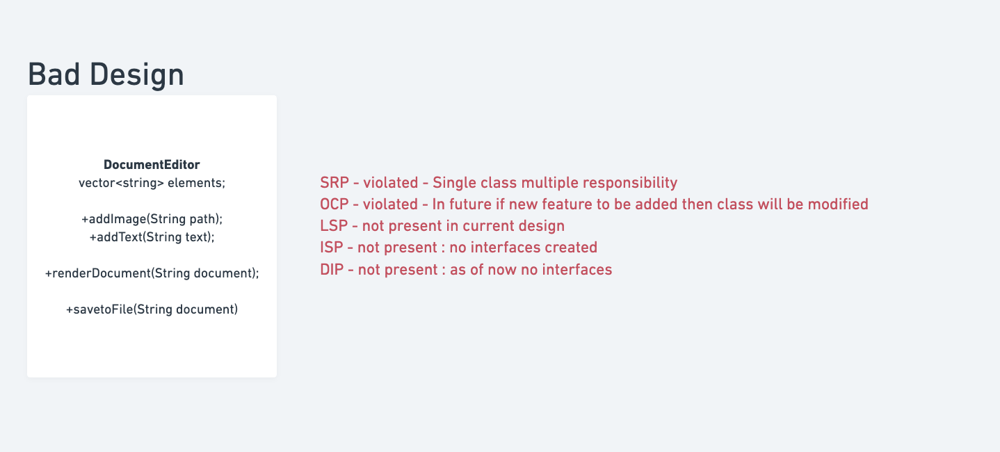
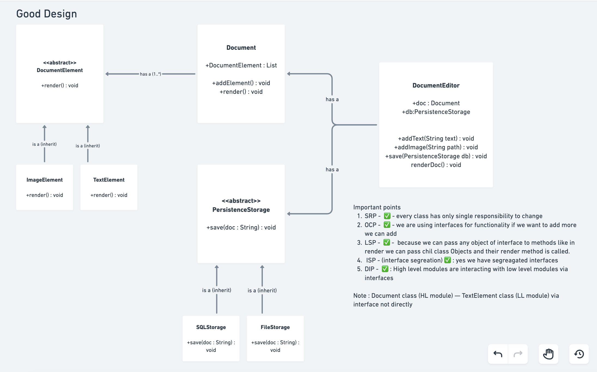
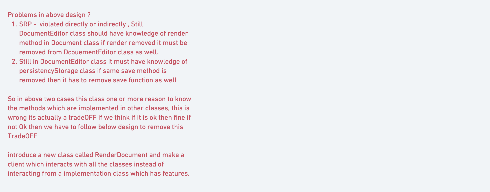
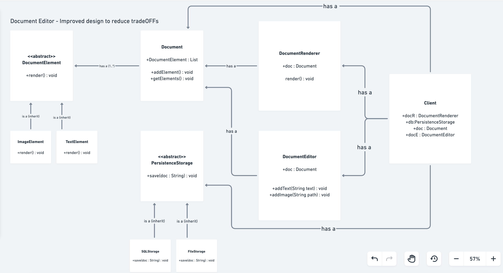

# Document Editor - Good Design Pattern

## Overview

This is a well-designed implementation of a Document Editor following **SOLID principles** and industry best practices. The design demonstrates how to build scalable, maintainable, and extensible systems through proper use of interfaces, inheritance, and separation of concerns.

---

## Architecture Diagram

### Bad Design vs Good Design

**Bad Design Problems:**
- SRP violated - Single class with multiple responsibilities
- OCP violated - Class needs modification for new features
- LSP not present in current design
- ISP not present - no interfaces created
- DIP not present - as of now no interfaces



**Good Design Solution:**

The refactored design follows all SOLID principles with clean separation of concerns:




### Improved Design with Document Renderer

Further optimization to reduce trade-offs:



---

## Key Components & Their Roles

### 1. **DocumentElement Interface** (`interfaces/DocumentElement.java`)

**Responsibility:** Define contract for all renderable document elements

```
interface DocumentElement {
    String render();
}
```

**Purpose:**
- Provides abstraction layer for all document elements
- Enables polymorphism - any DocumentElement can be treated uniformly
- Follows **Interface Segregation Principle** - clients depend on small, focused interfaces

**Why it's Important:**
- Allows adding new element types without modifying existing code
- Decouples element implementations from document management
- Makes testing easier through mock implementations

---

### 2. **Element Implementations** (`elements/`)

#### TextElement.java
- **Responsibility:** Render text content
- **Fields:** `String text`
- **Behavior:** Returns plain text string
- **Use Case:** Adding paragraphs, titles, content

#### ImageElement.java
- **Responsibility:** Render image references
- **Fields:** `String path`
- **Behavior:** Returns formatted image reference
- **Use Case:** Embedding images with file paths

#### NewLineElement.java
- **Responsibility:** Introduce line breaks
- **Behavior:** Returns newline character `"\n"`
- **Use Case:** Paragraph separation

#### TabSpaceElement.java
- **Responsibility:** Add indentation
- **Behavior:** Returns tab character `"\t"`
- **Use Case:** Code formatting, indentation

**Design Pattern:** Each element is a **Composite Pattern** participant
- All implement the same interface
- All can be stored in a unified collection
- No type-checking needed in document rendering

---

### 3. **Persistence Interface** (`interfaces/Persistence.java`)

**Responsibility:** Define contract for data persistence operations

```
interface Persistence {
    void save(String data);
}
```

**Purpose:**
- Abstracts persistence implementation details
- Allows multiple storage strategies without changing client code
- Follows **Dependency Inversion Principle** - high-level modules depend on abstractions

**Design Benefit:**
- Can switch between file storage, database, cloud, etc.
- No coupling between DocumentEditor and persistence layer
- Easy to test with mock persistence implementations

---

### 4. **Persistence Implementations** (`persistence/`)

#### SaveToFile.java
- **Method:** Writes document to local file system
- **Implementation:** Uses Java FileWriter
- **Output:** Creates `document.txt`
- **Error Handling:** Try-catch for IO exceptions

#### SaveToDatabase.java
- **Method:** Saves document to database
- **Implementation:** Placeholder for database logic
- **Extensibility:** Ready for JDBC, ORM (Hibernate), or API calls
- **Scalability:** Suitable for production systems

**Why Separate Implementations:**
- Each persistence method has single responsibility (SRP)
- Can test each independently
- Easy to add new persistence methods (OCP)
- Client code remains unchanged when adding new storage options

---

### 5. **Document Class** (`document/Document.java`)

**Responsibility:** Store and manage collection of document elements

**Key Features:**
```
- List<DocumentElement> elements
- void addElement(DocumentElement element)
- List<DocumentElement> getElements()
```

**Design Decisions:**
- Uses `ArrayList` for dynamic element collection
- Stores references to interface (not concrete classes)
- Provides getter for access by readers
- Single responsibility - just manages elements, doesn't render or persist

**Why This Matters:**
- Follows **Single Responsibility Principle** - only manages elements
- Follows **Dependency Inversion Principle** - depends on DocumentElement interface
- Follows **Open/Closed Principle** - open for adding elements, closed for modification

---

### 6. **DocumentRenderer Class** (`document/DocumentRenderer.java`)

**Responsibility:** Transform document elements into renderable output

**Key Features:**
```
- Document document (composition)
- String render()
```

**Process:**
1. Retrieves all elements from document
2. Iterates through each element
3. Calls `render()` on each element (polymorphism)
4. Concatenates all rendered strings
5. Returns complete document output

**Design Pattern:** **Strategy Pattern** for rendering
- Rendering logic separated from document management
- Can have multiple renderers for different output formats
- Rendering process preserved unchanged, elements can vary

**Why Separate Class:**
- Follows **Single Responsibility Principle** - only handles rendering
- Can add alternative renderers (HTMLRenderer, MarkdownRenderer, etc.)
- Follows **Open/Closed Principle** - open for new rendering strategies

---

### 7. **DocumentEditor Class** (`editor/DocumentEditor.java`)

**Responsibility:** Provide editing operations and coordinate document management

**Key Features:**
```
- Document document (composition)
- Persistence persistence (dependency injection)
- void addText(String text)
- void addImage(String img)
- void addNewLine()
- void addTabSpace()
- void save(String data)
```

**Conveniences Provided:**
- High-level API for document manipulation
- Hides element creation details from client
- Provides optional persistence layer integration

**Design Quality:**
- Uses **Dependency Injection** - persistence passed to constructor
- Follows **Composition over Inheritance** - has-a relationships
- Follows **Dependency Inversion Principle** - depends on Persistence interface
- Low coupling, high cohesion

---

### 8. **DocumentEditorClient Class** (`DocumentEditorClient.java`)

**Responsibility:** Entry point demonstrating the complete workflow

**Key Workflow:**
1. Create Document instance
2. Create Persistence implementation (e.g., SaveToFile)
3. Create DocumentRenderer with document
4. Create DocumentEditor with document
5. Use editor to add elements
6. Render document content
7. Save rendered output

**Design Benefits Demonstrated:**
- All dependencies injected
- No tight coupling
- Easy to swap implementations
- Clean, easy-to-read client code

---

## SOLID Principles Applied

### ✅ Single Responsibility Principle (SRP)
| Class | Single Responsibility |
|-------|----------------------|
| Document | Store elements |
| DocumentRenderer | Render elements |
| DocumentEditor | Edit operations |
| TextElement | Render text |
| SaveToFile | Save to file system |
| SaveToDatabase | Save to database |

**Benefit:** Each class has one reason to change

---

### ✅ Open/Closed Principle (OCP)
| Scenario | How OCP is Followed |
|----------|-------------------|
| Add new element type | Create new class implementing DocumentElement interface - no changes to existing code |
| Add new storage method | Create new class implementing Persistence interface - no changes to existing code |
| Add new renderer | Create new renderer class - no changes to DocumentEditor or Document |

**Benefit:** System is open for extension, closed for modification

---

### ✅ Liskov Substitution Principle (LSP)
**Implementation:**
- Any DocumentElement implementation can be substituted in `document.addElement()`
- DocumentRenderer works with any DocumentElement without knowing concrete type
- SaveToFile and SaveToDatabase can be substituted anywhere Persistence is expected

**Why It Matters:**
- Renderer doesn't need type-checking: no `if (element instanceof TextElement)`
- Editor works with any persistence implementation uniformly
- Polymorphism enabled at runtime

---

### ✅ Interface Segregation Principle (ISP)
**Segregation:**
- **DocumentElement** - only for rendering: `render()`
- **Persistence** - only for saving: `save(String data)`

**Benefits:**
- Clients only depend on methods they use
- No unnecessary baggage from fat interfaces
- Easy to implement small, focused interfaces

---

### ✅ Dependency Inversion Principle (DIP)
**High-Level Modules:** DocumentEditor, DocumentRenderer, Document
**Low-Level Modules:** TextElement, SaveToFile, SaveToDatabase
**Abstractions:** DocumentElement, Persistence

**Flow:**
```
DocumentEditor (high-level) ──depends on──> Persistence (abstract)
                                                    ↑
                                           implemented by
                                                    ↓
SaveToFile (low-level), SaveToDatabase (low-level)
```

**Benefits:**
- DocumentEditor independent of storage implementation
- Easy to test with mock Persistence
- Flexible at runtime - can change storage strategy
- Extensions don't force high-level module changes

---

## Design Patterns Used

### 1. **Composite Pattern**
- **Where:** Document holds collection of DocumentElements
- **Why:** Treat individual elements and collections uniformly
- **Benefit:** Can add simple or complex element structures

### 2. **Strategy Pattern**
- **Where:** Different rendering strategies (potential)
- **Why:** Encapsulate rendering algorithm
- **Benefit:** Can switch rendering strategies at runtime

### 3. **Dependency Injection**
- **Where:** Persistence injected into DocumentEditor
- **Why:** Decouple document editor from specific persistence
- **Benefit:** Easy to test, flexible at runtime

### 4. **Factory Pattern** (Implicit)
- **Where:** DocumentEditor creates specific elements
- **Why:** Encapsulate element creation logic
- **Benefit:** Client doesn't need to know element construction details

---

## Key Features & Interview Highlights

### 1. **Loose Coupling**
- Classes depend on interfaces, not concrete implementations
- Can change implementation without affecting other classes
- Easy to test and maintain

### 2. **High Cohesion**
- Each class has focused responsibilities
- Related functionality grouped together
- Clear separation of concerns

### 3. **Extensibility**
- Adding new element types: just implement DocumentElement
- Adding new persistence: just implement Persistence
- Adding new renderers: create new renderer class

### 4. **Testability**
- Each class can be tested in isolation
- Mock implementations easy to create
- No tight coupling to dependencies

### 5. **Flexibility**
- Swap persistence at runtime
- Add new element types without recompilation
- Change rendering strategy without affecting document structure

---

## Trade-offs & Improvements

### Current Design Strengths
✅ Follows all SOLID principles
✅ Easy to extend with new features
✅ Highly testable
✅ Maintainable code structure
✅ Clear separation of concerns

### Potential Improvements
- **Observer Pattern:** Notify listeners when document changes
- **Undo/Redo:** Command pattern for reversible operations
- **Formatting:** Additional interfaces for text styling (bold, italic, color)
- **Validation:** Validators for element addition
- **Event System:** Document events (elementAdded, documentSaved)

---

## Folder Structure Explanation

```
goodDesign/
├── interfaces/
│   ├── DocumentElement.java      # Abstract contract for elements
│   └── Persistence.java          # Abstract contract for storage
├── elements/
│   ├── TextElement.java          # Text implementation
│   ├── ImageElement.java         # Image implementation
│   ├── NewLineElement.java       # Line break implementation
│   └── TabSpaceElement.java      # Tab/indentation implementation
├── persistence/
│   ├── SaveToFile.java           # File system storage
│   └── SaveToDatabase.java       # Database storage
├── document/
│   ├── Document.java             # Element container
│   └── DocumentRenderer.java     # Rendering logic
├── editor/
│   └── DocumentEditor.java       # Editing operations
├── DocumentEditorClient.java     # Entry point
└── README.md                     # This file
```

**Organization Benefits:**
- Package by responsibility, not class type
- Interface definitions in separate package
- Implementations grouped logically
- Clear module boundaries
- Easy to locate functionality

---

## Interview Q&A

### Q1: Why is DocumentElement an interface and not an abstract class?
**Answer:** An interface best represents a contract that any element must fulfill. Using an interface:
- Doesn't impose unnecessary method implementations
- Allows multiple interface implementation (future extensibility)
- Clearly communicates the contract without implementation details
- Follows Interface Segregation Principle

### Q2: How does this design handle adding new element types?
**Answer:** Just implement DocumentElement interface:
```
class BoldElement implements DocumentElement {
    public String render() { return "<b>bold text</b>"; }
}
```
Existing code (Document, DocumentRenderer, DocumentEditor) requires no changes. This demonstrates the Open/Closed Principle.

### Q3: Why is Persistence separate from DocumentEditor?
**Answer:** Following Single Responsibility Principle:
- DocumentEditor handles editing operations
- Persistence handles data storage
This separation allows:
- DocumentEditor to work without storage (in-memory editing)
- Swapping storage implementations without modifying editor
- Testing editor independently of persistence

### Q4: Can you add two persistence methods simultaneously?
**Answer:** Document architecture would need modification. Current design supports one persistence at a time through dependency injection. To support multiple:
```
DocumentEditor(Document doc, List<Persistence> storages)
```
Then iterate through storages in save method. Trade-off: added complexity.

### Q5: What happens if DocumentRenderer is removed?
**Answer:** DocumentEditor would need rendering logic. This would violate Single Responsibility Principle. Renderer is kept separate because:
- Rendering logic may be complex
- Future renderers might vary (HTML, PDF, Markdown)
- Separation enables testing rendering independently

### Q6: How does this design follow DIP?
**Answer:** Dependency Inversion Principle means high-level modules depend on abstractions, not low-level details:
- DocumentEditor depends on Persistence (abstraction), not SaveToFile (concrete)
- DocumentRenderer depends on DocumentElement (abstraction), not TextElement (concrete)
- This inversion allows low-level modules to change without affecting high-level logic

### Q7: What SOLID principle is violated if we add persistence method directly to DocumentEditor?
**Answer:** Multiple violations:
- **SRP:** Editor would have both editing AND persistence responsibility
- **OCP:** Adding new persistence method means modifying DocumentEditor
- **DIP:** DocumentEditor becomes dependent on concrete persistence implementation
- **ISP:** DocumentEditor forced to implement unrelated persistence methods

### Q8: How is the Composite Pattern used here?
**Answer:** Document holds collection of DocumentElements. The pattern allows:
- Treating individual elements (TextElement) and collections uniformly
- Adding elements recursively (potential for composite elements)
- Renderer doesn't distinguish between simple and complex elements
- Simplifies client code - same interface for all element types

### Q9: What's the benefit of composition (Document inside DocumentEditor) over inheritance?
**Answer:** Composition benefits:
- Flexibility: Can change document at runtime
- Multiple inheritance: DocumentEditor could have other composed objects
- Better encapsulation: Can control exposure of document methods
- Loose coupling: DocumentEditor depends on Document interface, not concrete details
- Avoids fragile base class problem

### Q10: How would you add a delete element capability?
**Answer:** Add to DocumentEditor:
```
public void deleteElement(int index) {
    document.getElements().remove(index);
}
```
No changes to Document, Renderer, or Element classes needed. Demonstrates:
- Open/Closed Principle (open for extension)
- Single Responsibility (editor makes editing decisions)
- Loose coupling (other modules unaffected)

### Q11: If you need to support rich text formatting, how would the design change?
**Answer:** Minimal changes following OCP:
1. Create FormattedTextElement implementing DocumentElement
2. Optionally create Formatter interface for formatting logic
3. No changes to Document, DocumentRenderer, DocumentEditor
Example:
```
class FormattedTextElement implements DocumentElement {
    String text;
    TextFormat format; // bold, italic, color, etc.
    public String render() { return format.apply(text); }
}
```

### Q12: Explain the trade-offs in the current design
**Answer:**
- **Pro:** Clean, extensible, testable, follows SOLID
- **Con:** More classes than naive approach (added complexity)
- **Pro:** Complexity pays off at scale when features need to be added
- **Con:** Might be over-engineered for small projects
- **Trade-off:** More up-front design effort, but easier maintenance later
- **Alternative:** Start simple, refactor to this design when complexity arises

### Q13: What would happen if we don't use interfaces?
**Answer:** Without interfaces:
- DocumentRenderer would need to know all element types (type checking)
- Adding new persistence means modifying DocumentEditor (OCP violated)
- Difficult to test with mock implementations (tightly coupled)
- Client code tightly bound to concrete classes
- Changes to implementation force recompilation of dependents

### Q14: How does this design enable testing?
**Answer:** High testability through:
- Interfaces allow mockable dependencies
- Example: `new DocumentEditor(document, new MockPersistence())`
- Each class testable independently without instantiating others
- No static methods or static dependencies
- Clear dependencies through constructor injection

### Q15: Can DocumentEditor have multiple persistence methods?
**Answer:** No, current design supports one. Enhancement:
```
class DocumentEditor {
    List<Persistence> persistences;
    void save(String data) {
        for(Persistence p : persistences) { p.save(data); }
    }
}
```
Trade-off: Coordinate all persistence failures, manage multiple states.

---

## Key Takeaways

1. **Interfaces over Concrete Classes:** Depend on abstractions for flexibility
2. **Composition over Inheritance:** Compose objects rather than deeply inherit
3. **Single Responsibility:** Each class has one reason to change
4. **Dependency Injection:** Inject dependencies rather than creating them
5. **Separate Concerns:** Split document management, rendering, editing, persistence
6. **Design for Extension:** Write code open for extension, closed for modification
7. **Polymorphism Power:** Same interface, different implementations, no type-checking
8. **Package Organization:** Organize by responsibility, not by class type

---

## Conclusion

This Document Editor design demonstrates professional-grade software architecture:
- Follows all **SOLID principles** for maintainability
- Uses proven **design patterns** for flexibility
- Maintains **high cohesion** and **low coupling**
- Enables **easy testing** and **quick extensions**
- Scales well as **features are added** over time

The design trades initial complexity for long-term maintainability—a hallmark of production systems. When adding new features like formatting, export formats, or collaboration—this architecture gracefully accommodates changes without disturbing existing code.
