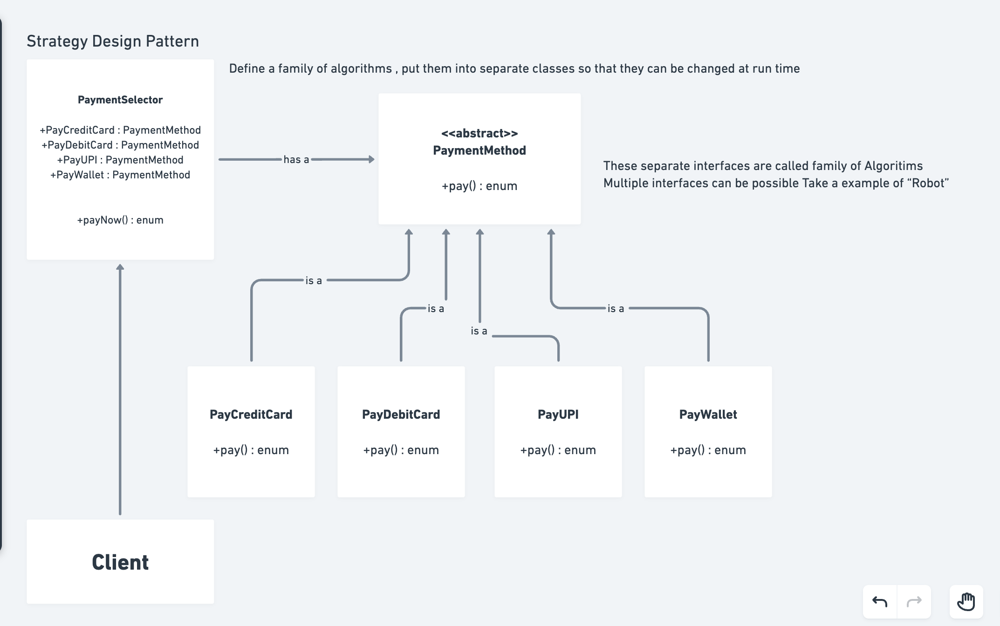

# Strategy Design Pattern

## Overview

The **Strategy Design Pattern** defines a family of algorithms, encapsulates each one, and makes them interchangeable. Strategy lets the algorithm vary independently from clients that use it.

In simple terms: Instead of hardcoding the choice of algorithm into the client, the pattern allows you to choose which algorithm to use at runtime through different strategy implementations.

---

**Important Points to remember:**

- → Encapsulate what varies & keep it separate from what remains same.
- → Solution to inheritance is not more inheritance.
- → Composition should be favoured over inheritance.
- → Code to interface & not to concrete.
- → Do NOT Repeat Yourself (DRY).

## Pattern Diagram



**Key Components:**
- **Client:** Uses PaymentSelector to process payments
- **PaymentSelector (Context):** Holds references to different payment strategies
- **PaymentMethod (Strategy):** Abstract interface defining the contract
- **Concrete Strategies:** Different payment implementations (PayCreditCard, PayDebitCard, PayUPI, PayWallet)

---

## Real-World Analogy

Imagine you need to travel to the airport. You have multiple options:
- **Car:** Fast but parking is expensive
- **Taxi:** Convenient but no control
- **Public Transport:** Cheap but time-consuming
- **Bike:** Eco-friendly but weather-dependent

You choose the strategy based on:
- Distance
- Cost budget
- Time available
- Weather conditions

The **destination (airport) remains the same**, but the **strategy (transportation method) changes** based on circumstances. This is exactly what the Strategy Pattern implements in code.

---

## Folder Structure

```
strategyDesignPattern/
├── interfaces/
│   └── PaymentMethod.java          # Abstract strategy interface
├── paymentmethods/
│   ├── PayCreditCard.java          # Concrete strategy
│   ├── PayDebitCard.java           # Concrete strategy
│   ├── PayUPI.java                 # Concrete strategy
│   └── PayWallet.java              # Concrete strategy
├── PaymentSelector.java            # Context class
├── Strategy.java                   # Client/Demo
└── README.md                       # This file
```

---

## Components Explained

### 1. **PaymentMethod Interface** (`interfaces/PaymentMethod.java`)

**Responsibility:** Define the contract for all payment strategies

```java
public interface PaymentMethod {
    void pay();
}
```

**Purpose:**
- Establishes the common interface all payment methods must follow
- Any class implementing this interface can be used interchangeably
- Clients depend on this abstraction, not concrete classes

**Design Principle:**
- **Dependency Inversion:** High-level modules depend on PaymentMethod (abstraction)
- **Polymorphism:** Runtime selection of actual payment method
- **Decoupling:** PaymentSelector doesn't need to know about specific payment types

**Why It's Important:**
- Allows new payment methods to be added without changing existing code
- Makes the system flexible and extensible
- Enables runtime algorithm selection

---

### 2. **Concrete Strategies** (`paymentmethods/`)

Each payment method implements the PaymentMethod interface with its own specific logic.

#### PayCreditCard.java
```java
public class PayCreditCard implements PaymentMethod {
    @Override
    public void pay() {
        System.out.println("Payment done using Credit Card");
    }
}
```
- **Strategy:** Process payment through credit card network
- **Implementation:** Specific logic for credit card transactions
- **Responsibility:** Single, focused responsibility - credit card payment only

#### PayDebitCard.java
```java
public class PayDebitCard implements PaymentMethod {
    @Override
    public void pay() {
        System.out.println("Paying via debit card");
    }
}
```
- **Strategy:** Process payment through debit card network
- **Implementation:** Specific logic for debit card transactions
- **Characteristic:** Directly debits from bank account

#### PayUPI.java
```java
public class PayUPI implements PaymentMethod {
    @Override
    public void pay() {
        System.out.println("Payment done via UPI");
    }
}
```
- **Strategy:** Process payment through UPI (Unified Payment Interface)
- **Implementation:** Specific logic for UPI transactions
- **Characteristic:** Real-time payment, popular in India

#### PayWallet.java
```java
public class PayWallet implements PaymentMethod {
    public void pay() {
        System.out.println("Payment done via Wallet");
    }
}
```
- **Strategy:** Process payment through digital wallet
- **Implementation:** Specific logic for wallet transactions
- **Characteristic:** Pre-loaded balance used for payment

**Design Benefits of Concrete Strategies:**
- **Single Responsibility Principle:** Each class handles one payment method
- **Open/Closed Principle:** Easy to add new payment types without modifying existing ones
- **Liskov Substitution Principle:** Any PaymentMethod can be substituted wherever needed
- **No Type Checking:** PaymentSelector doesn't use `instanceof` or type-casting

---

### 3. **PaymentSelector Class** (`PaymentSelector.java`)

**Responsibility:** Context class that uses payment strategies

```java
public class PaymentSelector {
    PaymentMethod payCreditCard;
    PaymentMethod payDebitCard;
    PaymentMethod payUPI;
    PaymentMethod payWallet;
    
    public PaymentSelector(PaymentMethod payCreditCard, 
                          PaymentMethod payDebitCard, 
                          PaymentMethod payUPI, 
                          PaymentMethod payWallet) {
        this.payCreditCard = payCreditCard;
        this.payDebitCard = payDebitCard;
        this.payUPI = payUPI;
        this.payWallet = payWallet;
    }

    public void payNow(String method) {
        if (method.equals("CreditCard")) {
            payCreditCard.pay();
        } else if (method.equals("DebitCard")) {
            payDebitCard.pay();
        } else if (method.equals("UPI")) {
            payUPI.pay();
        } else if (method.equals("Wallet")) {
            payWallet.pay();
        }
    }
}
```

**Key Features:**
- **Dependency Injection:** All strategies injected through constructor
- **Selection Logic:** `payNow()` method selects appropriate strategy
- **Strategy Storage:** Holds references to all payment methods
- **Runtime Selection:** Strategy chosen at runtime based on parameter

**Design Characteristics:**
- **Context Class:** Central point coordinating strategy usage
- **Composition:** Uses composition (has-a) rather than inheritance
- **Flexibility:** Strategies can be changed without modifying PaymentSelector
- **Low Coupling:** Depends on interface (PaymentMethod), not concrete classes

**Improvement Opportunity:**
Current implementation uses if-else chain. Can be enhanced using:
```java
Map<String, PaymentMethod> strategies = new HashMap<>();
strategies.put("CreditCard", payCreditCard);
strategies.put("DebitCard", payDebitCard);
// ...
public void payNow(String method) {
    PaymentMethod strategy = strategies.get(method);
    if (strategy != null) {
        strategy.pay();
    }
}
```
This approach:
- Eliminates if-else chain (more scalable)
- Easier to add/remove strategies
- Better performance for many strategies

---

### 4. **Strategy Class** (`Strategy.java`)

**Responsibility:** Client/Demo class demonstrating pattern usage

```java
public class Strategy {
    public static void main(String[] args) {
        PaymentSelector selector = new PaymentSelector(
            new PayCreditCard(), 
            new PayDebitCard(), 
            new PayUPI(), 
            new PayWallet()
        );
        selector.payNow("UPI");
        selector.payNow("DebitCard");
        selector.payNow("CreditCard");
        selector.payNow("Wallet");
        // ... more payments
    }
}
```

**Demonstrates:**
- Creating PaymentSelector with all payment strategies
- Using payNow() to select different strategies at runtime
- Each call can use different payment method
- Same interface, different behaviors

---

## How Strategy Pattern Works

### Step-by-Step Execution Flow

1. **Initialization**
   ```
   PaymentSelector created with all payment strategy objects
   Each strategy is passed as dependency
   ```

2. **Selection**
   ```
   payNow("UPI") called
   PaymentSelector receives method name
   ```

3. **Routing**
   ```
   if-else chain matches the method name
   Correct PaymentMethod reference selected
   ```

4. **Execution**
   ```
   Selected strategy's pay() method invoked
   Specific payment logic executed
   ```

5. **Output**
   ```
   Strategy-specific message printed
   "Payment done via UPI"
   ```

---

## Key Design Principles Applied

### Single Responsibility Principle (SRP)
✅ Each payment class has ONE responsibility
- PayCreditCard: Only knows credit card payment
- PayDebitCard: Only knows debit card payment
- PayUPI: Only knows UPI payment
- PayWallet: Only knows wallet payment

**Benefit:** Easy to modify or test one payment method without affecting others

---

### Open/Closed Principle (OCP)
✅ Open for extension, closed for modification

**Adding New Payment Method (Extension):**
```java
public class PayGooglePay implements PaymentMethod {
    @Override
    public void pay() {
        System.out.println("Payment done via Google Pay");
    }
}
```

**No changes needed to:**
- PaymentSelector
- Existing payment implementations
- Client code (mostly)

**Benefit:** System grows without modifying existing code (less risk of bugs)

---

### Liskov Substitution Principle (LSP)
✅ Any PaymentMethod can substitute for another

```java
// This works with ANY PaymentMethod implementation
PaymentMethod strategy = new PayCreditCard(); // or PayDebitCard, etc.
strategy.pay(); // Works correctly regardless of concrete type
```

**Benefit:** No type checking or casting needed; polymorphism works correctly

---

### Dependency Inversion Principle (DIP)
✅ High-level modules depend on abstractions

```
PaymentSelector (high-level)
        ↓ depends on
    PaymentMethod (abstraction)
        ↑ implemented by
PayCreditCard, PayDebitCard, etc. (low-level)
```

**Benefit:** Changes to payment implementations don't affect PaymentSelector

---

## Pattern Characteristics

| Aspect | Description |
|--------|-------------|
| **Purpose** | Encapsulate algorithms to make them interchangeable |
| **When to Use** | Multiple algorithms for same task; algorithm selection at runtime |
| **Advantage** | Flexibility, extensibility, easy testing, cleaner code |
| **Disadvantage** | More classes; overhead for single-algorithm scenarios |
| **Complexity** | Medium - adds a few more classes |
| **Related Patterns** | State (similar but different intent), Command, Template Method |

---

## When to Use Strategy Pattern

### ✅ Use When:
1. **Multiple Algorithms Exist** - Various ways to accomplish same goal
   - Example: Multiple payment methods, sorting algorithms, compression formats

2. **Algorithm Selection at Runtime** - Choice depends on runtime conditions
   - Example: User selects payment method during checkout

3. **Frequent Algorithm Changes** - New algorithms added regularly
   - Example: New payment methods introduced regularly

4. **Avoiding Conditional Logic** - Too many if-else statements
   - Example: Instead of if-else for each payment type

5. **Testing Different Approaches** - Easy to swap implementations
   - Example: Mock strategies for unit testing

### ❌ Avoid When:
1. **Single Algorithm** - Only one way to do something
2. **Rarely Changes** - Algorithm never changes or changes very rarely
3. **Simple Logic** - Overkill for simple decision
4. **Performance Critical** - Interface calls add overhead

---

## Advantages & Disadvantages

### ✅ Advantages

1. **Flexibility**
   - Algorithms can be selected and changed at runtime
   - Client code remains stable

2. **Extensibility**
   - New strategies added without modifying existing code
   - Supports Open/Closed Principle

3. **Testability**
   - Each strategy testable independently
   - Mock strategies easy to create for testing
   - No external dependencies needed

4. **Encapsulation**
   - Algorithm details hidden from client
   - Client only knows about interface

5. **Single Responsibility**
   - Each strategy has one responsibility
   - Separate classes for separate concerns

6. **Runtime Configuration**
   - Strategies chosen based on runtime conditions
   - Dynamic behavior without recompilation

### ❌ Disadvantages

1. **Increased Classes**
   - More classes in codebase
   - Increased code organization complexity

2. **Memory Overhead**
   - All strategy objects kept in memory
   - Even when not all strategies used

3. **Complexity**
   - Overkill for simple scenarios
   - Increased code for simple problems

4. **Client Awareness**
   - Client must know about all strategies
   - Selecting appropriate strategy is client's responsibility

5. **Performance**
   - Interface dispatch has minimal overhead
   - Context switching between strategies

---

## Common Use Cases

### 1. **E-Commerce Payment System**
```
Context: PaymentProcessor
Strategies: CreditCard, DebitCard, Wallet, UPI, Bank Transfer, Cryptocurrency
```
**Why:** Users choose payment method; system needs to support multiple methods

### 2. **Sorting Algorithms**
```
Context: Sorter
Strategies: QuickSort, MergeSort, BubbleSort, HeapSort
```
**Why:** Different algorithms optimal for different data sizes

### 3. **Navigation Route Planning**
```
Context: NavigationApp
Strategies: FastestRoute, ShortestRoute, MostScenic, FewestTolls
```
**Why:** Users choose preference; system uses appropriate algorithm

### 4. **File Compression**
```
Context: FileCompressor
Strategies: GZIP, ZIP, RAR, BZIP2, LZMA
```
**Why:** Different formats for different use cases

### 5. **Authentication Methods**
```
Context: AuthenticationManager
Strategies: Password, OAuth, Biometric, TwoFactor, SAML
```
**Why:** Different authentication methods based on security requirements

### 6. **Rendering Engines**
```
Context: DocumentRenderer
Strategies: PDFRenderer, HTMLRenderer, MarkdownRenderer, EPUBRenderer
```
**Why:** Different output formats from same document

---

## Interview Q&A

### Q1: What is the Strategy Design Pattern?
**Answer:** Strategy Pattern defines a family of algorithms, encapsulates each one, and makes them interchangeable. It lets the algorithm vary independently from clients that use it. Instead of hardcoding algorithm choice, the pattern allows runtime selection through different implementations of a common interface.

**Key Point:** Algorithm selection moves from compile-time (hardcoded) to runtime (configurable).

---

### Q2: How is Strategy different from State Pattern?
**Answer:**

| Strategy | State |
|----------|-------|
| **Intent:** Select algorithm at runtime | **Intent:** Alter behavior when state changes |
| **Responsibility:** Client chooses which algorithm | **Responsibility:** Object chooses which behavior |
| **Relationship:** One-to-one or one-to-many | **Relationship:** Object transitions between states |
| **Example:** Payment methods (static choice) | **Example:** Order states (transitions dynamically) |
| **Duration:** Strategy typically unchanged | **Duration:** State changes during object lifecycle |

**Simple Analogy:**
- **Strategy:** Pizza shop lets customer choose sauce (pepperoni, marinara, white)
- **State:** Traffic light automatically transitions between red, yellow, green

---

### Q3: Why not just use if-else instead of Strategy Pattern?
**Answer:** If-else has problems that Strategy solves:

**If-else Problems:**
```java
if (method.equals("CreditCard")) {
    // Credit card logic
} else if (method.equals("DebitCard")) {
    // Debit card logic
} else if (method.equals("UPI")) {
    // UPI logic
} else if (method.equals("Wallet")) {
    // Wallet logic
} else if (method.equals("GooglePay")) {
    // NEW: Adding this requires modifying existing class
}
```

**Strategy Solution:**
```java
public class PayGooglePay implements PaymentMethod {
    @Override
    public void pay() { /* implementation */ }
}
// No changes to PaymentSelector needed
// Follows Open/Closed Principle
```

**Disadvantages of if-else:**
- Violates Open/Closed Principle (must modify existing code)
- Hard to maintain (logic grows with each new type)
- Difficult to test (all branches in single class)
- Single Responsibility violated (one class knows all algorithms)

---

### Q4: What's the difference between Strategy and Composition?
**Answer:** Strategy IS a form of Composition.

**Composition:** Object contains reference to another object
```java
PaymentSelector has-a PaymentMethod // This is composition
```

**Strategy:** Special case of Composition where composed object implements strategy interface
```java
PaymentSelector has-a PaymentMethod (strategy interface)
PaymentMethod implementations are different algorithms
```

**Key Insight:** Strategy = Composition + Interface + Runtime Selection

---

### Q5: Can one PaymentSelector use multiple strategies simultaneously?
**Answer:** Yes! Two approaches:

**Approach 1: Composite Pattern**
```java
class CompositePayment implements PaymentMethod {
    List<PaymentMethod> strategies = new ArrayList<>();
    public void pay() {
        for(PaymentMethod s : strategies) {
            s.pay(); // All strategies execute
        }
    }
}
```

**Approach 2: Sequential Execution**
```java
public void payWithMultiple(List<String> methods) {
    for(String method : methods) {
        payNow(method); // Execute each strategy
    }
}
```

**Current Design:** Supports one strategy at a time

---

### Q6: How would you add a new payment method?
**Answer:**

**Step 1:** Create new class implementing PaymentMethod
```java
public class PayBitcoin implements PaymentMethod {
    @Override
    public void pay() {
        System.out.println("Payment done via Bitcoin");
    }
}
```

**Step 2:** Update PaymentSelector (or use Map-based approach)
```java
PaymentMethod payBitcoin = new PayBitcoin();
// Create new selector or update existing
PaymentSelector selector = new PaymentSelector(
    payCreditCard, payDebitCard, payUPI, payWallet, payBitcoin
);
```

**Benefits:**
- No modification to existing payment implementations
- No modification to interface
- One new class + selector update
- Follows Open/Closed Principle

---

### Q7: How does dependency injection work in this pattern?
**Answer:** Dependency Injection means objects don't create their dependencies; instead, dependencies are provided to them.

**In this example:**
```java
public PaymentSelector(PaymentMethod payCreditCard, 
                      PaymentMethod payDebitCard, 
                      PaymentMethod payUPI, 
                      PaymentMethod payWallet) {
    // Dependencies injected through constructor
    this.payCreditCard = payCreditCard;
    this.payDebitCard = payDebitCard;
    this.payUPI = payUPI;
    this.payWallet = payWallet;
}
```

**Benefits of DI:**
- PaymentSelector doesn't create strategies
- Easy to swap implementations
- Testable: inject mock strategies
- Loose coupling: depends on interface, not concrete classes

**Without DI (Tightly Coupled):**
```java
public PaymentSelector() {
    this.payCreditCard = new PayCreditCard(); // Creates dependencies
    this.payDebitCard = new PayDebitCard();   // Hard-coded
    // Problem: Can't easily test or swap
}
```

---

### Q8: Explain the polymorphism in this pattern
**Answer:** Polymorphism means "many forms" - same interface, different behaviors:

```java
PaymentMethod strategy = new PayCreditCard();
strategy.pay(); // Executes PayCreditCard.pay()

strategy = new PayUPI();
strategy.pay(); // Executes PayUPI.pay()

strategy = new PayWallet();
strategy.pay(); // Executes PayWallet.pay()
```

Same variable `strategy` (type PaymentMethod), different behavior based on actual object.

**Compile-time:** `strategy` is PaymentMethod
**Runtime:** `strategy` can be any implementation (PayCreditCard, PayUPI, etc.)

**Why Important:**
- PaymentSelector uses `payCreditCard.pay()` without knowing it's PayCreditCard
- Same code works with any PaymentMethod implementation
- No type casting or `instanceof` checking needed

---

### Q9: What is the difference between Strategy and using inheritance?
**Answer:**

**Strategy Pattern (Composition):**
```java
class PaymentSelector {
    PaymentMethod strategy; // Has-a relationship
}
class PayCreditCard implements PaymentMethod { }
```

**Inheritance Approach:**
```java
class PaymentSelector extends PaymentMethod {
    // PaymentSelector IS-A PaymentMethod
    // Violates Single Responsibility
}
```

**Comparison:**

| Aspect | Strategy (Composition) | Inheritance |
|--------|----------------------|------------|
| **Relationship** | Has-a (flexible) | Is-a (rigid) |
| **Change Strategy** | Easy - swap at runtime | Hard - must subclass |
| **Multiple Methods** | Easy - compose multiple | Hard - single inheritance |
| **Testing** | Easy - inject mocks | Harder - extends hierarchy |
| **SOLID** | Better (DIP, LSP) | Violates principles |

**Key Insight:** Composition > Inheritance for flexibility

---

### Q10: How is testing easier with Strategy Pattern?
**Answer:** Testing becomes easier because you can inject mock strategies:

**Without Strategy (Tightly Coupled):**
```java
class PaymentProcessor {
    public void process(String method) {
        if (method.equals("CreditCard")) {
            // Calls real payment gateway - hard to test
            CreditCardGateway.charge();
        }
    }
}
```

**With Strategy (Easy to Test):**
```java
// Mock payment for testing
class MockPayment implements PaymentMethod {
    @Override
    public void pay() {
        System.out.println("Mock payment - no real charge");
    }
}

// Test code
PaymentSelector selector = new PaymentSelector(
    new MockPayment(), new MockPayment(), 
    new MockPayment(), new MockPayment()
);
selector.payNow("CreditCard"); // Uses mock, doesn't charge real card
```

**Benefits:**
- No external dependencies needed for testing
- Fast execution (no actual payment processing)
- Complete control over behavior
- Can simulate errors easily

---

### Q11: Can you have zero strategies initially and add them later?
**Answer:** Yes! You can use a lazy initialization or optional strategies:

**Approach 1: Optional Strategies**
```java
class PaymentSelector {
    Optional<PaymentMethod> paymentStrategy = Optional.empty();
    
    public void setStrategy(PaymentMethod strategy) {
        this.paymentStrategy = Optional.of(strategy);
    }
    
    public void payNow() {
        if (paymentStrategy.isPresent()) {
            paymentStrategy.get().pay();
        }
    }
}
```

**Approach 2: Registry Pattern**
```java
class PaymentRegistry {
    Map<String, PaymentMethod> strategies = new HashMap<>();
    
    public void register(String name, PaymentMethod method) {
        strategies.put(name, method);
    }
    
    public void pay(String name) {
        PaymentMethod method = strategies.get(name);
        if (method != null) {
            method.pay();
        }
    }
}
```

**Current Implementation:** Requires all strategies upfront

---

### Q12: What happens if an invalid payment method is requested?
**Answer:** Current implementation does nothing:

```java
public void payNow(String method) {
    if (method.equals("CreditCard")) {
        payCreditCard.pay();
    } else if (method.equals("DebitCard")) {
        payDebitCard.pay();
    } else if (method.equals("UPI")) {
        payUPI.pay();
    } else if (method.equals("Wallet")) {
        payWallet.pay();
    }
    // Invalid method: silently does nothing (BUG!)
}
```

**Better Implementation:**
```java
public void payNow(String method) {
    if (method.equals("CreditCard")) {
        payCreditCard.pay();
    } else if (method.equals("DebitCard")) {
        payDebitCard.pay();
    } else if (method.equals("UPI")) {
        payUPI.pay();
    } else if (method.equals("Wallet")) {
        payWallet.pay();
    } else {
        throw new IllegalArgumentException("Unknown payment method: " + method);
    }
}
```

**Or with Map:**
```java
public void payNow(String method) {
    PaymentMethod strategy = strategies.get(method);
    if (strategy == null) {
        throw new IllegalArgumentException("Unknown payment method: " + method);
    }
    strategy.pay();
}
```

---

### Q13: How would you handle payment with additional parameters?
**Answer:** Modify the interface to accept parameters:

**Current Interface:**
```java
public interface PaymentMethod {
    void pay();
}
```

**Enhanced Interface:**
```java
public interface PaymentMethod {
    void pay(double amount, String transactionId);
}
```

**Updated Implementation:**
```java
public class PayCreditCard implements PaymentMethod {
    @Override
    public void pay(double amount, String transactionId) {
        System.out.println("Charged $" + amount + " to credit card");
        System.out.println("Transaction ID: " + transactionId);
    }
}
```

**Note:** This would require updating all implementations

---

### Q14: Compare Strategy Pattern with Factory Pattern
**Answer:**

| Aspect | Strategy | Factory |
|--------|----------|---------|
| **Purpose** | Select algorithm to use | Create objects |
| **Interface** | Algorithm contract | Object creation contract |
| **Usage** | After object creation | During object creation |
| **Example** | Choose payment method | Create payment method |
| **Changes** | Runtime behavior varies | What object type created varies |

**Combined Usage:**
```java
// Factory creates the strategy object
PaymentMethod strategy = PaymentFactory.create("CreditCard");

// Strategy is used by context
PaymentSelector selector = new PaymentSelector(strategy);
```

---

### Q15: What are common mistakes implementing Strategy Pattern?
**Answer:**

**Mistake 1: if-else for selection instead of using strategies**
```java
// WRONG: Still has if-else
if (method.equals("Credit")) {
    creditLogic();
} else if (method.equals("Debit")) {
    debitLogic();
}
```

**Mistake 2: Strategy knows about context**
```java
// WRONG: PayCreditCard shouldn't know about PaymentSelector
class PayCreditCard {
    PaymentSelector selector; // Circular dependency!
}
```

**Mistake 3: Forgetting to update PaymentSelector when adding strategy**
```java
// NEW PaymentMethod but PaymentSelector not updated
// Selector has no way to use it
```

**Mistake 4: Creating too many micro-strategies**
```java
// WRONG: Don't create strategy for every minor variation
// Group related variations into single strategy
```

**Mistake 5: Not using dependency injection**
```java
// WRONG: PaymentSelector creates strategies internally
// Hard to test, tight coupling
class PaymentSelector {
    PayCreditCard card = new PayCreditCard(); // Don't do this
}
```

---

## Real-World Implementation Considerations

### Scalability
As number of strategies grows, consider using **Map-based approach**:
```java
Map<String, PaymentMethod> strategies = new HashMap<>();
strategies.put("CreditCard", new PayCreditCard());
strategies.put("Debit", new PayDebitCard());
strategies.put("UPI", new PayUPI());

public void payNow(String method) {
    PaymentMethod strategy = strategies.get(method);
    if (strategy != null) {
        strategy.pay();
    }
}
```

**Benefits:**
- Eliminates if-else chain
- Easier to add/remove strategies
- Better performance for many strategies (O(1) lookup)

### Error Handling
```java
public void payNow(String method) {
    try {
        PaymentMethod strategy = strategies.get(method);
        if (strategy == null) {
            throw new PaymentMethodException(
                "Payment method not found: " + method);
        }
        strategy.pay();
    } catch (Exception e) {
        handlePaymentError(e);
    }
}
```

### Logging & Monitoring
```java
public void payNow(String method) {
    logger.info("Processing payment with method: " + method);
    long startTime = System.currentTimeMillis();
    
    PaymentMethod strategy = strategies.get(method);
    strategy.pay();
    
    long duration = System.currentTimeMillis() - startTime;
    logger.info("Payment completed in " + duration + "ms");
}
```

---

## Key Takeaways

1. **Flexibility:** Algorithms can be chosen and changed at runtime
2. **Extensibility:** New strategies added without modifying existing code
3. **Testability:** Each strategy testable independently
4. **Encapsulation:** Algorithm details hidden from client
5. **Composition:** Uses composition over inheritance
6. **Dependency Injection:** Strategies injected into context
7. **Polymorphism:** Same interface, different implementations
8. **SOLID Principles:** Follows SRP, OCP, LSP, DIP
9. **When to Use:** Multiple algorithms; runtime selection; frequent changes
10. **When NOT to Use:** Single algorithm; rarely changes; simple problems

---

## Conclusion

The Strategy Design Pattern is a fundamental pattern for managing multiple algorithms in a flexible, maintainable way. By encapsulating algorithms and making them interchangeable, it enables:

- **Cleaner Code:** No massive if-else chains
- **Better Maintenance:** Changes localized to specific strategies
- **Easy Testing:** Mock strategies for unit testing
- **Runtime Flexibility:** Algorithm selection based on runtime conditions
- **Professional Architecture:** Demonstrates understanding of design principles

This pattern is widely used in production systems across industries—from payment processing to machine learning pipelines to rendering engines. Mastering this pattern is essential for building scalable, professional software systems.
