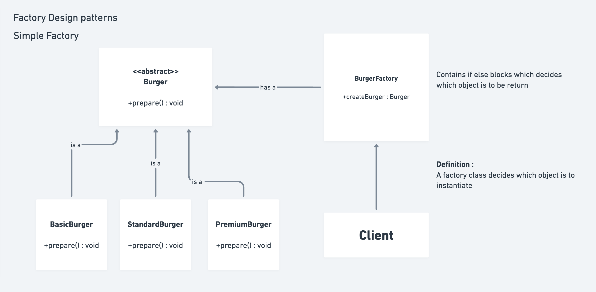
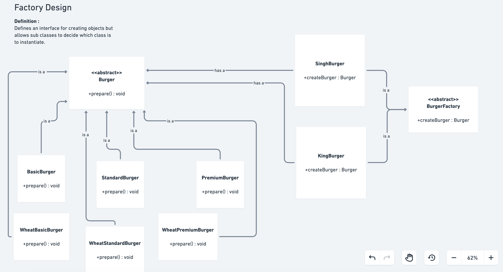
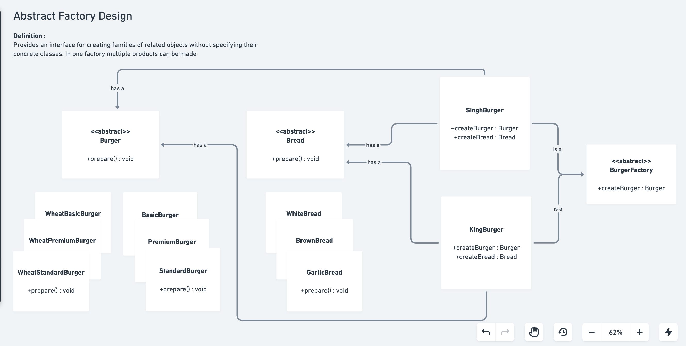

# Factory Design Pattern 

## Overview

Factory Design Patterns are **Creational Design Patterns** that deal with object creation mechanisms. They provide solutions to instantiate objects without specifying their exact classes, making systems more flexible and maintainable.

The factory patterns abstract the instantiation process by providing interfaces for object creation, allowing subclasses to determine which classes to instantiate.

---

## Why Factory Patterns Are Important

### Problem Without Factory Pattern
```java
// TIGHTLY COUPLED - Client knows about all concrete classes
Burger burger;
if (type.equals("basic")) {
    burger = new BasicBurger();
} else if (type.equals("premium")) {
    burger = new PremiumBurger();
}
burger.prepare();

// Problem: Client has direct dependency on concrete classes
// If new burger type added, client code must change
// Violates Open/Closed Principle
```

### Solution With Factory Pattern
```java
// LOOSELY COUPLED - Client depends on factory interface
BurgerFactory factory = new KingBurger();
Burger burger = factory.createBurger(type);
burger.prepare();

// Benefit: Client doesn't know about concrete burger classes
// New burger types added without changing client code
```

---

## Three Levels of Factory Patterns

### 1. **Simple Factory Pattern** (m1_simple/)
- **Complexity:** ⭐ Low
- **Responsibility:** Single factory class handles all object creation
- **Best For:** Small projects, simple scenarios, consistent object creation
- **Drawback:** Not a true design pattern per GoF, violates Open/Closed Principle

### 2. **Factory Method Pattern** (m2_factory/)
- **Complexity:** ⭐⭐ Medium
- **Responsibility:** Each subclass factory creates different product types
- **Best For:** Multiple product families, each with variations
- **Advantage:** Follows Open/Closed Principle, extensible

### 3. **Abstract Factory Pattern** (m3_abstractFactory/)
- **Complexity:** ⭐⭐⭐ High
- **Responsibility:** Factory creates families of related objects
- **Best For:** Related product families (e.g., Burger + GarlicBread)
- **Advantage:** Ensures consistency across product families

---

## Pattern 1: Simple Factory Pattern

### Definition
A class with a method that instantiates objects based on input parameters. The factory encapsulates object creation logic in a single place.



### Architecture

**Components:**
- **Burger Interface:** Contract for burger products
- **Concrete Burgers:** BasicBurger, StandardBurger, PremiumBurger
- **BurgerFactory:** Single factory with `createBurger()` method
- **Client:** SimpleFactory class uses the factory

### Implementation Structure

```
m1_simple/
├── interfaces/
│   └── Burger.java              # Product interface
├── items/
│   ├── BasicBurger.java         # Concrete product
│   ├── StandardBurger.java      # Concrete product
│   └── PremiumBurger.java       # Concrete product
├── factory/
│   └── BurgerFactory.java       # Simple factory
└── SimpleFactory.java           # Client/Demo
```

### Code Example

**BurgerFactory.java**
```java
public class BurgerFactory {
    public Burger createBurger(String type) {
        switch (type.toLowerCase()) {
            case "basic":
                return new BasicBurger();
            case "standard":
                return new StandardBurger();
            case "premium":
                return new PremiumBurger();
            default:
                throw new IllegalArgumentException("Unknown burger type: " + type);
        }
    }
}
```

**SimpleFactory.java (Client)**
```java
BurgerFactory basicBurger = new BurgerFactory();
Burger burger = basicBurger.createBurger("premium");
burger.prepare();
```

### Characteristics

**Advantages:**
- ✅ Simple to implement
- ✅ Centralized object creation logic
- ✅ Easy to understand
- ✅ Good for simple scenarios

**Disadvantages:**
- ❌ Violates Open/Closed Principle (requires modification for new types)
- ❌ Single factory becomes complex with many product types
- ❌ Not flexible for product family variations
- ❌ Not a true GoF pattern (often called "Static Factory")

### When to Use Simple Factory
- Small projects with few product types
- Product types unlikely to change
- Simple, straightforward object creation
- Learning basic factory concepts

---

## Pattern 2: Factory Method Pattern

### Definition
Defines an interface for creating objects, but lets **subclasses decide which class to instantiate**. Defers object creation to derived classes.



### Architecture

**Key Principle:** Each concrete factory subclass is responsible for creating its specific product types.

**Components:**
- **BurgerFactory Interface:** Abstract factory contract
- **KingBurger:** Concrete factory for King burgers
- **SinghBurger:** Concrete factory for Singh burgers
- **Burger Interface:** Product contract
- **Concrete Burgers:** Different burger implementations

### Implementation Structure

```
m2_factory/
├── interfaces/
│   └── Burger.java              # Product interface
├── factory/
│   └── BurgerFactory.java       # Abstract factory interface
├── concretefactory/
│   ├── KingBurger.java          # Concrete factory 1
│   └── SinghBurger.java         # Concrete factory 2
├── items/
│   ├── BasicBurger.java
│   ├── BasicWheatBurger.java
│   ├── StandardBurger.java
│   ├── StandardWheatBurger.java
│   ├── PremiumBurger.java
│   └── PremiumWheatBurger.java
└── Factory.java                 # Client/Demo
```

### Factory Method Flow

```
BurgerFactory (interface)
        ↑
        | implemented by
        |
    KingBurger ──────→ creates BasicBurger, StandardBurger, PremiumBurger
    SinghBurger ──────→ creates BasicWheatBurger, StandardWheatBurger, PremiumWheatBurger
```

### Code Example

**BurgerFactory.java (Abstract)**
```java
public interface BurgerFactory {
    Burger createBurger(String type);
}
```

**KingBurger.java (Concrete Factory)**
```java
public class KingBurger implements BurgerFactory {
    @Override
    public Burger createBurger(String type) {
        switch (type.toLowerCase()) {
            case "basic":
                return new BasicBurger();
            case "standard":
                return new StandardBurger();
            case "premium":
                return new PremiumBurger();
            default:
                throw new IllegalArgumentException("Unknown burger type");
        }
    }
}
```

**SinghBurger.java (Concrete Factory)**
```java
public class SinghBurger implements BurgerFactory {
    @Override
    public Burger createBurger(String type) {
        switch (type.toLowerCase()) {
            case "basic":
                return new BasicWheatBurger();
            case "standard":
                return new StandardWheatBurger();
            case "premium":
                return new PremiumWheatBurger();
            default:
                throw new IllegalArgumentException("Unknown burger type");
        }
    }
}
```

**Factory.java (Client)**
```java
BurgerFactory kingFactory = new KingBurger();
BurgerFactory singhFactory = new SinghBurger();

Burger burger1 = kingFactory.createBurger("premium");  // Creates PremiumBurger
Burger burger2 = singhFactory.createBurger("premium"); // Creates PremiumWheatBurger

burger1.prepare();
burger2.prepare();
```

### Characteristics

**Advantages:**
- ✅ Follows Open/Closed Principle
- ✅ Each subclass can create different product types
- ✅ Extensible: Add new factories without modifying existing ones
- ✅ Separates object creation from usage
- ✅ Better code organization

**Disadvantages:**
- ❌ More classes than Simple Factory
- ❌ Added complexity for simple scenarios
- ❌ Creates one factory per product family
- ❌ Client must know which factory to use

### When to Use Factory Method Pattern
- Multiple factories creating different product types
- Product creation logic varies by factory
- Want to add new factories without modifying existing code
- Product families with consistent interfaces
- Medium-to-large projects

---

## Pattern 3: Abstract Factory Pattern

### Definition
Provides an interface for creating **families of related or dependent objects** without specifying their concrete classes. Factory methods create multiple product types that belong together.



### Architecture

**Key Principle:** Ensures families of related objects (e.g., Burger + GarlicBread) are created consistently.

**Components:**
- **MealFactory Interface:** Creates multiple product types (Burger + GarlicBread)
- **KingBurger:** Concrete factory for King meal
- **SinghBurger:** Concrete factory for Singh meal
- **Burger & GarlicBread Interfaces:** Product family contracts
- **Concrete Products:** Different burger and bread implementations

### Implementation Structure

```
m3_abstractFactory/
├── interfaces/
│   ├── Burger.java              # Product family 1
│   └── GarlicBread.java         # Product family 2
├── factory/
│   └── MealFactory.java         # Abstract factory interface
├── concretefactory/
│   ├── KingBurger.java          # Concrete factory
│   └── SinghBurger.java         # Concrete factory
├── items/
│   ├── bread/
│   │   ├── BasicGarlicBread.java
│   │   ├── BasicWheatGarlicBread.java
│   │   ├── CheeseGarlicBread.java
│   │   └── CheeseWheatGarlicBread.java
│   └── burgers/
│       ├── BasicBurger.java
│       ├── BasicWheatBurger.java
│       ├── PremiumBurger.java
│       ├── PremiumWheatBurger.java
│       ├── StandardBurger.java
│       └── StandardWheatBurger.java
└── AbstractFactory.java         # Client/Demo
```

### Abstract Factory Flow

```
MealFactory (interface)
    |
    +── createBurger(String type) : Burger
    +── createGarlicBread(String type) : GarlicBread
        ↑
        | implemented by
        |
    KingBurger ──→ creates {PremiumBurger, BasicGarlicBread}
    SinghBurger ──→ creates {PremiumWheatBurger, CheeseWheatGarlicBread}
```

### Code Example

**MealFactory.java (Abstract)**
```java
public interface MealFactory {
    Burger createBurger(String type);
    GarlicBread createGarlicBread(String type);
}
```

**KingBurger.java (Concrete Factory)**
```java
public class KingBurger implements MealFactory {
    @Override
    public Burger createBurger(String type) {
        // Returns King-style burgers
        if (type.equals("basic")) {
            return new BasicBurger();
        } else if (type.equals("premium")) {
            return new PremiumBurger();
        }
        return null;
    }
    
    @Override
    public GarlicBread createGarlicBread(String type) {
        // Returns King-style garlic breads
        if (type.equals("basic")) {
            return new BasicGarlicBread();
        } else if (type.equals("cheese")) {
            return new CheeseGarlicBread();
        }
        return null;
    }
}
```

**SinghBurger.java (Concrete Factory)**
```java
public class SinghBurger implements MealFactory {
    @Override
    public Burger createBurger(String type) {
        // Returns Singh-style burgers (wheat-based)
        if (type.equals("basic")) {
            return new BasicWheatBurger();
        } else if (type.equals("premium")) {
            return new PremiumWheatBurger();
        }
        return null;
    }
    
    @Override
    public GarlicBread createGarlicBread(String type) {
        // Returns Singh-style garlic breads (wheat-based)
        if (type.equals("basic")) {
            return new BasicWheatGarlicBread();
        } else if (type.equals("cheese")) {
            return new CheeseWheatGarlicBread();
        }
        return null;
    }
}
```

**AbstractFactory.java (Client)**
```java
MealFactory kingFactory = new KingBurger();
MealFactory singhFactory = new SinghBurger();

// King's meal
Burger kingBurger = kingFactory.createBurger("premium");
GarlicBread kingBread = kingFactory.createGarlicBread("cheese");
kingBurger.prepare();
kingBread.prepare();

// Singh's meal
Burger singhBurger = singhFactory.createBurger("premium");
GarlicBread singhBread = singhFactory.createGarlicBread("cheese");
singhBurger.prepare();
singhBread.prepare();
```

### Characteristics

**Advantages:**
- ✅ Ensures product family consistency
- ✅ Isolates product creation from client
- ✅ Easy to add new product families
- ✅ Follows Open/Closed Principle
- ✅ SOLID principles compliant
- ✅ Encapsulates product relationships

**Disadvantages:**
- ❌ High complexity for simple scenarios
- ❌ Many classes and interfaces
- ❌ Difficult to add new product types to existing families
- ❌ Learning curve for junior developers
- ❌ May be overkill for small projects

### When to Use Abstract Factory Pattern
- Related products created together (product families)
- System must work with multiple families
- Product consistency important
- Want to hide concrete product classes
- Product family will evolve

---

## Comparison Table: Simple vs Factory Method vs Abstract Factory

| Aspect | Simple Factory | Factory Method | Abstract Factory |
|--------|---|---|---|
| **Pattern Type** | Simplified | GoF Pattern | GoF Pattern |
| **Number of Factories** | 1 | Multiple | Multiple |
| **Product Types** | Single type | Single type per factory | Multiple types per factory |
| **Extensibility** | Low (violates OCP) | High (follows OCP) | High (follows OCP) |
| **Complexity** | Low | Medium | High |
| **Product Families** | Not supported | Not supported | Fully supported |
| **Code Duplication** | Minimal | Medium | Medium |
| **Client Coupling** | Medium | Low | Low |
| **Learning Curve** | Easy | Medium | Steep |
| **Use Case** | Few product types | Multiple products | Related products |

---

## Detailed Comparison by Use Case

### Scenario: Adding New Product Type

**Simple Factory**
```java
// Must modify BurgerFactory class
public Burger createBurger(String type) {
    switch (type.toLowerCase()) {
        // ... existing cases
        case "deluxe":  // NEW - class modification violation
            return new DeluxeBurger();
    }
}
// Violates Open/Closed Principle ❌
```

**Factory Method**
```java
// Create new factory class - no modification needed
public class NewFactory implements BurgerFactory {
    @Override
    public Burger createBurger(String type) {
        if (type.equals("deluxe")) {
            return new DeluxeBurger();
        }
        // ... other types
    }
}
// Follows Open/Closed Principle ✅
```

**Abstract Factory**
```java
// Create new factory implementing MealFactory interface
public class NewFactory implements MealFactory {
    @Override
    public Burger createBurger(String type) {
        // New burger creation logic
    }
    
    @Override
    public GarlicBread createGarlicBread(String type) {
        // Coordinated bread creation
    }
}
// Maintains product family consistency ✅
```

---

## Design Principles Applied

### Single Responsibility Principle (SRP)
- **Simple Factory:** Single class handles all creation
- **Factory Method:** Each factory handles specific type
- **Abstract Factory:** Each factory handles product family

### Open/Closed Principle (OCP)
- **Simple Factory:** ❌ Violates (must modify for new types)
- **Factory Method:** ✅ Follows (extend with new factories)
- **Abstract Factory:** ✅ Follows (extend with new families)

### Dependency Inversion Principle (DIP)
- **Simple Factory:** Moderate (client knows factory)
- **Factory Method:** Good (client depends on interface)
- **Abstract Factory:** Excellent (complete abstraction)

### Interface Segregation Principle (ISP)
- **Simple Factory:** N/A (no interfaces)
- **Factory Method:** Product interface only
- **Abstract Factory:** Multiple product interfaces

---

## Real-World Use Cases

### Simple Factory Use Cases
- Configuration object creation
- Log level determination
- Basic strategy selection
- Prototype cloning

### Factory Method Use Cases
- Document viewers (FileFactory creates PDFViewer, WordViewer, etc.)
- Payment processors (PaymentFactory creates CreditCard, PayPal, etc.)
- Database connections (ConnectionFactory creates MySQL, PostgreSQL, etc.)
- UI components (ButtonFactory creates WebButton, MobileButton, etc.)

### Abstract Factory Use Cases
- **GUI Frameworks:** Cross-platform look-and-feel (WindowsButton + WindowsCheckbox, MacButton + MacCheckbox)
- **Database Systems:** Different schemas + connection pools
- **Restaurant Chains:** Meal combinations (Burger + Fries + Drink for each restaurant)
- **Payment Systems:** Payment method + Receipt + Invoice for each bank
- **Cloud Providers:** Compute + Storage + Network services for AWS, Azure, GCP

---

## Interview Q&A

### Q1: What are Factory Design Patterns?
**Answer:** Factory Design Patterns are creational patterns that define interfaces for object creation without specifying exact concrete classes. Instead of using `new` directly, factories encapsulate object creation logic, making code more flexible, maintainable, and testable.

**Three types:**
1. **Simple Factory** - Single factory class
2. **Factory Method** - Subclasses decide which class to instantiate
3. **Abstract Factory** - Factory creates families of related objects

---

### Q2: What's the difference between Simple Factory and Factory Method?
**Answer:**

**Simple Factory:**
```
BurgerFactory.createBurger(type) → returns appropriate burger
```
- Single factory class
- Not extensible (violates OCP)
- Must modify existing class for new types

**Factory Method:**
```
BurgerFactory (interface)
    ↓
  KingBurger implements BurgerFactory
  SinghBurger implements BurgerFactory
```
- Multiple factories (each subclass is factory)
- Extensible (follows OCP)
- New factories added without modifying existing code

**Key Difference:** Factory Method delegates object creation to subclasses through inheritance/polymorphism.

---

### Q3: Why is Simple Factory not a "true" GoF pattern?
**Answer:** The Gang of Four recognized only Factory Method and Abstract Factory as official patterns. Simple Factory is often called "Static Factory" or "Type-Parameterized Factory."

**Reasons it's not GoF:**
- No inheritance or polymorphism in factory
- Single responsibility for all object creation
- Not as flexible for extension
- Violates Open/Closed Principle

**Why it matters:**
- Understanding distinction shows design pattern maturity
- Helps choose appropriate pattern for scenario
- Simple Factory good for learning, but Factory Method better for production

---

### Q4: When should you use each factory pattern?
**Answer:**

**Use Simple Factory when:**
- Few product types (2-3)
- Product types unlikely to change frequently
- Small project with simple needs
- Learning factory patterns

**Use Factory Method when:**
- Multiple product types that vary by category
- Need extensibility (new products added regularly)
- Different creators produce different products
- Want cleaner `new` keyword usage

**Use Abstract Factory when:**
- Related products created together (product families)
- Need consistency across product families
- Multiple product families (themes, platforms, etc.)
- Complex product hierarchies

---

### Q5: Can Simple Factory method be static?
**Answer:** Yes! Simple Factory is often implemented with **static methods**:

```java
public class BurgerFactory {
    public static Burger createBurger(String type) {
        switch (type.toLowerCase()) {
            case "basic": return new BasicBurger();
            case "premium": return new PremiumBurger();
            default: throw new IllegalArgumentException("Unknown type");
        }
    }
}

// Usage - no factory instance needed
Burger burger = BurgerFactory.createBurger("premium");
```

**Advantages:**
- No factory object instantiation needed
- Convenient access
- Clear utility-like usage

**Disadvantages:**
- Can't override static methods
- Not replaceable for testing (unless use injection)
- Can become cluttered with too many static methods

---

### Q6: What's the relationship between Factory Method and Strategy Pattern?
**Answer:** Both are related but solve different problems:

**Factory Method:**
```
Problem: Which object should I create?
Solution: Encapsulate object creation
Focus: CREATING objects
Example: Deciding between BasicBurger, PremiumBurger
```

**Strategy Pattern:**
```
Problem: Which algorithm should I use?
Solution: Encapsulate algorithms
Focus: SELECTING behavior/algorithms
Example: Choosing payment method (Credit Card vs UPI)
```

**Comparison:**
- Both use interfaces for flexibility
- Factory Method creates objects
- Strategy selects behaviors
- Often used together in systems

**Combined Example:**
```java
PaymentFactory factory = new OnlinePaymentFactory();
PaymentMethod strategy = factory.create("UPI"); // Factory creates
strategy.pay(); // Strategy executes behavior
```

---

### Q7: How does Abstract Factory ensure product consistency?
**Answer:** Abstract Factory groups related products into product families created by same factory:

**Problem Without Abstract Factory:**
```java
// Inconsistent combinations possible
Burger burger = kingFactory.createBurger("premium");
GarlicBread bread = singhFactory.createGarlicBread("cheese");
// Mix of King burger with Singh bread - inconsistent!
```

**Solution With Abstract Factory:**
```java
// Consistent combination guaranteed
MealFactory kingFactory = new KingBurger();
Burger burger = kingFactory.createBurger("premium");
GarlicBread bread = kingFactory.createGarlicBread("cheese");
// Both from KingBurger - consistent!

MealFactory singhFactory = new SinghBurger();
burger = singhFactory.createBurger("premium");
bread = singhFactory.createGarlicBread("cheese");
// Both from SinghBurger - consistent!
```

**Consistency Ensured Because:**
- Single factory creates all related products
- All products have same origin/theme
- Enforced by interface contract
- Violations caught at compile-time

---

### Q8: What's the difference between Abstract Factory and Factory Method?
**Answer:**

**Factory Method:**
```
- Creates ONE type of object (Burger)
- Multiple factories for different products
- Each factory focused on one creation

interface BurgerFactory {
    Burger createBurger();
}
```

**Abstract Factory:**
```
- Creates MULTIPLE RELATED object types (Burger + Bread)
- Single factory creates product family
- Factory orchestrates related products

interface MealFactory {
    Burger createBurger(String type);
    GarlicBread createGarlicBread(String type);
}
```

**When to Use Which:**
- **Factory Method:** One product type, multiple variants
- **Abstract Factory:** Multiple product types that belong together

---

### Q9: How do you add a new product to Simple Factory?
**Answer:**

**Step 1:** Create new product class
```java
public class SpicyBurger implements Burger {
    @Override
    public void prepare() {
        System.out.println("Making spicy burger!");
    }
}
```

**Step 2:** Modify BurgerFactory ⚠️ (Violation of OCP)
```java
public class BurgerFactory {
    public Burger createBurger(String type) {
        switch (type.toLowerCase()) {
            case "basic":
                return new BasicBurger();
            case "premium":
                return new PremiumBurger();
            case "spicy":  // ← MODIFICATION - violates OCP
                return new SpicyBurger();
            default:
                throw new IllegalArgumentException("Unknown type");
        }
    }
}
```

**Problem:** Factory class modified = risk of breaking existing code

**Better Approach:** Use Factory Method
```java
// Create new factory - NO MODIFICATION to existing code
public class SpicyBurgerFactory implements BurgerFactory {
    @Override
    public Burger createBurger(String type) {
        if (type.equals("spicy")) {
            return new SpicyBurger();
        }
        // Other types...
    }
}
```

---

### Q10: How do you add a new product family to Abstract Factory?
**Answer:**

**Step 1:** Create new factory implementing MealFactory
```java
public class ChinaBurger implements MealFactory {
    @Override
    public Burger createBurger(String type) {
        if (type.equals("basic")) {
            return new MandoBurger();
        }
        // Other burger types...
    }
    
    @Override
    public GarlicBread createGarlicBread(String type) {
        if (type.equals("basic")) {
            return new MandoGarlicBread();
        }
        // Other bread types...
    }
}
```

**Step 2:** Use new factory (no modification to existing code)
```java
MealFactory chinaBurger = new ChinaBurger();
Burger burger = chinaBurger.createBurger("basic");
GarlicBread bread = chinaBurger.createGarlicBread("basic");
```

**Benefits:**
- ✅ No modification to existing factories
- ✅ No modification to client code (mostly)
- ✅ New family complete and isolated
- ✅ Follows Open/Closed Principle

---

### Q11: What happens if you add one method to Abstract Factory interface?
**Answer:** **All concrete factories must implement it!**

```java
public interface MealFactory {
    Burger createBurger(String type);
    GarlicBread createGarlicBread(String type);
    Drink createDrink(String type);  // ← NEW METHOD
}

// ERROR! KingBurger doesn't implement createDrink()
public class KingBurger implements MealFactory {
    // Compilation error until method added
    @Override
    public Drink createDrink(String type) {
        // Must implement this!
    }
}
```

**This is:**
- **Advantage:** Consistency enforced; can't forget any product
- **Disadvantage:** Inflexible; adding product type requires changing all factories

**Solution Options:**
1. **Provide default implementations (Java 8+):**
```java
public interface MealFactory {
    Burger createBurger(String type);
    
    default Drink createDrink(String type) {
        return new DefaultDrink();
    }
}
```

2. **Create separate interface for optional products:**
```java
public interface AdvancedMealFactory extends MealFactory {
    Drink createDrink(String type);
}
```

---

### Q12: Can you combine Factory Pattern with Singleton?
**Answer:** Yes! Often combined for resource management:

```java
public class SingletonBurgerFactory {
    private static SingletonBurgerFactory instance;
    
    private SingletonBurgerFactory() {
        // Prevent instantiation
    }
    
    public static synchronized SingletonBurgerFactory getInstance() {
        if (instance == null) {
            instance = new SingletonBurgerFactory();
        }
        return instance;
    }
    
    public Burger createBurger(String type) {
        switch (type) {
            case "basic": return new BasicBurger();
            case "premium": return new PremiumBurger();
            default: throw new IllegalArgumentException("Unknown type");
        }
    }
}

// Usage
SingletonBurgerFactory factory = SingletonBurgerFactory.getInstance();
Burger burger = factory.createBurger("premium");
```

**Use Cases:**
- Database connection factory (single connection pool)
- Logger factory (single logging instance)
- Configuration factory (single app config)
- Resource pool factory

**Advantages:**
- Controlled factory instantiation
- Efficient resource usage
- Global access point

**Disadvantages:**
- Harder to test (tight coupling to singleton)
- Potential thread-safety issues
- Makes testing difficult

---

### Q13: How do Factory Patterns relate to Dependency Injection?
**Answer:** Both solve similar problems but at different levels:

**Factory Pattern:**
```java
// Factory encapsulates creation logic
Burger burger = burgerFactory.createBurger("premium");
```

**Dependency Injection:**
```java
// Dependencies injected from outside
@Inject
BurgerFactory factory;

Burger burger = factory.createBurger("premium");
```

**Relationship:**
- **Factory:** Internal mechanism for creating objects
- **DI:** External mechanism for providing dependencies
- **Together:** DI framework provides factories, factories create objects

**Combined Example:**
```java
// Spring dependency injection + factory pattern
@Service
public class BurgerService {
    @Autowired
    private BurgerFactory factory; // Injected
    
    public Burger orderBurger(String type) {
        return factory.createBurger(type); // Factory used
    }
}
```

**Benefits of Combination:**
- ✅ Loose coupling throughout
- ✅ Easy to test (inject mock factories)
- ✅ Configuration-driven behavior
- ✅ Professional architecture

---

### Q14: What are common mistakes in implementing factory patterns?
**Answer:**

**Mistake 1: Factory creates too many different types**
```java
// WRONG: Single factory doing too much
public class UniversalFactory {
    public Object create(String type) {
        switch(type) {
            case "burger": return new BasicBurger();
            case "pizza": return new BasicPizza();
            case "drink": return new Coke();
            case "dessert": return new IceCream();
            // Too many unrelated types!
        }
    }
}
// Solution: Separate factories per product family
```

**Mistake 2: Forgetting null checks**
```java
// WRONG: No null handling
public Burger createBurger(String type) {
    if (type.equals("premium")) {
        return new PremiumBurger();
    } else if (type.equals("basic")) {
        return new BasicBurger();
    }
    // What if type doesn't match? Returns null implicitly
}

// CORRECT: Handle unknown types
public Burger createBurger(String type) {
    if (type.equals("premium")) {
        return new PremiumBurger();
    } else if (type.equals("basic")) {
        return new BasicBurger();
    }
    throw new IllegalArgumentException("Unknown burger type: " + type);
}
```

**Mistake 3: Not using interfaces for products**
```java
// WRONG: Factory returns concrete class
public class BasicBurger basicBurgerFactory() {
    return new BasicBurger();
}

// CORRECT: Return interface
public interface Burger { void prepare(); }
public Burger createBurger(String type) {
    return new BasicBurger();
}
```

**Mistake 4: Client still knows about concrete classes**
```java
// WRONG: Factory doesn't hide concrete classes
Burger burger = burgerFactory.createBurger("premium");
if (burger instanceof PremiumBurger) { // Type checking defeats purpose
    ((PremiumBurger) burger).premiumMethod();
}

// CORRECT: No type checking needed
Burger burger = burgerFactory.createBurger("premium");
burger.prepare(); // Use interface methods only
```

**Mistake 5: Over-engineering simple scenarios**
```java
// WRONG: Using Abstract Factory for simple case
interface PizzaFactory {
    Pizza createPizza();
}
// Only have PizzaFactory, no other related products

// CORRECT: Use Simple Factory if appropriate
public class PizzaFactory {
    public Pizza createPizza(String type) {
        // Simple factory sufficient for simple case
    }
}
```

---

### Q15: How would you test factory pattern implementations?
**Answer:**

**Testing Simple Factory:**
```java
@Test
public void testCreateBasicBurger() {
    BurgerFactory factory = new BurgerFactory();
    Burger burger = factory.createBurger("basic");
    
    assertNotNull(burger);
    assertTrue(burger instanceof BasicBurger);
    // Can't inject mock without refactoring
}
```

**Testing Factory Method (Better):**
```java
@Test
public void testKingFactoryCreatesPremiumBurger() {
    BurgerFactory factory = new KingBurger();
    Burger burger = factory.createBurger("premium");
    
    assertNotNull(burger);
    assertTrue(burger instanceof PremiumBurger);
}

@Test
public void testSinghFactoryCreatesPremiumWheatBurger() {
    BurgerFactory factory = new SinghBurger();
    Burger burger = factory.createBurger("premium");
    
    assertNotNull(burger);
    assertTrue(burger instanceof PremiumWheatBurger);
}
```

**Testing Abstract Factory (Best):**
```java
@Test
public void testKingFactoryConsistency() {
    MealFactory factory = new KingBurger();
    
    Burger burger = factory.createBurger("premium");
    GarlicBread bread = factory.createGarlicBread("cheese");
    
    // Both from same factory = consistent
    assertTrue(burger instanceof PremiumBurger);
    assertTrue(bread instanceof CheeseGarlicBread);
}

@Test
public void testMockFactory() {
    // Can inject mock factory for testing
    MealFactory mockFactory = mock(MealFactory.class);
    when(mockFactory.createBurger("basic"))
        .thenReturn(new MockBurger());
    
    Burger burger = mockFactory.createBurger("basic");
    verify(mockFactory).createBurger("basic");
}
```

**Testing Strategy:**
1. Test each factory creates correct product types
2. Test with mock factories for client code
3. Test error handling (unknown types)
4. Test null safety
5. Test consistency in Abstract Factory

---

## Real-World Examples in Java

### Java Collections Framework
```java
// Factory Method in Collections
List<String> list = new ArrayList<>();
Set<String> set = new HashSet<>();
// Different factories (implicitly) create different structures
```

### Java Calendar
```java
// Factory Method for locale-specific calendars
Calendar cal = Calendar.getInstance(); // Simple Factory
Calendar japaneseCal = Calendar.getInstance(Locale.JAPAN); // Factory Method
```

### XML/JSON Processing
```java
// Factory for creating parsers
DocumentBuilderFactory.newInstance().newDocumentBuilder();
JAXBContext.newInstance(MyClass.class);
```

---

## Key Takeaways

1. **Simple Factory** is good for learning but not extensible
2. **Factory Method** enables extensibility through subclassing
3. **Abstract Factory** ensures product family consistency
4. **Choose based on:**
   - Number of products
   - Product variations needed
   - Extensibility requirements
   - Product relationships
5. **Factory Pattern Benefits:**
   - Centralized object creation
   - Loose coupling
   - Easy to extend
   - Follows SOLID principles
6. **Factory Patterns + DI = Professional architecture**

---

## Conclusion

Factory Design Patterns are fundamental to professional software development. They evolve in complexity:

- **Simple Factory** - Basic encapsulation
- **Factory Method** - Extensible design via subclassing
- **Abstract Factory** - Coordinated product family creation

Understanding when and how to use each pattern demonstrates:
- ✅ Design maturity
- ✅ SOLID principles knowledge
- ✅ Professional coding practices
- ✅ Scalability awareness

Mastering these patterns is essential for building flexible, maintainable systems that gracefully accommodate change and growth.
