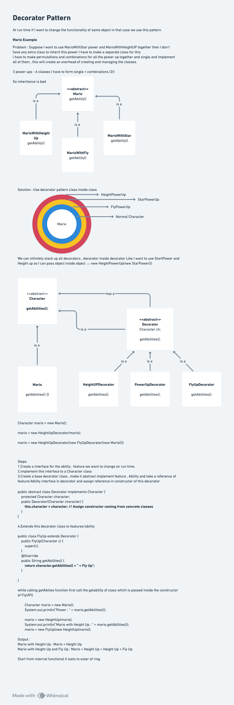

# Decorator Design Pattern

## Definition

The **Decorator Design Pattern** is a structural design pattern that allows you to **attach additional responsibilities to an object dynamically**, providing a flexible alternative to subclassing to extend functionality.

The Decorator pattern **wraps an object with a decorator** that provides the same interface, allowing the decorator to add behavior before, after, or around the original object's behavior.

Also known as:
- **Wrapper Pattern**
- **Enhancement Pattern**

## Purpose

The Decorator pattern is used when:
- You need to add new features/responsibilities to objects without modifying them
- Adding features via inheritance would create too many subclasses
- You want to combine features dynamically at runtime
- You need to apply transformations to objects before/after their methods
- You want to add optional features that are applied conditionally

## Key Problem It Solves

**Without Decorator Pattern (Subclassing Approach):**
```
If Mario can have abilities: Height, Fly, StarPower
You'd need:
  - Mario
  - MarioHeightUp
  - MarioFlyUp
  - MarioStarPower
  - MarioHeightUpFlyUp
  - MarioHeightUpStarPower
  - MarioFlyUpStarPower
  - MarioHeightUpFlyUpStarPower
  
This is 8 classes for just 3 features!
With N features, you need 2^N subclasses (Combinatorial Explosion)
```

**With Decorator Pattern (Dynamic Composition):**
```
  - Mario (base)
  - HeightUp (decorator)
  - FlyUp (decorator)
  - StarPower (decorator)
  
Combine dynamically:
  mario = new StarPower(new FlyUp(new HeightUp(new Mario())));
Only 4 classes! Flexible & scalable combinations!
```

---

## Core Participants

| Participant | Role |
|-------------|------|
| **Component Interface** | Defines the interface for objects that can have responsibilities added dynamically |
| **Concrete Component** | The original object to which additional responsibilities can be added |
| **Decorator** | Abstract decorator maintaining reference to component; implements same interface |
| **Concrete Decorator** | Adds specific responsibilities to the component; can call component methods then add behavior |

---

## Quick notes and diagram


---

## Implementation Components

### Component Interface

#### **Character Interface**
```
Purpose: Defines the contract for all objects (components and decorators)
Method: getAbilities()
  - Returns the string representation of abilities
  - Implemented by both Mario (concrete component) and all decorators
  - Allows decorators to be used interchangeably with components
  - Both wrapped object and wrapper respond to same method call
```

**Key Design Point:**
- Decorators implement the **same interface** as the component
- This allows decorators to be used wherever components are used
- Enables transparent wrapping: client code treats both the same

---

### Concrete Component

#### **Mario Class**
```
Purpose: The original object to which decorators add functionality
Implements: Character interface

Methods:
  - getAbilities()
    * Returns: "Mario"
    * Represents base abilities without any decorators
    * Starting point for decoration chain

Key Points:
  - Simple base implementation
  - Can stand alone without decorators
  - Doesn't know about or depend on decorators
  - Remains unchanged even when decorated
```

**Behavior:**
- Provides the base functionality
- Does not explicitly extend or relate to decorators
- Can be wrapped multiple times by different decorators

---

### Abstract Decorator

#### **Decorator Class (Base Decorator)**
```
Purpose: Abstract class that wraps a component and provides same interface

Attributes:
  - protected Character character
    * Maintains reference to wrapped component
    * Can wrap any Character (component or already-decorated component)
    * Allows composition: decorators wrapping decorators

Methods:
  - Constructor(Character character)
    * Stores the wrapped component
    * Called by concrete decorators to initialize wrapped object
    * Passed up the chain via super()

Key Design Pattern:**
  - Implements Character interface (same as component)
  - Holds reference to Character (not concrete Mario)
  - Opens door for decorator chaining

Why Abstract?
  - Shouldn't be instantiated directly
  - Provides common structure for all concrete decorators
  - Forces subclasses to implement getAbilities()
  - Ensures consistent behavior across all decorators
```

**Critical Design Decision:**
```
Stores Character (interface), NOT Mario (concrete class)
This allows:
  - Wrapping any Character implementation
  - Wrapping already-decorated characters
  - Unlimited decorator chaining
  
Alternative (wrong): Store only Mario
  - Can't wrap other characters
  - Can't wrap decorated Marios
  - Breaks flexibility
```

---

### Concrete Decorators

#### **HeightUp Decorator**
```
Purpose: Adds "Height Up" ability to a character
Extends: Decorator abstract class
Implements: Character interface (inherited)

Attributes:
  - character (inherited from Decorator)
    * Holds the wrapped character
    * Can be Mario or another decorated character

Methods:
  - Constructor(Character c)
    * Stores the wrapped character via super()
    * Typical pattern: super(c);
    
  - getAbilities()
    * Calls wrapped character's getAbilities()
    * Appends " + Height Up" to result
    * Returns combined string with decoration
    * Example:
      - Input: Mario
      - Output: "Mario + Height Up"
      - Input: "Mario + Height Up" (already decorated)
      - Output: "Mario + Height Up + Height Up" (double decorator)

Behavior:
  - Non-intrusive: doesn't modify wrapped character
  - Additive: adds to existing abilities
  - Chainable: wraps any Character implementation
```

**Key Pattern Elements:**
```
1. Wraps a Character: public HeightUp(Character c)
2. Implements same interface: implements Character
3. Delegates to wrapped: character.getAbilities()
4. Adds own behavior: + " + Height Up"
5. Returns enhanced result
```

---

#### **FlyUp Decorator**
```
Purpose: Adds "Fly Up" ability to a character
Extends: Decorator abstract class

Structure:
  - Same as HeightUp
  - Different ability string: " + Fly Up"
  
Behavior:
  - Wraps any Character
  - Returns: baseAbility + " + Fly Up"
  - Can be stacked with other decorators
  
Example Compositions:
  - FlyUp(Mario) → "Mario + Fly Up"
  - FlyUp(HeightUp(Mario)) → "Mario + Height Up + Fly Up"
  - FlyUp(FlyUp(Mario)) → "Mario + Fly Up + Fly Up" (double fly)
```

---

#### **StarPower Decorator**
```
Purpose: Adds "Star Power" ability to a character
Extends: Decorator abstract class

Structure:
  - Same as HeightUp and FlyUp
  - Different ability string: " + Star Power"
  
Behavior:
  - Wraps any Character
  - Returns: baseAbility + " + Star Power"
  - Can be any position in decorator chain
  
Example Compositions:
  - StarPower(Mario) → "Mario + Star Power"
  - StarPower(FlyUp(HeightUp(Mario))) → "Mario + Height Up + Fly Up + Star Power"
  - HeightUp(StarPower(FlyUp(Mario))) → "Mario + Fly Up + Star Power + Height Up"
```

**Decorator Order Matters:**
```
Order affects the visual output order:
  - new HeightUp(new FlyUp(Mario)) → "Mario + Fly Up + Height Up"
  - new FlyUp(new HeightUp(Mario)) → "Mario + Height Up + Fly Up"

Order typically shows abilities from inside-out (first decorator applied last in output)
```

---

## Execution Flow: Step-by-Step

### Example 1: Basic Character
```
Character mario = new Mario();
System.out.println(mario.getAbilities());

Execution:
  1. mario → new Mario()
  2. mario.getAbilities() → returns "Mario"
  3. Output: "Mario"

State:
  mario = [Mario]
```

---

### Example 2: Single Decorator
```
mario = new HeightUp(mario);
// Now mario = HeightUp wrapping Mario

System.out.println(mario.getAbilities());

Execution:
  1. HeightUp.getAbilities() is called
  2. Inside: character.getAbilities() → calls Mario.getAbilities()
  3. Mario returns "Mario"
  4. HeightUp appends " + Height Up"
  5. Returns "Mario + Height Up"
  6. Output: "Mario + Height Up"

State:
  mario = [HeightUp → Mario]
  Reference now points to HeightUp, not Mario
```

---

### Example 3: Multiple Decorators (Chaining)
```
mario = new FlyUp(new HeightUp(mario));
// Now mario = FlyUp wrapping HeightUp wrapping Mario

System.out.println(mario.getAbilities());

Execution Flow (Inside-Out):
  1. FlyUp.getAbilities() called
     ├─ Calls character.getAbilities() (which is HeightUp)
     │
     2. HeightUp.getAbilities() called
        ├─ Calls character.getAbilities() (which is Mario)
        │
        3. Mario.getAbilities() called
           └─ Returns "Mario"
     │
     └─ Returns "Mario" + " + Height Up" = "Mario + Height Up"
     │
     └─ FlyUp appends " + Fly Up"
     │
     └─ Returns "Mario + Height Up + Fly Up"

Final Output: "Mario + Height Up + Fly Up"

State:
  mario = [FlyUp → [HeightUp → [Mario]]]
  Nested decoration: decorators wrapping decorators wrapping component
```

---

### Example 4: Independent Decoration Chain
```
Character mario2 = new Mario();
mario2 = new FlyUp(mario2);

System.out.println(mario2.getAbilities());

Execution:
  1. Different starting point (new Mario instance)
  2. Different decorator chain (only FlyUp)
  3. Returns "Mario + Fly Up"

Note:
  - mario and mario2 are independent
  - mario still has "Mario + Height Up + Fly Up"
  - mario2 only has "Mario + Fly Up"
  - Each maintains its own decoration chain
```

---

## Class Diagram

```
┌──────────────────┐
│   <<interface>>  │
│   Character      │
├──────────────────┤
│ +getAbilities(): │
│   String         │
└────────┬─────────┘
         △
         │ implements
    ┌────┴──────┐
    │            │
┌───▼──────┐ ┌──▼─────────────┐
│   Mario  │ │ <<abstract>>    │
└──────────┘ │    Decorator    │
             ├─────────────────┤
             │ #character:     │
             │   Character     │
             │ #Decorator()    │
             └────────┬────────┘
                      △
                      │ extends
          ┌───────────┼───────────┐
          │           │           │
      ┌───▼──┐   ┌───▼──┐   ┌───▼────────┐
      │FlyUp │   │HeightUp  │StarPower │
      └──────┘   └────────┘└──────────┘

Relationships:
  - Mario: Concrete component implementing Character
  - Decorator: Abstract wrapper implementing Character
  - FlyUp, HeightUp, StarPower: Concrete decorators extending Decorator
  - All implement Character (polymorphism)
  - Decorators hold Character reference (composition)
```

---

## Key Interview Topics

### 1. **Decorator vs Inheritance**

**Inheritance Approach (Problematic):**
```
class MarioHeightUp extends Mario { ... }
class MarioFlyUp extends Mario { ... }
class MarioHeightUpFlyUp extends MarioHeightUp { ... }

Issues:
  - Combinatorial explosion: N features = 2^N classes
  - Rigid: Can't choose features at runtime
  - Violates Single Responsibility Principle
  - Code duplication across subclasses
```

**Decorator Approach (Better):**
```
class HeightUp extends Decorator { ... }
class FlyUp extends Decorator { ... }

Advantages:
  - Linear growth: N features = N + 1 classes (base + N decorators)
  - Flexible: Choose features dynamically
  - Reusable: HeightUp can decorate any Character
  - Clean: Each decorator has single responsibility
```

---

### 2. **Composition over Inheritance**

**Composition:**
```
- Decorator holds reference to Component (Has-A relationship)
- Can wrap any Component, dynamic at runtime
- Flexible: swap wrapped object, change decoration order
- Reflects Liskov Substitution Principle
```

**Inheritance:**
```
- Child inherits from Parent (Is-A relationship)
- Compile-time: fixed at definition
- Static: can't change parent class at runtime
- Violates Open-Closed Principle
```

---

### 3. **Transparent Wrapping**

**Key Concept:** Decorators are transparent because they implement the same interface
```
// Client code doesn't know if working with Mario or decorated Mario
Character c = new Mario();
c = new HeightUp(c);  // Still responds to getAbilities()

// Works the same whether decorated or not
String abilities = c.getAbilities();

// Client doesn't need to know wrapping happened
```

**Importance:**
- Allows using decorated objects everywhere original objects are used
- Enables graceful feature addition without client code changes
- Follows Interface Segregation Principle

---

### 4. **Decorator Ordering & Sequence**

**Order Matters:**
```
new FlyUp(new HeightUp(new Mario()))
  → "Mario + Height Up + Fly Up"

new HeightUp(new FlyUp(new Mario()))
  → "Mario + Fly Up + Height Up"
```

**Why?**
```
Outer decorator's behavior wraps inner decorator
Result accumulates from inside-out
Order determines feature sequence in output
```

**Interview Question:** *"Does decorator order affect functionality or just output?"*

**Answer:** In this implementation, only output order. Functionally, all abilities are present. But in real scenarios, order can matter for side effects:

```
Example (Real-world):
  - Logger decorator: logs before/after
  - Caching decorator: caches then returns
  - Compression decorator: compresses then sends
  
Order DOES matter here:
  - Compression(Logger(originalObject))
    → Logs, then compresses
  - Logger(Compression(originalObject))
    → Compresses, then logs compressed size
```

---

### 5. **Recursive Composition (Nesting)**

**How Decorators Can Wrap Other Decorators:**
```
// Decorator wraps another Decorator which wraps Component
FlyUp f = new FlyUp(new HeightUp(new Mario()));

Visual Structure:
┌──────────────┐
│   FlyUp      │ ← Decorator #2
│ ┌──────────┐ │
│ │ HeightUp │ │ ← Decorator #1
│ │┌────────┐│ │
│ ││ Mario  ││ │ ← Component
│ │└────────┘│ │
│ └──────────┘ │
└──────────────┘

Why This Works:
  - Decorator implements Character (same interface as Mario)
  - So HeightUp IS-A Character
  - FlyUp can wrap any Character, including HeightUp
  - No limit to nesting depth
```

**Key Enable:** Decorator stores `Character` (interface), not `Mario` (concrete class)

---

### 6. **Advantages of Decorator Pattern**

✅ **Open-Closed Principle**: Open for extension (add new decorators), closed for modification (don't change existing)

✅ **Single Responsibility**: Each decorator has one reason to change (its specific feature)

✅ **Flexibility**: Combine features in any order at runtime

✅ **Dynamic Behavior**: Add/remove features without object changes

✅ **Reusability**: Same decorator works with any component

✅ **No Combinatorial Explosion**: Constant features, linear class count

✅ **Runtime Composition**: Decide decorations based on runtime conditions

```
Example:
if (playerLevel > 10) mario = new FlyUp(mario);
if (hasStarPickup) mario = new StarPower(mario);
```

---

### 7. **Disadvantages & Limitations**

❌ **Code Complexity**: Nested decorators harder to understand than simple objects

❌ **Performance**: Multiple decorators = multiple method calls (indirection)

❌ **Instance Equality**: Two decorated objects aren't equal even with same decorations
```
mario1 = new HeightUp(new Mario());
mario2 = new HeightUp(new Mario());
mario1.equals(mario2) → false (different object instances)
```

❌ **Identity Loss**: Client sees Character interface, can't access original Mario directly

❌ **Decorator Order Dependency**: If order matters, must track it carefully

❌ **Debugging**: Stack trace shows decorator chain instead of final behavior

❌ **Thread Safety**: Not inherently thread-safe for concurrent decorator modifications

---

### 8. **Real-World Applications**

**Java I/O Streams (Classic Example):**
```
InputStream is = new FileInputStream("file.txt");
InputStream buffered = new BufferedInputStream(is);
InputStream compressed = new GZIPInputStream(buffered);

// Reading from compressed uses both decorators
compressed.read() → decompresses → buffers → reads file
```

**GUI Components:**
```
JButton button = new JButton("Click Me");
button = addBorder(button);      // Add border decorator
button = addDragHandler(button); // Add drag decorator
button = addTooltip(button);     // Add tooltip decorator
```

**Web APIs:**
```
Request request = new BaseRequest();
request = new AuthenticationDecorator(request);  // Add auth
request = new LoggingDecorator(request);         // Add logging
request = new CachingDecorator(request);         // Add caching
request.execute();
```

**Database:**
```
Connection conn = new DatabaseConnection();
conn = new TransactionDecorator(conn);    // Add transactions
conn = new LoggingDecorator(conn);        // Add query logging
conn = new PoolingDecorator(conn);        // Add connection pooling
```

---

### 9. **Common Mistakes & How to Avoid**

| Mistake | Problem | Solution |
|---------|---------|----------|
| **Storing concrete type** | Can't wrap decorated objects | Store interface type: `Character character` |
| **Not implementing interface** | Decorator not polymorphic | Ensure decorator implements component interface |
| **Modifying wrapped object** | Violates pattern intent | Only decorate, don't change wrapped object |
| **Creating too many decorators** | Leads to maintenance burden | Combine multiple responsibilities in single decorator if cohesive |
| **Forgetting delegation** | Original behavior lost | Always call `character.getAbilities()` before adding |
| **Assuming order doesn't matter** | Unexpected behavior | Document and consider order effects |

---

### 10. **Interview Questions & Answers**

**Q1: Why do decorators implement the same interface as the component?**
- **A:** So client code doesn't know whether it's working with original component or decorated version. Provides transparent wrapping. Client treats decorated object same as original.

**Q2: What's the difference between Decorator and Wrapper?**
- **A:** Functionally similar, but pattern distinction: Wrapper usually adds interface (adapts), Decorator adds behavior (enhances existing interface). Here, Decorator adds functionality while maintaining same interface.

**Q3: Can you apply the same decorator multiple times?**
- **A:** Yes! `new HeightUp(new HeightUp(mario))` creates "Mario + Height Up + Height Up". Depends on use case whether this is desired.

**Q4: How would you implement a decorator that modifies existing abilities instead of just appending?**
- **A:** Override getAbilities(), call wrapped object, then process/modify the string before returning. Example: remove old ability and add new one.

**Q5: What happens if decorator's constructor receives null?**
- **A:** Null pointer exception when getAbilities() calls character.getAbilities(). Should add null checks: `if(character == null) throw new IllegalArgumentException()`.

**Q6: Can decorators remove functionality instead of just adding?**
- **A:** Yes! Decorator can return subset of abilities. Not typical but possible. Example: create a "RemoveAbility" decorator that filters out specific abilities.

**Q7: How would you implement composite behavior where decorator applies transformation to the value?**
- **A:** `getAbilities()` could manipulate the result: uppercase, lowercase, add prefix/suffix, count, etc. Decorator is flexible—can do any processing.

**Q8: Is Decorator Pattern different from Strategy Pattern?**
- **A:** Yes. Decorator adds behavior/responsibilities to object, extending functionality. Strategy encapsulates algorithm, allowing algorithm swapping. Decorator uses composition to extend object, Strategy uses composition to vary algorithm.

**Q9: Can you mix decorators and inheritance?**
- **A:** Yes, but defeats purpose. A decorated subclass works, but then you lose benefits of decorator flexibility. Generally avoid mixing unless there's architectural reason.

**Q10: How would you handle decorator removal? (Undecorate)**
- **A:** No built-in way. Would need to track wrapped object or implement unwrap() method. Example: add method to get wrapped character, allows "unwrapping" step by step.

---

## Design Principles Applied

### **Open-Closed Principle (OCP)**
```
Open for Extension: Add new decorators (FlyUp, HeightUp) without changing existing code
Closed for Modification: Mario, Character interface unchanged
New features via new classes, not modifying existing ones
```

### **Single Responsibility Principle (SRP)**
```
Mario: Provides base character
HeightUp: Adds height ability only
FlyUp: Adds flight ability only
StarPower: Adds star power only
Each class has one reason to change
```

### **Liskov Substitution Principle (LSP)**
```
Subclasses (decorators) can replace base type (Character)
Client code works identically with Mario, HeightUp, or nested decorators
No special casing needed
```

### **Composition over Inheritance**
```
Decorators use composition (HAS-A) instead of inheritance (IS-A)
More flexible: wrap any Character, not just predefined class hierarchy
```

### **Dependency Inversion Principle (DIP)**
```
High-level modules (clients) depend on abstractions (Character interface)
Low-level modules (Mario, Decorators) depend on same abstraction
Not on concrete implementations
```

---

## Advanced Concepts

### **Responsibility Chain**
```
Each decorator in chain has responsibility to:
1. Call wrapped object's method
2. Add its own behavior
3. Return result
Result flows through entire chain
```

### **Method Interception**
```
Decorators intercept method calls
Can add behavior BEFORE: log, validate, authenticate
Can add behavior AFTER: format, cache, notify
Can add behavior AROUND: timing measurements, transaction management
```

### **Feature Aggregation**
```
Final object aggregates all features from chain
Single object provides multiple features
Features appear as combined result
No separate feature objects to manage
```

### **Type Masking**
```
Client sees Character interface
Doesn't know about underlying Mario or decorator implementations
Implementation details hidden
Allows changing implementations without client impact
```

---

## Comparison with Similar Patterns

| Pattern | Intent | Structure | Use Case |
|---------|--------|-----------|----------|
| **Decorator** | Add responsibilities | Wraps object, same interface | Add features dynamically |
| **Adapter** | Make incompatible interfaces compatible | Wraps object, different interface | Interface conversion |
| **Proxy** | Provide surrogate/placeholder | Wraps object, same interface | Control access, lazy loading |
| **Strategy** | Encapsulate algorithms | HAS-A algorithm, different algorithms | Switch algorithms |
| **Chain of Responsibility** | Pass request along chain | Chain of handlers | Process requests through chain |

---

## Variations & Extensions

### **1. Conditional Decoration**
```
if (condition1) mario = new HeightUp(mario);
if (condition2) mario = new FlyUp(mario);
if (condition3) mario = new StarPower(mario);
```

### **2. Decorator with Additional Methods**
```
public class CombatDecorator extends Decorator {
    public void attack() { ... }
    public void defend() { ... }
}
Note: Client must cast to use additional methods
```

### **3. Decorator Stacking Logic**
```
public class SmartDecorator extends Decorator {
    private int stackCount = 0;
    
    public String getAbilities() {
        if (character instanceof SmartDecorator) {
            return character.getAbilities() + " (x" + stackCount + ")";
        }
        return character.getAbilities() + " + Special";
    }
}
```

### **4. Decorator with State**
```
public class PowerDecorator extends Decorator {
    private int powerLevel;
    
    public String getAbilities() {
        String base = character.getAbilities();
        return base + " + Power (" + powerLevel + ")";
    }
}
```

---

## Summary for Interview

**Key Takeaway:** Decorator Pattern provides a **flexible alternative to inheritance for adding responsibilities to objects dynamically**. It uses **composition** to wrap objects, enabling **runtime feature combination** without class explosion.

**3-Minute Elevator Pitch:**
The Decorator pattern solves the problem of adding optional features without creating countless subclass combinations. By wrapping objects with decorators that implement the same interface, you can dynamically compose features in any combination. Each decorator adds responsibility while delegating to the wrapped object.

**Critical Interview Points:**
1. **Solves combinatorial explosion** from inheritance approach
2. **Uses composition** (wraps object) not inheritance (extends class)
3. **Maintains same interface** enabling transparent wrapping
4. **Recursive composition** allows decorators to wrap other decorators
5. **Follows Open-Closed Principle** extending without modifying
6. **Each decorator has single responsibility**
7. **Runtime flexibility** deciding features dynamically
8. **Clear use case** when you have optional, combinable features

**Common Follow-ups:**
- How would you undecorata object? (Typically not supported, keep original reference)
- What if you need to modify existing behavior? (Override method, call super, modify result)
- How to handle identifier/equality? (Implement equals/hashCode if needed, or wrap original)
- Thread safety? (Not inherent, must synchronize if needed)
- Performance concerns? (Multiple method calls, but usually acceptable trade-off)
