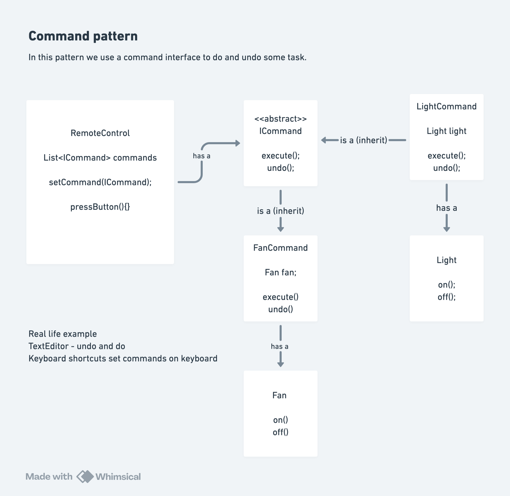

# Command Design Pattern

## Definition

The **Command Design Pattern** is a behavioral design pattern that **encapsulates a request as an object**, allowing you to **parameterize clients with different requests**, **queue requests**, **log requests**, and **support undoable operations**.

The pattern decouples the object that invokes the operation (invoker) from the object that performs the operation (receiver).

Also known as:
- **Action Pattern**
- **Transaction Pattern**

## Purpose

The Command pattern is used when:
- You need to parameterize objects with operations
- You want to queue operations, schedule them, or execute them remotely
- You need to support undo/redo functionality
- You want to log or audit operations
- You need to decouple sender from receiver
- You want to simplify passing requests through a system
- You need to encapsulate method calls as objects

## Key Problem It Solves

## UML diagram


**Without Command Pattern (Tight Coupling):**
```
class RemoteControl {
    void pressButton(int button) {
        if (button == 0) light.on();
        if (button == 1) light.off();
        if (button == 2) fan.on();
        if (button == 3) fan.off();
        // ... more devices
    }
}

Issues:
- RemoteControl depends on Light, Fan directly
- Hard to add new devices (modify RemoteControl)
- Can't easily queue, log, or undo operations
- code is rigid and tightly coupled
- Single Responsibility violated
```

**With Command Pattern (Loose Coupling):**
```
class RemoteControl {
    Command[] commands = new Command[4];
    
    void setCommand(int button, Command cmd) {
        commands[button] = cmd;  // Store ANY command
    }
    
    void pressButton(int button) {
        commands[button].execute();  // Execute without knowing what it does
    }
}

Advantages:
- RemoteControl doesn't know about Light, Fan, etc.
- Easy to add new devices (create new Command)
- Can support undo, queue, logging
- Flexible and extensible
- Clean separation of concerns
```

---

## Core Participants

| Participant | Role |
|-------------|------|
| **Command Interface** | Defines the interface for executing and undoing operations |
| **Concrete Command** | Implements Command; binds receiver with action; encapsulates receiver method calls |
| **Invoker** | Asks command to execute; doesn't know concrete command type |
| **Receiver** | Knows how to perform actual work; executes when asked by command |
| **Client** | Creates commands and associates them with invokers |

---

## Implementation Components

### Command Interface

#### **Command Interface**
```
Purpose: Defines contract for all commands
Methods:
  1. execute()
     - Executes the command's action
     - Everything needed to perform action is in concrete command
     - May have parameters or be parameter-less
  
  2. undo()
     - Reverses the action performed by execute()
     - Not required in all Command patterns (shown here)
     - Essential for supporting undo/redo systems

Design Notes:
- Minimal interface: only what all commands must do
- Concrete commands implement specifics
- Invoker depends only on this interface
- Enabling polymorphism: execute any command without knowing type
```

**Key Design Decision:**
```
- Interface, not abstract class
- Allows multiple inheritance paths
- Clean contract definition
- Invoker can hold Command[] array polymorphically
```

---

### Receiver Objects

#### **Light Class (Receiver)**
```
Purpose: The actual object that performs the work
Methods:
  - on()
    * Turns the light on
    * Prints status message
    * Real implementation of the action
    
  - off()
    * Turns the light off
    * Prints status message
    * Reverses the action

Characteristics:
  - Knows HOW to perform operations
  - Doesn't know it's being controlled via Command pattern
  - Can be used directly or through commands
  - Business logic lives here
  
Receiver vs Command:
  - Light.on() is the receiver method
  - LightCommand wraps this method call
  - Separation: Light has method, LightCommand encapsulates it
```

---

#### **Fan Class (Receiver)**
```
Purpose: Another receiver object with similar interface
Methods:
  - on()  : Turns fan on
  - off() : Turns fan off

Key Observation:
  - Light and Fan have same interface (on/off)
  - Different implementations (different behaviors)
  - Both can be controlled by RemoteControl through commands
  - Demonstrates receiver polymorphism through command uniformity
```

---

### Concrete Commands

#### **LightCommand (Concrete Command)**
```
Purpose: Encapsulates a light control operation
Implements: Command interface
Attributes:
  - Light light
    * Reference to the receiver object
    * Holds the light being controlled
    * Stored during construction

Methods:
  - Constructor(Light light)
    * Stores reference to receiver
    * Called when command is created
    * Links command to specific light instance
    * Different LightCommand can control different Light objects
    
  - execute()
    * Calls light.on()
    * Specific action encapsulated here
    * Invoker calls this without knowing about light.on()
    
  - undo()
    * Calls light.off()
    * Reverses the execute action
    * Creates undo capability

Design Pattern Key:**
  - Encapsulates method call: light.on() wrapped in object
  - Defers execution: command object created, executed later
  - Passes operation as parameter: RemoteControl accepts Command
  - Makes request an object: can store, queue, transmit LightCommand
```

**Execution Semantics:**
```
execute() → on()   (turn light on)
undo()    → off()  (turn light off)

Note: undo() doesn't call execute() then reverse
      It directly calls the opposite action (off())
      This is a simple undo strategy
```

---

#### **FanCommand (Concrete Command)**
```
Purpose: Encapsulates a fan control operation
Implements: Command interface
Attributes:
  - Fan fan (receiver reference)

Methods:
  - Constructor(Fan fan)
    * Stores fan reference
    
  - execute()
    * Calls fan.on()
    
  - undo()
    * Calls fan.off()

Parallel Structure:
  - FanCommand mirrors LightCommand
  - Same pattern applied to different receiver
  - Demonstrates command pattern reusability
  - Can reuse LightCommand code with different devices

Key Insight:
  - If you have N devices with on/off, create N commands
  - Each command knows its receiver
  - Invoker treats all identically
```

---

### Invoker

#### **RemoteControl Class (Invoker)**
```
Purpose: Invokes commands without knowing their details
Attributes:
  - int numofButtons = 4
    * Fixed number of buttons on remote
    * Could be configurable in production
    * Determines command array size
    
  - Command[] buttons
    * Array to hold commands
    * Index corresponds to physical button
    * buttons[0] = command for button 0, etc.
    * Each button can have different command
    
  - boolean[] buttonPressed
    * Tracks state of each button
    * true = button currently pressed/active
    * false = button not pressed/inactive
    * Enables toggle behavior (press = execute, press again = undo)

Methods:
  1. Constructor
     - Creates empty buttons array (nulls)
     - Creates buttonPressed array (all false)
     - Initializes state
     - No commands assigned yet
     
  2. setCommand(int buttonIndex, Command command)
     - Assigns command to button
     - buttonIndex: which button (0-3)
     - command: any command implementing Command interface
     - Range check: validates buttonIndex
     - Can reassign commands at runtime (dynamic binding)
     
     Example:
       RemoteControl remote = new RemoteControl();
       remote.setCommand(0, new FanCommand(fan));
       // Button 0 now executes fan commands
       
  3. pressButton(int buttonIndex)
     - Core invoke mechanism
     - Executes or undoes based on state
     - Range check: validates buttonIndex
     - State check: buttonPressed[buttonIndex]
     - Toggle behavior:
       * First press: execute() then set buttonPressed[buttonIndex] = true
       * Second press: undo() then set buttonPressed[buttonIndex] = false
       * Third press: execute() again, repeat cycle
     
     Flow:
       if (!buttonPressed[buttonIndex])  // Not currently pressed
           buttons[buttonIndex].execute()
           buttonPressed[buttonIndex] = true
       else                               // Currently pressed
           buttons[buttonIndex].undo()
           buttonPressed[buttonIndex] = false

Invoker Pattern Characteristics:
  - Doesn't know concrete command types
  - Depends on Command interface only
  - Doesn't care what command does
  - Just invokes execute/undo
  - Can hold multiple commands
  - Can invoke commands dynamically
  - Enables deferred execution
  - Can queue commands (if needed)
```

**Key Invoker Concept:**
```
RemoteControl is DECOUPLED from Light, Fan, etc.
RemoteControl only knows about Command interface
Can easily add new device types without changing RemoteControl
This is the power of the Command pattern
```

---

## Execution Flow: Step-by-Step

### Setup Phase
```
1. Create Receiver Objects
   Fan fan = new Fan();
   Light light = new Light();
   
   Result: Two devices created, ready to be controlled

2. Create Invoker
   RemoteControl remote = new RemoteControl();
   
   Result: Remote with 4 buttons, all unassigned (null commands)
   State: buttonPressed = [false, false, false, false]

3. Create Commands
   (Done implicitly in setCommand)
   
4. Assign Commands to Buttons
   remote.setCommand(0, new FanCommand(fan));
   remote.setCommand(1, new LightCommand(light));
   
   Result:
   - Button 0: FanCommand wrapping fan
   - Button 1: LightCommand wrapping light
   - Button 2: null (no command)
   - Button 3: null (no command)
```

---

### Execution Phase - Button Press #1 (Execute)

```
Scenario: Press button 0 (Fan button)
remote.pressButton(0);

Execution Flow:
1. RemoteControl.pressButton(0) called
   - buttonIndex = 0
   - Range check: 0 < 4 ✓
   
2. Check button state
   - buttonPressed[0] is false (not currently pressed)
   
3. Execute command
   - buttons[0].execute() called
   - Button 0 holds FanCommand
   - FanCommand.execute() invoked
     ├─ Calls fan.on()
     └─ Fan prints "Fan is ON"
   
4. Update state
   - buttonPressed[0] = true
   - Tracks that button 0 is now "active"

Output: "Fan is ON"

State After:
  buttons = [FanCommand, LightCommand, null, null]
  buttonPressed = [true, false, false, false]
```

---

### Execution Phase - Button Press #2 (Undo)

```
Scenario: Press button 0 again (same button)
remote.pressButton(0);

Execution Flow:
1. RemoteControl.pressButton(0) called
   
2. Check button state
   - buttonPressed[0] is true (currently pressed)
   - Condition !buttonPressed[0] is FALSE
   - Goes to else block
   
3. Execute undo
   - buttons[0].undo() called
   - FanCommand.undo() invoked
     ├─ Calls fan.off()
     └─ Fan prints "Fan is OFF"
   
4. Update state
   - buttonPressed[0] = false
   - Tracks that button is now inactive

Output: "Fan is OFF"

State After:
  buttons = [FanCommand, LightCommand, null, null]
  buttonPressed = [false, false, false, false]

Key Insight:
  Toggle behavior achieved through state tracking
  Same button: first press turns ON, second press turns OFF
```

---

### Execution Phase - Different Button

```
Scenario: Press button 1 (Light button)
remote.pressButton(1);

Execution Flow:
1. RemoteControl.pressButton(1) called
   
2. Check button state
   - buttonPressed[1] is false
   
3. Execute command
   - buttons[1].execute() called
   - LightCommand.execute() invoked
     ├─ Calls light.on()
     └─ Light prints "Light is ON"
   
4. Update state
   - buttonPressed[1] = true

Output: "Light is ON"

Independent State:
  buttons = [FanCommand, LightCommand, null, null]
  buttonPressed = [false, true, false, false]
  
Note: Button 0 and Button 1 have independent states
      Pressing Button 1 doesn't affect Button 0 state
      Each button tracks its own state
```

---

### Execution Phase - Invalid Button

```
Scenario: Press button 2 (unassigned button)
remote.pressButton(2);

Execution Flow:
1. RemoteControl.pressButton(2) called
   
2. Check range
   - buttonIndex 2 < 4 ✓ (valid range)
   
3. Check if button has command
   - buttons[2] is null
   - buttons[2].execute() would throw NullPointerException!
   
Note: Current implementation has a BUG
      Should check if buttons[2] != null before calling
      
Fixed version would be:
if (buttonIndex >= 0 && buttonIndex < numofButtons) {
    if (buttons[buttonIndex] != null) {  // Added check
        if (!buttonPressed[buttonIndex]) {
            buttons[buttonIndex].execute();
            ...
        }
    } else {
        System.out.println("No command assigned to button " + buttonIndex);
    }
}
```

---

## Visual Diagram


---

## Architecture Diagram

```
┌─────────────────────┐
│  RemoteControl      │ (Invoker)
│ (Invoker)           │
├─────────────────────┤
│ Command[] buttons   │─────┐
│ pressButton()       │     │
│ setCommand()        │     │
└─────────────────────┘     │
                            │
                    ┌───────▼────────┐
                    │  <<interface>> │
                    │    Command     │
                    ├────────────────┤
                    │ +execute()     │
                    │ +undo()        │
                    └────────┬────────┘
                             △
                    ┌────────┴──────────┐
                    │                   │
             ┌──────▼──────┐    ┌──────▼──────┐
             │LightCommand │    │ FanCommand  │
             ├─────────────┤    ├─────────────┤
             │-light       │    │-fan         │
             │+execute()   │    │+execute()   │
             │+undo()      │    │+undo()      │
             └──────┬──────┘    └──────┬──────┘
                    │                   │
             ┌──────▼──────┐    ┌──────▼──────┐
             │    Light    │    │     Fan     │
             │ (Receiver)  │    │ (Receiver)  │
             ├─────────────┤    ├─────────────┤
             │+on()        │    │+on()        │
             │+off()       │    │+off()       │
             └─────────────┘    └─────────────┘

Relationships:
- RemoteControl holds Command[] (polymorphic)
- LightCommand/FanCommand implement Command
- Each command holds reference to receiver (Light/Fan)
- RemoteControl invokes commands without knowing receivers
```

---

## Key Interview Topics

### 1. **Why Command Pattern? Core Benefits**

**Decoupling: Separation of Concerns**
```
Without pattern:
  RemoteControl knows about Light, Fan, TV, Door, etc.
  Adding new device requires changing RemoteControl

With pattern:
  RemoteControl knows only Command interface
  Adding new device requires only new Command
  RemoteControl code unchanged
  Follows Open-Closed Principle
```

**Encapsulation**
```
Request encapsulated as object:
  - Can store it: Command cmd = new FanCommand(fan);
  - Can queue it: commandQueue.add(cmd);
  - Can log it: commandLog.record(cmd);
  - Can undo it: cmd.undo();
```

**Parameterization**
```
Method can take Command as parameter:
  void executeCommand(Command cmd) {
      cmd.execute();
  }
  
Same method executes different actions based on Command type
Enables client to parameterize requests
```

---

### 2. **Command vs Other Patterns**

| Pattern | Intent | Key Difference |
|---------|--------|-----------------|
| **Command** | Encapsulate request as object | Request becomes object |
| **Strategy** | Encapsulate algorithm | Algorithm becomes interchangeable |
| **State** | Object changes behavior | Behavior varies by internal state |
| **Chain of Responsibility** | Pass request along chain | Request forwarded through handlers |

---

### 3. **Undo/Redo Implementation**

**Current Implementation (Simple Toggle):**
```
execute() = turn on
undo()    = turn off

Toggle behavior: pressing again undoes
```

**Advanced Undo Stack (Production):**
```
Stack<Command> undoStack = new Stack<>();
Stack<Command> redoStack = new Stack<>();

When executing:
  command.execute();
  undoStack.push(command);
  redoStack.clear();

When undoing:
  Command cmd = undoStack.pop();
  cmd.undo();
  redoStack.push(cmd);
  
When redoing:
  Command cmd = redoStack.pop();
  cmd.execute();
  undoStack.push(cmd);
```

**State Preservation for Undo:**
```
Some commands need to store state before execute()

Example:
class EditTextCommand implements Command {
    private String text;
    private String originalText;
    
    public void execute() {
        originalText = document.getText();  // Save state
        document.setText(text);
    }
    
    public void undo() {
        document.setText(originalText);     // Restore state
    }
}
```

---

### 4. **Invoker vs Receiver**

**Invoker (RemoteControl):**
- Doesn't know how to do the work
- Doesn't know what device is being controlled
- Simply invokes Command.execute() or Command.undo()
- Can be generic and reusable

**Receiver (Light, Fan):**
- Knows HOW to perform the action
- Contains actual business logic
- Doesn't know it's controlled via Command pattern
- Can be used independently or through commands

**Separation:**
```
Invoker: "I know HOW to invoke"
Command: "I know WHAT to invoke and on WHICH receiver"
Receiver: "I know HOW to perform"

Three separate responsibilities!
```

---

### 5. **Dynamic Command Assignment**

**Time-based:**
```
// Assign commands at runtime, can change anytime
remote.setCommand(0, new FanCommand(fan));

// Later, reassign to different device
remote.setCommand(0, new LightCommand(light));

// Can depend on conditions
if (isWinter) {
    remote.setCommand(0, new HeaterCommand(heater));
} else {
    remote.setCommand(0, new FanCommand(fan));
}
```

**Advantages:**
- Flexible: Commands not hardcoded
- Adaptable: Behavior can change at runtime
- Configurable: From files, user input, etc.

---

### 6. **Null Command Pattern (NullObject)**

**Current Issue:**
```
Pressing unassigned button causes NullPointerException
buttons[2] is null → buttons[2].execute() → crash!
```

**Solution: Null Command**
```
class NoOpCommand implements Command {
    public void execute() {
        // Do nothing
    }
    
    public void undo() {
        // Do nothing
    }
}

Instead of null:
buttons[i] = new NoOpCommand();  // Default for all buttons

Now pressing unassigned button is safe:
  buttons[2].execute();  → does nothing, no error
```

**Benefits:**
- Avoids null checks
- Cleaner code
- Follows Null Object Pattern
- Eliminates null pointer exceptions

---

### 7. **Command Queuing**

**Scenario: Batch Commands**
```
List<Command> commandQueue = new ArrayList<>();

// Add multiple commands
commandQueue.add(new FanCommand(fan));
commandQueue.add(new LightCommand(light));
commandQueue.add(new FanCommand(fan));

// Execute all
for (Command cmd : commandQueue) {
    cmd.execute();
}

// Undo all in reverse
for (int i = commandQueue.size() - 1; i >= 0; i--) {
    commandQueue.get(i).undo();
}
```

**Use Cases:**
- Batch operations
- Macro recording
- Scheduled execution
- Transaction-like behavior

---

### 8. **Command with Parameters**

**Current Implementation:**
```
Command encapsulates receiver AND action
No parameters needed (on/off is implicit)
```

**Advanced: Parameterized Commands**
```
class LightCommand implements Command {
    private Light light;
    private int brightness;  // Parameter
    
    public LightCommand(Light light, int brightness) {
        this.light = light;
        this.brightness = brightness;
    }
    
    public void execute() {
        light.setBrightness(brightness);
    }
    
    public void undo() {
        light.setBrightness(0);  // Off
    }
}

Usage:
remote.setCommand(0, new LightCommand(light, 50));  // 50% brightness
```

---

### 9. **Macro/Composite Commands**

**Scenario: Press one button, multiple commands execute**
```
class MacroCommand implements Command {
    private List<Command> commands = new ArrayList<>();
    
    public void addCommand(Command cmd) {
        commands.add(cmd);
    }
    
    public void execute() {
        for (Command cmd : commands) {
            cmd.execute();  // All commands execute
        }
    }
    
    public void undo() {
        for (int i = commands.size()-1; i >= 0; i--) {
            commands.get(i).undo();  // Undo in reverse order
        }
    }
}

Usage:
MacroCommand goodNight = new MacroCommand();
goodNight.addCommand(new FanCommand(fan));
goodNight.addCommand(new LightCommand(light));
goodNight.addCommand(new DoorCommand(door));

remote.setCommand(0, goodNight);
// Press button 0: all three commands execute (complete routine!)
```

---

### 10. **Logging and Auditing**

**Command Pattern enables Operation Logging:**
```
class CommandWithLogging implements Command {
    private Command command;
    private Logger logger;
    
    public CommandWithLogging(Command cmd, Logger logger) {
        this.command = cmd;
        this.logger = logger;
    }
    
    public void execute() {
        logger.log("Executing: " + command.getClass().getName());
        command.execute();
        logger.log("Success");
    }
    
    public void undo() {
        logger.log("Undoing: " + command.getClass().getName());
        command.undo();
    }
}

Usage:
Command cmd = new LoggingCommandDecorator(
    new FanCommand(fan),
    auditLogger
);
```

**Enables:**
- Complete operation history
- Audit trails
- Debugging
- Compliance logging

---

## Advantages of Command Pattern

✅ **Decoupling**: Invoker doesn't depend on concrete command types  
✅ **Flexibility**: Easy to add new commands without changing existing code  
✅ **Reusability**: Commands can be reused with different invokers  
✅ **Undo/Redo**: Natural support for reversible operations  
✅ **Queuing**: Commands can be queued, logged, transmitted  
✅ **Macro**: Composite commands enable complex operations  
✅ **OCP**: Open for extension (new commands), closed for modification  
✅ **SRP**: Each command has single responsibility  

---

## Disadvantages & Challenges

❌ **Complexity**: More classes for simple operations  
❌ **Overhead**: Command object creation has memory cost  
❌ **State Management**: Undo requires state tracking  
❌ **Ordering Dependencies**: Undo order critical in macros  
❌ **Exception Handling**: Exceptions in execute/undo need handling  
❌ **Memory Leaks**: Command history can bloat memory  
❌ **Debugging Difficulty**: Execution flow less obvious  

---

## Implementation Issues & Solutions

| Issue | Problem | Solution |
|-------|---------|----------|
| **Null Commands** | Unassigned buttons crash | Use NullObject pattern |
| **State for Undo** | Can't undo complex operations | Store state before execute |
| **Memory Leaks** | Command history grows unbounded | Trim old commands/history limits |
| **Undo Order** | Composite commands undo wrong order | Undo in reverse execution order |
| **Exception Handling** | Command fails, system inconsistent | Wrap in try-catch, rollback on failure |
| **Concurrent Modifications** | Multi-thread queue access issues | Synchronize queue access |
| **Parameter Passing** | How to pass parameters to command | Store in command constructor |

---

## Real-World Applications

### **1. Text Editors (Undo/Redo)**
```
Commands: Insert, Delete, Replace, Cut, Paste
Stack undo/redo history
User presses Ctrl+Z: pops command, calls undo()
```

### **2. GUI Frameworks (Button Actions)**
```
Each button holds a Command
Clicking button invokes execute()
Enables flexible UI configuration
```

### **3. Keyboard Shortcuts**
```
Ctrl+C → CopyCommand
Ctrl+V → PasteCommand
Ctrl+Z → UndoCommand (which is itself a command!)
Any key can be bound to any command
```

### **4. Macro Recording**
```
Record: Store sequence of commands
Playback: Execute sequence
Enables automation of repetitive tasks
```

### **5. Remote Services (RPC)**
```
Commands sent over network
Server receives, deserializes, executes
Natural fit for distributed systems
```

### **6. Job Scheduling**
```
Scheduler holds Queue<Command>
Executes at scheduled times
Can retry failed commands
Can roll back with undo()
```

### **7. Game Development**
```
Player input → Command
Replay system: store all commands
Replay entire game by executing command sequence
Enables perfect game replays
```

---

## Common Interview Questions

**Q1: How is Command Pattern different from Strategy Pattern?**
- **A:** Strategy encapsulates interchangeable algorithms; Command encapsulates requests. Strategy is about how to DO something, Command is about WHAT to do and when to do it.

**Q2: Can you implement undo for a complex operation?**
- **A:** Store the state before executing. On undo, restore the saved state. For composite commands, undo each sub-command in reverse order.

**Q3: What happens if a command fails during execution?**
- **A:** Current implementation has no error handling. Production should wrap in try-catch, log failure, optionally rollback (call undo). Implement Command retry logic.

**Q4: How would you implement Ctrl+Z (undo) in a text editor?**
- **A:** Maintain Stack<Command> undoStack. Each text operation (insert, delete) creates a command, executes it, pushes to stack. Ctrl+Z pops from stack, calls undo() on command.

**Q5: Why not just pass a method pointer instead of Command object?**
- **A:** Command object provides consistency (all implement same interface), can store state, easier to persist/serialize, can implement macro/composite commands. Method pointers limited.

**Q6: Can a Command be an Observer?**
- **A:** Yes! Can have Observable notify commands to execute. Combines two patterns. Example: events trigger commands.

**Q7: What's the relationship between Command and Composite patterns?**
- **A:** Composite commands (MacroCommand) hold list of other commands. Composite allows treating single commands and composite commands uniformly.

**Q8: How do you handle command parameters?**
- **A:** Store parameters in command constructor, not in execute() method. This allows queuing/serializing commands with their parameters intact.

**Q9: Can you implement nested undo (undo the undo)?**
- **A:** Maintain two stacks: undoStack and redoStack. When undoing, move command from undo to redo. When redoing, move from redo to undo.

**Q10: How does Command Pattern relate to Chain of Responsibility?**
- **A:** Different patterns. Command: encapsulate request. Chain: pass request through chain of handlers. Can combine: commands passed through handler chain.

---

## Best Practices

### **1. Always Use Interface for Commands**
```
Enables polymorphism and flexibility
Invoker depends on interface, not concrete classes
```

### **2. Implement NullCommand for Default**
```
Prevents null pointer exceptions
Cleaner than null checks
Follows Null Object pattern
```

### **3. Store State for Undo**
```
Copy state before modifying
Enables reversal of changes
Necessary for complex operations
```

### **4. Use Macro/Composite for Complex Operations**
```
Group related commands
Execute together as atomic unit
Undo all in correct order
```

### **5. Consider Command Serialization**
```
Commands can be persisted
Enables command history, replays, distributed execution
Store command type and parameters
```

### **6. Handle Exceptions in Commands**
```
Wrap execute/undo in try-catch
Log failures
Optionally rollback on failure
Don't let exceptions break system state
```

### **7. Limit Undo History Size**
```
Protect against memory leaks
Keep only last N commands
Delete oldest on limit exceeded
```

### **8. Document Undo Semantics**
```
Some commands undo differently than simple reverse
Document what undo() actually does
Ensure users understand behavior
```

---

## Pattern Variations

### **1. Command with Memento (State Snapshot)**
```
class SmartCommand implements Command {
    private Receiver receiver;
    private Memento snapshot;
    
    public void execute() {
        snapshot = receiver.createMemento();  // Save state
        receiver.performAction();
    }
    
    public void undo() {
        receiver.restoreMemento(snapshot);    // Restore state
    }
}
```

### **2. Asynchronous Command Execution**
```
interface AsyncCommand extends Command {
    Future<Void> executeAsync();
}

Usage: Can execute command on thread pool, track completion
```

### **3. Command with Priority**
```
PriorityQueue<Command> commandQueue;

Commands executed in priority order, not insertion order
```

### **4. Command Factory Pattern**
```
class CommandFactory {
    public static Command createCommand(String type, Object receiver) {
        switch(type) {
            case "light": return new LightCommand((Light) receiver);
            case "fan": return new FanCommand((Fan) receiver);
            // ...
        }
    }
}
```

---

## Summary for Interview

**Key Takeaway:** Command Pattern **encapsulates requests as objects**, enabling **deferred execution, undo/redo, queuing, and logging**. It **decouples invoker from receiver** through a common Command interface.

**3-Minute Elevator Pitch:**
The Command Pattern converts a request into an object that encapsulates both the receiver and the action. An invoker (like RemoteControl) holds these command objects and executes them without knowing what they do. This allows flexible, runtime binding of commands to buttons, easy undo/redo support, and the ability to queue, log, or transmit commands.

**Critical Interview Points:**
1. **Encapsulation**: Requests become objects (can store, queue, transmit)
2. **Decoupling**: Invoker doesn't depend on concrete receiver types
3. **Reusability**: Same command works with different invokers
4. **Undo/Redo**: Natural support through execute/undo methods
5. **Dynamic Binding**: Commands assigned to buttons at runtime
6. **Macro Support**: Composite commands enable complex operations
7. **Logging/Auditing**: Commands are trackable and recordable
8. **Open-Closed**: Easy to add new commands without changing existing code

**When to Use:**
- GUI frameworks (button actions, menu items, keyboard shortcuts)
- Undo/redo systems (text editors, drawing applications)
- Task scheduling and job queues
- Macro recording and playback
- Remote procedure calls and distributed systems
- Game development (input recording and replay)

**Implementation Checklist:**
- ✅ Define Command interface with execute/undo
- ✅ Create concrete commands wrapping receivers
- ✅ Create invoker holding and executing commands
- ✅ Support dynamic command assignment
- ✅ Handle edge cases (null commands, exceptions)
- ✅ Consider state preservation for undo
- ✅ Implement NullCommand for safety
