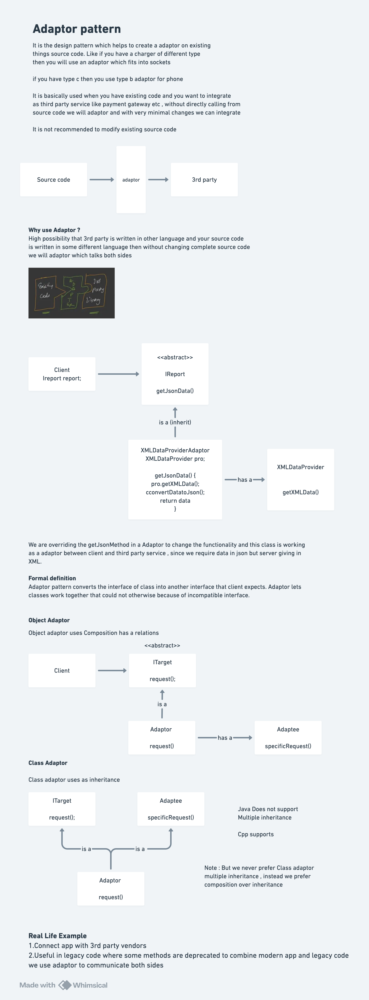

# Adapter Design Pattern

## Definition

The **Adapter Design Pattern** is a structural design pattern that **converts the interface of a class into another interface that clients expect**. The Adapter pattern lets classes work together that couldn't otherwise due to incompatible interfaces.

The pattern acts as a bridge between two incompatible interfaces, allowing them to communicate without modifying their source code.

Also known as:
- **Wrapper Pattern**
- **Translator Pattern**
- **Bridge Adapter Pattern**

## Purpose

The Adapter pattern is used when:
- You have existing classes with incompatible interfaces that need to work together
- You want to integrate third-party libraries without modifying your code
- You need to use legacy code alongside new code with different interfaces
- You want to define a reusable class that cooperates with unrelated classes
- You need to adapt multiple incompatible implementations
- You want to avoid modifying existing source code (third-party libraries)

## Key Problem It Solves

**Without Adapter Pattern (Direct Integration):**
```
Client expects: getJsonData()
Third-party provides: getXmlData()

Code:
class Client {
    void process(DataProvider provider) {
        String data = provider.getJsonData();  // What we need
    }
}

XmlProvider only has:
public String getXmlData()  // What we have

Solution: Modify XmlProvider?
  - Can't modify third-party code
  - Copyright/licensing issues
  - May break other applications using it
  - Violates Open-Closed Principle
```

**With Adapter Pattern (Bridge Interface):**
```
Create an adapter that:
  1. Implements the interface client expects (IReport with getJsonData)
  2. Holds reference to the incompatible class (XmlProvider)
  3. Translates method calls (getJsonData → getXmlData + conversion)
  4. Presents unified interface to client
  
Client sees: interface it expects
Behind scenes: adapter translates to whatever third-party provides
```

---

## Core Participants

| Participant | Role |
|-------------|------|
| **Target Interface** | Interface that client expects |
| **Adaptee** | Existing class with incompatible interface |
| **Adapter** | Implements target interface; holds reference to adaptee; translates calls |
| **Client** | Uses objects conforming to target interface |

---

##  Diagram and Quick notes



---

## Implementation Components

### Target Interface

#### **IReport Interface**
```
Purpose: Define the expected interface for clients
Method: getJsonData(String data)
  - Returns: String (JSON formatted data)
  - Parameter: String (raw data input)
  - This is what client code expects to call

Design Point:
  - Client works with this interface only
  - Client doesn't know about XmlProvider
  - Adapter implements this interface
  - Creates abstraction layer between client and adaptee
```

**Key Concept:**
```
interface IReport {
    String getJsonData(String data);
}

Client code:
IReport report = ...;  // Don't care about implementation
String json = report.getJsonData("some-data");  // Use target interface
```

---

### Adaptee

#### **XmlProvider Class (Incompatible Class)**
```
Purpose: The existing class that needs to be adapted
Method: getXmlData(String data)
  - Parameters:
    * String data: raw input like "Naman:25"
  - Returns: String (XML formatted data)
  
Implementation:
  1. Parse input: split by ':' to get name and id
  2. Build XML: wrap in <user>, <name>, <id> tags
  3. Return: properly formatted XML string
  
Behavior:
  - NOT a third-party library (but could be)
  - Has method name different from what client expects
  - Output format different from what client expects
  - Can't modify this class (would break other code)
  
Example:
  Input: "Naman:25"
  Output: "<user><name>Naman</name><id>25</id></user>"
```

**Why It's Incompatible:**
```
Client expects: IReport interface with getJsonData() method
XmlProvider offers: No interface, only getXmlData() method
Output format: XML instead of JSON
The adapter bridges this gap
```

---

### Adapter (Object Adapter)

#### **XmlDataProviderAdaptor (Object Adapter Using Composition)**
```
Purpose: Bridge between incompatible interface (XmlProvider) and expected interface (IReport)
Implements: IReport (target interface)
Type: Object Adapter (uses composition, not inheritance)

Attributes:
  - XmlProvider xmlProvider
    * Reference to the incompatible class
    * Composition: HAS-A relationship
    * Allows access to adaptee methods
    * Can be set dynamically via constructor

Constructor:
  public XmlDataProviderAdaptor(XmlProvider xmlProvider)
    - Takes adaptee as parameter
    - Stores reference for later use
    - Enables dependency injection
    - Flexible: can adapt any XmlProvider instance

Methods:
  1. getJsonData(String data)
     - Implements IReport.getJsonData()
     - Satisfies client's expected interface
     - Implementation steps:
       a. Call xmlProvider.getXmlData(data)
          └─ Get XML formatted data from adaptee
       b. Parse XML response
          └─ Extract name and id from XML tags
       c. Convert to JSON format
          └─ Build JSON object: { "name": "...", "id": "..." }
       d. Return JSON string
          └─ Client gets what it expects

Translation Process:
  Client calls: getJsonData()
       ↓
  Adapter implements: getJsonData()
       ↓
  Adapter calls: xmlProvider.getXmlData()
       ↓
  Adaptee returns: XML data
       ↓
  Adapter converts: XML → JSON
       ↓
  Adapter returns: JSON to client
```

**Composition vs Inheritance:**
```
This implementation uses COMPOSITION (Object Adapter):
  class Adapter implements IReport {
      private XmlProvider provider;  // HAS-A relationship
  }

Alternative: INHERITANCE (Class Adapter):
  class Adapter extends XmlProvider implements IReport {
      // Inherit from adaptee
      // Java doesn't support multiple inheritance (limited)
  }

Composition is preferred because:
  - More flexible: can wrap any XmlProvider instance
  - Avoids deep inheritance hierarchies
  - Can change wrapped object at runtime
  - Follows Composition over Inheritance principle
  - Java limitation: multiple inheritance not allowed
```

---

### Client

#### **Client Class**
```
Purpose: The code that needs the adapted interface
Method: getReport(IReport report, String rawData)
  - Parameter report: IReport interface (what client expects)
  - Parameter rawData: String data to process
  - Doesn't care about implementation

Behavior:
  1. Receive report (any IReport implementation)
  2. Call report.getJsonData(rawData)
  3. Print result

Key Characteristic:
  - Depends on IReport interface, NOT concrete classes
  - Works with any IReport implementation:
    * Direct implementation of IReport
    * Adapter wrapping XmlProvider
    * Any other IReport implementation
  - Demonstrates polymorphism through interface
  
Client Code:
  IReport report = new XmlDataProviderAdaptor(xmlProvider);
  client.getReport(report, "Naman:25");
  // Client calls getJsonData() through IReport interface
  // Doesn't know about XmlProvider
```

---

## Execution Flow: Step-by-Step

### Setup Phase

```
1. Create Adaptee (XmlProvider)
   XmlProvider xmlProvider = new XmlProvider();
   
   Result: XmlProvider instance ready to use
   Interface: has getXmlData() method
   State: No data processed yet

2. Create Adapter
   IReport report = new XmlDataProviderAdaptor(xmlProvider);
   
   Result: Adapter holds reference to XmlProvider
   Implements: IReport interface
   Presents: getJsonData() interface to client
   
   State:
   report → [XmlDataProviderAdaptor] → [XmlProvider]
            (IReport interface)        (getXmlData)

3. Create Client
   Client client = new Client();
   
   Result: Client ready to process data
   Interface: expects IReport
```

---

### Execution Phase - Data Processing

```
Input Data: "Naman:25"
Expected Interface: IReport.getJsonData()
Actual Service: XmlProvider.getXmlData()

Step 1: Client calls adapter (through IReport interface)
   client.getReport(report, "Naman:25");
   
   Inside client.getReport():
     report.getJsonData("Naman:25")  // Calls through interface

Step 2: Adapter implements getJsonData()
   XmlDataProviderAdaptor.getJsonData("Naman:25")
   
   Inside adapter's getJsonData():
     a. Call adaptee: String xmlData = xmlProvider.getXmlData("Naman:25")
        
        XmlProvider.getXmlData() processes:
          - Input: "Naman:25"
          - Find separator ':' → position
          - name = "Naman:25".substring(0, position) = "Naman"
          - id = "Naman:25".substring(position+1) = "25"
          - Build XML: "<user>" + "<name>Naman</name>" + "<id>25</id>" + "</user>"
        
        Returns: "<user><name>Naman</name><id>25</id></user>"
     
     b. xmlData contains complete XML string

Step 3: Adapter parses XML response
   XmlData = "<user><name>Naman</name><id>25</id></user>"
   
   Parsing:
     - Split by "<name>": [before, "Naman</name>...</user>"]
     - Take second part, split by "</name>": ["Naman", ...]
     - Extract name = "Naman"
     - Split by "<id>": [before, "25</id></user>"]
     - Take second part, split by "</id>": ["25", ...]
     - Extract id = "25"

Step 4: Adapter converts XML to JSON
   Format JSON from extracted data:
     "{ \"name\": \"Naman\", \"id\": \"25\" }"
   
   Result: Valid JSON string

Step 5: Adapter returns JSON to client
   return jsonString;
   
   Client receives: "{ \"name\": \"Naman\", \"id\": \"25\" }"

Step 6: Client uses the data
   System.out.println("Processed JSON: " + json);
   
   Output: Processed JSON: { "name": "Naman", "id": "25" }
```

---

## Architecture Diagram

```
┌──────────────────────┐
│      Client          │
│  getReport()         │
└──────────────┬───────┘
               │ uses (IReport interface)
               │
        ┌──────▼──────────────┐
        │  <<interface>>       │
        │  IReport             │
        │  getJsonData()       │
        └─────────▲────────────┘
                  │ implements
                  │
        ┌─────────┴──────────────────────┐
        │                                 │
   ┌────▼─────────────────┐     (Option 2: Class Adapter - Inheritance)
   │ XmlDataProviderAdaptor│    Would do: class Adapter extends XmlProvider
   │ (Object Adapter)      │            implements IReport
   ├───────────────────────┤    
   │ -xmlProvider          │◄─── Composition
   │ +getJsonData()        │    
   └───────────────────────┘
                 │
         ┌───────▼──────────────┐
         │   XmlProvider        │
         │   (Adaptee)          │
         ├──────────────────────┤
         │   +getXmlData()      │
         └──────────────────────┘

Key Relationships:
  - Client depends on IReport interface only
  - Adapter implements IReport (satisfies client)
  - Adapter holds XmlProvider (composition)
  - Adapter translates between interfaces
  - No dependency between Client and XmlProvider
```

---

## Key Interview Topics

### 1. **Adapter vs Decorator vs Proxy**

| Pattern | Intent | Compatibility | Structure |
|---------|--------|---------------|-----------|
| **Adapter** | Make incompatible interfaces compatible | Interfaces different | Usually composition |
| **Decorator** | Add behavior to object | Same interface | Always composition |
| **Proxy** | Control access to object | Same interface | Always composition |
| **Facade** | Simplify subsystem interface | Create new interface | Usually composition |

**Quick Distinction:**
```
Adapter: "I need to use this class but its interface doesn't match"
Decorator: "I want to add extra behavior to this object"
Proxy: "I need to control how this object is accessed"
```

---

### 2. **Object Adapter vs Class Adapter**

**Object Adapter (Used in Implementation)**
```
Uses COMPOSITION:
class Adapter implements Target {
    private Adaptee adaptee;
    
    public void targetMethod() {
        adaptee.adapteeMethod();  // Delegate
    }
}

Advantages:
  ✓ Flexible: can wrap any Adaptee instance
  ✓ Works even if Adaptee is final class
  ✓ Can be changed at runtime
  ✓ Avoids deep inheritance hierarchies
  ✓ Can wrap multiple adaptees
  
Disadvantages:
  ✗ Extra indirection: method call goes through adapter
  ✗ Slightly more code: need to store and delegate
  ✗ Runtime polymorphism cost
```

**Class Adapter (Alternative)**
```
Uses INHERITANCE:
class Adapter extends Adaptee implements Target {
    public void targetMethod() {
        adapteeMethod();  // Direct call
    }
}

Advantages:
  ✓ Direct calls: no indirection
  ✓ Simple: less code
  ✓ No composition overhead
  ✓ Can override adaptee methods
  
Disadvantages:
  ✗ Inflexible: must know adaptee class at compile time
  ✗ Cannot adapt multiple incompatible types
  ✗ Violates Liskov Substitution Principle
  ✗ Java limitation: no multiple inheritance
  ✗ Tightly couples to adaptee hierarchy
  ✗ Can't adapt to final classes
  
Why avoided:
  Java doesn't support multiple inheritance
  Class Adapter would need to inherit from both Adaptee and Target
  Only possible in C++ with multiple inheritance
  Java prefers composition: more flexible, follows SOLID
```

**Why Object Adapter is Preferred:**
```
In Java:
  - Can't inherit from both Adaptee and Target (multiple inheritance forbidden)
  - Composition provides more flexibility
  - Object Adapter is more powerful
  - Can change wrapped object at runtime
  - Can use Adapters with final classes
```

---

### 3. **Two-Way Adapter (Bidirectional)**

**Current Implementation (One-Way):**
```
Client → Adapter → XmlProvider
Client gets JSON, only one direction
```

**Two-Way Adapter:**
```
class TwoWayAdapter implements IReport, IXmlProvider {
    private XmlProvider xmlProvider;
    private IReport jsonReport;
    
    // Adapt to JSON side
    public String getJsonData(String data) {
        return xmlProvider.getXmlData(data);  // Convert XML to JSON
    }
    
    // Adapt to XML side
    public String getXmlData(String data) {
        String json = jsonReport.getJsonData(data);  // Convert JSON to XML
        // Convert JSON to XML
        return json;
    }
}

Use Case:
  - System with both JSON and XML components
  - Adapter bridges both directions
  - Components can communicate bidirectionally
```

---

### 4. **Adapter with Multiple Adaptees**

**Scenario: Adapt Multiple Incompatible Sources**
```
interface IReport {
    String getJsonData(String data);
}

// Multiple adaptees
class XmlProvider { public String getXmlData(String data) { ... } }
class CsvProvider { public String getCsvData(String data) { ... } }
class SqlDatabase { public String queryData(String query) { ... } }

// Adapt each
class XmlAdapter implements IReport {
    private XmlProvider provider;
    public String getJsonData(String data) {
        return provider.getXmlData(data);  // Convert XML to JSON
    }
}

class CsvAdapter implements IReport {
    private CsvProvider provider;
    public String getJsonData(String data) {
        return provider.getCsvData(data);  // Convert CSV to JSON
    }
}

class SqlAdapter implements IReport {
    private SqlDatabase db;
    public String getJsonData(String data) {
        return db.queryData(data);  // Convert SQL result to JSON
    }
}

Client code:
IReport report = chooseAdapter();  // Polymorphism!
String json = report.getJsonData(data);  // Works regardless of source
```

**Key Benefit:**
```
Client code unchanged regardless of data source
Just swap adapter implementations
Enables true plugin architecture
```

---

### 5. **Data Transformation (Core Responsibility)**

**What Adapter Does:**
```
1. Accept request in client's preferred format
2. Transform to adaptee's format
3. Call adaptee method
4. Transform response back to client's format
5. Return to client

In Example:
  Input:  String via IReport.getJsonData()
  Adaptee format: XML (via getXmlData())
  Processing: XML → JSON conversion
  Output: String (JSON)
  
Transformation Chain:
  String input
      ↓
  Pass to adaptee
      ↓
  Receive XML
      ↓
  Parse XML
      ↓
  Build JSON
      ↓
  Return JSON
```

**Key Interview Point:**
```
Adapter often involves data transformation
From one format to another
From one API signature to another
From one protocol to another
From one data structure to another
```

---

### 6. **Adapter in Legacy System Integration**

**Real-World Scenario:**
```
Old System: Uses XML
  class LegacyXmlSystem {
      public String getData() { return "<user>...</user>"; }
  }

New System: Expects JSON
  interface ModernApi {
      String getJson();
  }

Problem: Can't modify either system

Solution: Adapter
  class LegacyAdapter implements ModernApi {
      private LegacyXmlSystem legacy;
      
      public String getJson() {
          String xml = legacy.getData();
          // Convert XML to JSON
          return convertXmlToJson(xml);
      }
  }

Benefits:
  - No modification to legacy system
  - No modification to new system
  - Minimal integration layer
  - Easy to remove if systems replaced
  - Clean separation of concerns
```

**Additional Adapters:**
```
Language incompatibility:
  - Java service ↔ Python service: Adapter handles RPC/serialization
  - Database incompatibility: Adapter provides uniform API
  - Protocol incompatibility: HTTP ↔ RPC ↔ Message queue
  - Payment gateway adapters: Stripe ↔ PayPal ↔ Razorpay
  - Cloud provider adapters: AWS ↔ Azure ↔ GCP
```

---

### 7. **Default Method Adapter**

**Scenario: Partial Implementation**
```
interface FullApi {
    String getJson();
    String getXml();
    String getCsv();
}

class PartialAdapter implements FullApi {
    private XmlProvider provider;
    
    public String getJson() {
        // Implemented: full functionality
        return convertToJson(provider.getXmlData());
    }
    
    public String getXml() {
        // Delegate: adaptee native method
        return provider.getXmlData();
    }
    
    public String getCsv() {
        // Default: not supported
        throw new UnsupportedOperationException();
    }
}

Alternative (Java 8+):
interface FullApi {
    String getJson();
    String getXml();
    
    default String getCsv() {
        return "CSV not supported";
    }
}
```

---

### 8. **Adapter Chain/Layered Adaptation**

**Multiple Levels of Adaptation:**
```
        ┌─────────┐
        │ Client  │
        └────┬────┘
             │ (expects JSON)
        ┌────▼──────────────┐
        │ JsonXmlAdapter     │
        │ (JSON ↔ XML)       │
        └────┬──────────────┘
             │ (provides XML)
        ┌────▼──────────────┐
        │ XmlCsvAdapter      │
        │ (XML ↔ CSV)        │
        └────┬──────────────┘
             │ (provides CSV)
        ┌────▼──────────────┐
        │ LegacyCsvSystem    │
        └────────────────────┘

Each adapter:
  - Receives in one format
  - Calls next level
  - Transforms response back
  
Benefit:
  - Gradual system transformation
  - Each adapter focuses on one conversion
  - Can be replaced independently
```

---

### 9. **Adapter with Factory Pattern**

**Dynamic Adapter Selection:**
```
class AdapterFactory {
    public static IReport createAdapter(String type, Object source) {
        switch(type) {
            case "xml":
                return new XmlAdapter((XmlProvider) source);
            case "csv":
                return new CsvAdapter((CsvProvider) source);
            case "sql":
                return new SqlAdapter((Database) source);
            default:
                throw new IllegalArgumentException("Unknown type");
        }
    }
}

Usage:
IReport adapter = AdapterFactory.createAdapter("xml", xmlProvider);
String json = adapter.getJsonData(data);

Benefits:
  - Centralized adapter creation
  - Easy to add new adapters
  - Client doesn't know about concrete adapters
  - Configuration-driven adapter selection
```

---

### 10. **Common Mistakes & Solutions**

| Mistake | Problem | Solution |
|---------|---------|----------|
| **Modifying third-party code** | Breaks license, other systems | Use adapter instead |
| **Using inheritance for adaptation** | Inflexible, multiple inheritance issue | Use composition (object adapter) |
| **Creating god-adapter** | Adapter becomes complex, many methods | Split into multiple smaller adapters |
| **Too much logic in adapter** | Should just translate, not transform | Keep transformation logic minimal |
| **Adapter depends on client** | Violates separation of concerns | Adapter depends on target/adaptee only |
| **Exposing adaptee through adapter** | Client may use wrong interface | Hide adaptee implementation details |
| **No error handling** | Failures not graceful | Add try-catch, logging, fallback |
| **Bidirectional without discipline** | Two-way adapters become confusing | Document clearly which way is primary |

---

## Advantages of Adapter Pattern

✅ **Reusability**: Use incompatible classes without modification  
✅ **Open-Closed Principle**: Open for extension, closed for modification  
✅ **No Source Code Changes**: Third-party libraries remain untouched  
✅ **Flexibility**: Can choose implementations at runtime  
✅ **Clear Separation**: Adapter layer explicit and isolated  
✅ **Single Responsibility**: Each adapter has focused responsibility  
✅ **Easy Testing**: Can mock adapters and adaptees independently  
✅ **Late Binding**: Decisions deferred to runtime  

---

## Disadvantages & Challenges

❌ **Added Complexity**: Extra class for simple integrations  
❌ **Performance Overhead**: Indirection, type conversions (usually negligible)  
❌ **Maintenance**: Adapter code must be maintained  
❌ **Debugging**: Extra layers complicate stack traces  
❌ **Testing**: Must test adapter behavior comprehensively  
❌ **Design Overhead**: May be overkill for one-off conversions  
❌ **Documentation**: Adapter interface must be clearly documented  
❌ **Evolution**: If adaptee interface changes frequently, adapter breaks  

---

## Real-World Applications

### **1. Payment Gateway Integration**
```
Company API expects: PaymentProcessor interface
Available: Stripe, PayPal, Razorpay with different APIs

Solution: Create adapters for each:
  - StripePaymentAdapter implements PaymentProcessor
  - PayPalPaymentAdapter implements PaymentProcessor
  - RazorpayPaymentAdapter implements PaymentProcessor

Client uses: PaymentProcessor (no knowledge of specific gateway)
Swapping: Change adapter configuration, not code
```

### **2. Database Connection Libraries**
```
Your API: DatabaseConnection interface
Third-party: Different drivers (MySQL, PostgreSQL, MongoDB)

Adapters:
  - MysqlAdapter wraps MysqlDriver
  - PostgresqlAdapter wraps PostgresqlDriver
  - MongoAdapter wraps MongoDriver

Client: Uses DatabaseConnection interface
Benefit: Database switch requires configuration change only
```

### **3. Logging Frameworks**
```
Your system expects: Logger interface
Available: Log4j, SLF4J, JUL different APIs

Adapters translate between them:
  - Log4jAdapter wraps Log4j logging
  - Slf4jAdapter wraps SLF4J
  - JulAdapter wraps Java Util Logging

Can change logging framework without app code changes
```

### **4. Cloud Provider Abstraction**
```
Your API: CloudStorage interface
Providers: AWS S3, Azure Blob, Google Cloud Storage

Adapters:
  - S3Adapter wraps S3Client
  - AzureAdapter wraps BlobClient
  - GcsAdapter wraps StorageClient

Multi-cloud support: Use any provider transparently
```

### **5. Legacy System Bridges**
```
Old system: SOAP-based
New system: REST-based

Adapter:
  - Accepts REST requests
  - Converts to SOAP calls via SOAP client
  - Converts SOAP response back to JSON
  - Bridges old and new systems during migration
```

### **6. Data Format Conversion**
```
Application logic: Works with JSON
Data sources: CSV, XML, Protocol Buffers, Avro

Adapters convert any format to JSON:
  - CsvToJsonAdapter
  - XmlToJsonAdapter
  - ProtocolBufferToJsonAdapter
  - AvroToJsonAdapter
```

---

## Interview Questions & Answers

**Q1: When would you use Adapter vs Facade?**
- **A:** Adapter converts interface of one class to another expected interface. Facade creates new simplified interface to complex subsystem. Adapter: one-to-one translation. Facade: many-to-one simplification. Adapter: existing classes incompatible. Facade: subsystem too complex.

**Q2: Why use object adapter instead of class adapter in Java?**
- **A:** Java doesn't support multiple inheritance. Class adapter would need to extend both Adaptee and Target. Object adapter uses composition (holds Adaptee), avoiding this limitation. Object adapter also more flexible: can change wrapped object at runtime, works with final classes.

**Q3: What if adaptee methods throw exceptions?**
- **A:** Adapter should wrap in try-catch, log exceptions, either throw adapted exception or provide fallback. Can convert checked exceptions to unchecked. Adapter responsibility: gracefully handle adaptee failures.

**Q4: Can adapter cache adaptee results?**
- **A:** Yes! Can enhance adapter with caching:
```
public String getJsonData(String data) {
    if (cache.contains(data)) return cache.get(data);
    String xml = xmlProvider.getXmlData(data);
    String json = convertToJson(xml);
    cache.put(data, json);
    return json;
}
```

**Q5: How do you test adapters?**
- **A:** Mock both sides. Mock adaptee to return test data. Test adapter's conversion logic. Mock client to verify adapter returns correct interface. Test error cases (adaptee failures, invalid input).

**Q6: What if adapting multiple incompatible interfaces?**
- **A:** Create separate adapter for each or composite adapter. Keep each focused. Example: if needing both XML and CSV, create XmlAdapter and CsvAdapter instead of one adapter handling both.

**Q7: How to handle bidirectional adaptation?**
- **A:** Implement both directions in adapter or create two adapters (one each direction). Document which is primary direction. Two-way adapters can become complex, often simpler to have two focused adapters.

**Q8: Can you chain adapters?**
- **A:** Yes! Adapter2 can adapt Adapter1 which adapts original class. Each layer handles one conversion. Useful for staged transformation. Trade-off: more layers = more indirection.

**Q9: What if adaptee interface changes?**
- **A:** Adapter breaks. Your adapter shields clients from change but must itself handle it. Either update adapter or provide new adapter version. Can use factory to manage versions.

**Q10: Is adapter same as wrapper in decorators?**
- **A:** Both use composition but different intent. Decorator: adds behavior to object, same interface. Adapter: makes incompatible interface compatible, the interface changes. Both wrap object but for different purposes.

---

## Best Practices

### **1. Keep Adapter Focused**
```
Single responsibility: Translate between two interfaces
Don't add business logic
Don't add extra features
Just adapt what's needed
```

### **2. Hide Internal Details**
```
// Bad: Exposes adaptee
public XmlProvider getAdaptee() { return xmlProvider; }

// Good: Hide implementation
// Client uses only IReport interface
```

### **3. Document Interface Mismatch**
```
// Document what's being adapted
/**
 * Adapts XmlProvider (provides XML) to IReport interface (expects JSON)
 * Converts XML output to JSON format
 */
class XmlDataProviderAdaptor implements IReport { ... }
```

### **4. Use Composition Over Inheritance**
```
Prefer:
class Adapter implements Target {
    private Adaptee adaptee;
}

Over:
class Adapter extends Adaptee implements Target { }
```

### **5. Provide Proper Error Handling**
```
Handle adaptee failures gracefully
Convert exceptions if needed
Log errors appropriately
Fail safely with meaningful messages
```

### **6. Consider Using Adapter Factory**
```
Centralize adapter creation
Makes adding new adapters easier
Decouples adapter selection from client
Enables configuration-driven behavior
```

### **7. Test Extensively**
```
Test adapter with various inputs
Test error conditions
Mock adaptee for isolated testing
Test through actual client code
```

### **8. Document Conversion Logic**
```
Explain transformations
Show input/output examples
Document assumptions
List limitations
```

---

## Comparison with Similar Patterns

```
┌─────────────┬──────────────┬──────────────┬──────────────┐
│ Pattern     │ Intent       │ Structure    │ Use When     │
├─────────────┼──────────────┼──────────────┼──────────────┤
│ Adapter     │ Convert      │ Composition/ │ Interfaces   │
│             │ interface    │ Inheritance  │ incompatible │
├─────────────┼──────────────┼──────────────┼──────────────┤
│ Bridge      │ Decouple     │ Composition  │ Abstraction  │
│             │ abstraction  │              │ varies       │
│             │ from impl    │              │              │
├─────────────┼──────────────┼──────────────┼──────────────┤
│ Decorator   │ Add behavior │ Composition  │ Extend       │
│             │              │              │ behavior      │
├─────────────┼──────────────┼──────────────┼──────────────┤
│ Facade      │ Simplify     │ Composition  │ Subsystem    │
│             │ complex API  │              │ complex      │
└─────────────┴──────────────┴──────────────┴──────────────┘
```

---

## Advanced Scenarios

### **Multi-Format Adapter**
```
interface DataProvider {
    String getJson();
    String getXml();
    String getCsv();
}

Provides unified access to multiple formats
Each method transforms to requested format
Client calls whatever format needed
```

### **Lazy Adaptation**
```
Adapter doesn't transform until actually needed
Useful for expensive transformations
Cache results after first conversion
Improves performance for repeated access
```

### **Validator Adapter**
```
class ValidatingAdapter implements IReport {
    private XmlProvider provider;
    
    public String getJsonData(String data) {
        if (!isValid(data)) throw new ValidationException();
        return convertToJson(provider.getXmlData(data));
    }
}

Adds validation on top of adaptation
Ensures quality of data
Fails fast on invalid input
```

### **Retry Adapter**
```
class RetryAdapter implements IReport {
    public String getJsonData(String data) {
        for (int i = 0; i < maxRetries; i++) {
            try {
                return convertToJson(provider.getXmlData(data));
            } catch (Exception e) {
                if (i == maxRetries - 1) throw e;
                wait(backoffTime);
            }
        }
    }
}

Adds resilience
Retries on failure
Exponential backoff
Improves reliability
```

---

## Summary for Interview

**Key Takeaway:** Adapter Pattern **converts incompatible interfaces into compatible ones**, enabling integration of classes that couldn't otherwise work together **without modifying their source code**.

**3-Minute Elevator Pitch:**
The Adapter Pattern acts as a translator between two incompatible interfaces. When you have existing code (third-party library, legacy system) with one interface but need another interface, an adapter bridges the gap. Instead of modifying the incompatible code (impossible for third-party libraries), you create an adapter that implements the needed interface and internally translates calls to the incompatible code. The client sees only the adapted interface.

**Critical Interview Points:**
1. **Solves Real Problem**: Integrating incompatible existing code
2. **No Source Modification**: Works with third-party libraries
3. **Object vs Class Adapter**: Java prefers object (composition)
4. **Key Responsibility**: Interface translation, not logic
5. **Composition Over Inheritance**: More flexible
6. **One Interface to Another**: Not simplifying (that's Facade)
7. **Data Transformation**: Often part of adaptation
8. **Runtime Flexibility**: Adapters chosen dynamically
9. **Enables Reusability**: Existing code usable in new context
10. **SOLID Principles**: Open-Closed, Dependency Inversion

**When to Use:**
- Integrating third-party libraries
- Legacy system integration
- Multi-format support
- Database abstraction
- Payment gateway switching
- Cloud provider independence
- Protocol conversion
- Language/framework interoperability

**Implementation Checklist:**
- ✅ Identify target interface (what client expects)
- ✅ Identify adaptee (incompatible existing class)
- ✅ Create adapter implementing target interface
- ✅ Store adaptee reference (composition)
- ✅ Delegate and translate in adapter methods
- ✅ Handle exceptions gracefully
- ✅ Test thoroughly
- ✅ Document transformations clearly
