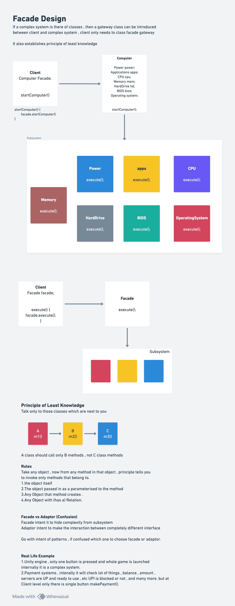

# Facade Design Pattern

## Definition

The **Facade Design Pattern** is a structural design pattern that provides a **unified, simplified interface to a complex subsystem** of classes, libraries, or frameworks. The Facade acts as a gateway between the client and a set of complex components, hiding the complexity and interactions between subsystems.

The Facade encourages **loose coupling** by decoupling clients from complex subsystem components.

Also known as:
- **Wrapper Pattern**
- **Gateway Pattern**
- **Simplified Interface Pattern**

## Purpose

The Facade pattern is used when:
- You have a complex subsystem with many interdependent classes
- You want to provide a simple interface to a complex system
- You need to decouple clients from subsystem components
- You want to establish layers of abstraction
- You need to reduce dependencies on complex subsystems
- You want to follow the Principle of Least Knowledge
- You need to simplify APIs for end users

## Key Problem It Solves

**Without Facade Pattern (Direct Access to Complex Subsystem):**
```java
Client must know about all subsystems:

Computer startup requires:
1. PowerSupply.providePower()
2. CoolingSystem.startFans()
3. CPU.initialize()
4. Memory.selfTest()
5. HardDrive.spinUp()
6. BIOS.boot(cpu, memory)
7. OperatingSystem.load()

Code:
class Client {
    public static void main(String[] args) {
        PowerSupply power = new PowerSupply();
        CoolingSystem cooling = new CoolingSystem();
        CPU cpu = new CPU();
        Memory memory = new Memory();
        HardDrive drive = new HardDrive();
        BIOS bios = new BIOS();
        OperatingSystem os = new OperatingSystem();
        
        power.providePower();
        cooling.startFans();
        cpu.initialize();
        memory.selfTest();
        drive.spinUp();
        bios.boot(cpu, memory);
        os.load();
    }
}

Issues:
- Client code is complex and verbose
- Client must know internal ordering
- Client depends on all subsystems
- Hard to maintain: change in subsystem = change in client
- Tight coupling: client knows too much
- Error-prone: easy to call methods in wrong order
- Violates Principle of Least Knowledge
```

**With Facade Pattern (Unified Simple Interface):**
```java
One interface encapsulates complexity:

Code:
Computer startup simplified:
class Client {
    public static void main(String[] args) {
        ComputerFacade computer = new ComputerFacade();
        computer.startComputer();  // One method call!
    }
}

Benefits:
- Simple, clean client code
- Facade handles ordering internally
- Client depends only on facade, not subsystems
- Easy to maintain: change subsystem = change facade
- Loose coupling: client doesn't know subsystems
- Less error-prone: one method can't be called in wrong order
- Adheres to Principle of Least Knowledge
```

---

## Core Participants

| Participant | Role |
|-------------|------|
| **Facade** | Provides unified interface; knows subsystem classes; delegates to appropriate subsystems |
| **Subsystem Classes** | Implement actual functionality; unaware of facade; can be used independently or through facade |
| **Client** | Uses facade; unaware of subsystem complexity; depends on simple facade interface |

---

## Diagram and Quick notes



---

## Implementation Components

### Subsystem Classes

These represent complex, interconnected components that work together:

#### **PowerSupply Class**
```java
Purpose: Provides electrical power to computer
Method: providePower()
  - Simulates power supply activation
  - Called during startup sequence
  - Part of subsystem, not called directly by client
  
Responsibility:
  - Single responsibility: provide power
  - Doesn't know about other subsystems
  - Can be used independently or through facade
```

---

#### **CoolingSystem Class**
```java
Purpose: Manages computer cooling (thermal management)
Method: startFans()
  - Activates cooling fans
  - Prevents system overheating
  - Called during startup
  
Design:
  - Isolated responsibility
  - Independent of other systems
  - Can be controlled independently
```

---

#### **CPU Class**
```java
Purpose: Central processor initialization
Method: initialize()
  - Initializes CPU registers
  - Performs startup checks
  - Prepares for operation
  
Dependencies:
  - Must be initialized before OS loads
  - Requires power from PowerSupply
  - Monitored by CoolingSystem
```

---

#### **Memory Class**
```java
Purpose: RAM memory management
Method: selfTest()
  - Tests memory integrity
  - Verifies no bad sectors
  - Ensures reliability
  
Responsibilities:
  - Must complete before OS loads
  - Tests memory before use
  - Reports status to BIOS
```

---

#### **HardDrive Class**
```java
Purpose: Storage subsystem
Method: spinUp()
  - Spins up disk platters
  - Prepares for data access
  - Takes time to reach operating speed
  
Characteristics:
  - Physical mechanical component
  - Needs time to become ready
  - Critical for OS loading
```

---

#### **BIOS Class**
```java
Purpose: Basic Input/Output System - hardware/OS bridge
Method: boot(CPU cpu, Memory memory)
  - Parameter: requires CPU and Memory references
  - Coordinates CPU and Memory initialization
  - Performs boot sequence
  
Design Pattern:**
  - Knows about CPU and Memory dependencies
  - Orchestrates their startup
  - BIOS responsible for CPU-Memory coordination
  - Would require: boot(CPU cpu, Memory memory, HardDrive drive, ...)
    if all subsystems handled here (shows why facade needed!)
```

---

#### **OperatingSystem Class**
```java
Purpose: OS kernel loading
Method: load()
  - Loads OS into memory
  - Must happen after all hardware ready
  - Initializes kernel and drivers
  
Sequencing:
  - Called last in startup sequence
  - Depends on all previous subsystems
  - Needs power, cooling, initialized CPU, tested memory, spinning drive
```

---

### Facade

#### **ComputerFacade Class**
```
Purpose: Unified interface hiding all complexity
Attributes:
  - PowerSupply powerSupply      // All subsystems referenced
  - CoolingSystem coolingSystem
  - CPU cpu
  - Memory memory
  - HardDrive hardDrive
  - BIOS bios
  - OperatingSystem os

Constructor:
  - Creates all subsystem instances
  - Initializes internal state
  - Single point of creation
  
Method: startComputer()
  - PUBLIC interface exposed to client
  - Coordinates all subsystems in correct order:
    1. powerSupply.providePower()
      └─ Must happen first (everything needs power)
    2. coolingSystem.startFans()
      └─ Start cooling before CPU heats up
    3. bios.boot(cpu, memory)
      └─ BIOS initializes CPU and Memory
         └─ CPU must initialize
         └─ Memory must pass self-test
    4. hardDrive.spinUp()
      └─ Prepare storage
    5. os.load()
      └─ Must happen last (needs everything ready)
  - Prints status messages
  - Provides feedback to client
  
Key Responsibilities:
  - Know about all subsystems
  - Know correct initialization order
  - Know interdependencies
  - Coordinate complex interactions
  - Present simple interface

Why Facade Needed (Evidence from Code):**
  - 7 subsystems with 10+ methods
  - Complex initialization order
  - Method dependencies (boot needs cpu and memory)
  - Interdependencies (cooling depends on power)
  - Facade encapsulates this complexity
  - Client sees only startComputer()
```

**Facade Architecture:**
```
┌─────────────────────────────┐
│    ComputerFacade (Facade)  │
│  ┌─────────────────────────┐│
│  │ - powerSupply           ││
│  │ - coolingSystem         ││
│  │ - cpu                   ││
│  │ - memory                ││
│  │ - hardDrive             ││
│  │ - bios                  ││
│  │ - os                    ││
│  └─────────────────────────┘│
│  ┌─────────────────────────┐│
│  │ + startComputer()       ││
│  └─────────────────────────┘│
└──────────────────┬──────────┘
                   │ coordinates
      ┌────────────┼────────────┬──────────────┬──────────────┬─────────────────┐
      │            │            │              │              │                 │
   ┌──▼──┐    ┌────▼────┐  ┌───▼───┐  ┌──────▼──────┐  ┌────▼────┐  ┌──────▼──────┐
   │Power│    │Cooling  │  │ CPU   │  │Memory       │  │HardDrive│  │  BIOS /OS   │
   │     │    │         │  │       │  │             │  │         │  │             │
   └─────┘    └─────────┘  └───────┘  └─────────────┘  └─────────┘  └─────────────┘
```

---

## Execution Flow: Step-by-Step

### Initialization Phase

```
1. Client creates facade:
   ComputerFacade computer = new ComputerFacade();
   
   Facade constructor executes:
   - Creates PowerSupply instance
   - Creates CoolingSystem instance
   - Creates CPU instance
   - Creates Memory instance
   - Creates HardDrive instance
   - Creates BIOS instance
   - Creates OperatingSystem instance
   
   Result: All subsystems instantiated and ready
   State: Subsystems created but not activated

2. Client calls single method:
   computer.startComputer();
   
   This is the entire public API
   Complexity hidden inside facade
```

---

### Execution Phase - Subsystem Coordination

```
Inside computer.startComputer():

Step 1: Print header
  System.out.println("----- Starting Computer -----");

Step 2: Activate power supply
  powerSupply.providePower();
  Output: "Power Supply: Providing power..."
  
  Why first?
    - Everything needs power
    - No other subsystem can run without it
    - Must be enabled before activating anything else
  
  State: System has power

Step 3: Start cooling
  coolingSystem.startFans();
  Output: "Cooling System: Fans started..."
  
  Why here?
    - CPU generates heat
    - Fans prevent overheating
    - Fans already running when CPU starts
  
  State: Cooling active, power available

Step 4: Boot BIOS with CPU and Memory
  bios.boot(cpu, memory);
  
  Inside BIOS.boot(CPU cpu, Memory memory):
    a. Print: "BIOS: Booting CPU and Memory checks..."
    b. cpu.initialize();
       Output: "CPU: Initialization started..."
       └─ CPU initializes registers, self-checks
    c. memory.selfTest();
       Output: "Memory: Self-test passed..."
       └─ Memory tests array, detects errors, confirms readiness
  
  Why this order?
    - BIOS is firmware that initializes hardware
    - BIOS knows how to initialize CPU
    - BIOS knows how to test Memory
    - Both must be done before OS loads
  
  State: CPU ready, Memory tested, BIOS boot sequence complete

Step 5: Spin up hard drive
  hardDrive.spinUp();
  Output: "Hard Drive: Spinning up..."
  
  Why here?
    - Hard drive is mechanical, takes time
    - Needs to be ready for OS to load from it
    - OS stored on hard drive
  
  State: Storage spinning, ready for access

Step 6: Load operating system
  os.load();
  Output: "Operating System: Loading into memory..."
  
  Why last?
    - OS needs all hardware ready
    - OS loads into tested memory
    - OS reads from spinning drive
    - CPU must be initialized to run OS
  
  State: OS loading into memory

Step 7: Print completion
  System.out.println("Computer Booted Successfully!");

Final Output Sequence:
  ----- Starting Computer -----
  Power Supply: Providing power...
  Cooling System: Fans started...
  BIOS: Booting CPU and Memory checks...
  CPU: Initialization started...
  Memory: Self-test passed...
  Hard Drive: Spinning up...
  Operating System: Loading into memory...
  Computer Booted Successfully!
```

---

## Key Interview Topics

### 1. **Facade vs Adapter**

| Aspect | Facade | Adapter |
|--------|--------|---------|
| **Intent** | Simplify complex subsystem | Make incompatible interfaces compatible |
| **Usage** | Hide complexity from client | Bridge incompatible interfaces |
| **Relationships** | One-to-many (facade to subsystems) | One-to-one (adapter to adaptee) |
| **Client Awareness** | Client unaware of subsystems | Client aware of adaptation |
| **Modification Required** | No subsystem changes | No adaptee changes |
| **Principle** | Principle of Least Knowledge | Interface translation |

**Key Difference:**
```java
Facade: "I have a complex system; let me hide it with a simple interface"
Adapter: "I have incompatible interfaces; let me make them work together"

Facade: Simpler interface to complex system
Adapter: Convert one interface to another

Facade purpose: Hide complexity
Adapter purpose: Enable interaction
```

---

### 2. **Principle of Least Knowledge**

**Definition:**
```java
"Only talk to your immediate friends"
A class should only know about:
1. Itself
2. Objects passed as parameters to its methods
3. Objects it creates
4. Objects it holds references to

Should NOT know about:
- Friends of friends
- Grandparent objects
- Concrete implementation details
```

**Example in Code:**
```java
WITHOUT Facade (Violates Principle):
class Client {
    void boot() {
        PowerSupply ps = new PowerSupply();
        CPU cpu = new CPU();
        Memory mem = new Memory();
        HardDrive hd = new HardDrive();
        BIOS bios = new BIOS();
        OperatingSystem os = new OperatingSystem();
        // Client knows 7 classes - too many!
    }
}

WITH Facade (Adheres to Principle):
class Client {
    void boot() {
        ComputerFacade facade = new ComputerFacade();
        facade.startComputer();
        // Client knows only 1 class (facade)
    }
}
```

**Benefits of Adhering:**
- Reduced coupling
- Easier to maintain
- Changes in subsystems don't affect client
- Better encapsulation
- Cleaner dependency graphs

---

### 3. **Complexity Characteristics**

**What Makes Subsystem Complex:**

**Structural Complexity:**
```java
Many classes (7 in example):
  PowerSupply
  CoolingSystem
  CPU
  Memory
  HardDrive
  BIOS
  OperatingSystem

Many interactions between them
```

**Behavioral Complexity:**
```java
Specific execution order required:
  Power → Cooling → BIOS → HardDrive → OS

Dependencies between subsystems:
  BIOS depends on CPU and Memory
  OS depends on all hardware being ready
  CPU initialization must precede OS
```

**Interaction Complexity:**
```java
Some classes know about others:
  BIOS.boot() takes CPU and Memory
  Method signatures become complex
  Client must manage parameter passing
```

**Hidden Interactions:**
```java
Why each step in order?
- Power must be first (everything needs power)
- Cooling should start before CPU heats
- BIOS coordinates CPU and Memory
- HardDrive must spin before OS loads
- OS must be last (depends on everything)

Without facade, client must understand ALL of this
```

---

### 4. **Facade Construction and Initialization**

**Facade Responsibilities:**

**1. Subsystem Instantiation**
```java
Facade creates all subsystems:
  private PowerSupply powerSupply = new PowerSupply();
  private CoolingSystem coolingSystem = new CoolingSystem();
  // ... etc

In constructor or as initialization
Facade controls how subsystems are created
```

**2. Dependency Management**
```java
Facade knows dependencies:
  BIOS needs CPU and Memory → bios.boot(cpu, memory)
  Facade passes correct references
  Client doesn't manage this
```

**3. Method Ordering**
```java
Facade knows correct sequence:
  1. Power
  2. Cooling
  3. BIOS with CPU and Memory
  4. HardDrive
  5. OS

Embedded in startComputer() method
Client can't call in wrong order
```

---

### 5. **Advantages of Facade Pattern**

✅ **Simplified Client Code**: Single method instead of complex sequence

✅ **Reduced Coupling**: Client depends on facade only, not subsystems

✅ **Encapsulation**: Implementation details hidden

✅ **Easy Modification**: Change subsystem internals, not client code

✅ **Reusability**: Same facade works for all clients

✅ **Principle of Least Knowledge**: Client limited to what it needs

✅ **Easier Testing**: Can mock facade or subsystems independently

✅ **Loose Coupling**: Subsystems can be changed/replaced without affecting clients

---

### 6. **Disadvantages & Limitations**

❌ **God Object**: Facade can become too large if handling many subsystems

❌ **Hidden Complexity**: Clients don't understand what happens inside

❌ **Limited Flexibility**: Facade dictates one-size-fits-all approach

❌ **Difficult Evolution**: If subsystems need different orchestration, multiple facades needed

❌ **Testing Complexity**: Testing facade requires understanding subsystems

❌ **Performance**: Additional method calls through facade (negligible in most cases)

❌ **Inflexible Ordering**: Facade determines order, client can't customize

---

### 7. **When to Create Multiple Facades**

**Scenario 1: Different Use Cases**
```java
ComputerFacade provides: startComputer()
But what if client needs:
  - Restart (restart subsystems)
  - Shutdown (graceful shutdown)
  - StandbyMode (low-power mode)

Solution: Create multiple methods or multiple facades
class ComputerFacade {
    public void startComputer() { ... }
    public void shutdownComputer() { ... }
    public void restartComputer() { ... }
}

Or create separate facades:
class ComputerStartupFacade { }
class ComputerShutdownFacade { }
class ComputerMaintenanceFacade { }
```

**Scenario 2: Different Subsystem Combinations**
```java
Gaming mode needs:
  - High-performance power profile
  - Aggressive cooling
  - CPU overclocking
  
Office mode needs:
  - Standard power profile
  - Normal cooling
  - CPU throttling for efficiency

Solution: Different facades for different modes
class GamingComputerFacade { }
class OfficeComputerFacade { }
```

---

### 8. **Subsystem Changes and Facade Impact**

**If Subsystem Method Signature Changes:**
```java
Before: cpu.initialize()
After:  cpu.initialize(int speedMhz)

Impact WITHOUT Facade:
  - All clients must be updated
  - Client code breaks

Impact WITH Facade:
  - Only ComputerFacade needs change
  - All clients unaffected
  - Facade shields clients:
    
    public void startComputer() {
        cpu.initialize(3000);  // Facade handles parameter
    }
```

**If New Subsystem Added:**
```java
Add new subsystem: PowerManagement

Impact WITHOUT Facade:
  - All clients must add initialization code
  - Client code becomes more complex

Impact WITH Facade:
  - Facade adds:
      private PowerManagement powerMgmt = new PowerManagement();
      // In startComputer():
      powerMgmt.optimizePower();
  - All clients automatically get new functionality
  - No client changes needed
```

---

### 9. **Real-World Applications**

### **1. Database Abstraction Layer**
```java
Complex: Multiple database drivers (MySQL, PostgreSQL, Oracle, MongoDB)
Facade: DatabaseFacade
  public Connection getConnection()
  public void executeQuery(String sql)
  public void close()

Client doesn't know which database
Facade handles connection pooling, transaction management
```

### **2. Payment Processing**
```java
Complex: Multiple payment gateways (Stripe, PayPal, Razorpay, Square)
Facade: PaymentFacade
  public boolean processPayment(double amount, String method)
  public String getTransactionStatus(String txnId)
  public void refund(String txnId)

Client calls simple methods
Facade handles gateway-specific APIs, format conversions
```

### **3. Logging System**
```java
Complex: Multiple log levels, multiple outputs (file, console, network)
Facade: LoggerFacade
  public void logInfo(String message)
  public void logError(String message)
  public void logDebug(String message)

Client doesn't know about:
  - Log formatting
  - File rotation
  - Network transmission
  - Timestamp management
```

### **4. UI Framework**
```java
Complex: Graphics, input handling, event system, rendering
Facade: UIFrameworkFacade
  public void render()
  public void handleInput(Event e)
  public void update(float deltaTime)

Game doesn't manage graphics, input individually
Facade coordinates them
```

### **5. Operating Systems**
```java
Complex: Memory management, file systems, process scheduling, I/O
Facade: System Calls (open, read, write, close)

Applications use simple system calls
OS handles complexity internally
Classic example of facade pattern
```

### **6. Microservices API Gateway**
```java
Complex: Multiple microservices with different APIs
Facade: API Gateway
  public Response getUserProfile(String userId)
  public Response getOrderHistory(String userId)

Client calls gateway
Gateway orchestrates calls to multiple services
Handles authentication, rate limiting, load balancing
```

---

### 10. **Common Interview Questions**

**Q1: When would you use Facade instead of just using subsystems directly?**
- **A:** When subsystems are complex with many classes and interdependencies. Facade simplifies client code, reduces coupling, and follows Principle of Least Knowledge. Direct access forces clients to understand and manage complex interactions.

**Q2: Can a Facade expose too much complexity (not abstract enough)?**
- **A:** Yes. If Facade has hundreds of methods, it hasn't simplified anything. Good Facade exposes 3-5 main operations covering 80% of use cases. Advanced operations can have separate advanced facades.

**Q3: How does Facade differ from just making a "utility class"?**
- **A:** Utility classes are static helpers. Facades are stateful objects holding subsystem references. Facades coordinate between subsystems. Utility classes are just convenient function collections. Facades provide abstraction layer.

**Q4: What if subsystems need different initialization for different scenarios?**
- **A:** Create multiple facades or multiple methods in one facade:
```java
class ComputerFacade {
    public void startComputer() { }           // Normal startup
    public void startInBiosMode() { }         // BIOS only
    public void startInSafeMode() { }         // Minimal startup
}
```

**Q5: Can subsystems be used independently without facade?**
- **A:** Yes! Facade doesn't replace subsystems, just coordinates them. Subsystems can be used directly if needed. Facade is optional convenience layer. Sometimes you need fine-grained control and bypass facade.

**Q6: How is Facade different from Decorator?**
- **A:** Decorator adds behavior to single object. Facade simplifies many objects. Decorator decorates instance. Facade coordinates classes. Decorator: same interface. Facade: new simplified interface.

**Q7: Should Facade be a singleton?**
- **A:** Not necessarily. If you have multiple independent computer instances, Facade shouldn't be singleton. Use singleton only if truly one instance needed. In this example, can create multiple ComputerFacade instances.

**Q8: What if two subsystems have conflicting requirements?**
- **A:** Facade arbitrates conflicts in initialization order. Example: if Power and Cooling both need precedence, Facade decides ordering. If truly conflicting, might need separate facades for different scenarios.

**Q9: Can Facade methods throw exceptions?**
- **A:** Yes, should throw exceptions gracefully:
```java
public void startComputer() throws ComputerStartupException {
    try {
        powerSupply.providePower();
        // ...
    } catch (PowerFailureException e) {
        throw new ComputerStartupException("Power failed", e);
    }
}
```

**Q10: How does Facade help with testing?**
- **A:** Can mock Facade for integration testing. Can mock subsystems individually for unit testing. Facade provides clear boundary for testing. Tests don't need to know subsystem details. Can test facade behavior in isolation.

---

## Best Practices

### **1. Keep Facade Simple**
```
Expose only essential operations
Hide complex subsystem operations
3-5 main methods maximum
Advanced operations: separate facades
```

### **2. Don't Leak Subsystem Classes**
```java
Bad: public PowerSupply getPowerSupply()
Good: Keep subsystems private

Client shouldn't access subsystems directly
Defeat purpose of facade if they do
```

### **3. Document Facade Operations**
```java
Explain what each method does
Document orchestration steps
Show example usage
List assumptions and dependencies
```

### **4. Handle Errors Gracefully**
```java
Catch subsystem exceptions
Wrap in facade-specific exceptions
Provide meaningful error messages
Enable rollback/cleanup on failure
```

### **5. Design Subsystems for Independence**
```java
Subsystems should work independently
Facade just coordinates
Don't create subsystem inter-dependencies
Maintain separation of concerns
```

### **6. Use Type-Safe Parameters**
```java
Bad: void startComputer(Map config)
Good: void startComputer()
     void startComputer(ComputerMode mode)

Clear, self-documenting signatures
Type-safe operations
```

### **7. Consider Performance**
```java
Facade adds method call overhead
Usually negligible but measurable in tight loops
Profile if performance-critical
Consider lazy initialization for expensive subsystems
```

### **8. Plan for Evolution**
```java
Design facades anticipating future changes
Allow multiple facades for different uses
Version facades if needed (Facade v2)
Can deprecate facades gradually
```

---

## Comparison Table

```
┌────────────────┬─────────────┬────────────┬────────────┐
│ Pattern        │ Simplifies  │ Hides      │ Purpose    │
├────────────────┼─────────────┼────────────┼────────────┤
│ Facade         │ Interfaces  │ Complexity │ Hide many  │
│                │ (multiple)  │ (internal) │ classes    │
├────────────────┼─────────────┼────────────┼────────────┤
│ Adapter        │ Interfaces  │ Difference │ Transform  │
│                │ (one pair)  │ (external) │ interfaces │
├────────────────┼─────────────┼────────────┼────────────┤
│ Decorator      │ Behavior    │ Original   │ Add        │
│                │ (same obj)  │ object     │ behavior   │
├────────────────┼─────────────┼────────────┼────────────┤
│ Proxy          │ Access      │ Real obj   │ Control    │
│                │ (one obj)   │ (reference)│ access     │
├────────────────┼─────────────┼────────────┼────────────┤
│ Strategy       │ Algorithm   │ Strategy   │ Vary       │
│                │ (variant)   │ selection  │ algorithm  │
└────────────────┴─────────────┴────────────┴────────────┘
```

---

## Design Variations

### **1. Tiered Facades**
```
┌──────────────────────┐
│ SimplifiedFacade     │
│ (for beginners)      │
└──────────┬───────────┘
           │
┌──────────▼──────────┐
│ AdvancedFacade      │
│ (for experts)       │
└──────────┬──────────┘
           │
┌──────────▼──────────┐
│ Subsystems          │
└─────────────────────┘
```

### **2. Adapter + Facade**
```
Multiple incompatible subsystems
Adapters make them compatible
Facade provides unified interface
```

### **3. Lazy-Loading Facade**
```
Create subsystems only when needed
Improve startup time
Cache subsystem instances
```

### **4. Observable Facade**
```
Facade notifies observers of state changes
Supports reactive patterns
Observers react to facade operations
```

---

## Summary for Interview

**Key Takeaway:** Facade Pattern **provides a simplified, unified interface to a complex subsystem**, reducing client coupling and following the **Principle of Least Knowledge**.

**3-Minute Elevator Pitch:**
When you have a complex subsystem composed of many inter-related classes with intricate dependencies, a Facade acts as a gateway. Instead of clients dealing with 7 different classes and understanding their interactions, they work with one Facade that coordinates everything. The Facade knows the correct order, handles dependencies, and presents a simple one-method interface (like `startComputer()`). Clients never need to understand how power, cooling, BIOS, CPU, memory, hard drive, and OS interact—they just call the facade.

**Critical Interview Points:**
1. **Hides Complexity**: Many classes → one simple interface
2. **Principle of Least Knowledge**: Client knows only facade
3. **Loose Coupling**: Client independent of subsystems
4. **Facade Knows Everything**: About subsystems and their coordination
5. **Not Optional**: Subsystems can still be used directly
6. **One-Way**: Facade → Subsystems, not bidirectional
7. **Coordination Logic**: Ember should know correct ordering
8. **Single Entry Point**: Usually one main method
9. **Easy Evolution**: Change subsystems without affecting clients
10. **Simplification Value**: Reduces complexity from exponential to single method

**When to Use:**
- Complex subsystem with many classes
- Dependencies between subsystems
- Want to reduce client coupling
- Need to simplify system usage
- Want single entry point for operations
- Need to hide implementation details
- Want to follow SOLID principles

**Does NOT Use For:**
- Simple systems with few classes
- When clients need fine-grained control
- When flexibility in ordering is needed
- When not actually reducing complexity

**Implementation Checklist:**
- ✅ Identify complex subsystems and their interactions
- ✅ Create Facade class holding subsystem references
- ✅ Define clear, simple public methods
- ✅ Implement correct orchestration/ordering in facade
- ✅ Hide subsystem details (make private)
- ✅ Handle subsystem errors gracefully
- ✅ Document facade operations clearly
- ✅ Keep subsystems independent
