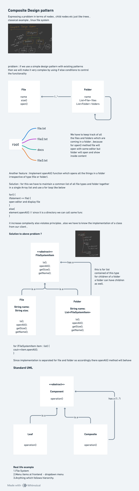

# Composite Design Pattern

## Definition

The **Composite Design Pattern** is a structural design pattern that lets you **compose objects into tree structures to represent part-whole hierarchies**. The Composite pattern lets clients treat individual objects and compositions of objects uniformly.

The pattern allows clients to work with individual objects and groups of objects (composites) the same way, without needing to distinguish between them.

Also known as:
- **Part-Whole Pattern**
- **Tree Pattern**
- **Object Tree Pattern**

## Purpose

The Composite pattern is used when:
- You have a hierarchical tree structure of objects
- You want to treat individual objects and groups of objects uniformly
- You need to represent part-whole hierarchies
- You want to let clients ignore differences between individual objects and compositions
- You need to build complex objects from simpler ones in a recursive manner
- You want traversal and manipulation of the tree structure to be simple and clean
- You need to work with files, folders, or UI component hierarchies

## Key Problem It Solves

**Without Composite Pattern (Treating Items Differently):**
```java
Client code must check type of each item:

void displayStructure(FileSystemItem item) {
    if (item instanceof File) {
        File file = (File) item;
        System.out.println("File: " + file.getName());
    } else if (item instanceof Folder) {
        Folder folder = (Folder) item;
        System.out.println("Folder: " + folder.getName());
        // Must manually recurse
        for (FileSystemItem child : folder.getItems()) {
            displayStructure(child);  // Recursive call needed
        }
    }
}

Issues:
- Client code must know about both File and Folder types
- Type checking required (instanceof) at multiple places
- Logic split between different conditions
- Hard to add new types (must add new else-if)
- Violates open/closed principle
- Code is verbose and error-prone
- Treating individual and composite objects differently
```

**With Composite Pattern (Uniform Treatment):**
```java
Client calls same method on all items:

void displayStructure(FileSystemItem item) {
    item.ls(0);  // Works for both File and Folder!
}

Benefits:
- Simple, clean client code
- Single method call works uniformly
- Files and Folders treated the same
- Recursion handled automatically (Folder calls ls on children)
- Easy to add new types (implement interface)
- Follows open/closed principle
- Code is concise and maintainable
```

---

## Core Participants

| Participant | Role |
|-------------|------|
| **Component (Interface)** | Declares common interface for both leaf and composite objects; implements default behavior where appropriate |
| **Leaf** | Represents leaf objects with no children; implements operations but returns null for child-related operations |
| **Composite** | Stores child components; implements operations by delegating to children; manages child collection |
| **Client** | Works with objects through component interface, treating leaves and composites uniformly |

---

## Quick notes and diagrams


---

## Implementation Details

### Component (Interface)

#### **FileSystemItem Interface**
```java
Purpose: Common interface for files and folders
Methods:
  void ls(int indent)
    - Display items in readable format
    - Both File and Folder implement this
  
  void openAll(int indent)
    - Open all items recursively
    - File implements for single item
    - Folder implements for self + all children
  
  int getSize()
    - Total size calculation
    - File returns its size
    - Folder returns sum of children sizes
  
  FileSystemItem cd(String name)
    - Navigate/search functionality
    - File returns null (can't contain items)
    - Folder searches children
  
  String getName()
    - Get name of item
    - Both File and Folder return their name
  
  boolean isFolder()
    - Type checking helper
    - File returns false
    - Folder returns true

Key Design Point:
  - All methods in interface
  - Default implementations where sensible
  - Both leaf and composite must implement
  - Client uses interface, not concrete types
```

---

### Leaf Component

#### **File Class**
```java
Purpose: Leaf node - represents individual file with no children
Attributes:
  - String name          // File name (resume.pdf)
  - int size             // File size in KB

Constructor:
  public File(String name, int size)
    - Creates new file with name and size
    - No children to manage
  
Methods:
  ls(int indent)
    - Simply print the file name with indentation
    - No recursion needed (no children)
  
  openAll(int indent)
    - Print: "Opening file: " + name
    - No iteration (single item)
  
  getSize()
    - Return this.size directly
    - No aggregation (leaf node)
  
  cd(String name)
    - Return null ALWAYS
    - Files cannot contain other items
    - Folder overrides this
  
  getName(), isFolder()
    - Minimal implementations
    - getName() returns name
    - isFolder() returns false

Why Separate from Folder:**
  - Files have simple behavior
  - No child management needed
  - Size is fixed value
  - No navigation into files
```

---

### Composite Component

#### **Folder Class**
```java
Purpose: Composite node - can contain other items (files or folders)
Attributes:
  - String name                          // Folder name
  - List<FileSystemItem> items           // Child items (files or folders)

Constructor:
  public Folder(String name)
    - Creates new folder
    - Initializes empty items list
  
Core Methods:
  addItem(FileSystemItem item)
    - Add file or folder to this folder
    - Can add any FileSystemItem (File or Folder)
    - Allows building tree structure
    - Called: documents.addItem(file1);
  
  ls(int indent)
    - Print folder name with indentation
    - Then call ls() on all children with increased indent
    - Recursive structure printed automatically
    - Indentation shows hierarchy
  
  openAll(int indent)
    - Print: "Opening folder: " + name
    - Then call openAll() on all children
    - Recursively opens entire tree
    - Children receive increased indent
  
  getSize()
    - Initialize totalSize = 0
    - Loop through all items
    - Call item.getSize() on each child
    - Sum all child sizes
    - Return total
    
    Why recursive?
      - Child folder's getSize() calls getSize() on ITS children
      - Automatically calculates entire subtree
  
  cd(String name)
    - Search children for item with matching name
    - Loop through items list
    - Return first match
    - Return null if not found
  
  getName(), isFolder()
    - getName() returns name
    - isFolder() returns true

Why Separate from File:**
  - Complex child management
  - Recursive behavior
  - Different size calculation (aggregation)
  - Navigation capability
  - Multiple children vs single item
```

**Composite Architecture:**
```
Root (Folder)
├── Documents (Folder)
│   ├── Resume.pdf (File)
│   ├── CoverLetter.doc (File)
│   └── Projects (Folder)
│       ├── Project1.jar (File)
│       └── Project2.jar (File)
├── Photos (Folder)
│   ├── Vacation.jpg (File)
│   ├── Birthday.jpg (File)
│   └── 2024 (Folder)
│       ├── Jan.jpg (File)
│       └── Feb.jpg (File)
└── Work (Folder)
    ├── Report.xlsx (File)
    └── Archive (Folder)
        ├── 2023.zip (File)
        └── 2022.zip (File)

Key Points:
  - Tree structure (hierarchical)
  - Mixed levels (folders contain folders and files)
  - Uniform interface (all are FileSystemItem)
  - Leaf nodes are Files
  - Composite nodes are Folders
```

---

## Execution Flow: Step-by-Step

### Building the Tree Structure

```
1. Create root folder:
   Folder root = new Folder("root");
   State: Root folder exists, no children

2. Create intermediate folders:
   Folder documents = new Folder("documents");
   Folder photos = new Folder("photos");
   State: Three folders exist, disconnected

3. Create leaf files:
   File file1 = new File("resume.pdf", 500);
   File file2 = new File("vacation.jpg", 1500);
   State: All components created

4. Build hierarchy - add folders to root:
   root.addItem(documents);
     └─ Root calls addItem()
        └─ Folder adds documents to items list
        └─ documents now child of root
   
   root.addItem(photos);
     └─ Root calls addItem()
        └─ Folder adds photos to items list
        └─ photos now child of root
   
   State: Root has 2 children (documents, photos)

5. Add files to folders:
   documents.addItem(file1);
     └─ documents calls addItem()
        └─ Folder adds file1 to items list
        └─ file1 now child of documents
   
   photos.addItem(file2);
     └─ photos calls addItem()
        └─ Folder adds file2 to items list
        └─ file2 now child of photos
   
   State: Complete tree structure built
        root
        ├── documents → [file1]
        └── photos → [file2]
```

---

### Display all items (ls operation)

```
1. Client calls:
   root.ls(0);

2. Root folder ls(0) executes:
   System.out.println(" ".repeat(0) + "root" + "/");
     OUTPUT: "root/"
   
   for (FileSystemItem item : items) {
       item.ls(0 + 2);  // Each child called with indent=2
   }
   
   Calls:
   - documents.ls(2)
   - photos.ls(2)

3. Documents folder ls(2) executes:
   System.out.println(" ".repeat(2) + "documents" + "/");
     OUTPUT: "  documents/"
   
   for (FileSystemItem item : items) {
       item.ls(2 + 2);  // Call child with indent=4
   }
   
   Calls:
   - file1.ls(4)

4. File resume.pdf ls(4) executes:
   System.out.println(" ".repeat(4) + "resume.pdf");
     OUTPUT: "    resume.pdf"
   
   No iteration (no children)

5. Photos folder ls(2) executes:
   System.out.println(" ".repeat(2) + "photos" + "/");
     OUTPUT: "  photos/"
   
   for (FileSystemItem item : items) {
       item.ls(2 + 2);  // Call child with indent=4
   }
   
   Calls:
   - file2.ls(4)

6. File vacation.jpg ls(4) executes:
   System.out.println(" ".repeat(4) + "vacation.jpg");
     OUTPUT: "    vacation.jpg"

Final Output:
  root/
    documents/
      resume.pdf
    photos/
      vacation.jpg

How Recursion Works:
  - Root calls ls on all children
  - Each child folder calls ls on ITS children
  - Each file just prints itself
  - Indentation increases at each level
  - No client code needed for recursion
```

---

### Calculate total size (getSize operation)

```
1. Client calls:
   int totalSize = root.getSize();

2. Root folder getSize() executes:
   int totalSize = 0;
   for (each child in items) {
       totalSize += child.getSize();
   }
   
   Loop iteration 1:
   - documents.getSize() called
     └─ Documents folder calculates its total:
        int folderTotal = 0;
        folderTotal += file1.getSize();  // 500
        return folderTotal;  // 500
   - totalSize += 500
   - totalSize is now 500

   Loop iteration 2:
   - photos.getSize() called
     └─ Photos folder calculates its total:
        int folderTotal = 0;
        folderTotal += file2.getSize();  // 1500
        return folderTotal;  // 1500
   - totalSize += 1500
   - totalSize is now 2000

   return totalSize;  // 2000

Result: 2000 KB

How Recursive Aggregation Works:
  - Folder calls getSize on children
  - If child is File, returns size value
  - If child is Folder, recursively sums ITS children
  - Automatic "bottom-up" calculation
  - No client needs to manage calculation
```

---

### Navigate to specific folder (cd operation)

```
1. Client calls:
   FileSystemItem found = root.cd("documents");

2. Root folder cd("documents") executes:
   for (FileSystemItem item : items) {
       if (item.getName().equals("documents")) {
           return item;  // Found!
       }
   }
   
   Checks each child:
   - item 1: documents.getName() equals "documents"? YES
   - return documents object
   - (no further iteration)

3. Client receives:
   found = documents folder object

4. Client can now use:
   found.ls(0);
   found.getSize();
   found.cd("subfolder");
   
   All work on documents instead of root

Search Behavior:
  - Folder searches direct children only
  - Doesn't recurse into subfolders
  - Returns first match
  - Returns null if not found
```

---

## Key Interview Topics

### 1. **Composite vs Hierarchy**

**Key Difference:**
```java
Regular Hierarchy:
  Base class (e.g., FileSystemItem)
  ├── File (leaf type)
  └── Folder (composite type)
  Client handles different types

Composite Pattern:
  Component interface (uniform)
  ├── Leaf implements it (File)
  └── Composite implements it (Folder)
  Client treats all as Component
```

**Why It Matters:**
```java
Composite allows:
  - Same interface for different types
  - Simple recursive behavior
  - Uniform treatment in client code
  - Easy addition of new types
```

---

### 2. **Tree Structure Representation**

**What is a Tree?**
```java
- Root node (single entry point)
- Parent-child relationships
- Multiple children per parent
- Each child has single parent (no cycles)
- Leaves have no children

Example:
  root
  ├── child1
  │   ├── grandchild1
  │   └── grandchild2
  └── child2
      └── grandchild3
```

**In Composite Pattern:**
```java
- Component is node type (File or Folder)
- Leaf has no children (File)
- Composite can have children (Folder)
- Each item knows parent only through reference
- Tree built by addItem() relationships
```

---

### 3. **Single Responsibility with Recursive Behavior**

**File Responsibility (Leaf):**
```java
public class File implements FileSystemItem {
    public void ls(int indent) {
        System.out.println(" ".repeat(indent) + name);
        // Simple: just print self
    }
}
```

**Folder Responsibility (Composite):**
```java
public class Folder implements FileSystemItem {
    public void ls(int indent) {
        System.out.println(" ".repeat(indent) + name + "/");
        for (FileSystemItem item : items) {
            item.ls(indent + 2);  // Delegate to children
        }
    }
}
```

**Key Insight:**
```java
- File: Do the operation
- Folder: Do operation + delegate to children
- Recursion emerges from this pattern
- No explicit recursion in client code
```

---

### 4. **Uniform Interface vs Varied Implementation**

**Same Method, Different Behavior:**
```java
// Both File and Folder have getSize()

File.getSize() returns:
  - Private size field (simple)
  - No calculation
  - Immediate return

Folder.getSize() returns:
  - Sum of children's sizes
  - Recursive aggregation
  - Calls getSize() on children
  
Both satisfy interface but behave differently
```

**Client Code:**
```java
FileSystemItem item = getRandomItem();  // Might be File or Folder
int size = item.getSize();              // Works regardless!
// No type checking needed
// No casting required
// No conditional logic
```

---

### 5. **Adding Items to Composite**

**Why This Design?**
```java
// addItem() only in Folder class
// NOT in File class

Why?
  - Files cannot contain items
  - Folders can contain items
  - Method only where it makes sense
  - Type checking handled naturally

Alternative (Bad Design):
  interface FileSystemItem {
      void addItem(FileSystemItem item);  // On both!
  }
  
  File.addItem() throws UnsupportedOperationException;
  // Bad: method exists but not applicable
```

**Better Design:**
```java
// addItem() only in Folder
// File doesn't have it
// Client knows only Folders can add
// No runtime exceptions
```

---

### 6. **Recursive Operations and Performance**

**Depth-First Traversal:**
```java
root.ls(0)
├─ documents.ls(2)
│  ├─ file1.ls(4)
│  └─ file2.ls(4)
└─ photos.ls(2)
   ├─ file3.ls(4)
   └─ folder_inside_photos.ls(4)
      └─ file4.ls(6)

Order: DFS naturally (complete subtree before next)
```

**Performance Considerations:**
```java
Large trees:
  - Stack: Each recursive call uses stack frame
  - Deep hierarchies: Risk of StackOverflowError
  - Very large trees: Consider iterative approach
  
Typical file system:
  - Usually not too deep (10-20 levels)
  - Safe to use recursive approach
  - Simple and maintainable
```

---

### 7. **Immutability vs Mutability in Composite**

**Current Design (Mutable):**
```java
Folder folder = new Folder("documents");
folder.addItem(file1);      // Can modify after creation
folder.addItem(file2);      // Can keep adding items
// Tree structure can change at runtime
```

**Immutable Design:**
```java
// Alternative: make tree immutable
public class Folder {
    private final List<FileSystemItem> items;
    
    public Folder(String name, FileSystemItem... items) {
        this.items = Collections.unmodifiableList(
            Arrays.asList(items)
        );
    }
    // No addItem() method
    // Tree set at creation, never changes
}
```

**Trade-offs:**
```
Mutable:
  ✓ Flexible (add/remove items anytime)
  ✗ Can lead to bugs (unexpected changes)

Immutable:
  ✓ Thread-safe
  ✓ Prevents accidental modifications
  ✗ Less flexible (must create new at change)
```

---

### 8. **Leaf vs Composite Responsibilities**

**File (Leaf) Responsibility:**
```java
public class File implements FileSystemItem {
    // Simple data (name, size)
    private String name;
    private int size;
    
    // Operations: Just handle self
    public void ls(int indent) {
        // Print self
    }
    
    public int getSize() {
        // Return self size
        return size;
    }
    
    public FileSystemItem cd(String name) {
        // Can't navigate (return null)
        return null;
    }
}
```

**Folder (Composite) Responsibility:**
```java
public class Folder implements FileSystemItem {
    // Complex structure (collection)
    private List<FileSystemItem> items;
    
    // Operations: Handle self + children
    public void ls(int indent) {
        // Print self
        // Then call ls on each child
    }
    
    public int getSize() {
        // Sum children sizes
        for (FileSystemItem item : items) {
            totalSize += item.getSize();
        }
    }
    
    public FileSystemItem cd(String name) {
        // Search children
        for (FileSystemItem item : items) {
            if (match) return item;
        }
    }
    
    public void addItem(FileSystemItem item) {
        // Manage children
        items.add(item);
    }
}
```

---

### 9. **Common Operations and Their Complexity**

**Operation: Display All Items (ls)**
```
Time: O(n) where n = total nodes
Space: O(h) where h = tree height (recursion stack)
```

**Operation: Calculate Total Size**
```
Time: O(n) - visit every node once
Space: O(h) - recursion stack
```

**Operation: Find Item (cd)**
```
Time: O(d) where d = direct children (searches only immediate children)
Space: O(1) - no recursion
```

**Operation: Add Item (addItem)**
```
Time: O(1) - constant time append
Space: O(1) - no extra space
```

---

### 10. **Type Checking and Safety**

**Problem without Composite:**
```java
// Old way: type checking everywhere
if (item instanceof File) {
    File f = (File) item;
    f.getSize();
} else if (item instanceof Folder) {
    Folder folder = (Folder) item;
    folder.getSize();
}

Problems:
  - Verbose
  - Error-prone
  - Violates open/closed principle
  - Hard to extend
```

**Solution with Composite:**
```java
// New way: polymorphism
item.getSize();  // Works for both!

How it works:
  - File implements getSize() one way
  - Folder implements getSize() another way
  - Runtime determines which runs
  - Client doesn't care about type
```

**Helper Method:**
```java
// If type checking is truly needed:
if (item.isFolder()) {
    Folder f = (Folder) item;
    f.addItem(something);
}
// Cleaner but usually not needed
```

---

## Composite vs Similar Patterns

| Aspect | Composite | Iterator |
|--------|-----------|----------|
| **Purpose** | Represent tree hierarchies | Access elements sequentially |
| **Structure** | Tree structure | Works with any collection |
| **Client** | Works with tree directly | Uses iterator pattern |
| **Operations** | On tree nodes | On individual elements |

| Aspect | Composite | Decorator |
|--------|-----------|-----------|
| **Purpose** | Tree of parts and wholes | Add behavior to objects |
| **Structure** | Hierarchical tree | Linear wrapper chain |
| **Children** | Multiple children per node | Single wrapped object |
| **Use** | Folder containing files | Component with decorators |

---

## Advantages of Composite Pattern

✅ **Uniform Treatment**: Client treats leaves and composites the same way

✅ **Simple Recursive Operations**: Tree traversal becomes straightforward

✅ **Open/Closed Principle**: Easy to add new component types

✅ **Clear Hierarchies**: Tree structure well-represented in code

✅ **Natural Recursion**: Methods call themselves on children automatically

✅ **Reduced Complexity**: Client code doesn't need type checking

✅ **Flexibility**: Add/remove items at runtime

✅ **Encapsulation**: Internal structure hidden from client

---

## Disadvantages & Limitations

❌ **Type Safety**: Both Files and Folders have same interface, even if operations don't apply (e.g., addItem on File)

❌ **Complexity**: Adding many new component types can be complex

❌ **Overhead**: Simple leaf nodes have overhead of component interface

❌ **Recursion Limits**: Deep trees risk StackOverflowError

❌ **Performance**: Operations on large trees can be slow

❌ **Finding Specific Items**: cd() only searches direct children, not entire tree

❌ **Immutability**: Current design allows modification, harder to ensure consistency

---

## When to Use Multiple Composites

**Scenario 1: Different Hierarchies**
```java
FileSystem hierarchy:
  Folder (contains Files and Folders)
  File (leaf)

Organization hierarchy:
  Department (contains Employees and Departments)
  Employee (leaf)

Solution: Create separate Composite patterns
  FileSystemItem interface / File / Folder
  OrganizationUnit interface / Employee / Department
```

**Scenario 2: Different Operations**
```java
Same File/Folder but needs:
  - Display (ls operation)
  - Compress (compression operation)
  - Encrypt (encryption operation)

Solution: Multiple facades or layered composites
  FileSystemComposite for display
  CompressionComposite for compression
```

---

## Real-World Applications

### **1. File System (Operating System)**
```java
Directory structure:
  root/
  ├── Documents/
  │   ├── file.txt
  │   └── Projects/
  └── Downloads/
      ├── image.jpg
      └── Archive/

Composite: Directory = Folder, File = File
Operations: ls, copy, delete, calculate size
```

### **2. DOM (Document Object Model)**
```java
HTML structure:
  <html>
    <body>
      <div>
        <p>Paragraph</p>
        <span>Text</span>
      </div>
      <section>
        <h1>Title</h1>
      </section>
    </body>
  </html>

Composite: Element (div, section) = Composite
          Text, p, h1 = Leaf elements
Operations: render(), getWidth(), addEventListener()
```

### **3. Organization Structure**
```java
Company hierarchy:
  CEO
  ├── VP Engineering
  │   ├── Manager Backend
  │   │   ├── Engineer 1
  │   │   └── Engineer 2
  │   └── Manager Frontend
  └── VP Sales
      ├── Manager Sales
      │   └── Sales Rep 1
      └── Sales Rep 2

Composite: Department = Folder
           Employee = File
Operations: calculateBudget(), countEmployees(), generateReport()
```

### **4. UI Component Hierarchy**
```java
Window structure:
  Window (composite)
  ├── Panel (composite)
  │   ├── Button (leaf)
  │   └── TextBox (leaf)
  ├── Panel (composite)
  │   ├── Label (leaf)
  │   └── ComboBox (leaf)
  └── Panel (composite)
      └── Button (leaf)

Composite: Panel = Composite
          Button, TextBox, Label = Leaf
Operations: render(), layout(), handleClick()
```

### **5. Menu Structure (Restaurant, Software)**
```java
Restaurant Menu:
  Menu (composite)
  ├── Appetizers (submenu/composite)
  │   ├── Salad (item/leaf)
  │   └── Soup (item/leaf)
  ├── Main Course (submenu/composite)
  │   ├── Steak (item/leaf)
  │   └── Fish (item/leaf)
  └── Desserts (submenu/composite)
      ├── Cake (item/leaf)
      └── Ice Cream (item/leaf)

Composite: Submenu = Composite
          MenuItem = Leaf
Operations: getPrice(), getDescription(), display()
```

### **6. Game Object Hierarchy**
```java
Scene structure:
  Scene (composite)
  ├── GameObject - Player (composite)
  │   ├── Sprite (leaf)
  │   ├── Collider (leaf)
  │   └── HealthBar (composite)
  │       ├── BackgroundBar (leaf)
  │       └── ForegroundBar (leaf)
  ├── GameObject - Enemy (composite)
  │   └── Sprite (leaf)
  └── Light (leaf)

Composite: GameObject = Composite
          Sprite, Light = Leaf
Operations: update(), render(), physics()
```

---

## Best Practices

### **1. Keep Leaf Simple**
```java
Bad: File implements too much complex logic
Good: File just handles itself

public class File implements FileSystemItem {
    public void ls(int indent) {
        System.out.println(" ".repeat(indent) + name);  // Simple!
    }
}
```

### **2. Delegate from Composite**
```java
Bad: Folder reimplements everything
Good: Folder delegates to children

public class Folder implements FileSystemItem {
    public void ls(int indent) {
        System.out.println(" ".repeat(indent) + name + "/");
        for (FileSystemItem item : items) {
            item.ls(indent + 2);  // Delegate!
        }
    }
}
```

### **3. Control Child Manipulation**
```java
Bad: Children can be added/removed inconsistently
Good: Add validation

public void addItem(FileSystemItem item) {
    if (item == null) {
        throw new IllegalArgumentException("Cannot add null");
    }
    if (items.contains(item)) {
        throw new IllegalArgumentException("Already exists");
    }
    items.add(item);
}
```

### **4. Provide Clear API**
```java
Good: Clear which methods apply to which types

File class: NO addItem() method
Folder class: HAS addItem() method

Client knows where to call addItem()
```

### **5. Consider Limits on Composition**
```java
Bad: Unlimited nesting
Good: Define reasonable limits

public void addItem(FileSystemItem item) {
    if (currentDepth >= MAX_DEPTH) {
        throw new IllegalStateException("Too deep");
    }
    items.add(item);
}
```

### **6. Use Immutable Structure if Possible**
```java
public class Folder {
    private final List<FileSystemItem> items;
    
    public Folder(String name, FileSystemItem... children) {
        this.items = Collections.unmodifiableList(
            Arrays.asList(children)
        );
    }
    
    // No addItem() - tree is immutable
}
```

### **7. Handle Cycles Prevention**
```java
Bad: Folder A contains Folder B, Folder B contains Folder A (cycle!)
Good: Prevent parent from being added to child

public void addItem(FileSystemItem item) {
    if (isDescendantOf(item)) {
        throw new IllegalArgumentException("Would create cycle");
    }
    items.add(item);
}
```

### **8. Recurse with Caution**
```java
Good: Be aware of recursion depth
public void ls(int indent) {
    if (indent > MAX_INDENT) {
        System.out.println("... truncated");
        return;
    }
    System.out.println(" ".repeat(indent) + name);
    for (FileSystemItem item : items) {
        item.ls(indent + 2);
    }
}
```

---

## Design Variations

### **1. Iterator-Based Traversal**
```java
// Instead of recursion, use Iterator pattern
public Iterator<FileSystemItem> getIterator() {
    return items.iterator();
}

// Client code:
Iterator<FileSystemItem> it = root.getIterator();
while (it.hasNext()) {
    FileSystemItem item = it.next();
    item.ls(0);
}
```

### **2. Visitor Pattern with Composite**
```java
// Separate operations from structure
interface FileSystemVisitor {
    void visit(File file);
    void visit(Folder folder);
}

public interface FileSystemItem {
    void accept(FileSystemVisitor visitor);
}

// Client:
FileSystemVisitor printer = new PrintVisitor();
root.accept(printer);  // Visits all nodes
```

### **3. Lazy-Loaded Composite**
```java
// Load children on-demand
public class LazyFolder extends Folder {
    private boolean childrenLoaded = false;
    
    @Override
    public void ls(int indent) {
        if (!childrenLoaded) {
            loadChildren();  // Load from disk
            childrenLoaded = true;
        }
        super.ls(indent);
    }
}
```

### **4. Copy-on-Write Composite**
```java
// Create copy when modifying
public void addItem(FileSystemItem item) {
    // Instead of modifying items list
    // Create new list with new item
    List<FileSystemItem> newItems = 
        new ArrayList<>(items);
    newItems.add(item);
    this.items = Collections.unmodifiableList(newItems);
}
```

### **5. Virtual Composite (Proxy Pattern)**
```java
// Folder that doesn't actually contain items
// Retrieves from database
public class DatabaseFolder extends Folder {
    private int folderId;
    
    @Override
    public List<FileSystemItem> getItems() {
        // Query database for children of this folder
        return database.getChildrenOf(folderId);
    }
}
```

---

## Common Interview Questions

**Q1: What is the Composite pattern and when would you use it?**
- **A:** Composite pattern allows you to compose objects into tree structures to represent part-whole hierarchies. Use it when you need to treat individual objects and groups of objects uniformly. Example: file system where folders contain files and subfolders. Both should support same operations like ls() or getSize().

**Q2: What's the difference between Composite and Decorator pattern?**
- **A:** Decorator adds behavior to individual objects (linear wrapper chain). Composite represents part-whole hierarchies (tree structure). Decorator: one object gets decorated. Composite: multiple children in hierarchical structure. Use Decorator for adding features; use Composite for hierarchies.

**Q3: How does Composite achieve code reuse?**
- **A:** Through polymorphism. Both File and Folder implement same interface. When you call ls() on any item, correct implementation runs. Tree traversal code (like ls method) calls ls() on children, which recursively works throughout tree. This automatic recursion is achieved through polymorphic method calls, not code duplication.

**Q4: Can File class have addItem() method?**
- **A:** Yes technically, but NO practically. Files can't contain items, so addItem() shouldn't exist on File. Better design: only define addItem() in Folder. If both have it, File would throw UnsupportedOperationException, which is bad. By design, File doesn't have method, so client knows it's not applicable.

**Q5: What's wrong with treating Composite as just another inheritance hierarchy?**
- **A:** Without Composite pattern, client code would need:
```java
if (item instanceof File) { ... }
else if (item instanceof Folder) { ... }
```
This violates open/closed principle. Adding new type requires modifying client code. Composite pattern uses polymorphism (same method works for all types) instead of type checking.

**Q6: How do you prevent cycles in Composite?**
- **A:** Check if the item being added is an ancestor of current folder:
```java
public void addItem(FileSystemItem item) {
    if (isAncestorOf(item)) {
        throw new IllegalArgumentException("Would create cycle");
    }
    items.add(item);
}

private boolean isAncestorOf(FileSystemItem item) {
    if (this == item) return true;
    if (parent != null) return parent.isAncestorOf(item);
    return false;
}
```

**Q7: Why is Composite better than a flat list with parent references?**
- **A:** Composite represents hierarchical structure explicitly. With flat list:
  - Must manually traverse parent-child relationships
  - Hard to find all descendants
  - Code scattered across client
  
With Composite:
  - Tree structure visible in code
  - Recursive operations natural
  - Client code simple and clean

**Q8: How do you handle operations that apply only to Composite (like addItem)?**
- **A:** Don't put addItem() in Component interface. Only define it in Folder class. If you put it on Component interface, File must implement it (throwing exception), which violates interface segregation principle. Better: keep method only where it makes sense.

Alternative: Use Java 8+ default methods with optional operations that throw:
```java
public interface FileSystemItem {
    default void addItem(FileSystemItem item) {
        throw new UnsupportedOperationException();
    }
}
```

**Q9: What happens if you call cd() on a deeply nested Folder?**
- **A:** cd() only searches direct children, doesn't recurse. If you want to find item deep in tree:
```java
// cd only searches immediate children
Folder documents = (Folder) root.cd("documents");

// To search entire tree, need recursive search:
FileSystemItem found = root.findDeep("filename");

// Or traverse manually:
public FileSystemItem findDeep(String name) {
    for (FileSystemItem item : items) {
        if (item.getName().equals(name)) return item;
        if (item.isFolder()) {
            FileSystemItem found = item.findDeep(name);
            if (found != null) return found;
        }
    }
    return null;
}
```

**Q10: How does Composite pattern handle size calculation?**
- **A:** File returns its size directly. Folder recursively sums children sizes:
```java
File.getSize() = return size;  // Direct value

Folder.getSize() {              // Recursive aggregation
    int total = 0;
    for (item : items) {
        total += item.getSize();  // Calls getSize on each
    }
    return total;
}
```
This works because:
  - File's getSize() returns base value
  - Folder's getSize() calls getSize() on children
  - If child is Folder, it recursively sums ITS children
  - Result: automatic tree-wide aggregation
  - No client code manages recursion

---

## Summary

The **Composite Design Pattern** solves the problem of treating individual objects and groups of objects uniformly in hierarchical structures by:

1. **Providing unified interface** - Both File and Folder implement same interface
2. **Enabling transparent recursion** - Tree traversal happens automatically through polymorphic method calls
3. **Simplifying client code** - No type checking, no casting, no conditional logic
4. **Allowing flexible composition** - Build trees by adding items to composites
5. **Supporting multiple operations** - Same interface supports display, calculation, navigation

This pattern is fundamental to many real-world systems including file systems, UI frameworks, DOM hierarchies, and organizational structures. Understanding it deeply shows knowledge of polymorphism, recursive design, and object composition principles.
