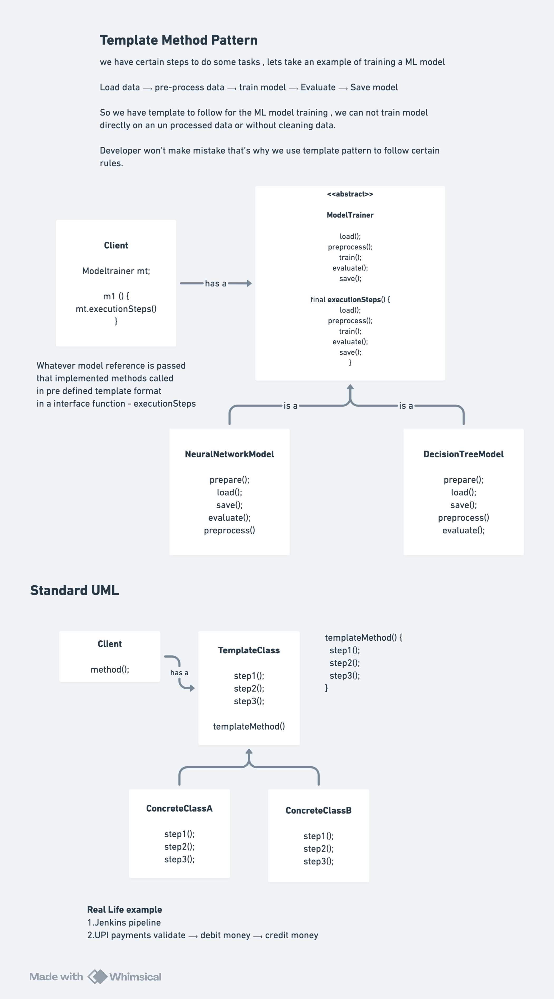

# Template Method Design Pattern

## Definition

The **Template Method Pattern** is a behavioral design pattern that **defines the skeleton of an algorithm in a base class but lets subclasses override specific steps without changing the algorithm's structure**.

The pattern defines a template of "how to do something" in a method, deferring some steps to subclasses while ensuring the overall sequence remains consistent.

Also known as:
- **Algorithm Template Pattern**
- **Method Template Pattern**
- **Skeleton Pattern**

## Purpose

The Template Method pattern is used when:
- You have an algorithm with common steps and variant steps
- Multiple classes need to follow the same process but with different implementations
- You want to enforce a specific sequence of operations
- You have code duplication across similar algorithms
- You need to avoid code duplication while allowing customization
- You want to define an invariant part of algorithm in base class
- You need to invert control (Hollywood Principle: "Don't call us, we'll call you")

## Key Problem It Solves

**Without Template Method Pattern (Duplicated Algorithm Structure):**
```java
Client must manage algorithm sequence:

class DecisionTreeTrainer {
    public void trainModel(String dataPath) {
        loadData(dataPath);
        preprocessData();
        trainDecisionTree();        // Different name!
        evaluateWithConfusionMatrix();  // Different approach
        saveModelStructure();           // Different save
    }
}

class NeuralNetworkTrainer {
    public void trainModel(String dataPath) {
        loadData(dataPath);         // Same code duplicated
        preprocessData();           // Same code duplicated
        trainWithBackpropagation(); // Different implementation
        evaluateWithAccuracy();     // Different approach
        saveModelWeights();         // Different save
    }
}

Issues:
- Algorithm skeleton duplicated in each class
- Same steps (load, preprocess) repeated
- Naming inconsistency (trainDecisionTree vs trainWithBackpropagation)
- If algorithm steps change, must update all classes
- Violates DRY (Don't Repeat Yourself) principle
- Hard to enforce consistent sequence
- Difficult to add new trainers (must copy entire structure)
- Error-prone: easy to miss a step or call steps in wrong order
```

**With Template Method Pattern (Algorithm in Base Class):**
```java
Base class defines algorithm skeleton:

abstract class ModelTrainer {
    public final void trainModel(String dataPath) {
        loadData(dataPath);
        preprocessData();
        train();              // Abstract: let subclass implement
        evaluate();           // Abstract: let subclass implement
        save();               // Abstract: let subclass implement
    }
    
    protected void loadData(String path) { ... }      // Common
    protected void preprocessData() { ... }           // Common
    protected abstract void train();                   // Varies
    protected abstract void evaluate();                // Varies
    protected abstract void save();                    // Varies
}

Subclasses implement only differences:

class DecisionTree extends ModelTrainer {
    @Override
    protected void train() {
        System.out.println("Training with Gini impurity");
    }
    
    @Override
    protected void evaluate() {
        System.out.println("Evaluating with confusion matrix");
    }
    
    @Override
    protected void save() {
        System.out.println("Saving model structure");
    }
}

Benefits:
- Algorithm sequence in one place (base class)
- Common steps defined once, reused everywhere
- Subclasses implement only what differs
- Sequence guaranteed (trainModel is final)
- Easy to add new trainers: just override 3 methods
- DRY principle followed
- Consistent naming and behavior
- Enforces algorithm structure
```

---
## Quick Notes and diagrams


---

## Core Participants

| Participant | Role |
|-------------|------|
| **AbstractClass (Template)** | Defines abstract method signatures for algorithm steps; implements concrete method with template (sequence of calls) |
| **ConcreteClass** | Implements abstract methods to define specific algorithm step behaviors |
| **Client** | Calls template method, which orchestrates the algorithm |

---

## Implementation Details

### Template Class

#### **ModelTrainer Abstract Class**
```java
Purpose: Defines algorithm skeleton and common steps
Method Visibility:
  - trainModel(): public final
    └─ Cannot be overridden (final keyword)
    └─ Defines immutable algorithm sequence
    └─ Called by client only
  
  - loadData(), preprocessData(): protected
    └─ Common implementation (not abstract)
    └─ Can be overridden if subclass needs different behavior
    └─ Default behavior suitable for most cases
  
  - train(), evaluate(), save(): protected abstract
    └─ Must be implemented by subclass
    └─ Vary by concrete class
    └─ No default implementation

Algorithm Structure (trainModel):
  1. loadData(dataPath)
     - Load raw dataset from file/source
     - Parse data format (CSV, JSON, images, etc.)
     - Store in memory
  
  2. preprocessData()
     - Split into train/test sets
     - Normalize/standardize features
     - Handle missing values
     - Feature engineering
  
  3. train()          [VARIES BY SUBCLASS]
     - Training algorithm depends on model type
     - DecisionTree: use Gini impurity
     - NeuralNetwork: use backpropagation
  
  4. evaluate()       [VARIES BY SUBCLASS]
     - Evaluation metrics depend on model type
     - DecisionTree: confusion matrix
     - NeuralNetwork: accuracy and loss
  
  5. save()           [VARIES BY SUBCLASS]
     - Saving format depends on model type
     - DecisionTree: save tree structure
     - NeuralNetwork: save weights and architecture

Why "final"?
  - Ensures algorithm sequence never changes
  - Prevents subclass from changing order
  - Guarantees steps always execute in correct sequence
  - Enforces template contract
```

---

### Concrete Classes

#### **DecisionTree Class**
```java
Purpose: Concrete implementation for decision tree training
Inherited Method: trainModel()
  - Executes template sequence with decision tree specifics
  
Implemented Methods:
  train()
    - Algorithm: Build decision tree using Gini impurity
    - Specific to decision tree models
    - Not used by neural networks
  
  evaluate()
    - Algorithm: Confusion matrix evaluation
    - Metrics: Accuracy, precision, recall, F1
    - Specific to classification trees
  
  save()
    - Format: Save tree structure (nodes, splits)
    - JSON or serialized format
    - Preserves decision boundaries

Behavior:
  When client calls: dtTrainer.trainModel("path")
  
  Execution sequence:
  1. loadData("path")
     └─ Load decision tree dataset
  
  2. preprocessData()
     └─ Split data, normalize features
  
  3. train()
     └─ "Training with Gini impurity"
     └─ Build tree using entropy measures
  
  4. evaluate()
     └─ "Evaluating with confusion matrix"
     └─ Calculate classification metrics
  
  5. save()
     └─ "Saving model structure to disk"
     └─ Store tree for later use
```

#### **NeuralNetwork Class**
```java
Purpose: Concrete implementation for neural network training
Inherited Method: trainModel()
  - Executes template sequence with neural network specifics
  
Implemented Methods:
  train()
    - Algorithm: Train using backpropagation
    - Specific to neural networks
    - Not used by decision trees
  
  evaluate()
    - Algorithm: Accuracy and loss evaluation
    - Metrics: Loss value, accuracy percentage
    - Specific to neural networks
  
  save()
    - Format: Save weights and biases
    - Neuron parameters saved
    - Network architecture saved

Behavior:
  When client calls: nnTrainer.trainModel("path")
  
  Execution sequence:
  1. loadData("path")
     └─ Load neural network dataset
  
  2. preprocessData()
     └─ Split data, normalize features
  
  3. train()
     └─ "Training with backpropagation"
     └─ Update weights through gradient descent
  
  4. evaluate()
     └─ "Evaluating with accuracy and loss"
     └─ Calculate loss and accuracy metrics
  
  5. save()
     └─ "Saving model weights to disk"
     └─ Store all weights and biases
```

**Template Method Architecture:**
```
┌─────────────────────────────────────┐
│   ModelTrainer (Abstract)           │
│  ┌──────────────────────────────┐   │
│  │ + final trainModel()         │   │
│  │   1. loadData()              │   │
│  │   2. preprocessData()        │   │
│  │   3. train()                 │◄──┼─── Calls abstract methods
│  │   4. evaluate()              │   │
│  │   5. save()                  │   │
│  └──────────────────────────────┘   │
│  ┌──────────────────────────────┐   │
│  │ # loadData()   [concrete]    │   │
│  │ # preprocessData()[concrete] │   │
│  │ # train()      [abstract]    │   │
│  │ # evaluate()   [abstract]    │   │
│  │ # save()       [abstract]    │   │
│  └──────────────────────────────┘   │
└─────────────────────────────────────┘
         ▲            ▲
         │ extends    │ extends
    ┌────┴────┐   ┌──┴──────────┐
    │Decision │   │NeuralNetwork│
    │  Tree   │   │             │
    │         │   │             │
    │train()  │   │train()      │
    │evaluate │   │evaluate()   │
    │save()   │   │save()       │
    └─────────┘   └─────────────┘
```

---

## Execution Flow: Step-by-Step

### Creating and Training Decision Tree

```
1. Client creates decision tree trainer:
   ModelTrainer dtTrainer = new DecisionTree();
   State: DecisionTree object created
   Note: Reference held as ModelTrainer (polymorphic)

2. Client calls template method:
   dtTrainer.trainModel("data/decision_tree_dataset.csv");
   
   This calls ModelTrainer.trainModel() (not DecisionTree's method)
   Because trainModel() is final in ModelTrainer
   Cannot be overridden

3. trainModel() executes step 1:
   loadData("data/decision_tree_dataset.csv")
   
   ModelTrainer.loadData() runs:
   System.out.println("[Common] Loading dataset from path");
   └─ Generic message (common to all models)
   └─ If DecisionTree needs custom loading, can override
   
   State: Dataset loaded into memory

4. trainModel() executes step 2:
   preprocessData()
   
   ModelTrainer.preprocessData() runs:
   System.out.println("[Common] Splitting into train/test...");
   └─ Generic preprocessing (works for both models)
   
   State: Data split and normalized

5. trainModel() calls abstract method:
   train()
   
   Runtime determines which implementation:
   At runtime, object is DecisionTree instance
   Calls DecisionTree.train():
   System.out.println("[DecisionTree] Training with Gini impurity");
   └─ Specific algorithm for decision trees
   
   State: Decision tree trained on training data

6. trainModel() calls abstract method:
   evaluate()
   
   Runtime determines which implementation:
   Object is DecisionTree instance
   Calls DecisionTree.evaluate():
   System.out.println("[DecisionTree] Evaluating with confusion matrix");
   └─ Specific evaluation for classification
   
   State: Model evaluated on test data

7. trainModel() calls abstract method:
   save()
   
   Runtime determines which implementation:
   Object is DecisionTree instance
   Calls DecisionTree.save():
   System.out.println("[DecisionTree] Saving model structure to disk");
   └─ Save tree-specific format
   
   State: Model persisted to disk

Final Execution Order (Guaranteed by "final"):
  1. loadData() - common
  2. preprocessData() - common
  3. train() - DecisionTree specific
  4. evaluate() - DecisionTree specific
  5. save() - DecisionTree specific

This sequence ALWAYS runs in this order
No subclass can change it
```

### Creating and Training Neural Network

```
1. Client creates neural network trainer:
   ModelTrainer nnTrainer = new NeuralNetwork();
   State: NeuralNetwork object created

2. Client calls template method:
   nnTrainer.trainModel("data/neural_network_dataset.csv");

3-4. Steps 1-2 (loadData, preprocessData):
   Same as DecisionTree (common implementation)
   Generic load and preprocess messages

5. trainModel() calls abstract method:
   train()
   
   Runtime determines which implementation:
   Object is NeuralNetwork instance
   Calls NeuralNetwork.train():
   System.out.println("[NeuralNetwork] Training with backpropagation");
   └─ Different algorithm than DecisionTree
   
   State: Neural network trained

6. trainModel() calls abstract method:
   evaluate()
   
   Object is NeuralNetwork instance
   Calls NeuralNetwork.evaluate():
   System.out.println("[NeuralNetwork] Evaluating with accuracy and loss");
   └─ Different metrics than DecisionTree
   └─ Uses loss function instead of confusion matrix
   
   State: Network evaluated

7. trainModel() calls abstract method:
   save()
   
   Object is NeuralNetwork instance
   Calls NeuralNetwork.save():
   System.out.println("[NeuralNetwork] Saving model weights to disk");
   └─ Different format than DecisionTree
   └─ Saves weights and biases, not tree structure
   
   State: Weights persisted

Key Insight:
  Same sequence runs for both models
  But implementations change based on actual type
  This is polymorphism in action
```

### Complete Execution Sequence

```
Output of main():
  === Decision Tree Training ===
  [Common] Loading dataset from data/decision_tree_dataset.csv
  [Common] Splitting into train/test and normalizing
  [DecisionTree] Training with Gini impurity
  [DecisionTree] Evaluating with confusion matrix
  [DecisionTree] Saving model structure to disk
  
  === Neural Network Training ===
  [Common] Loading dataset from data/neural_network_dataset.csv
  [Common] Splitting into train/test and normalizing
  [NeuralNetwork] Training with backpropagation
  [NeuralNetwork] Evaluating with accuracy and loss
  [NeuralNetwork] Saving model weights to disk

Observations:
  - Both follow exact same sequence
  - loadData step is identical
  - preprocessData step is identical
  - train/evaluate/save steps differ by model
  - Sequence enforced by "final" in base class
  - Each model customizes only its own steps
```

---

## Key Interview Topics

### 1. **Template Method vs Strategy Pattern**

| Aspect | Template Method | Strategy |
|--------|-----------------|----------|
| **Purpose** | Define algorithm skeleton, let subclass vary steps | Encapsulate interchangeable algorithms |
| **Mechanism** | Inheritance (subclass override) | Composition (pass algorithm object) |
| **Control** | Base class controls sequence | Client controls choice |
| **Flexibility** | Steps must follow fixed sequence | Any algorithm variant possible |
| **Relationship** | Is-a (inheritance) | Has-a (composition) |
| **Code Reuse** | Through inheritance | Through composition |

**Example:**
```java
Template Method:
  class Trainer extends ModelTrainer { ... }  // Is-a
  
Strategy:
  class Trainer {
      private TrainingStrategy strategy;     // Has-a
      void trainModel() {
          strategy.train();
      }
  }
```

---

### 2. **"Final" Keyword in Template Method**

**Why is trainModel marked as "final"?**
```java
public final void trainModel(String dataPath) { ... }

Reason:
  - Prevents subclass from overriding template method
  - Ensures algorithm sequence never changes
  - Guarantees steps execute in order
  - Enforces template contract
  
Example of problem without "final":
  class DecisionTree extends ModelTrainer {
      @Override
      public void trainModel(String path) {
          train();          // Wrong order!
          loadData(path);   // Data loaded too late
          preprocessData();
          evaluate();
          save();
      }
  }
  
This breaks the template, loads data after training!

With "final":
  DecisionTree cannot override trainModel()
  Compile error prevents this mistake
  Sequence always guaranteed
```

---

### 3. **Abstract vs Concrete Methods in Template**

**Concrete Methods (Common Steps):**
```java
protected void loadData(String path) {
    System.out.println("[Common] Loading dataset from " + path);
}

Why concrete?
  - Same implementation for all models
  - Loading CSV process identical
  - Subclass rarely needs different loading
  - Saves code duplication
  
Can be overridden?
  - Yes, declared as protected (not final)
  - If DecisionTree needs custom loading, can override
  - Optional customization
```

**Abstract Methods (Variant Steps):**
```java
protected abstract void train();
protected abstract void evaluate();
protected abstract void save();

Why abstract?
  - Each model has different algorithm
  - No common implementation possible
  - Subclass MUST provide implementation
  - Forces subclass to consider each step
  
Can be overridden?
  - Must be overridden
  - Compile error if not implemented
  - No default behavior
```

---

### 4. **Enforcing Algorithm Sequence**

**How is sequence enforced?**
```java
// Base class:
public final void trainModel(String dataPath) {
    loadData(dataPath);           // Step 1 ALWAYS first
    preprocessData();             // Step 2 ALWAYS second
    train();                       // Step 3 ALWAYS third
    evaluate();                   // Step 4 ALWAYS fourth
    save();                        // Step 5 ALWAYS fifth
}

Guarantees:
  - loadData happens before train
  - preprocessData happens before evaluate
  - evaluate happens before save
  - No step can be skipped
  - No step can be reordered
  - Every trainer follows same sequence

Without Template Method:
  Each trainer implements trainModel independently
  One might do: preprocess, train, load (wrong order!)
  Another might skip evaluate step
  Sequence not enforced
  Bugs hard to track
```

---

### 5. **Code Reuse Through Inheritance**

**DRY Principle Application:**
```java
Without Template Method:
  class DecisionTreeTrainer {
      public void trainModel(String dataPath) {
          loadData(dataPath);      // CODE 1 - DUPLICATED
          preprocessData();        // CODE 2 - DUPLICATED
          trainDecisionTree();     // Unique
          evaluateConfusionMatrix(); // Unique
          saveTreeStructure();     // Unique
      }
  }
  
  class NeuralNetworkTrainer {
      public void trainModel(String dataPath) {
          loadData(dataPath);      // CODE 1 - DUPLICATED
          preprocessData();        // CODE 2 - DUPLICATED
          trainWithBackprop();     // Unique
          evaluateAccuracy();      // Unique
          saveWeights();           // Unique
      }
  }
  
  100 lines of code (50+ duplicated)

With Template Method:
  abstract class ModelTrainer {
      public final void trainModel(String dataPath) {
          loadData(dataPath);      // CODE 1 - ONCE
          preprocessData();        // CODE 2 - ONCE
          train();
          evaluate();
          save();
      }
  }
  
  class DecisionTree extends ModelTrainer {
      protected void train() { ... }
      protected void evaluate() { ... }
      protected void save() { ... }
  }
  
  50 lines of code (no duplication)
  40% less code!
```

---

### 6. **Hollywood Principle**

**"Don't call us, we'll call you"**
```java
Traditional approach (client calls methods):
  ModelTrainer trainer = new DecisionTree();
  trainer.loadData("path");
  trainer.preprocessData();
  trainer.train();           // Client controls steps
  trainer.evaluate();
  trainer.save();
  
Problems:
  - Client must know sequence
  - Easy to call in wrong order
  - Code scattered across multiple locations
  - Hard to maintain consistency

Template Method (framework calls methods):
  ModelTrainer trainer = new DecisionTree();
  trainer.trainModel("path");  // Only one call
  
  // trainModel() calls:
  // 1. loadData
  // 2. preprocessData
  // 3. train
  // 4. evaluate
  // 5. save
  
Benefits:
  - Framework (base class) controls sequence
  - Client just initiates process
  - Sequence guaranteed
  - Client doesn't need to know implementation details
  - This is inversion of control
```

---

### 7. **Polymorphism and Runtime Binding**

**How do different implementations get called?**
```java
Reference type vs Object type:
  ModelTrainer dtTrainer = new DecisionTree();  // Reference: ModelTrainer
                                                // Object: DecisionTree
  
  ModelTrainer nnTrainer = new NeuralNetwork(); // Reference: ModelTrainer
                                                // Object: NeuralNetwork

When trainModel() calls train():
  dtTrainer.train()  → Looks up object type → Calls DecisionTree.train()
  nnTrainer.train()  → Looks up object type → Calls NeuralNetwork.train()
  
This is late binding (runtime type determination)

Why useful?
  - Template method doesn't know concrete types
  - Works with any ModelTrainer subclass
  - New trainers can be added without changing base class
  - Polymorphism enables this pattern
```

---

### 8. **Hook Methods vs Abstract Methods**

**Hook Methods (Optional Customization):**
```java
protected void preprocessData() {
    System.out.println("[Common] Preprocessing...");
    // Default behavior
}

Characteristics:
  - Concrete (provide default implementation)
  - Subclass CAN override if needed
  - Optional customization point
  - Usually not overridden (default sufficient)
  
Usage:
  If DecisionTree needs special preprocessing:
  @Override
  protected void preprocessData() {
      super.preprocessData();  // Call parent
      // Custom preprocessing
  }
```

**Abstract Methods (Mandatory Implementation):**
```java
protected abstract void train();

Characteristics:
  - No implementation (abstract)
  - Subclass MUST implement
  - Mandatory customization point
  - Always overridden
  
Usage:
  @Override
  protected void train() {
      // DecisionTree specific
  }
```

---

### 9. **Adding New Trainer Types**

**Extensibility with Template Method:**
```java
Adding RandomForest trainer:

class RandomForest extends ModelTrainer {
    @Override
    protected void train() {
        System.out.println("[RandomForest] Training ensemble of trees");
    }
    
    @Override
    protected void evaluate() {
        System.out.println("[RandomForest] Evaluating with majority vote");
    }
    
    @Override
    protected void save() {
        System.out.println("[RandomForest] Saving forest structure");
    }
}

Client code:
ModelTrainer rfTrainer = new RandomForest();
rfTrainer.trainModel("data/rf_dataset.csv");

Sequence guaranteed:
  1. loadData        (inherited)
  2. preprocessData  (inherited)
  3. train           (RandomForest specific)
  4. evaluate        (RandomForest specific)
  5. save            (RandomForest specific)

No need to rewrite trainModel()
No code duplication
Sequence automatically correct
Easy to add new types
```

---

### 10. **Template Method vs Adapter Pattern**

| Aspect | Template Method | Adapter |
|--------|-----------------|---------|
| **Intent** | Define algorithm structure | Convert interface |
| **Focus** | Method structure/sequence | Interface compatibility |
| **Inheritance** | Base class + subclass | Separate adapter class |
| **Use Case** | Similar algorithms varying steps | Different interfaces same function |

**When to use each:**
```java
Template Method:
  Multiple classifiers with same training process
  Different implementations of same algorithm steps
  
Adapter:
  Legacy code with incompatible interface
  Third-party library needs wrapping
  Two systems need to work together
```

---

## Advantages of Template Method Pattern

✅ **Code Reuse**: Common steps defined once in base class

✅ **Enforced Consistency**: Algorithm sequence guaranteed by "final" method

✅ **Open/Closed Principle**: Open for extension (override steps), closed for modification (sequence fixed)

✅ **Clear Structure**: Algorithm structure visible in one place (base class)

✅ **Reduced Duplication**: Don't repeat algorithm skeleton in each subclass

✅ **Easy Maintenance**: Change common steps once, all subclasses benefit

✅ **Inversion of Control**: Framework controls sequence, not client

✅ **Simple Extension**: Add new trainers by implementing 3 abstract methods

---

## Disadvantages & Limitations

❌ **Inheritance Overhead**: Forces inheritance relationship (tight coupling)

❌ **Rigidity**: Sequence cannot be customized (fixed by "final")

❌ **Method Explosion**: Many small methods (one per step) can be complex

❌ **Hard to Override Sequence**: If new trainer needs different order, must use Strategy instead

❌ **Deep Inheritance Hierarchy**: Can create complex class hierarchies

❌ **Limited Flexibility**: All trainers must follow same sequence

❌ **Abstract Methods**: Subclass must implement all abstract methods even if not needed

---

## When to Use Multiple Templates

**Scenario 1: Different Algorithm Structures**
```java
Training template:
  Load → Preprocess → Train → Evaluate → Save
  
Evaluation template:
  Load → Preprocess → Evaluate → Report
  
Deployment template:
  Load → Preprocess → Inference → Format → Output
  
Solution: Multiple template classes
  TrainerTemplate for training
  EvaluatorTemplate for evaluation
  DeployerTemplate for deployment
```

**Scenario 2: Different Levels of Customization**
```java
Basic template (2 hook methods):
  Load → Train → Save
  
Advanced template (5 hook methods):
  Load → Preprocess → Validate → Train → Evaluate → Save
  
Solution: Separate templates by complexity
  SimpleModelTrainer for basic use
  AdvancedModelTrainer for complex use
```

---

## Real-World Applications

### **1. ML Model Training (Current Example)**
```java
Process: Load data → Preprocess → Train → Evaluate → Save
Multiple Models: DecisionTree, NeuralNetwork, RandomForest, SVM
Common Steps: Load, Preprocess (same for all)
Variant Steps: Train, Evaluate, Save (different per model)
```

### **2. Django/Spring Web Framework**
```java
Request handling template:
  Receive request → Parse → Authenticate → Authorize → Process → Render

Concrete Views:
  LoginView, CheckoutView, ProfileView

Common: Request parsing, authentication
Variant: Business logic processing
```

### **3. Document Processing Pipeline**
```
Template: Load → Parse → Extract → Transform → Store

Different Document Types:
  PDF document, Word document, Excel spreadsheet
  
Common: Loading, parsing framework
Different: Extraction logic, transformation rules
```

### **4. Game Engine**
```
Game Loop Template:
  Input → Update → Render → Physics

Different Games:
  Platformer, RPG, Shooter
  
Common: Loop structure, input handling, rendering
Different: Update logic, physics simulation
```

### **5. Database Migration Framework**
```
Migration Template:
  Validate schema → Create backup → Modify → Verify → Commit

Different Migrations:
  AddColumn, DropTable, CreateIndex, AddConstraint
  
Common: Validation, backup, commit
Different: Specific DDL modifications
```

### **6. Testing Framework (JUnit, TestNG)**
```
Test Template:
  Setup (@Before) → Execute test → Teardown (@After)

Test Cases:
  LoginTest, PaymentTest, RegistrationTest
  
Common: Setup and teardown
Different: Test method execution
```

### **7. Report Generation**
```
Report Template:
  Gather data → Process → Format → Export

Report Types:
  PDFReport, ExcelReport, HTMLReport
  
Common: Data gathering, processing
Different: Formatting and export logic
```

---

## Best Practices

### **1. Define Clear Template Steps**
```java
Good: Few focused steps
  loadData()
  preprocessData()
  train()
  evaluate()
  save()

Bad: Too many steps or vague names
  prepare()
  doIt()
  finish()
```

### **2. Use Meaningful Protected Methods**
```java
Good: Protected methods for customization points
  protected abstract void train()
  protected abstract void evaluate()

Bad: Private methods that can't be overridden
  private void train()  // Subclass can't customize
```

### **3. Provide Reasonable Defaults**
```java
Good: Hook methods with sensible defaults
  protected void preprocessData() {
      // Default preprocessing suitable for most
  }
  // Subclass can override if needed

Bad: Everything abstract
  protected abstract void preprocessData()
  // Every subclass must implement
```

### **4. Document Template Contract**
```java
Good: Clear documentation of what each step does
  /**
   * Loads data from the specified path.
   * Common implementation suitable for most models.
   * Override if custom loading strategy needed.
   */
  protected void loadData(String path) { ... }

Bad: No explanation of template
  protected void loadData(String path) { ... }
```

### **5. Use "final" for Template Method**
```java
Good: Prevent sequence modification
  public final void trainModel(String dataPath) { ... }

Bad: Allow template override
  public void trainModel(String dataPath) { ... }
  // Subclass could break sequence
```

### **6. Keep Steps Cohesive**
```java
Good: Each step has single responsibility
  train()    - training only
  evaluate() - evaluation only
  save()     - saving only

Bad: Multiple responsibilities per step
  trainAndEvaluate()     // Two concerns
  preprocessAndValidate() // Two concerns
```

### **7. Consider Naming Consistency**
```java
Good: Consistent naming across implementations
  protected abstract void train()
  protected abstract void evaluate()
  protected abstract void save()
  
  // All subclasses use same names
  DecisionTree.train()
  NeuralNetwork.train()

Bad: Different names per subclass
  trainWithGini()           // DecisionTree
  trainWithBackpropagation() // NeuralNetwork
  // Inconsistent, violates contract
```

### **8. Avoid Feature Envy**
```java
Good: Each step handles its responsibility
  protected void train() {
      // Just training logic
  }

Bad: Steps accessing other's domain
  protected void train() {
      save();  // Save shouldn't be called from train
      evaluate(); // Violates separation
  }
```

---

## Design Variations

### **1. Multiple Template Levels**
```java
abstract class ModelTrainer {
    final void trainModel() {        // Top-level template
        loadData();
        preprocessData();
        trainAndEvaluate();          // Delegates to sub-template
        save();
    }
    
    protected final void trainAndEvaluate() {  // Sub-template
        train();
        evaluate();
    }
}
```

### **2. Conditional Template Steps**
```java
public final void trainModel(String dataPath) {
    loadData(dataPath);
    preprocessData();
    
    if (shouldTrain()) {             // Conditional step
        train();
        evaluate();
    }
    
    save();
}

protected boolean shouldTrain() {
    return true;  // Default, subclass can override
}
```

### **3. Parameterized Template Method**
```java
public final void trainModel(String dataPath, TrainingConfig config) {
    loadData(dataPath);
    preprocessData();
    train(config);      // Pass configuration
    evaluate();
    save();
}

protected abstract void train(TrainingConfig config);
```

### **4. Template with Chain of Responsibility**
```java
public final void trainModel(String dataPath) {
    loadData(dataPath);
    
    preprocessData();
    if (!validate()) {  // Chain: validate after preprocess
        throw new ValidationException();
    }
    
    train();
    evaluate();
    save();
}

protected boolean validate() {
    return true;  // Subclass can override
}
```

### **5. Strategy + Template Combination**
```java
abstract class ModelTrainer {
    protected TrainingStrategy strategy;  // Strategy object
    
    public final void trainModel() {
        loadData();
        preprocessData();
        strategy.train();      // Delegate to strategy
        evaluate();
        save();
    }
}

// Flexible: change strategy at runtime
trainer.strategy = new BackpropagationStrategy();
```

---

## Common Interview Questions

**Q1: What is Template Method pattern and what does it solve?**
- **A:** Template Method defines the skeleton of an algorithm in base class but lets subclasses override specific steps. It solves code duplication by defining common steps once while allowing variation in specific steps. Example: Model training has common load/preprocess steps but different train/evaluate logic for different models.

**Q2: Why is the template method marked as "final"?**
- **A:** To prevent subclasses from overriding the template method and changing the algorithm sequence. With "final", the sequence (load → preprocess → train → evaluate → save) is guaranteed to execute in that order. Without it, a subclass could call train() before preprocessData(), breaking the algorithm.

**Q3: How does Template Method differ from Strategy pattern?**
- **A:** Template Method uses inheritance - base class defines structure, subclass overrides steps. Strategy uses composition - context uses strategy object. Template Method enforces a fixed sequence; Strategy allows any algorithm. Template = "is-a", Strategy = "has-a".

**Q4: When would you use Template Method vs just calling functions in sequence?**
- **A:** Template Method when you want to enforce a sequence and avoid duplication. If you just call functions in sequence:
```java
Trainer t = new DecisionTree();
t.loadData();
t.preprocessData();
t.train();
t.evaluate();
t.save();
```
Problems: Sequence not enforced, client must know order, duplicated in every usage. Template Method solves this with one method call ensuring correct sequence.

**Q5: Can concrete methods in the template be overridden?**
- **A:** Yes. Methods like loadData() are protected (not final), so subclass can override if needed. But most models use default implementation. Abstract methods like train() MUST be overridden. This gives flexibility - essential customization is mandatory, optional customization is possible.

**Q6: What if a new trainer needs a different sequence (preprocess before load)?**
- **A:** Template Method forces fixed sequence - you can't change it. If truly different sequence needed, use Strategy pattern instead or create separate template. Don't force wrong pattern:
```java
// Wrong: Template forcing wrong structure
class WeirdTrainer extends ModelTrainer {
    @Override
    protected void loadData() {
        // Won't help - called in wrong position
    }
}

// Right: Use Strategy or separate template
class WeirdSequenceTrainer {
    void train() {
        preprocessData();
        loadData();    // Can set any order
        train();
    }
}
```

**Q7: How do you prevent subclass from overriding the template?**
- **A:** Use "final" keyword on template method. This is part of Template Method pattern - it enforces the contract:
```java
public final void trainModel() {  // Cannot be overridden
    loadData();
    preprocessData();
    train();
    evaluate();
    save();
}
```

**Q8: What's the benefit of Template Method over if-else or type checking?**
- **A:** Polymorphism and clean separation. Without Template Method:
```java
if (type == DECISION_TREE) {
    loadData();
    preprocessData();
    trainGini();      // Duplicated sequence
    evaluateConfusion();
    saveStructure();
} else if (type == NEURAL_NETWORK) {
    loadData();       // Duplicated again
    preprocessData();
    trainBackprop();
    evaluateAccuracy();
    saveWeights();
}
```
With Template Method: sequence defined once, types handle their variations cleanly.

**Q9: How do you add a new trainer type?**
- **A:** Create class extending ModelTrainer and implement the 3 abstract methods:
```java
class RandomForest extends ModelTrainer {
    @Override
    protected void train() { }
    
    @Override
    protected void evaluate() { }
    
    @Override
    protected void save() { }
}

// Automatically gets correct sequence
ModelTrainer trainer = new RandomForest();
trainer.trainModel("path");  // Sequence guaranteed
```

**Q10: Can you have multiple abstract methods that must be implemented?**
- **A:** Yes, and that's fine. Each abstract method is a customization point. Subclass must implement all of them:
```java
protected abstract void train();       // Must implement
protected abstract void evaluate();    // Must implement
protected abstract void save();        // Must implement
```
Client doesn't need to know which subclass - template handles calling each at right time with polymorphism.

---

## Summary

The **Template Method Design Pattern** solves the problem of duplicated algorithm structure by defining the skeleton in a base class while allowing subclasses to customize specific steps.

Key insights:
1. **Structure in base class** - Algorithm sequence defined once, reused everywhere
2. **Customization in subclass** - Override only what differs, not entire algorithm
3. **Sequence enforcement** - "final" keyword guarantees order of operations
4. **Polymorphism** - Base class calls methods, runtime determines which implementation runs
5. **Code reuse** - Common steps (load, preprocess) defined once, not duplicated
6. **Inversion of control** - Framework controls flow, not client code
7. **Extensibility** - Add new trainers without changing existing code

This pattern is fundamental to many frameworks (testing, web, game engines) and shows mastery of inheritance, polymorphism, and design principle application.
