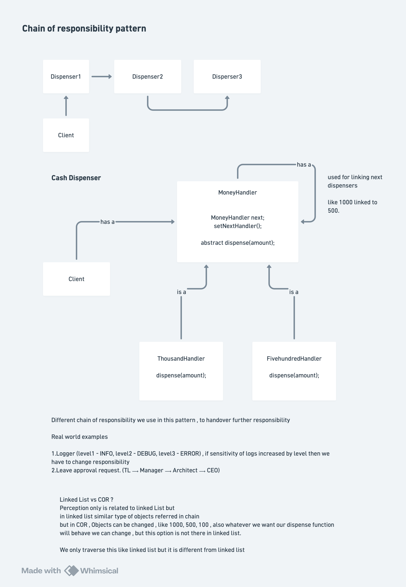

# Chain of Responsibility Design Pattern

## Definition

The **Chain of Responsibility Design Pattern** is a behavioral design pattern that **passes a request along a chain of handlers, where each handler decides either to process the request or pass it to the next handler**.

The pattern allows you to pass requests along a chain of object handlers where each handler has the opportunity to process the request or pass it along the chain.

Also known as:
- **Handler Chain Pattern**
- **Request Forwarding Pattern**
- **Chain of Handlers Pattern**

## Purpose

The Chain of Responsibility pattern is used when:
- You have multiple objects that could handle a request and you don't know which one should
- You want to issue a request to multiple objects without specifying receiver explicitly
- You want to dynamically determine which objects in a set should handle a specific request
- You want to add new handlers without modifying existing code
- You want to decouple request senders from receivers
- You need flexible ordering of handlers
- You have a hierarchy or chain-like processing need
- You want to avoid tight coupling between clients and handlers

## Quick notes and diagrams



## Key Problem It Solves

**Without Chain of Responsibility Pattern (Hard-Coded Handler Logic):**
```java
Client must know and handle all cases:

class ATM {
    void withdraw(int amount) {
        // Hard-coded logic for each denomination
        int thousand = amount / 1000;
        if (thousand > 0) {
            System.out.println("Dispensing " + thousand + " x ₹1000");
            amount -= thousand * 1000;
        }
        
        int fiveHundred = amount / 500;
        if (fiveHundred > 0) {
            System.out.println("Dispensing " + fiveHundred + " x ₹500");
            amount -= fiveHundred * 500;
        }
        
        int hundred = amount / 100;
        if (hundred > 0) {
            System.out.println("Dispensing " + hundred + " x ₹100");
            amount -= hundred * 100;
        }
        
        int fifty = amount / 50;
        if (fifty > 0) {
            System.out.println("Dispensing " + fifty + " x ₹50");
            amount -= fifty * 50;
        }
        
        if (amount > 0) {
            System.out.println("Cannot dispense remaining: " + amount);
        }
    }
}

Issues:
- All logic in one class (violation of SRP)
- Hard to add new denomination (modify main class)
- Hard to change order of denominations (modify main class)
- Tight coupling: client knows all handlers
- Code is inflexible and monolithic
- Difficult to test (everything together)
- Handler selection logic mixed with processing logic
- Violates open/closed principle
- Adding new handler requires modifying client
```

**With Chain of Responsibility Pattern (Flexible Chain):**
```java
Each handler handles its part and passes along:

abstract class MoneyHandler {
    protected MoneyHandler nextHandler;
    
    public void setNextHandler(MoneyHandler handler) {
        this.nextHandler = handler;
    }
    
    public abstract void dispense(int amount);
}

class ThousandHandler extends MoneyHandler {
    public void dispense(int amount) {
        // Handle ₹1000 notes
        int notes = amount / 1000;
        if (notes > 0) {
            System.out.println("Dispensing " + notes + " x ₹1000");
            amount -= notes * 1000;
        }
        
        // Pass remainder to next handler
        if (amount > 0 && nextHandler != null) {
            nextHandler.dispense(amount);
        }
    }
}

Benefits:
- Each handler handles one denomination (SRP)
- Easy to add new handler (create new class)
- Easy to change order (just relink chain)
- Loose coupling: handlers don't know about ATM
- Open/closed principle: can add handlers without modifying existing
- Each handler testable in isolation
- Handler selection logic decoupled from processing
- Flexible chain composition
- Client doesn't need to know about handlers
```

---

## Core Participants

| Participant | Role |
|-------------|------|
| **Handler (Abstract)** | Defines interface for handling requests; holds reference to next handler |
| **ConcreteHandler** | Implements request handling; decides whether to handle or pass to next |
| **Client** | Initiates request by passing to first handler in chain |

---

## Implementation Details

### Handler (Abstract Base Class)

#### **MoneyHandler Abstract Class**
```java
Purpose: Defines the structure for all money denomination handlers
Attributes:
  - MoneyHandler nextHandler     // Reference to next handler in chain
  
Constructor:
  public MoneyHandler()
    - Initializes nextHandler = null
    - No handler by default

Methods:
  setNextHandler(MoneyHandler handler)
    - Set the next handler in the chain
    - Called after creating all handlers
    - Builds the chain structure
    - Example: thousand.setNextHandler(fiveHundred)
  
  abstract void dispense(int amount)
    - Each concrete handler implements specific logic
    - Decides how much to dispense for its denomination
    - Passes remainder to next handler
    - Or reports insufficient funds if no next handler

Key Design Points:
  - Abstract class enforces contract
  - nextHandler enables chain building
  - setNextHandler allows dynamic chain creation
  - dispense() signature same for all handlers
  - Polymorphism enables transparent handler calling
```

---

### Concrete Handlers

#### **ThousandRuppesshandler Class**
```java
Purpose: Handle ₹1000 note dispensing
Attributes:
  - int mNumNotes             // Number of ₹1000 notes available

Constructor:
  public ThousandRuppesshandler(int notes)
    - Sets mNumNotes = notes
    - Example: new ThousandRuppesshandler(3) means 3 notes = ₹3000 available

Method: dispense(int amount)
  Step 1: Calculate notes needed
    - notesNeeded = amount / 1000  // Integer division
    - Example: 4000 / 1000 = 4 notes needed
  
  Step 2: Check availability
    - If notesNeeded > mNumNotes:
      └─ notesNeeded = mNumNotes  (dispense what we have)
      └─ mNumNotes = 0            (we're out)
    - Else:
      └─ mNumNotes -= notesNeeded (reduce remaining)
  
  Step 3: Dispense if possible
    - If notesNeeded > 0:
      └─ Print: "Dispensing: X x ₹1000"
      └─ Deduct from total notes
  
  Step 4: Calculate remainder
    - remainingAmount = amount - (1000 * notesNeeded)
    - Example: 4000 - (1000 * 3) = 1000 remaining
  
  Step 5: Pass to next handler or fail
    - If remainingAmount > 0:
      └─ If nextHandler exists: nextHandler.dispense(remainingAmount)
      └─ If no nextHandler: Print "insufficient funds in ATM"

Example Execution:
  Initial: 3 x ₹1000 notes available, withdraw ₹4000
  
  Step 1: notesNeeded = 4000 / 1000 = 4
  Step 2: 4 > 3 (mNumNotes), so notesNeeded = 3, mNumNotes = 0
  Step 3: Print "Dispensing: 3 x ₹1000"
  Step 4: remainingAmount = 4000 - 3000 = 1000
  Step 5: Pass 1000 to nextHandler (FiveHundredHandler)
```

#### **FiveHundredRuppesshandler Class**
```java
Purpose: Handle ₹500 note dispensing
Same structure as ThousandRuppesshandler but:
  - Divides by 500 instead of 1000
  - Works with ₹500 notes

Example Execution (continuing from Thousand):
  Receives remainingAmount = 1000 from Thousand
  
  Step 1: notesNeeded = 1000 / 500 = 2
  Step 2: 2 <= mNumNotes, so notesNeeded = 2, mNumNotes -= 2
  Step 3: Print "Dispensing: 2 x ₹500"
  Step 4: remainingAmount = 1000 - 1000 = 0
  Step 5: remainingAmount == 0, so don't call next handler
  
Result: Dispensing complete
```

#### **HundredRuppesshandler Class**
```java
Purpose: Handle ₹100 note dispensing
Same structure:
  - Divides by 100
  - Works with ₹100 notes
```

#### **FiftyRuppesshandler Class**
```java
Purpose: Handle ₹50 note dispensing
Same structure:
  - Divides by 50
  - Works with ₹50 notes
  - Last handler in chain
```

**Handler Chain Architecture:**
```
┌────────────────────────────────────────────────────────┐
│                    Client                              │
│              withdraw(4000)                            │
└─────────────────────┬──────────────────────────────────┘
                      │
                      │ calls dispense(4000)
                      │
        ┌─────────────▼─────────────┐
        │  ThousandHandler          │
        │  (mNumNotes = 3)          │
        │                           │
        │ Handles: 3 x ₹1000        │
        │ Remaining: ₹1000          │
        │ nextHandler → FiveHundred │
        └─────────────┬─────────────┘
                      │
                      │ calls dispense(1000)
                      │
        ┌─────────────▼─────────────┐
        │  FiveHundredHandler       │
        │  (mNumNotes = 10)         │
        │                           │
        │ Handles: 2 x ₹500         │
        │ Remaining: ₹0             │
        │ No more calls             │
        └───────────────────────────┘
```

---

## Execution Flow: Step-by-Step

### Building the Chain

```
1. Create handlers with notes:
   MoneyHandler thousand = new ThousandRuppesshandler(3);
   // 3 x ₹1000 notes = ₹3000 available
   
   MoneyHandler fivehundred = new FiveHundredRuppesshandler(10);
   // 10 x ₹500 notes = ₹5000 available
   
   MoneyHandler hundred = new HundredRuppesshandler(10);
   // 10 x ₹100 notes = ₹1000 available
   
   MoneyHandler fifty = new FiftyRuppesshandler(20);
   // 20 x ₹50 notes = ₹1000 available
   
   Total available: ₹3000 + ₹5000 + ₹1000 + ₹1000 = ₹10,000

2. Link handlers into chain:
   thousand.setNextHandler(fivehundred);
   // thousand's nextHandler = fivehundred
   
   fivehundred.setNextHandler(hundred);
   // fivehundred's nextHandler = hundred
   
   hundred.setNextHandler(fifty);
   // hundred's nextHandler = fifty
   
   fifty has no nextHandler (null)

   Chain Structure:
   Thousand → FiveHundred → Hundred → Fifty → null
```

### Processing Withdrawal Request

```
1. Client initiates:
   thousand.dispense(4000);
   
   Request: Withdraw ₹4000
   Chain starts with Thousand handler

2. ThousandHandler processes:
   amount = 4000
   
   Calculate notes needed:
   notesNeeded = 4000 / 1000 = 4 notes
   
   Check availability:
   4 (needed) > 3 (available)?
   YES: notesNeeded = 3 (dispense what we have)
        mNumNotes = 0 (we're empty now)
   
   Dispense:
   OUTPUT: "Dispensing : 3 x ₹1000"
   Total dispensed: ₹3000
   
   Calculate remainder:
   remainingAmount = 4000 - (1000 * 3) = 1000 remaining
   
   Pass to next handler:
   if (1000 > 0 && nextHandler != null)
   → nextHandler.dispense(1000)
   → fivehundred.dispense(1000)

3. FiveHundredHandler processes:
   amount = 1000
   
   Calculate notes needed:
   notesNeeded = 1000 / 500 = 2 notes
   
   Check availability:
   2 (needed) > 10 (available)?
   NO: notesNeeded = 2 (dispense exactly what needed)
       mNumNotes = 10 - 2 = 8 (reduce our stock)
   
   Dispense:
   OUTPUT: "Dispensing : 2 x ₹500"
   Total dispensed: ₹1000
   
   Calculate remainder:
   remainingAmount = 1000 - (500 * 2) = 0 remaining
   
   Pass to next handler:
   if (0 > 0 && nextHandler != null)
   → NO (remainder is 0, don't call next)
   → Chain ends

4. Final Result:
   Total Dispensed: ₹3000 + ₹1000 = ₹4000 ✓
   
   OUTPUT:
     Withdrawing money from ATM
     Dispensing : 3 x ₹1000
     Dispensing : 2 x ₹500

5. State after withdrawal:
   Thousand: 0 notes remaining (was 3, used 3)
   FiveHundred: 8 notes remaining (was 10, used 2)
   Hundred: 10 notes remaining (unused)
   Fifty: 20 notes remaining (unused)
```

### Different Request Scenario

```
What if withdrawal = ₹1234?

1. ThousandHandler:
   notesNeeded = 1234 / 1000 = 1
   1 <= 3? YES
   OUTPUT: "Dispensing : 1 x ₹1000"
   remainingAmount = 1234 - 1000 = 234
   Pass 234 to FiveHundredHandler

2. FiveHundredHandler:
   notesNeeded = 234 / 500 = 0
   0 > 0? NO → NO output, no notes dispensed
   remainingAmount = 234 - 0 = 234
   Pass 234 to HundredHandler

3. HundredHandler:
   notesNeeded = 234 / 100 = 2
   2 <= 10? YES
   OUTPUT: "Dispensing : 2 x ₹100"
   remainingAmount = 234 - 200 = 34
   Pass 34 to FiftyHandler

4. FiftyHandler:
   notesNeeded = 34 / 50 = 0
   0 > 0? NO → NO output, no notes dispensed
   remainingAmount = 34 - 0 = 34
   if (34 > 0 && nextHandler != null)
   nextHandler == null (no next handler)
   OUTPUT: "insuffiecient funds in ATM"

Final Result:
  ₹1000 (1 x ₹1000)
  ₹200 (2 x ₹100)
  Cannot dispense: ₹34
  Total dispensed: ₹1200 (partial fulfillment)

OUTPUT:
  Dispensing : 1 x ₹1000
  Dispensing : 2 x ₹100
  insuffiecient funds in ATM
```

---

## Key Interview Topics

### 1. **Chain of Responsibility vs Command Pattern**

| Aspect | Chain of Responsibility | Command |
|--------|------------------------|---------|
| **Purpose** | Pass request along chain of handlers | Encapsulate request as object |
| **Multiple processors** | Multiple in chain can handle same request | One invoker, one command |
| **Handler decision** | Each handler decides to process or pass | Command encapsulates what to do |
| **Decoupling** | Sender doesn't know which handler processes | Command decouples invoker from receiver |
| **Multiple execution** | Handlers in sequence | One-time execution typically |
| **Undo/Redo** | Not typically used | Natural fit for undo/redo |

---

### 2. **Chain Building and Linking**

**How Chain is Constructed:**
```java
// Create individual handlers
MoneyHandler h1 = new ThousandHandler(3);
MoneyHandler h2 = new FiveHundredHandler(10);
MoneyHandler h3 = new HundredHandler(10);

// Build chain by linking
h1.setNextHandler(h2);   // h1 → h2
h2.setNextHandler(h3);   // h2 → h3
h3.setNextHandler(null); // h3 → null (end)

// Chain: Handler1 → Handler2 → Handler3 → null

// Request starts at head
h1.dispense(amount);  // Entry point
```

**Changing Chain Order:**
```java
// Easy to reorder
h1.setNextHandler(h3);   // h1 → h3
h3.setNextHandler(h2);   // h3 → h2
h2.setNextHandler(null); // h2 → null

// Same handlers, different order
// No code modification in handlers
```

---

### 3. **Handler Decision Logic**

**Each Handler Decides:**
```java
public void dispense(int amount) {
    // Step 1: Can I handle this?
    int notesNeeded = amount / denomination;
    
    if (notesNeeded > mNumNotes) {
        notesNeeded = mNumNotes;  // Take what we have
        mNumNotes = 0;
    } else {
        mNumNotes -= notesNeeded;  // We have enough
    }
    
    // Step 2: Do I handle?
    if (notesNeeded > 0) {
        System.out.println("I handle: " + notesNeeded);
    }
    
    // Step 3: Is more needed?
    int remainder = amount - (denomination * notesNeeded);
    
    if (remainder > 0) {
        if (nextHandler != null) {
            nextHandler.dispense(remainder);  // Pass along
        } else {
            System.out.println("Cannot handle remaining");
        }
    }
    // If remainder == 0, request fully handled, stop
}
```

**Decision Points:**
- Can I handle part of this? (Always yes if notes available)
- Do I have anything to dispense? (If notesNeeded > 0)
- Is remainder needed? (If amount > what I dispensed)
- Should I pass to next? (If remainder > 0 and nextHandler exists)

---

### 4. **Request Propagation**

**How Request Travels:**
```java
Client code:
  handler1.dispense(4000)

Handler 1 (Thousand):
  → Dispense 3 x ₹1000
  → Remainder: 1000
  → Call nextHandler.dispense(1000)

Handler 2 (FiveHundred):
  → Dispense 2 x ₹500
  → Remainder: 0
  → Don't call nextHandler (remainder is 0)
  → END (request fully processed)

Key: Request flows down the chain
Each handler processes its part
Remaining amount passed to next
Chain ends when remainder is 0 or no nextHandler
```

---

### 5. **Partial vs Complete Request Handling**

**Complete Handling:**
```java
Withdraw ₹4000:
  Thousand: dispenses ₹3000 (3 notes), remainder ₹1000
  FiveHundred: dispenses ₹1000 (2 notes), remainder ₹0
  
Total: ₹4000 successfully dispensed ✓
Request FULLY handled
```

**Partial Handling:**
```java
Withdraw ₹1234:
  Thousand: dispenses ₹1000 (1 note), remainder ₹234
  FiveHundred: dispenses ₹0 (can't dispense), remainder ₹234
  Hundred: dispenses ₹200 (2 notes), remainder ₹34
  Fifty: dispenses ₹0 (can't dispense), remainder ₹34
  No more handlers → "insufficient funds"
  
Total: ₹1200 dispensed, ₹34 cannot dispense
Request PARTIALLY handled
```

---

### 6. **Adding New Handler**

**Extensibility:**
```java
// Want to add ₹20 notes handler
class TwentyHandler extends MoneyHandler {
    private int mNumNotes;
    
    public void dispense(int amount) {
        int notesNeeded = amount / 20;
        
        if (notesNeeded > mNumNotes) {
            notesNeeded = mNumNotes;
            mNumNotes = 0;
        } else {
            mNumNotes -= notesNeeded;
        }
        
        if (notesNeeded > 0) {
            System.out.println("Dispensing: " + notesNeeded + " x ₹20");
        }
        
        int remainder = amount - (20 * notesNeeded);
        
        if (remainder > 0) {
            if (nextHandler != null) {
                nextHandler.dispense(remainder);
            } else {
                System.out.println("insufficient funds");
            }
        }
    }
}

// Add to chain:
fifty.setNextHandler(new TwentyHandler(50));

No modification to existing handlers!
Open/Closed Principle followed
```

---

### 7. **Handler Responsibility and Accountability**

**Each Handler Accountable For:**
```java
ThousandHandler responsible for:
  ✓ Knowing how many ₹1000 notes available
  ✓ Calculating notes needed for ₹1000 denomination
  ✓ Dispensing ₹1000 notes
  ✓ Updating available notes count
  ✓ Calculating remainder
  ✗ What to do with remainder (passes to next)

Separation of Concerns:
  - Each handler: one denomination
  - No handler knows about all denominations
  - Each handler focused, simple, testable
```

---

### 8. **Failure Handling**

**End of Chain Without Complete Handling:**
```java
// Want ₹34 but last handler processes ₹50 notes
// Fifty handler receives remainder ₹34
notesNeeded = 34 / 50 = 0
// Can't dispense

if (34 > 0) {
    if (nextHandler != null)
        nextHandler.dispense(34);
    else
        System.out.println("insufficient funds in ATM");
}
// nextHandler is null (Fifty is last)
// OUTPUT: "insufficient funds in ATM"
// Request fails gracefully
```

**Two Failure Types:**
```
1. No handler for the amount:
   Withdrawal amount has remainder no handler can dispense
   Last handler reports failure
   
2. No funds available:
   Requested amount > total in all handlers
   Last handler reports failure
```

---

### 9. **Dynamic Chain Modification**

**Changing Chain at Runtime:**
```java
// Initial chain
handler1.setNextHandler(handler2);
handler2.setNextHandler(handler3);

// Process one request
handler1.dispense(1000);

// Modify chain
handler1.setNextHandler(handler3);  // Skip handler2!
handler3.setNextHandler(handler2);  // Different order

// Process another request
handler1.dispense(2000);

// Same handlers, different chain behavior
// No class modifications needed
```

---

### 10. **Stateful Handlers**

**Handler State (Available Notes):**
```java
Handler created:
  ThousandHandler handler = new ThousandHandler(5);
  // state: mNumNotes = 5

First request (dispense 2000):
  notesNeeded = 2000 / 1000 = 2
  States: mNumNotes = 5 - 2 = 3
  After: state = 3

Second request (dispense 4000):
  notesNeeded = 4000 / 1000 = 4
  4 > 3? YES
  notesNeeded = 3, state = 0
  After: state = 0

Handler state changes with each request!
Handlers remember money dispensed
```

---

## Advantages of Chain of Responsibility Pattern

✅ **Decoupling**: Sender doesn't know which handler processes request

✅ **Flexibility**: Handlers can be added, removed, or reordered without modifying existing code

✅ **Open/Closed Principle**: Easy to add new handler types

✅ **Single Responsibility**: Each handler handles one specific task/denomination

✅ **Dynamic Chains**: Update chain at runtime

✅ **Clear Processing Flow**: Request flows linearly through chain

✅ **Partial Handling Support**: Handlers can process parts of request

✅ **Easy to Test**: Each handler testable in isolation

✅ **Reusable Handlers**: Same handler can be part of different chains

✅ **Scalability**: Easy to add more handlers as requirements grow

---

## Disadvantages & Limitations

❌ **Guaranteed Processing Uncertain**: Request might not be processed (no handler for it)

❌ **Debugging Difficulty**: Hard to trace which handler processed request

❌ **Performance**: Request travels through multiple handlers (overhead)

❌ **Chain Configuration Error**: Forgetting to link handlers causes issues

❌ **Handler Ordering Critical**: Wrong order means wrong processing

❌ **Complexity**: For simple problems, may be over-engineered

❌ **Request Type Coupling**: Each handler must understand request format

❌ **Memory Overhead**: Each handler holds reference to next handler

---

## When to Use Multiple Chains

**Scenario 1: Different Chain for Different Request Types**
```java
// Money dispensing chain
MoneyHandler thousandHandler = new ThousandHandler(5);
// ... build chain

// Approval chain (similar structure, different logic)
ApprovalHandler manager = new ManagerApprover();
// ... build approval chain

// Two independent chains for different request types
```

**Scenario 2: Multiple Parallel Chains**
```java
// Denomination chain
Thousand → FiveHundred → Hundred → Fifty

// Priority chain
ImportanceLevelError → ImportanceLevelWarn → ImportanceLevelInfo

// Same handler concept, different domains
```

---

## Real-World Applications

### **1. ATM Cash Dispensing (Current Example)**
```java
Denominations: ₹1000 → ₹500 → ₹100 → ₹50
Each denomination handler in chain
Request flows through, using available notes
Last handler reports if cannot complete
```

### **2. Approval Workflow**
```
Document Approval Chain:
  Employee → Manager → Director → CEO

Employee submits request
Manager reviews, approves < ₹1L
Director reviews, approves < ₹10L
CEO reviews remaining requests

Each level decides: approve, reject, or pass to next
```

### **3. Logging Levels**
```
Logger Chain:
  ERROR → WARN → DEBUG → INFO

Critical error: all levels notified
Warning: WARN, DEBUG, INFO levels notified
Info: INFO level only

Each logger decides whether to log, then passes to next
```

### **4. Event Handling (DOM/UI)**
```
Event bubbling:
  Button → Form → Div → Document

User clicks button
Button handles click
If not handled, Form gets event
Continues up chain
Last handler in document object
```

### **5. HTTP Request Middleware**
```
Request Processing Chain:
  Authentication → Authorization → Validation → Business Logic

Request enters middleware chain
Each middleware: verify, process, or pass
Request flows through all middleware
Finally reaches handler
```

### **6. Servlet Filter Chain (Java Web)**
```
Filter1 → Filter2 → Filter3 → Servlet

Request enters filter chain
Each filter can modify request/response
Request flows to servlet
Response flows back through filters in reverse
```

### **7. Exception Handling**
```
catch Block Chain:
  RuntimeException → IOException → Exception → Throwable

Thrown exception starts at RuntimeException
If caught, handled
If not, goes to IOException
Continues until caught or reaches Throwable
```

### **8. Validation Chain**
```
Validator Chain:
  EmailValidator → LengthValidator → SpecialCharValidator

User input validated
Email format? Next validator
Length check? Next validator
Special chars? Next validator
All pass? Data is valid
```

---

## Best Practices

### **1. Define Clear Chain Order**
```java
Good: Logical order - most to least likely to handle
  Thousand → FiveHundred → Hundred → Fifty
  (Larger denominations first)

Bad: Arbitrary order
  Fifty → Thousand → FiveHundred → Hundred
  (Inefficient, small denominations first)
```

### **2. Always Check if NextHandler Exists**
```java
Good: Null check before calling
  if (remainder > 0 && nextHandler != null) {
      nextHandler.dispense(remainder);
  } else if (remainder > 0) {
      System.out.println("Cannot handle");
  }

Bad: No null check
  if (remainder > 0) {
      nextHandler.dispense(remainder);  // NPE if null!
  }
```

### **3. Make Handler Stateless or Clear About State**
```java
Good: Clear about state management
  class ThousandHandler {
      private int mNumNotes;  // Clear state
      // Updates tracked
  }

Bad: Hidden state
  class ThousandHandler {
      static int globalNotes;  // Implicit state
      // Hard to track changes
  }
```

### **4. Document Handler Responsibilities**
```java
Good: Clear documentation
  /**
   * Handles ₹1000 note dispensing.
   * Processes requested amount for 1000 denomination.
   * Passes remainder to next handler.
   */

Bad: No documentation
  class ThousandHandler { }
```

### **5. Provide Easy Chain Building**
```java
Good: Fluent interface for chain building
  handler1.setNextHandler(handler2)
         .setNextHandler(handler3)
         .setNextHandler(handler4);

Bad: Manual linking scattered
  handler1.next = handler2;
  handler2.next = handler3;
  handler3.next = handler4;
```

### **6. Consider Chain Head Entry Point**
```java
Good: Clear entry point
  moneyChain.dispense(amount);  // Start at thousand
  
Bad: Ambiguous entry
  fivehundred.dispense(amount);  // Skips thousand handler
```

### **7. Handle Failure Gracefully**
```java
Good: Clear failure message
  if (nextHandler == null && remainder > 0) {
      System.out.println("Cannot dispense remaining: " + remainder);
  }

Bad: Silent failure
  if (nextHandler == null && remainder > 0) {
      return;  // Silently loses money!
  }
```

### **8. Avoid Chain Cycles**
```java
Bad: Circular chain
  h1 → h2 → h3 → h1  // Infinite loop!

Good: Linear chain
  h1 → h2 → h3 → null  // Clear end
```

---

## Design Variations

### **1. Handler with Conditional Passing**
```java
class ConditionalHandler extends MoneyHandler {
    public void dispense(int amount) {
        if (isProcessable(amount)) {
            process(amount);
            // Don't pass to next
        } else {
            if (nextHandler != null) {
                nextHandler.dispense(amount);
            }
        }
    }
    
    private boolean isProcessable(int amount) { }
    private void process(int amount) { }
}
```

### **2. Handler with Aggregation**
```java
class AggregatingHandler extends MoneyHandler {
    private List<Integer> handledAmounts = new ArrayList<>();
    
    public void dispense(int amount) {
        // Handle and track
        int handled = processAmount(amount);
        handledAmounts.add(handled);
        
        // Pass remainder
        if (remainder > 0 && nextHandler != null) {
            nextHandler.dispense(remainder);
        }
    }
    
    public List<Integer> getHandledAmounts() {
        return handledAmounts;
    }
}
```

### **3. Reverse Chain Processing**
```java
class ReverseChainHandler extends MoneyHandler {
    public void executeInReverse(Request r) {
        if (nextHandler != null) {
            nextHandler.executeInReverse(r);  // Go to end first
        }
        processRequest(r);  // Then handle on return
    }
}
```

### **4. Handler with Retry Logic**
```java
class RetryHandler extends MoneyHandler {
    private int maxRetries = 3;
    
    public void dispense(int amount) {
        int retries = 0;
        while (retries < maxRetries) {
            try {
                processAmount(amount);
                return;
            } catch (FailedException e) {
                retries++;
                if (retries >= maxRetries && nextHandler != null) {
                    nextHandler.dispense(amount);
                }
            }
        }
    }
}
```

---

## Common Interview Questions

**Q1: What is Chain of Responsibility pattern and what problem does it solve?**
- **A:** Chain of Responsibility passes a request along a chain of handlers where each handler decides whether to handle it or pass it to next. It solves the problem of not knowing which object should handle a request. Instead of client knowing all handlers, request travels through chain until handled. Example: ATM money dispensing - client requests ₹4000, but doesn't know which denomination handlers will process it.

**Q2: How does the chain get built?**
- **A:** Handlers are linked using setNextHandler() method. First create all handlers: `new ThousandHandler(5)`. Then link them in order: `thousand.setNextHandler(fiveHundred); fiveHundred.setNextHandler(hundred);` This creates linear chain. Client only knows first handler, request flows down automatically.

**Q3: What happens if a handler doesn't fully process the request?**
- **A:** Handler processes its part (dispenses what denomination it can handle) and calculates remainder. If remainder > 0 and nextHandler exists, it calls nextHandler.dispense(remainder). If nextHandler is null, it reports failure. For example, if ₹1234 is requested and thousand dispenses ₹1000, it passes ₹234 to next handler.

**Q4: How is Chain of Responsibility different from Command pattern?**
- **A:** Chain of Responsibility passes requests through chain until handled, multiple handlers possible. Command encapsulates request as object for one-time execution with one handler. CoR: linear flow through chain. Command: request encapsulation. CoR handles uncertainty of which handler. Command handles request batching and queuing.

**Q5: What if request reaches end of chain without being fully processed?**
- **A:** If remainder still exists and no nextHandler, the last handler reports failure (e.g., "insufficient funds"). This is graceful degradation - process what's possible, report what's not. Better than throwing exception.

**Q6: Can chain be modified at runtime?**
- **A:** Yes, setNextHandler() can be called anytime. You can reorder handlers, add, or remove handlers between requests. This is dynamic composition benefit. For example, disable fifty handler during shortage: `hundred.setNextHandler(null);` instead of `hundred.setNextHandler(fifty);`

**Q7: Why not just call all handlers directly?**
- **A:** Direct calling requires client to know all handlers and right order. Client code would be:
```
thousand.dispense(2000);
fivehundred.dispense(remaining);
hundred.dispense(remaining);
```
With pattern, client just calls: `thousandHandler.dispense(2000);` Context flows automatically. If order changes or new handler added, client code unchanged.

**Q8: How do you add new denomination (e.g., ₹20 notes)?**
- **A:** Create new handler class extending MoneyHandler, implement dispense() for ₹20 logic. Then update chain: `fifty.setNextHandler(new TwentyHandler(stock));` No modification to existing handlers, no client code change. Open/Closed Principle demonstrated.

**Q9: What state does each handler maintain?**
- **A:** Each handler maintains mNumNotes (count of denomination notes available). This state changes with each dispense request. After dispensing, mNumNotes reduced. Handlers are stateful - they remember how much money was dispensed. First request might dispense ₹3000, second request finds ₹0 remaining if only had ₹3000.

**Q10: How does this compare to Facade pattern?**
- **A:** Facade provides single interface to complex subsystem, simplifying client code. CoR chains handlers for sequential processing. Facade: one-to-many static relationship. CoR: one-to-one linked chain. Facade: complexity hiding. CoR: request routing. Facade: entry point to system. CoR: flexible processing flow.

---

## Summary

The **Chain of Responsibility Design Pattern** solves the problem of requests needing to be processed by multiple potential handlers by:

1. **Creating flexible handler chain** - Each handler knows only about next handler
2. **Decoupling sender from receiver** - Client doesn't know which handler processes request
3. **Dynamic handler composition** - Handlers can be added, removed, reordered at runtime
4. **Sequential processing** - Request flows down chain, each handler processes its part
5. **Partial handling support** - Request can be partially processed, remainder passed along
6. **Encapsulation of responsibility** - Each handler responsible for one specific task
7. **Easy extensibility** - Add new handlers without modifying existing code

The pattern is fundamental to many real-world systems including withdrawal machines (ATM), approval workflows, logging frameworks, event handling, and middleware processing. Understanding this pattern shows mastery of behavioral design, loose coupling, and responsibility delegation.
