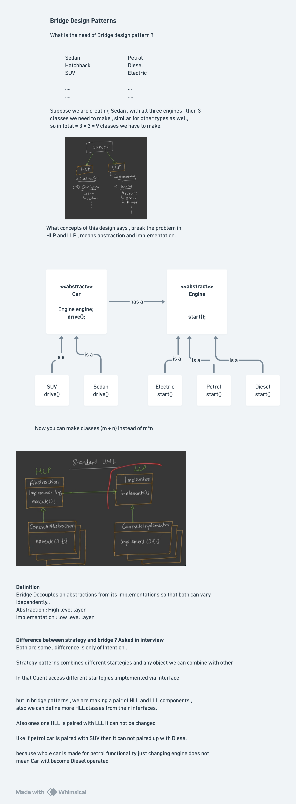

# Bridge Design Pattern

## Definition

The **Bridge Design Pattern** is a structural design pattern that **decouples an abstraction from its implementation so that the two can vary independently**.

The Bridge pattern divides responsibilities into two separate hierarchies: an abstract hierarchy and an implementation hierarchy. They are connected through a bridge (composition) allowing them to evolve separately.

Also known as:
- **Handle/Body Pattern**
- **Implementation Bridge Pattern**
- **Abstraction/Implementation Separation Pattern**

## Purpose

The Bridge pattern is used when:
- You want to avoid permanent binding between abstraction and implementation
- Changes in implementation should not affect clients
- You want to share implementation among multiple objects
- You want to reduce the number of subclasses (avoid class explosion)
- Both abstraction and implementation should be extended independently
- You want to separate interface from implementation
- Implementation should be selected at runtime
- You need to support multiple implementations that vary independently

## Key Problem It Solves

**Without Bridge Pattern (Implementation Locked in Hierarchy):**
```java
Class explosion: Different hierarchies for each combination

Abstract Cars:
  Car - the base abstraction
  ├── Sedan
  └── SUV

Implementations (Engines):
  Petrol, Diesel, Electric

Problem: Need all combinations
  SedenPetrol, SedenDiesel, SedenElectric
  SUVPetrol, SUVDiesel, SUVElectric
  
  Total classes: 2 car types × 3 engines = 6 classes!
  
If we add 3 more car types (Truck, Hatchback, Coupe):
  Total classes: 5 car types × 3 engines = 15 classes!
  
For each new engine type, must create 5 new car subclasses
For each new car type, must create 3 new subclasses

Exponential growth: n car types × m engine types = n*m classes

Issues:
- Class explosion (too many concrete classes)
- Hard to maintain (changes in implementation scattered)
- Tight coupling: engine logic in car subclasses
- Code duplication: engine behavior repeated in each car class
- Difficult to add new combinations
- Violates DRY (Don't Repeat Yourself)
```

**With Bridge Pattern (Abstraction and Implementation Separate):**
```java
Two independent hierarchies:

Abstraction Hierarchy:          Implementation Hierarchy:
Car (abstract)                  Engine (interface)
├── Sedan                       ├── PetrolEngine
└── SUV                         ├── DieselEngine
                                └── ElectricEngine

Connection (Bridge):
Car has-a Engine (composition)

Combinations (dynamic):
  Sedan with PetrolEngine       ✓ (via composition)
  Sedan with DieselEngine       ✓ (via composition)
  Sedan with ElectricEngine     ✓ (via composition)
  SUV with PetrolEngine         ✓ (via composition)
  SUV with DieselEngine         ✓ (via composition)
  SUV with ElectricEngine       ✓ (via composition)

Total classes: 2 car types + 3 engines = 5 classes
(vs 6 without pattern)

If add 3 more car types:
Total classes: 5 car types + 3 engines = 8 classes
(vs 15 without pattern)

Linear growth instead of exponential!

Benefits:
- Fewer classes needed
- Easy to add new car types (just extend Car)
- Easy to add new engines (just implement Engine)
- No duplication of engine logic
- Each can evolve independently
- Open/Closed Principle followed
- Composition over inheritance
```

---

## Core Participants

| Participant | Role |
|-------------|------|
| **Abstraction** | Defines high-level interface; holds reference to Implementor |
| **RefinedAbstraction** | Extends Abstraction with specific functionality |
| **Implementor (Interface)** | Defines interface for implementation classes |
| **ConcreteImplementor** | Implements Implementor interface with specific behavior |

---

## Quick notes and diagrams


## Implementation Details

### Implementor (Abstraction - Car Type)

#### **Car Abstract Class**
```java
Purpose: Abstract interface for different car types
Attributes:
  - Engine engine         // Bridge to implementation (composition)

Constructor:
  public Car(Engine e)
    - Takes Engine as parameter (dependency injection)
    - Stores reference to engine
    - Establishes the bridge

Methods:
  abstract void drive()
    - Implemented differently by each car type
    - Sedan: "Driving Sedan car"
    - SUV: "Driving SUV Car"

Key Design Points:
  - Car doesn't know HOW to start (engine implementation)
  - Car knows WHO to ask (the engine reference)
  - Car defines what cars do (drive)
  - Engine defines HOW to start
  - Bridge: engine field connecting abstraction to implementation
```

#### **Sedan Class (Refined Abstraction)**
```java
Purpose: Specific car type - Sedan
Inherits: Car abstract class

Constructor:
  public Sedan(Engine e)
    - Calls super(e) passing engine to parent
    - Stores engine reference via parent

Method: drive()
  1. engine.start()           // Delegates to engine (polymorphic)
  2. System.out.println("Driving Sedan car")

Behavior:
  - Sedan always prints "Driving Sedan car"
  - Engine type varies (Petrol, Diesel, Electric)
  - Same drive() method works with all engine types
  - engine.start() calls appropriate engine implementation at runtime
```

#### **SUV Class (Refined Abstraction)**
```java
Purpose: Specific car type - SUV
Inherits: Car abstract class

Constructor:
  public SUV(Engine e)
    - Calls super(e) passing engine to parent

Method: drive()
  1. engine.start()           // Delegates to engine (polymorphic)
  2. System.out.println("Driving SUV Car")

Behavior:
  - SUV always prints "Driving SUV Car"
  - Engine type varies
  - Same bridge (engine field) used by all car types
  - Different engine implementations selected at runtime
```

---

### Implementor (Implementation - Engine)

#### **Engine Interface**
```java
Purpose: Defines contract for all engine implementations
Method:
  void start()
    - All engines must implement start behavior
    - Behavior varies: Petrol, Diesel, Electric

Key Point:
  - Simple interface hiding complexity
  - Easy to add new engine types
  - Decoupled from car types
```

#### **PetrolEngine Class (Concrete Implementor)**
```java
Purpose: Petrol engine implementation
Method: start()
  - Output: "Petrol Engine Starting.."
  - Specific to petrol logic
  - Not tied to car type

Key Characteristic:
  - Can be used with Sedan, SUV, or any car type
  - Independent of abstraction hierarchy
  - Reusable across all car implementations
```

#### **DieselEngine Class (Concrete Implementor)**
```java
Purpose: Diesel engine implementation
Method: start()
  - Output: "Diesel Engine Starting.."
  - Specific to diesel logic

Key Characteristic:
  - Can be used with any car type
  - Independent of abstraction hierarchy
```

#### **ElectricEngine Class (Concrete Implementor)**
```java
Purpose: Electric engine implementation
Method: start()
  - Output: "Electric Engine Starting.."
  - Specific to electric logic

Key Characteristic:
  - Can be used with any car type
  - Easily added without modifying car classes
  - Demonstrates bridge flexibility
```

**Bridge Pattern Architecture:**
```
┌─────────────────────────────────────────────────────────┐
│                    ABSTRACTION                          │
│                  (Car Types)                            │
│                                                         │
│           Car (abstract)                               │
│           ├── engine: Engine  ◄──────┐                 │
│                                       │ BRIDGE
│      ┌────────────────┬──────────┐    │ (composition)
│      │                │          │    │
│   Sedan            SUV        (more) │
│                                      │
└─────────────────────────────────────┼─────────────────┘
                                      │
        ┌─────────────────────────────┘
        │
        │
┌───────▼────────────────────────────────────────────────┐
│                 IMPLEMENTATION                         │
│                (Engine Types)                          │
│                                                        │
│        Engine (interface)                             │
│        ├── PetrolEngine                               │
│        ├── DieselEngine                               │
│        └── ElectricEngine                             │
│                                                        │
└────────────────────────────────────────────────────────┘

Bridge connects the two hierarchies
Allows car types and engine types to vary independently
```

---

## Execution Flow: Step-by-Step

### Creating Cars with Different Engines

```
1. Create engine implementations:
   Engine petrol = new PetrolEngine();
   Engine diesel = new DieselEngine();
   Engine electric = new ElectricEngine();
   
   State: Three engine implementations exist independently

2. Create Sedan with electric engine:
   Car sedan = new Sedan(electric);
   
   Sedan constructor:
   - Calls super(electric)
   - Car constructor: this.engine = electric
   - Bridge established: Sedan linked to ElectricEngine
   
   State: Sedan has reference to ElectricEngine

3. Drive the Sedan:
   sedan.drive();
   
   Sedan.drive() executes:
   - Calls: engine.start()
     └─ Runtime resolution: which engine? ElectricEngine
     └─ Calls: ElectricEngine.start()
     └─ Output: "Electric Engine Starting.."
   - Prints: "Driving Sedan car"
   
   Total Output:
     Electric Engine Starting..
     Driving Sedan car

4. Create SUV with petrol engine:
   Car suv = new SUV(petrol);
   
   SUV constructor:
   - Calls super(petrol)
   - Car constructor: this.engine = petrol
   - Bridge established: SUV linked to PetrolEngine
   
   State: SUV has reference to PetrolEngine

5. Drive the SUV:
   suv.drive();
   
   SUV.drive() executes:
   - Calls: engine.start()
     └─ Runtime resolution: which engine? PetrolEngine
     └─ Calls: PetrolEngine.start()
     └─ Output: "Petrol Engine Starting.."
   - Prints: "Driving SUV Car"
   
   Total Output:
     Petrol Engine Starting..
     Driving SUV Car

6. Create another SUV with diesel engine:
   Car suv1 = new SUV(diesel);
   
   suv1.drive();
   
   SUV (second instance).drive() executes:
   - Calls: engine.start()
     └─ Runtime resolution: which engine? DieselEngine
     └─ Calls: DieselEngine.start()
     └─ Output: "Diesel Engine Starting.."
   - Prints: "Driving SUV Car"
   
   Total Output:
     Diesel Engine Starting..
     Driving SUV Car

Complete Output:
  Electric Engine Starting..
  Driving Sedan car
  Petrol Engine Starting..
  Driving SUV Car
  Diesel Engine Starting..
  Driving SUV Car

Key Observations:
  - Same car type (SUV) with different engines → different behavior
  - Same engine type can be used with different cars
  - Easy to create new combinations (just pass different engine)
  - No new classes needed for combinations
  - Engine selection deferred to runtime
```

---

## Key Interview Topics

### 1. **Bridge Pattern vs Adapter Pattern**

| Aspect | Bridge | Adapter |
|--------|--------|---------|
| **Intent** | Decouple abstraction from implementation | Make incompatible interfaces compatible |
| **Usage** | Designed upfront into architecture | Applied to existing code for compatibility |
| **Scope** | Structural design | Compatibility layer |
| **When Used** | During design phase | After discovering incompatibility |
| **Hierarchies** | Two independent hierarchies | Connects two existing incompatible types |

**Easy Explanation:**
```
Bridge: "I have cars and engines. Let me separate them so they can grow independently."
Adapter: "I have existing car and engine code that don't work together. Let me make them compatible."

Bridge: Prevents the problem upfront
Adapter: Fixes the problem after it exists
```

---

### 2. **Bridge Pattern vs Strategy Pattern** (Easy Language)

| Aspect | Bridge | Strategy |
|--------|--------|----------|
| **Problem Solved** | Avoid class explosion when two hierarchies vary | Allow behavior to vary, make replaceable |
| **Hierarchies** | TWO independent hierarchies | ONE hierarchy + strategies |
| **When Combine** | Both abstraction AND implementation vary | Only algorithm/behavior varies |
| **Permanence** | Bridge relatively permanent (set at creation) | Strategy easily switched at runtime |
| **Example** | Cars (sedan, SUV) + Engines (petrol, diesel) | Sorting behavior (BubbleSort, QuickSort) |
| **Focus** | Separating two concerns | Interchangeable algorithms |

**Easy Explanation:**

```
BRIDGE PATTERN:
Think: "I have multiple car TYPES and multiple engine TYPES"
Problem: If I inherit (Sedan extends PetrolCar extends Car), 
         I need SedenPetrol, SedenDiesel, SedenElectric classes
Solution: Make Car have-a Engine (use composition)
         Sedan can work with ANY engine!

Code Example:
  class Sedan {
    Engine engine;  // Bridge to engine
    void drive() {
      engine.start();
    }
  }

STRATEGY PATTERN:
Think: "I have ONE type of object but MULTIPLE ways to do something"
Problem: If I inherit (BubbleSort extends Sorter, QuickSort extends Sorter),
        I create new class for each algorithm
Solution: Make Sorter have-a SortStrategy
         Sorter can use ANY sorting strategy!

Code Example:
  class Sorter {
    SortStrategy strategy;  // Strategy to use
    void sort(int[] arr) {
      strategy.sort(arr);
    }
  }

KEY DIFFERENCE:
Bridge: Multiple car types × multiple engines = need bridge to combine
Strategy: One object × multiple algorithms = need strategy to choose

Bridge: 2 dimensions of variation (car type AND engine type)
Strategy: 1 dimension of variation (algorithm variation only)

Bridge Analogy: Mixing different car models with different engines
Strategy Analogy: Different ways to sort same array
```

### 3. **Two Independent Hierarchies**

**Abstraction Hierarchy (Car Types):**
```java
         Car (abstract)
         ├── engine: Engine
         
         ├── Sedan
         │   └── drive(): specific sedan driving
         │   
         └── SUV
             └── drive(): specific SUV driving

Can add: Truck, Hatchback, Coupe
Just extend Car, implement drive()
```

**Implementation Hierarchy (Engine Types):**
```java
         Engine (interface)
         
         ├── PetrolEngine
         │   └── start(): petrol starting
         │
         ├── DieselEngine
         │   └── start(): diesel starting
         │
         └── ElectricEngine
             └── start(): electric starting

Can add: HybridEngine, BiofuelEngine
Just implement Engine interface
```

**Bridge (The Connection):**
```java
Car holds reference to Engine:
  abstract class Car {
      Engine engine;  // THE BRIDGE
  }

This single line:
  - Separates two hierarchies
  - Enables independence
  - Prevents class explosion
```

---

### 4. **Why Bridge Prevents Class Explosion**

**Without Bridge (Inheritance Approach):**
```
If we tried inheritance:
class SedenPetrolCar extends Car { }
class SedenDieselCar extends Car { }
class SedenElectricCar extends Car { }
class SUVPetrolCar extends Car { }
class SUVDieselCar extends Car { }
class SUVElectricCar extends Car { }

3 car types × 3 engine types = 9 classes (if had 3 cars)
5 car types × 5 engine types = 25 classes (if had 5 cars)

Growth: exponential (n × m)
Problem: This is called Cartesian product explosion
```

**With Bridge (Composition Approach):**
```
class Car {
    Engine engine;  // Bridge
}

Only need:
class Sedan extends Car { }
class SUV extends Car { }

Plus:
class PetrolEngine { }
class DieselEngine { }
class ElectricEngine { }

3 car types + 3 engine types = 6 classes

Growth: linear (n + m)
Solution: Composition avoids explosion

Combinations at runtime:
new Sedan(new PetrolEngine())
new Sedan(new DieselEngine())
new Sedan(new ElectricEngine())
new SUV(new PetrolEngine())
... all possible without new classes!
```

---

### 5. **Bridge vs Encapsulation**

**Encapsulation (Private Details):**
```java
class Car {
    private Engine engine;  // Hidden
    
    public void drive() {
        // Internal implementation details hidden
    }
}

Focus: Hiding HOW it's done
Goal: Protect internals
```

**Bridge (Pluggable Implementation):**
```java
class Car {
    Engine engine;  // Public/flexible
    
    public void drive() {
        engine.start();  // Delegated
    }
}

Focus: Making implementation changeable
Goal: Support multiple implementations
```

Both use composition, but:
- Encapsulation: hide the details
- Bridge: expose the interface, hide implementations

---

### 6. **Composition Over Inheritance**

**Inheritance (Wrong for Bridge Problem):**
```java
class Car { }
class PetrolCar extends Car { }  // Problem: tightly couples engine to car
class DieselCar extends Car { }  // Need new class for each engine
class PetrolSedan extends PetrolCar { }  // Explosion!

Changes to engine type:
  Affects all car subclasses
  Violates open/closed principle
```

**Composition (Bridge Solution):**
```java
class Car {
    Engine engine;  // Holder
}
class Sedan extends Car { }
class SUV extends Car { }

Changes to engine type:
  No changes to car classes
  Just create new Engine implementation
  Open/closed principle followed
```

**Rule:**
```
Use inheritance when: IS-A relationship
  Doctor IS-A Person (doctors are people)
  
Use composition when: HAS-A relationship
  Car HAS-A Engine (cars have engines)
  
Bridge uses composition: Car HAS-A Engine
Not inheritance: Car extends Engine (wrong!)
```

---

### 7. **Runtime Flexibility**

**Bridge Allows Runtime Selection:**
```java
// Decide at runtime which engine to use
Scanner sc = new Scanner(System.in);
System.out.println("Choose engine: 1=Petrol, 2=Diesel, 3=Electric");
int choice = sc.nextInt();

Engine engine;
if (choice == 1) engine = new PetrolEngine();
else if (choice == 2) engine = new DieselEngine();
else engine = new ElectricEngine();

Car car = new Sedan(engine);  // Engine decided at runtime
car.drive();

Without bridge (with inheritance):
  Can't dynamically choose - type fixed at compile time
  Would need reflection or factory with many if-else
```

---

### 8. **Abstraction vs Implementation Independence**

**Independent Evolution:**
```java
// Add new car type WITHOUT changing engine code
class Truck extends Car {
    public void drive() {
        engine.start();
        System.out.println("Driving Truck");
    }
}

// All engines still work!
Truck truck = new Truck(new PetrolEngine());
truck.drive();

// Add new engine WITHOUT changing car code
class BiofuelEngine implements Engine {
    public void start() {
        System.out.println("Biofuel Engine Starting..");
    }
}

// All cars can use it!
Car sedan = new Sedan(new BiofuelEngine());
sedan.drive();

Each hierarchy can grow independently!
```

---

### 9. **Bridge vs Facade**

| Aspect | Bridge | Facade |
|--------|--------|--------|
| **Purpose** | Decouple abstraction from implementation | Simplify complex subsystem |
| **Hierarchies** | Two separate hierarchies | One-way simplification |
| **Structure** | Composition of two peer classes | Wrapper around complex system |
| **Intent** | Independence and variation | Ease of use |

---

### 10. **When NOT to Use Bridge**

```java
DON'T use Bridge when:
  - Only ONE abstraction and ONE implementation (no variation)
  - Implementation tightly coupled to abstraction by design
  - Simple problem that doesn't need separation
  - Adding unnecessary complexity
  
Example (BAD use of bridge):
  class Stack {
      ArrayImpl impl;  // Bridge unnecessary
  }
  
  Stack is just stack, ArrayImpl is just array
  No need for independence
  
DO use Bridge when:
  - Multiple abstractions (Sedan, SUV, Truck)
  - Multiple implementations (Petrol, Diesel, Electric)
  - Both can vary and evolve independently
  - Need to combine them dynamically
```

---

## Advantages of Bridge Pattern

✅ **Decoupling**: Abstractions independent from implementations

✅ **Runtime Flexibility**: Change implementation without changing abstraction code

✅ **Avoids Class Explosion**: Linear growth instead of exponential (n+m vs n×m)

✅ **Open/Closed Principle**: Open for extend (new abstractions/implementations), closed for modification

✅ **Single Responsibility**: Each class has one reason to change

✅ **Easy Maintenance**: Changes to implementation don't affect abstraction

✅ **Code Reuse**: Implementations reusable across abstractions

✅ **Composition Over Inheritance**: Better design principle

✅ **Reduced Coupling**: Abstractions don't depend on implementation details

✅ **Easier Testing**: Can test abstractions and implementations independently

---

## Disadvantages & Limitations

❌ **Added Complexity**: Extra layer of indirection for simple problems

❌ **Learning Curve**: Harder to understand concept initially

❌ **Indirection Overhead**: Extra method calls through bridge

❌ **Runtime Type Determination**: Performance cost of dynamic binding

❌ **More Classes Initially**: More files to manage (even if fewer total)

❌ **Not Always Obvious**: When to use bridge vs other patterns

❌ **Overkill for Simple Cases**: Can be overengineering for straightforward problems

---

## Real-World Applications

### **1. Vehicle Manufacturing (Current Example)**
```java
Car Types: Sedan, SUV, Truck, Hatchback
Engine Types: Petrol, Diesel, Electric, Hybrid

Bridge: Car HAS-A Engine
Benefit: Every engine can be used in every car
         Add new car type without new engine configurations
         Add new engine type usable in all cars
```

### **2. Database Abstraction Layer**
```java
Abstraction: DatabaseConnection interface
  - Connection (high-level)
  - Query (high-level)

Implementation: Different database drivers
  - MySQLDriver
  - PostgreSQLDriver
  - MongoDBDriver
  - OracleDriver

Bridge: Code uses DatabaseConnection interface
        Driver selected at runtime
        Change database without code changes
```

### **3. UI Rendering Across Platforms**
```java
Abstraction: Window, Button, TextBox (high-level UI elements)

Implementation: Platform-specific rendering
  - WindowsRenderer
  - MacRenderer
  - LinuxRenderer

Bridge: UI classes have Renderer reference
        Same UI code works on all platforms
        Add new platform without UI changes
```

### **4. Graphics Display Systems**
```java
Abstraction: Shape (Circle, Rectangle, Triangle)

Implementation: Display mechanism
  - Screen display
  - Printer output
  - PDF generation
  - SVG export

Bridge: Shape has Display reference
        Render same shape to different outputs
```

### **5. Persistence Layer Abstraction**
```java
Abstraction: Repository (high-level data access)
  - list()
  - save()
  - delete()

Implementation: Storage mechanisms
  - FileStorage
  - DatabaseStorage
  - CloudStorage
  - CacheStorage

Bridge: Repository uses Storage reference
        Switch storage without business logic changes
```

### **6. Payment Gateway**
```java
Abstraction: PaymentProcessor
  - processPayment()
  - refund()

Implementation: Different payment gateways
  - StripeProcessor
  - PayPalProcessor
  - SquareProcessor

Bridge: PaymentProcessor has gateway reference
        Add new gateway without modifying business code
```

---

## Best Practices

### **1. Identify Two Independent Dimensions**
```java
Good: Clear two dimensions
  Dimension 1: Car types (what to drive)
  Dimension 2: Engine types (how to drive)
  
Bad: No clear dimensions
  Just inheritance without varying dimensions
```

### **2. Use Interface for Implementation**
```java
Good: Interface for abstraction-independent contract
  interface Engine { void start(); }
  
Bad: Concrete class for implementation
  class Engine { }  // Not extensible
```

### **3. Constructor Injection for Bridge**
```java
Good: Inject dependency
  class Car {
      Engine engine;
      public Car(Engine e) { this.engine = e; }
  }

Bad: Create internally
  class Car {
      Engine engine = new PetrolEngine();
      // Hard to change, no flexibility
  }
```

### **4. Keep Abstraction Simple**
```java
Good: Delegation to implementation
  class Sedan {
      void drive() {
          engine.start();
          System.out.println("Sedan");
      }
  }

Bad: Complex logic in abstraction
  class Sedan {
      void drive() {
          // Complex engine logic here
          // Duplicated in every car type
      }
  }
```

### **5. Use Factory for Creation**
```java
Good: Factory to manage combinations
  class CarFactory {
      static Car createSedan(Engine e) {
          return new Sedan(e);
      }
  }

Bad: Direct instantiation scattered
  Car car = new Sedan(petrolEngine);
  // Repeated everywhere
```

---

## Design Variations

### **1. Setter for Bridge (Dynamic Switching)**
```java
class Car {
    Engine engine;
    
    public void setEngine(Engine e) {
        this.engine = e;  // Change engine at runtime!
    }
    
    void drive() {
        engine.start();
        System.out.println("Driving");
    }
}

// Usage:
Car sedan = new Sedan(petrolEngine);
sedan.drive();

sedan.setEngine(electricEngine);  // Switch engine!
sedan.drive();
```

### **2. Bridge with Adapter**
```java
// Existing incompatible engine
class OldEngine {
    void turnOn() { }  // Different interface
}

// Adapter making it compatible
class OldEngineAdapter implements Engine {
    private OldEngine oldEngine;
    
    public void start() {
        oldEngine.turnOn();  // Adapt interface
    }
}

// Now can use old engine with bridge
Car sedan = new Sedan(new OldEngineAdapter(oldEngine));
```

### **3. Bridge with Decorator**
```java
// Enhanced engine with extra features
class EngineDecorator implements Engine {
    private Engine engine;
    
    public void start() {
        System.out.println("Pre-start checks...");
        engine.start();
        System.out.println("Post-start initialization...");
    }
}

// Used through bridge
Car sedan = new Sedan(new EngineDecorator(petrolEngine));
sedan.drive();  // Enhanced start behavior
```

---

## Common Interview Questions

**Q1: What is Bridge pattern and what problem does it solve?**
- **A:** Bridge pattern decouples abstraction from implementation so they can vary independently. It solves the class explosion problem when you have multiple abstractions (car types) and multiple implementations (engine types). Without bridge, you'd need n×m classes. With bridge, you need n+m classes. Example: instead of SedenPetrol, SedenDiesel, SUVPetrol classes, you have Sedan and SUV classes, with engine injected as dependency.

**Q2: How is Bridge different from Adapter?**
- **A:** Bridge is designed upfront to decouple two hierarchies for independent variation. Adapter fixes incompatibility between existing code. Bridge: "I know these two things need to vary independently." Adapter: "I have incompatible code that I need to work together." Bridge creates two hierarchies. Adapter connects existing incompatible types.

**Q3: What's the key difference between Bridge and Strategy patterns?**
- **A:** Bridge has TWO independent hierarchies varying simultaneously. Strategy has ONE hierarchy with multiple interchangeable algorithms. Bridge example: car types + engine types (2 dimensions of variation, both abstract concept hierarchies). Strategy example: sorting algorithms for one sorter (1 dimension of variation, all algorithms do same thing). Strategy typically one per type, easily switched. Bridge more permanent, set at creation.

**Q4: Why use composition instead of inheritance for the bridge?**
- **A:** With inheritance, you'd create SedenPetrolCar, SedenDieselCar, SUVPetrolCar classes (class explosion). With composition, Sedan and SUV each hold Engine reference. A single Sedan instance can work with any engine. Changes to engine types don't require new car subclasses. Composition provides flexibility that inheritance doesn't.

**Q5: How many objects do you need to create in Bridge example?**
- **A:** For 2 car types (Sedan, SUV) and 3 engine types (Petrol, Diesel, Electric), you could create: 2 car instances + 3 engine instances = 5 objects minimum. Or reuse engines: `Car s1 = new Sedan(petrol); Car s2 = new SUV(petrol);` Same petrol engine used by both. Without bridge pattern, you'd need 6 classes just to represent the types (SedenPetrol, SedenDiesel, SedenElectric, SUVPetrol, SUVDiesel, SUVElectric).

**Q6: What happens if you add a new engine type with Bridge?**
- **A:** Just create new class implementing Engine interface. No changes to any car classes. Example: `class HybridEngine implements Engine { ... }` All existing cars can now use it: `Car c = new Sedan(new HybridEngine());` Without bridge, you'd need new Sedan subclass, new SUV subclass, etc.

**Q7: Is the bridge always in constructor?**
- **A:** Not always. You can use constructor (recommended) or setter. Constructor: `new Sedan(electricEngine)` - engine set at creation. Setter: `sedan.setEngine(electricEngine)` - engine changed later. Constructor is cleaner and simpler. Use setter if you need runtime changes.

**Q8: Can you have multiple bridges in one class?**
- **A:** Yes. Example: `class Car { Engine engine; Transmission transmission; }` Car has bridges to both engine and transmission hierarchies. Each can vary independently. The more bridges, the more complex, but the principle is same.

**Q9: How do you decide between Bridge and Inheritance?**
- **A:** Inheritance: IS-A relationship (Doctor IS-A Person). Bridge: HAS-A relationship (Car HAS-A Engine). When you have both hierarchies that vary independently, use Bridge. When one is-a specialization of another, use inheritance. Our example: Sedan IS-A Car (inheritance), but Car HAS-A Engine (bridge).

**Q10: What if only one implementation exists?**
- **A:** Bridge still useful as future-proofing. Interface provides contract for future implementations. When new engine type needed, just add class. No code changes in existing car classes. Costs minimal extra code now, provides maximum flexibility later.

---

## Strategy vs Bridge: Easy Language Summary

```
┌─────────────────────────────────────────────────────┐
│         BRIDGE PATTERN - Easy Explanation           │
│                                                     │
│ Scenario: YOU HAVE MULTIPLE THINGS THAT VARY      │
│           IN TWO DIFFERENT WAYS                    │
│                                                     │
│ Example:                                            │
│   Different cars (Sedan, SUV)                      │
│   Different engines (Petrol, Diesel)               │
│                                                     │
│   Problem without bridge:                          │
│     Need SedenPetrol class                         │
│     Need SedenDiesel class                         │
│     Need SUVPetrol class                           │
│     Need SUVDiesel class                           │
│     And so on... (EXPLOSION!)                      │
│                                                     │
│   Solution with bridge:                            │
│     Car has-a Engine (composition)                 │
│     Sedan and SUV classes                          │
│     Petrol and Diesel classes                      │
│     Combine them at runtime!                       │
│                                                     │
│   KEY: Two INDEPENDENT things varying             │
│        Both create their own hierarchy             │
│        Connected by composition (bridge)           │
└─────────────────────────────────────────────────────┘

┌─────────────────────────────────────────────────────┐
│         STRATEGY PATTERN - Easy Explanation         │
│                                                     │
│ Scenario: YOU HAVE ONE THING WITH MULTIPLE         │
│           WAYS TO DO THE SAME BEHAVIOR             │
│                                                     │
│ Example:                                            │
│   One sorter (Sorter)                              │
│   Multiple algorithms (Bubble, Quick, Merge)       │
│                                                     │
│   Problem without strategy:                        │
│     Need BubbleSorter class                        │
│     Need QuickSorter class                         │
│     Need MergeSorter class                         │
│     Each one is a sorter, just different HOW       │
│                                                     │
│   Solution with strategy:                          │
│     Sorter has-a SortStrategy                      │
│     One Sorter class                               │
│     BubbleSort, QuickSort, MergeSort strategies    │
│     Pick algorithm at runtime!                     │
│                                                     │
│   KEY: ONE thing with MULTIPLE algorithms          │
│        All do same job, different ways             │
│        Strategy encapsulates the algorithm         │
└─────────────────────────────────────────────────────┘

┌─────────────────────────────────────────────────────┐
│              SIMPLE COMPARISON                      │
│                                                     │
│ BRIDGE: 2 things varying                           │
│   Car types + Engine types                         │
│   Part-whole relationship important                │
│   Example: new Sedan(new PetrolEngine())           │
│                                                     │
│ STRATEGY: 1 thing with variations                  │
│   Sorting algorithms                               │
│   Interchangeable algorithms important             │
│   Example: new Sorter(new QuickSortStrategy())     │
│                                                     │
│ BRIDGE: "How do I avoid class explosion?"          │
│ STRATEGY: "How do I make algorithms swappable?"    │
│                                                     │
│ BRIDGE: Both hierarchies are important             │
│ STRATEGY: Only algorithm variation matters         │
│                                                     │
│ BRIDGE: sedan.drive() → sedan.engine.start()       │
│         Calls different engines                    │
│ STRATEGY: sorter.sort() → sorter.strategy.sort()   │
│           Uses different algorithms                │
└─────────────────────────────────────────────────────┘
```

---

## Summary

The **Bridge Design Pattern** decouples abstraction from implementation through composition, allowing two independent hierarchies to vary separately.

Key insights:
1. **Two Independent Hierarchies** - Abstraction (what) and Implementation (how) separate
2. **Composition Over Inheritance** - Use composition bridge instead of inheritance explosion
3. **Linear Growth** - n abstractions + m implementations = n+m classes (not n×m)
4. **Runtime Flexibility** - Change implementations without changing abstractions
5. **Open/Closed Principle** - Open for extension, closed for modification
6. **Abstraction Independence** - New car types don't affect engine code
7. **Implementation Independence** - New engines don't affect car code
8. **Reduces Coupling** - Abstractions don't depend on concrete implementations
9. **Enables Scalability** - Easy to add new abstractions or implementations
10. **Real-World Pattern** - Used in databases, UI frameworks, graphics systems

Bridge is most valuable when you have genuine two-dimensional variation and want to avoid class explosion. It's a fundamental structural pattern showing mastery of composition, dependency management, and design principles.
