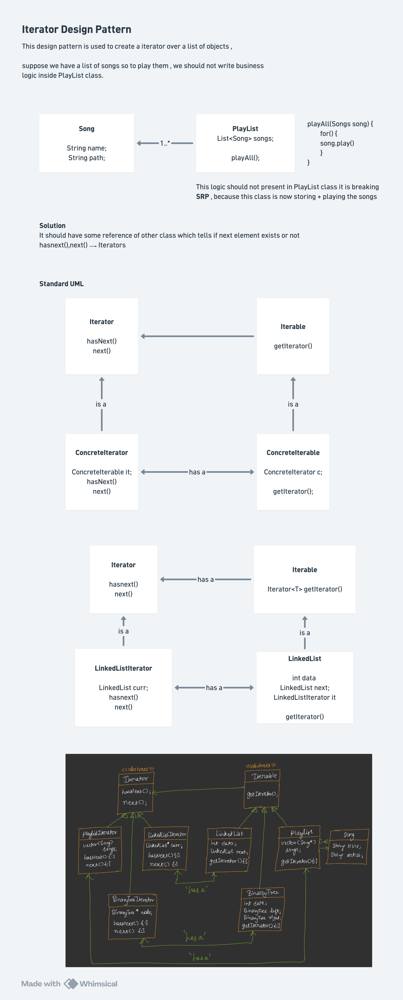

# Iterator Design Pattern

## Definition

The **Iterator Design Pattern** is a behavioral design pattern that provides a way to access elements of a collection sequentially without exposing the underlying representation of the collection. It decouples the traversal mechanism from the collection itself, allowing you to iterate over different types of collections using a uniform interface.

## Problem Statement (Interview Context)

### The Challenge: Exposing Internal Structure

**Scenario:** You have a `PlayList` class that stores songs and allows clients to iterate through them:

```java
// ❌ Bad Approach 1: Expose internal data structure
class PlayList {
    private List<Song> songs = new ArrayList<>();
    
    public List<Song> getSongs() {
        return songs;  // ← Exposes internal implementation!
    }
}

// Client code
PlayList playlist = new PlayList();
List<Song> songs = playlist.getSongs();  // ← Knows about ArrayList
for (Song song : songs) {
    song.play();
}
```

**Problems:**
1. **Violates Encapsulation**: Internal data structure is exposed
2. **Tight Coupling**: Client depends on `List` interface
3. **Hard to Change**: Changing `ArrayList` to `LinkedList` breaks clients
4. **SRP Violation**: `PlayList` both stores AND provides access
5. **Business Logic Mixed**: Traversal logic lives in client code

```java
// ❌ Bad Approach 2: Add traversal to collection
class PlayList {
    private List<Song> songs = new ArrayList<>();
    
    public void playAll() {
        for (int i = 0; i < songs.size(); i++) {
            songs.get(i).play();
        }
    }
    
    // Lots of different traversal methods...
    public void playReverse() { /* ... */ }
    public void playRandom() { /* ... */ }
    public void playFiltered(Predicate<Song> filter) { /* ... */ }
}
```

**Problems:**
1. **SRP Violation**: `PlayList` has too many responsibilities (storage + multiple traversal methods)
2. **Code Duplication**: Each traversal method contains similar loop logic
3. **Hard to Extend**: Adding new traversal methods means modifying `PlayList`
3. **Tight Coupling**: Traversal logic mixed with collection logic

### The Solution: Iterator Pattern

**Key Insight:** Separate **traversal logic** from **storage logic**

```java
// ✅ Good Approach: Iterator Pattern
class PlayList implements Iterable<Song> {
    private List<Song> songs = new ArrayList<>();
    
    @Override
    public Iterator<Song> getIterator() {
        return new PlayListIterator(songs);
    }
}

// Client code
PlayList playlist = new PlayList();
Iterator<Song> iterator = playlist.getIterator();

while (iterator.hasnext()) {
    iterator.next().play();
}
```

**Benefits:**
- ✅ Internal structure hidden (only Iterator exposed)
- ✅ Easy to change internal structure
- ✅ Traversal logic isolated in Iterator
- ✅ Separation of concerns maintained
- ✅ Can support multiple simultaneous iterators

---

## Core Components

### 1. Iterator Interface

Defines the contract for traversing a collection:

```java
interface Iterator<T> {
    boolean hasnext();  // Check if more elements exist
    T next();           // Get next element and advance
}
```

**Responsibilities:**
- Track current position in collection
- Provide mechanism to move to next element
- Indicate when traversal is complete

**Key Methods:**
- `hasnext()`: Returns `true` if there are more elements
- `next()`: Returns the next element and advances cursor

### 2. Iterable Interface

Provides access to iterators:

```java
interface Iterable<T> {
    Iterator<T> getIterator();  // Create and return an iterator
}
```

**Responsibilities:**
- Create iterator instances
- Potentially create multiple simultaneous iterators

### 3. ConcreteIterator

Implements the actual traversal logic:

```java
class LinkedListIterator implements Iterator<Integer> {
    private LinkedList curr;  // Current position
    
    public LinkedListIterator(LinkedList head) {
        curr = head;  // Initialize to start
    }
    
    @Override
    public boolean hasnext() {
        return curr.next != null;  // Check if next element exists
    }
    
    @Override
    public Integer next() {
        int data = curr.data;
        curr = curr.next;  // Advance to next
        return data;
    }
}
```

**Responsibilities:**
- Maintain cursor/pointer position
- Implement traversal logic specific to this collection type
- Handle edge cases (empty collection, last element, etc.)

### 4. ConcreteIterable

The collection that provides iterators:

```java
class LinkedList implements Iterable<Integer> {
    int data;
    LinkedList next;
    
    public LinkedList(int d) {
        this.data = d;
        this.next = null;
    }
    
    @Override
    public Iterator<Integer> getIterator() {
        return new LinkedListIterator(this);  // Create iterator
    }
}
```

**Responsibilities:**
- Store collection elements internally
- Create iterator instances on demand
- Hide internal structure from clients

---

## Architecture & Design

### Communication Flow

```
Client Code
   ↓
Iterable Interface (getIterator())
   ↓
ConcreteIterable (PlayList, LinkedList)
   ↓
Iterator Interface (hasnext(), next())
   ↓
ConcreteIterator (LinkedListIterator)
   ↓
Collection Elements
```

### Key Design Principles

1. **Separation of Concerns**
   - Collection: Stores elements
   - Iterator: Traverses elements
   - Each has single responsibility

2. **Abstraction**
   - Clients depend on interfaces, not implementations
   - Can swap iterators without changing client code

3. **Encapsulation**
   - Internal structure hidden from clients
   - Only Iterator interface exposed

4. **Decoupling**
   - Collection doesn't need to know traversal methods
   - Client doesn't need to know collection structure

---

## Implementation Details

### From the Code Example

**Step 1: Create LinkedList nodes**
```java
LinkedList list1 = new LinkedList(1);
list1.next = new LinkedList(2);
list1.next.next = new LinkedList(3);
list1.next.next.next = new LinkedList(4);
list1.next.next.next.next = new LinkedList(5);
```

Creates linked structure: `1 → 2 → 3 → 4 → 5 → null`

**Step 2: Get Iterator**
```java
Iterator<Integer> itr = list1.getIterator();
```

- Calls `list1.getIterator()` 
- Returns `new LinkedListIterator(list1)` (head node)
- Iterator initialized at first node (value: 1)

**Step 3: Traverse**
```java
while (itr.hasnext()) {
    System.out.println("Node : " + itr.next());
}
```

**Iteration Sequence:**

| Step | `curr` | `hasnext()` | `next()` Returns | `curr` After |
|------|--------|-----------|------------------|--------------|
| 1 | Node(1) | `curr.next` (Node 2) → true | 1 | Node(2) |
| 2 | Node(2) | `curr.next` (Node 3) → true | 2 | Node(3) |
| 3 | Node(3) | `curr.next` (Node 4) → true | 3 | Node(4) |
| 4 | Node(4) | `curr.next` (Node 5) → true | 4 | Node(5) |
| 5 | Node(5) | `curr.next` (null) → false | 5 | null |
| 6 | null | hasnext() → false | STOP | - |

**Output:**
```
Node : 1
Node : 2
Node : 3
Node : 4
Node : 5
```

---

## Interview Deep Dive

### Q1: Why not just use a for-loop over the collection directly?

**Answer:**

Direct access approach:
```java
// Exposes structure, tight coupling
for (int i = 0; i < list.size(); i++) {
    Song song = list.get(i);
}
```

Iterator approach:
```java
// Hides structure, loose coupling
Iterator<Song> it = list.getIterator();
while (it.hasNext()) {
    Song song = it.next();
}
```

**Advantages of Iterator:**
- Collection can store elements however it wants (array, linked list, tree, hash table)
- Client code doesn't change when internal structure changes
- Can have multiple simultaneous iterators
- Can easily swap different iterator implementations
- Works uniformly across different collection types

**Example:** If you switch from `ArrayList` to `LinkedList`:
- Without Iterator: Client code breaks (can't use `.get(i)` efficiently)
- With Iterator: Client code remains unchanged

### Q2: What's the difference between Iterator and Iterable?

**Answer:**

| Aspect | Iterable | Iterator |
|--------|----------|----------|
| **Purpose** | Provides access to iterator | Performs traversal |
| **Interface** | `getIterator()` | `hasnext()`, `next()` |
| **Responsibility** | Create iterator | Track position, move through elements |
| **State** | Stateless | Stateful (maintains cursor position) |
| **Multiple Instances** | Yes (can create multiple iterators) | One per traversal |
| **Implemented By** | Collection classes | Iterator classes |

**Analogy:**
- **Iterable** = "Here's a book" (provides access to contents)
- **Iterator** = "Here's a bookmark" (tracks your position)

### Q3: Can you have multiple iterators over the same collection?

**Answer:** Yes! Each iterator maintains its own cursor position.

```java
LinkedList list1 = new LinkedList(1);
list1.next = new LinkedList(2);
list1.next.next = new LinkedList(3);

// Two simultaneous iterators
Iterator<Integer> itr1 = list1.getIterator();  // Cursor at 1
Iterator<Integer> itr2 = list1.getIterator();  // Cursor at 1

System.out.println(itr1.next());  // 1, cursor → 2
System.out.println(itr2.next());  // 1, cursor → 2
System.out.println(itr1.next());  // 2, cursor → 3
System.out.println(itr2.next());  // 2, cursor → 3
```

Independent cursor positions = independent traversals simultaneously!

### Q4: What if the collection is modified during iteration?

**Answer:** Two approaches:

**Approach 1: Fail-Fast** (Standard in Java)
```java
List<String> list = new ArrayList<>();
Iterator<String> it = list.iterator();
it.next();
list.remove(0);  // ← Modifies collection
it.next();       // ← Throws ConcurrentModificationException
```

**Approach 2: Fail-Safe** (Makes a copy)
```java
List<String> copy = new ArrayList<>(list);
Iterator<String> it = copy.iterator();
it.next();
list.remove(0);  // ← Modifies original, not copy
it.next();       // ← Works fine, iterating over snapshot
```

**Interview Point:** Different use cases prefer different approaches!

### Q5: How is this different from the for-each loop?

**Answer:** The for-each loop is syntactic sugar built on top of Iterator!

```java
// This:
for (String item : collection) {
    System.out.println(item);
}

// Is compiled to:
Iterator<String> it = collection.iterator();
while (it.hasNext()) {
    String item = it.next();
    System.out.println(item);
}
```

The `for-each` loop works on **any class implementing `Iterable`**.

### Q6: What are the disadvantages of Iterator Pattern?

**Answer:**

1. **Complexity**: Additional classes needed (Iterator + Iterable interfaces)
2. **One-Directional**: Standard Iterator only goes forward (can add BiDirectionalIterator)
3. **No Direct Access**: Can't jump to middle element
4. **Overhead**: Creating iterator objects has memory overhead
5. **Thread Safety**: Need synchronization if multiple threads modify collection

### Q7: When would you NOT use Iterator Pattern?

**Answer:**

1. **Simple Collections**: Overkill for small, simple arrays
2. **Performance Critical**: Iterator overhead might matter
3. **Direct Random Access Only**: If you never need traversal
4. **Fixed Iteration Only**: Same way of iterating always

```java
// ❌ Overkill
int[] array = {1, 2, 3};  // Just use for-loop

// ✅ Appropriate
List<Song> songs = new ArrayList<>();
Iterator<Song> it = songs.iterator();  // Flexible, reusable
```

### Q8: What's the relationship between Iterator and Strategy Pattern?

**Answer:** 

- **Iterator**: Different ways to **traverse** same data
- **Strategy**: Different ways to **process** data

```java
// Iterator: Traverse differently
Iterator<Integer> forward = list.getIterator();
Iterator<Integer> backward = list.getReverseIterator();

// Strategy: Process differently
Strategy<Integer> sumStrategy = new Sum();
Strategy<Integer> avgStrategy = new Average();
```

They're complementary patterns, often used together.

### Q9: How do you handle empty collections?

**Answer:**

```java
class EmptyIterator implements Iterator<Integer> {
    @Override
    public boolean hasnext() {
        return false;  // Always false for empty collection
    }
    
    @Override
    public Integer next() {
        throw new NoSuchElementException("Collection is empty");
    }
}
```

Usage:
```java
LinkedList emptyList = null;  // Or empty collection

Iterator<Integer> it = (emptyList == null) 
    ? new EmptyIterator() 
    : emptyList.getIterator();

while (it.hasnext()) {
    // Won't execute for empty iterator
}
```

### Q10: What about bidirectional iteration?

**Answer:** Extend Iterator to support backward traversal:

```java
interface BiDirectionalIterator<T> extends Iterator<T> {
    boolean hasPrevious();
    T previous();
}

class LinkedListBiIterator implements BiDirectionalIterator<Integer> {
    private LinkedList curr;
    private LinkedList prev;
    
    @Override
    public boolean hasPrevious() {
        return prev != null;
    }
    
    @Override
    public Integer previous() {
        // Move backward
        curr = prev;
        // Need doubly-linked list or maintain reference
        return curr.data;
    }
}
```

---

## Common Use Cases

### 1. Traversing Linked Lists
```java
LinkedList head = new LinkedList(1);
Iterator<Integer> it = head.getIterator();
while (it.hasnext()) {
    System.out.println(it.next());
}
```

### 2. Traversing Trees
```java
interface TreeIterator {
    boolean hasnext();
    // In-order traversal
    // Pre-order traversal  
    // Post-order traversal
}
```

### 3. File System Traversal
```java
Directory dir = new Directory("Documents");
Iterator<File> it = dir.getIterator();
while (it.hasnext()) {
    File file = it.next();
    // Process file
}
```

### 4. Database Result Sets
```java
ResultSet resultSet = statement.executeQuery("SELECT * FROM users");
while (resultSet.next()) {
    User user = new User(resultSet);
    // Process user
}
```

### 5. Collections Framework (Java)
```java
List<String> names = new ArrayList<>();
Iterator<String> it = names.iterator();
while (it.hasNext()) {
    System.out.println(it.next());
}
```

---

## Design Principle Violations Without Iterator

### Without Iterator (SRP Violation)

```java
// ❌ BAD: PlayList does too much
class PlayList {
    private List<Song> songs;  // Stores songs
    
    public void playAll() { }           // Iterates and plays
    public void playReverse() { }       // Different iteration
    public void playRandom() { }        // Yet another iteration
    public void addSong(Song s) { }     // Adds song
    public void removeSong(Song s) { }  // Removes song
    // ← Violates SRP - has multiple reasons to change
}
```

### With Iterator (SRP Followed)

```java
// ✅ GOOD: Separation of concerns

// PlayList: Manages collection
class PlayList implements Iterable<Song> {
    private List<Song> songs;
    
    @Override
    public Iterator<Song> getIterator() {
        return new PlayListIterator(songs);
    }
    
    public void addSong(Song s) { }
    public void removeSong(Song s) { }
}

// Iterators: Handle traversal
class PlayListIterator implements Iterator<Song> { }
class ReversePlayListIterator implements Iterator<Song> { }
class RandomPlayListIterator implements Iterator<Song> { }
```

Each class has single reason to change!

---

## Iterator vs Other Approaches

| Approach | Use Case | Pros | Cons |
|----------|----------|------|------|
| **Direct Loop** | Simple arrays | Simple, fast | Tight coupling, exposes structure |
| **Iterator** | Complex collections | Flexible, extensible | More classes, slight overhead |
| **Stream API** | Functional processing | Elegant, chainable | Different paradigm, less control |
| **Visitor** | Complex object trees | Flexible double-dispatch | Complex to implement |
| **For-Each Loop** | Simple traversal | Clean syntax | Limited functionality |

---

## Time & Space Complexity

| Operation | Time | Space | Notes |
|-----------|------|-------|-------|
| `getIterator()` | O(1) | O(1) | Creating iterator |
| `hasnext()` | O(1) | O(1) | Just checking current position |
| `next()` | O(1) | O(1) | Moving to next, typically constant |
| Full Traversal | O(n) | O(1) | Visit each element once, iterator is O(1) space |

---

## Real-World Interview Scenario

**Interviewer:** "Design a music player system. Users should be able to iterate through playlists. Write code for the Iterator Pattern."

**Better Answer:**

```java
// 1. Iterator Interface
interface Iterator<T> {
    boolean hasnext();
    T next();
}

// 2. Iterable Interface
interface Iterable<T> {
    Iterator<T> getIterator();
}

// 3. Song Element
class Song {
    String name;
    String artist;
    
    public void play() {
        System.out.println("Playing: " + name + " by " + artist);
    }
}

// 4. Concrete Iterator
class PlayListIterator implements Iterator<Song> {
    private List<Song> songs;
    private int index = 0;
    
    public PlayListIterator(List<Song> songs) {
        this.songs = songs;
    }
    
    @Override
    public boolean hasnext() {
        return index < songs.size();
    }
    
    @Override
    public Song next() {
        if (!hasnext()) {
            throw new NoSuchElementException();
        }
        return songs.get(index++);
    }
}

// 5. PlayList (Concrete Iterable)
class PlayList implements Iterable<Song> {
    private List<Song> songs = new ArrayList<>();
    
    public void addSong(Song song) {
        songs.add(song);
    }
    
    @Override
    public Iterator<Song> getIterator() {
        return new PlayListIterator(songs);
    }
}

// 6. Usage
PlayList playlist = new PlayList();
playlist.addSong(new Song("Song1", "Artist1"));
playlist.addSong(new Song("Song2", "Artist2"));

Iterator<Song> it = playlist.getIterator();
while (it.hasnext()) {
    it.next().play();
}
```

**What This Shows:**
- ✅ Clear separation of concerns
- ✅ Proper use of interfaces
- ✅ Easy to add new iterator types
- ✅ Internal structure hidden
- ✅ Type-safe generic implementation

---

## Key Advantages

1. **Encapsulation**: Internal structure hidden from clients
2. **Flexibility**: Can have multiple iterators, different traversal orders
3. **Uniformity**: Same interface for different collection types
4. **Extensibility**: Easy to add new iterators without changing collection
5. **Separation of Concerns**: Collection logic separate from traversal logic
6. **Loose Coupling**: Client doesn't depend on concrete collection type
7. **Easy to Change**: Switch internal data structure without affecting clients

---

## Key Disadvantages

1. **Added Complexity**: Requires more classes and interfaces
2. **Memory Overhead**: Each iterator maintains state
3. **One-Directional Only**: Standard Iterator only goes forward
4. **Performance**: Might be slower than direct array access for simple cases
5. **Thread Safety Concerns**: Need synchronization with concurrent modifications
6. **Learning Curve**: More complex than simple loops for beginners

---

## When to Use Iterator Pattern

✅ **Use When:**
- Multiple ways to traverse same collection
- Different traversal orders needed (forward, reverse, in-order, etc.)
- internal data structure shouldn't be exposed
- Tight coupling would result from direct access
- Different types of collections need uniform traversal interface
- Multiple simultaneous traversals needed

❌ **Avoid When:**
- Simple array with single traversal method
- Performance is absolutely critical
- Collection is immutable and never changes structure
- Direct random access is primary need
- Team unfamiliar with pattern

---

## Common Implementation Issues

### ❌ Issue 1: Not initializing cursor properly

```java
// ❌ BAD
class BadIterator implements Iterator<Integer> {
    private LinkedList curr;  // Not initialized!
    
    public boolean hasnext() {
        return curr != null;  // Could be null
    }
}

// ✅ GOOD
class GoodIterator implements Iterator<Integer> {
    private LinkedList curr;
    
    public GoodIterator(LinkedList head) {
        this.curr = head;  // Initialize in constructor
    }
    
    public boolean hasnext() {
        return curr != null && curr.next != null;
    }
}
```

### ❌ Issue 2: Not handling empty collections

```java
// ❌ BAD - throws NPE if empty
Iterator<Integer> it = emptyLinkedList.getIterator();
it.next();  // NullPointerException!

// ✅ GOOD
@Override
public Integer next() {
    if (!hasnext()) {
        throw new NoSuchElementException("No more elements");
    }
    // ... rest of logic
}
```

### ❌ Issue 3: Confusing hasnext() semantics

```java
// ❌ BAD: Returns true when at last element
public boolean hasnext() {
    return curr != null;  // Includes current element
}
// This means hasnext() before last element is true
// But after calling next() on last element, hasNext() is still true!

// ✅ GOOD: Returns true if there's a next element
public boolean hasnext() {
    return curr.next != null;  // Only looks ahead
}
```

### ❌ Issue 4: Modifying cursor incorrectly

```java
// ❌ BAD: Loses data
@Override
public Integer next() {
    curr = curr.next;  // Advanced first
    return curr.data;  // Wrong data!
}

// ✅ GOOD: Get data THEN advance
@Override
public Integer next() {
    int data = curr.data;
    curr = curr.next;  // Advance after reading
    return data;
}
```

---

## Summary of Key Concepts

| Concept | Description |
|---------|-------------|
| **Separation** | Traversal logic separate from storage |
| **Encapsulation** | Internal structure hidden from clients |
| **Abstraction** | Clients use Iterator interface, not concrete types |
| **Uniformity** | Same interface works for different collection types |
| **Stateful** | Iterator maintains cursor position |
| **Stateless** | Collection doesn't change during iteration |
| **Multiple Iterators** | Can have many simultaneous traversals |
| **One Direction** | Usually only forward (can extend for bidirectional) |

---

# Quick Notes and Diagram



The image above shows the complete architectural overview:

**Top Section - Problem:**
- Shows that storing songs in PlayList and playing them directly violates SRP
- Business logic mixed with traversal logic

**Middle Section - UML Relationship:**
- `Iterator` interface with `hasnext()` and `next()` methods
- `Iterable` interface with `getIterator()` method
- Concrete implementations: `ConcreteIterator` and `ConcreteIterable`

**Lower Sections - Full Implementation:**
- `LinkedListIterator` maintains current position in linked list
- `LinkedList` implements `Iterable`, provides `getIterator()`
- Shows complete class structure with methods
- Demonstrates how PlayList and Song interact

**Key Relationships Shown:**
- Iterator "is a" implementation of Iterator interface
- Iterable "is a" implementation of Iterable interface
- Concrete implementations maintain reference to collection
- Iterator tracks position, Iterable creates iterators

This diagram illustrates that without Iterator, PlayList would need business logic + traversal logic, violating SRP. With Iterator, each class has single responsibility.

---

# Interview Checklist

✅ Can you explain the problem Iterator Pattern solves?  
✅ What's the difference between Iterator and Iterable?  
✅ Can you implement Iterator for a LinkedList?  
✅ How would you handle empty collections?  
✅ Can you have multiple iterators simultaneously?  
✅ What happens if collection is modified during iteration?  
✅ How does for-each loop work with Iterator?  
✅ What are time/space complexities?  
✅ Compare Iterator vs direct access?  
✅ When would you NOT use Iterator?  
✅ How does it relate to SRP?  
✅ Design a PlayList with Iterator Pattern?  
✅ Bidirectional iteration approach?  
✅ Different traversal orders (in-order, reverse, etc.)?  
✅ Thread safety considerations?  

---

# Key Takeaways for Interviews

1. **Purpose**: Provide uniform interface to traverse different collection types
2. **Core Components**: Iterator (traversal), Iterable (provider), Concrete implementations
3. **Separation**: Traversal logic separate from collection storage logic
4. **Encapsulation**: Hide internal data structure from clients
5. **Flexibility**: Support multiple iterators, different traversal orders
6. **Stateful**: Iterator maintains cursor position
7. **Extensibility**: Add new iterators without changing collection
8. **Real-World**: Java Collections Framework heavily uses Iterator Pattern
9. **Trade-offs**: More classes/code complexity for better design
10. **Alternatives**: For-each loop, Streams, direct access (each with trade-offs)

