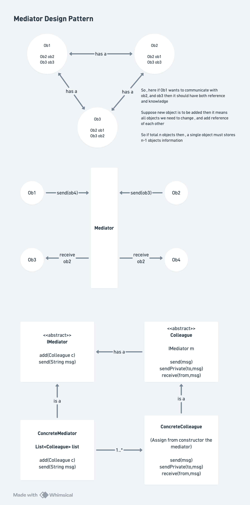

# Mediator Design Pattern

## Definition

The **Mediator Design Pattern** is a behavioral design pattern that defines an object that encapsulates how a set of objects interact with each other. It promotes loose coupling by keeping objects from referring to each other explicitly and lets you vary their interaction independently.

## Core Philosophy

**Main Insight:** Instead of objects communicating directly with each other (creating mesh of dependencies), introduce a **central mediator** that handles all communication between objects.

```
Without Mediator (Tight Coupling):
Object1 ↔ Object2 ↔ Object3 ↔ Object4
  ↓        ↓        ↓        ↓
  All connected to all (Complex mesh!)

With Mediator (Loose Coupling):
Object1 ─┐
Object2 ─┼─ Mediator
Object3 ─┤
Object4 ─┘
  Star topology, mediator at center
```

---

## Problem Statement (Interview Context)

### The Challenge: Spaghetti Communication

**Scenario:** You're building a chat application with multiple users in a chat room.

**Without Mediator Pattern:**

```java
// ❌ BAD: Every user knows about every other user
class User {
    private List<User> colleagues;  // References ALL other users!
    
    public void send(String msg) {
        for (User colleague : colleagues) {
            colleague.receive(msg);
        }
    }
}

User u1 = new User("Alice");
User u2 = new User("Bob");
User u3 = new User("Charlie");

u1.colleagues = Arrays.asList(u2, u3);
u2.colleagues = Arrays.asList(u1, u3);
u3.colleagues = Arrays.asList(u1, u2);

// Problems:
// 1. u1, u2, u3 all tightly coupled
// 2. Adding new user → update ALL users' colleague lists
// 3. Each user must know about ALL others
// 4. Complex spaghetti of connections
// 5. Hard to change communication logic
// 6. Violates Single Responsibility (storing + communicating)
```

**Issues:**
1. **Tight Coupling**: Every object knows every other object
2. **Scalability**: Adding user #100 requires updating all 99 users
3. **Complexity**: Communication logic scattered across objects
4. **Maintenance Nightmare**: Change communication → change all classes
5. **Code Duplication**: Each object implements similar broadcast logic
6. **SRP Violation**: Users both store data AND handle communication


# Quick Notes and Diagram



### Solution: Introduce Mediator

```java
// ✅ GOOD: Users only know about ChatRoom (Mediator)
class User {
    private ChatRoom chatRoom;  // Only reference to Mediator!
    
    public void send(String msg) {
        chatRoom.send(this, msg);  // → Mediator handles it
    }
}

ChatRoom room = new ChatRoom();
User u1 = new User("Alice", room);
User u2 = new User("Bob", room);
User u3 = new User("Charlie", room);

u1.send("Hello all!");  // Through room (mediator), not direct to u2, u3

// Benefits:
// ✅ Loose coupling (users only know ChatRoom)
// ✅ Easy to add users (just register with ChatRoom)
// ✅ Communication logic centralized (ChatRoom)
// ✅ Easy to modify communication rules
// ✅ SRP maintained (ChatRoom handles communication)
```

---

## Architecture & Components

### 1. Mediator Interface

Defines contract for mediation:

```java
interface IMediator {
    void send(String from, String msg);                   // Broadcast
    void sendPrivate(String from, String to, String msg); // Direct message
    void registerColleague(Colleague c);                  // Register user
}
```

**Responsibilities:**
- Define communication methods
- Enforce interface for all mediators
- Abstract communication logic

### 2. Colleague (Abstract Base Class)

Represents communicating objects:

```java
abstract class Colleague {
    public IMediator mediator;  // Reference to mediator only
    
    public Colleague(IMediator m) {
        mediator = m;
        mediator.registerColleague(this);  // Register with mediator
    }
    
    abstract String getName();
    abstract void send(String msg);                    // Send to all
    abstract void sendPrivate(String to, String msg);  // Send to one
    abstract void receive(String from, String msg);    // Receive message
}
```

**Key Point:** Colleague knows ONLY about Mediator, not other colleagues.

### 3. ConcreteMediator

Implements actual mediation logic:

```java
class ChatMediator implements IMediator {
    private List<Colleague> colleagues = new ArrayList<>();
    
    @Override
    public void registerColleague(Colleague c) {
        colleagues.add(c);  // Maintain registry
    }
    
    @Override
    public void send(String from, String msg) {
        System.out.println("[" + from + " broadcasts]: " + msg);
        for (Colleague colleague : colleagues) {
            if (colleague.getName().equals(from)) continue;  // Skip sender
            colleague.receive(from, msg);
        }
    }
    
    @Override
    public void sendPrivate(String from, String to, String msg) {
        System.out.println("[" + from + " sends to " + to + "]: " + msg);
        for (Colleague colleague : colleagues) {
            if (colleague.getName().equals(to)) {
                colleague.receive(from, msg);
            }
        }
    }
}
```

**Responsibilities:**
- Store registry of colleagues
- Route messages between colleagues
- Implement communication logic
- Enforce rules (who can talk to whom, etc.)

### 4. ConcreteColleague

Represents actual communicating objects:

```java
class User extends Colleague {
    private String name;
    
    public User(String name, IMediator m) {
        super(m);
        this.name = name;
    }
    
    @Override
    String getName() {
        return name;
    }
    
    @Override
    void send(String msg) {
        mediator.send(name, msg);  // Ask mediator to broadcast
    }
    
    @Override
    void sendPrivate(String to, String msg) {
        mediator.sendPrivate(name, to, msg);  // Ask mediator to send
    }
    
    @Override
    void receive(String from, String msg) {
        System.out.println("    " + name + " got from " + from + ": " + msg);
    }
}
```

**Key Point:** Delegates all communication to mediator.

---

## Interaction Flow: Step-by-Step

### Scenario: Alice sends broadcast message

**Step 1: Alice Sends**
```
alice.send("Good morning all...")
```

**Step 2: Alice Delegates to Mediator**
```java
// In User.send():
mediator.send(name, msg);
// ↓ Calls ChatMediator.send("Alice", "Good morning...")
```

**Step 3: Mediator Broadcasts**
```java
// In ChatMediator.send():
for (Colleague colleague : colleagues) {
    if (colleague.getName().equals(from)) continue;  // Skip Alice
    colleague.receive(from, msg);                   // Send to all others
}
```

**Step 4: Others Receive**
```
Bob.receive("Alice", "Good morning...")     // Bob gets it
Charlie.receive("Alice", "Good morning...") // Charlie gets it
```

**Output:**
```
[Alice broadcasts]: Good morning all...
    Bob got from Alice: Good morning all...
    Charlie got from Alice: Good morning all...
```

### Scenario: Bob Sends Private Message to Alice

**Step 1: Bob Sends Private**
```
bob.sendPrivate("Alice", "Hello, Alice!")
```

**Step 2: Bob Delegates to Mediator**
```java
// In User.sendPrivate():
mediator.sendPrivate(name, to, msg);
// ↓ Calls ChatMediator.sendPrivate("Bob", "Alice", "Hello, Alice!")
```

**Step 3: Mediator Routes to Specific User**
```java
// In ChatMediator.sendPrivate():
for (Colleague colleague : colleagues) {
    if (colleague.getName().equals(to)) {
        colleague.receive(from, msg);  // Send to Alice only
    }
}
```

**Step 4: Alice Receives**
```
Alice.receive("Bob", "Hello, Alice!")
```

**Output:**
```
[Bob Send private msg to Alice]: Hello, Alice!
    Alice got from Bob: Hello, Alice!
```

---

## Interview Deep Dive

### Q1: What problem does Mediator solve?

**Answer:**

**Without Mediator (N-to-N coupling):**
```
Objects communicate directly
- Object knows about N-1 other objects
- Total connections: N × (N-1) = O(N²)
- For 100 users: 9,900 connections!
- Adding user #101: Must update 100 other objects
```

**With Mediator (N-to-1 coupling):**
```
All communicate through central mediator
- Each object knows about 1 mediator
- Total connections: N
- For 100 users: 100 connections
- Adding user #101: Just update mediator, not 100 objects
```

**Benefits:**
- ✅ Reduced coupling (O(N²) → O(N))
- ✅ Centralized control
- ✅ Easier to understand communication
- ✅ Can change roles/permissions in one place

---

### Q2: What's the difference between Mediator and Observer Pattern?

**Answer:**

| Aspect | Mediator | Observer |
|--------|----------|----------|
| **Focus** | How objects communicate | How to notify multiple objects |
| **Relationship** | Two-way (can respond) | One-way (subject to observers) |
| **Logic** | Mediates complex interactions | Simple publish-subscribe |
| **Coupling** | Uses interface, centralized | Uses callbacks/listeners |
| **Hierarchy** | Peer-to-peer through mediator | One subject, many observers |
| **Use Case** | Dialog boxes, chat rooms, air traffic | Button clicks, file changes |

**In Code:**

```
Mediator:
User1 ←→ ChatRoom ←→ User2
(Two-way communication through mediator)

Observer:
Subject → Observer1, Observer2, Observer3
(One-way notification to all observers)
```

---

### Q3: How do you add a new colleague at runtime?

**Answer:**

```java
// Creating and adding user at runtime
ChatRoom room = ...;  // Already existing with existing users

// New user joins
User newUser = new User("David", room);
// Automatically registered because:
// new User() calls super(mediator) 
// which calls mediator.registerColleague(this)
```

**No existing users need to change!** The mediator handles everything:

```java
// Existing users don't know about David
User u1 = ... // "Alice"
User u2 = ... // "Bob"

// Alice can still communicate
u1.send("Hello!");  // Goes to ChatRoom
// ChatRoom sends to all (including new David)
```

---

### Q4: Can multiple mediators exist?

**Answer:** Yes! You could have multiple chat rooms.

```java
// Two separate chat rooms (mediators)
IMediator room1 = new ChatMediator();  // Room 1
IMediator room2 = new ChatMediator();  // Room 2

// Users in room 1
User alice = new User("Alice", room1);
User bob = new User("Bob", room1);

// Users in room 2 (different space)
User charlie = new User("Charlie", room2);
User david = new User("David", room2);

// Alice and Bob talk in room1
alice.send("Hello!");  // Only Bob gets it (not Charlie/David)

// Charlie and David talk in room2
charlie.send("Hi!");   // Only David gets it (not Alice/Bob)
```

**Each mediator is independent!**

---

### Q5: What if you want different mediators for different rules?

**Answer:** Create different mediator implementations!

```java
// IMediator interface allows multiple implementations

// Mediator 1: Free-for-all chat
class OpenChatMediator implements IMediator {
    public void send(String from, String msg) {
        // Send to everyone, no restrictions
    }
}

// Mediator 2: Moderated chat
class ModeratedChatMediator implements IMediator {
    private Set<String> banned = new HashSet<>();
    
    public void send(String from, String msg) {
        if (banned.contains(from)) {
            System.out.println("User banned!");
            return;
        }
        // Send to everyone
    }
}

// Mediator 3: VIP chat (only VIP users)
class VIPChatMediator implements IMediator {
    public void send(String from, String msg) {
        // Check if VIP before sending
    }
}

// Usage:
IMediator publicRoom = new OpenChatMediator();
IMediator moderatedRoom = new ModeratedChatMediator();
IMediator vipRoom = new VIPChatMediator();

User u1 = new User("Alice", publicRoom);        // Alice in public
User u2 = new User("Bob", moderatedRoom);       // Bob in moderated
User u3 = new User("Charlie", vipRoom);         // Charlie in VIP
```

---

### Q6: What's the difference between Mediator and Facade Pattern?

**Answer:**

| Aspect | Mediator | Facade |
|--------|----------|--------|
| **Purpose** | Mediates peer-to-peer interaction | Simplifies complex subsystem |
| **Scope** | Many colleagues through mediator | Many subsystems to single interface |
| **Communication** | Bidirectional (colleagues ↔ mediator) | One-way (clients → facade) |
| **Change** | Colleagues can change dynamically | Subsystems relatively static |
| **Know** | Mediator knows all colleagues | Facade knows subsystem classes |
| **Coupling** | Mediator tightly coupled to colleagues | Decouples subsystem from clients |

**In Context:**

```
Mediator: Dialog Box
- OK Button ←→ Dialog
- Cancel Button ←→ Dialog
- Text Field ←→ Dialog
(Buttons interact through dialog)

Facade: Library System
- Many complex classes
- Facade provides simple interface
- Client doesn't know about complexity
```

---

### Q7: How does Mediator help with testing?

**Answer:**

**Without Mediator (Hard to test):**
```java
// User must know about all other users
class User {
    private List<User> colleagues;
}

// Test requires instantiating all colleagues
@Test
public void testUserSend() {
    User alice = new User("Alice", {bob, charlie, david, ...});
    // Need to mock/create all other users
}
```

**With Mediator (Easy to test):**
```java
// User only knows about mediator
class User {
    private IMediator mediator;
}

// Test can mock the mediator
@Test
public void testUserSend() {
    IMediator mockRoom = mock(IMediator.class);
    User alice = new User("Alice", mockRoom);
    
    alice.send("Hello");
    
    verify(mockRoom).send("Alice", "Hello");  // Verify mediator called
}
```

**Benefits:**
- Test one colleague in isolation
- Mock the mediator
- No complex test setup
- Verify collaboration contracts

---

### Q8: When should you NOT use Mediator?

**Answer:**

❌ **Avoid Mediator when:**
```
1. Simple one-to-one communication
   (Just use direct references)

2. Truly independent objects
   (No interaction needed)

3. One clear hierarchy
   (Parent-child, use Observer instead)

4. Frequently changing communication rules
   (Mediator becomes too complex)

5. Only 2-3 objects total
   (Overhead not worth it)

6. Real-time performance critical
   (Extra indirection adds latency)
```

**Example - DON'T USE MEDIATOR:**
```java
// ❌ Over-engineered
class TextBox {
    private IMediator mediator;
}

class Button {
    private IMediator mediator;
}

// Just use direct listener:
button.addListener(() -> textBox.clear());

// ✅ Simple and clear
```

---

### Q9: How to prevent infinite loops of communication?

**Answer:**

**Problem:**
```
Alice sends → ChatRoom → Bob
Bob sends → ChatRoom → Alice
Alice sends → ChatRoom → Bob
... (infinite loop!)
```

**Solution: Skip Sender**
```java
@Override
public void send(String from, String msg) {
    for (Colleague colleague : colleagues) {
        if (colleague.getName().equals(from)) continue;  // ← Skip sender!
        colleague.receive(from, msg);
    }
}
```

**Better Solution: Message Tracking**
```java
class SmartMediator implements IMediator {
    private Set<String> messageIds = new HashSet<>();  // Track sent messages
    
    public void send(String from, String msg, String msgId) {
        if (messageIds.contains(msgId)) {
            return;  // Already sent this message
        }
        messageIds.add(msgId);
        
        for (Colleague colleague : colleagues) {
            if (!colleague.getName().equals(from)) {
                colleague.receive(from, msg);
            }
        }
    }
}
```

---

### Q10: How does Mediator relate to MVC pattern?

**Answer:**

**MVC uses Mediator-like concepts:**
```
Model ←→ Controller ←→ View
       (Controller = Mediator)

Controller mediates between Model and View:
- User interaction → View
- View → Controller
- Controller updates Model
- Model changes → View updated
- Controller acts as mediator
```

**Example:**
```java
// Controller = Mediator
class UserController {
    private UserModel model;      // Business logic
    private UserView view;        // UI
    
    public void handleCreate(UserDTO dto) {
        // Mediate between view and model
        UserModel user = model.create(dto);
        view.showUser(user);
    }
    
    public void handleDelete(int id) {
        model.delete(id);
        view.refresh();
    }
}
```

---

## Architecture Patterns

### Mediator Pattern Structure

```
┌──────────┐         ┌──────────┐
│Colleague │         │IMediator │
└──────────┘         └──────────┘
     ▲                     ▲
     │ knows               │ implements
     └─ ─ ─ ─ ─ ─ ─ ─ ─ ─┘
                 │
          ┌──────┴──────────┐
          │                 │
     ┌────────────┐   ┌──────────────┐
     │  User1     │   │ ChatMediator │
     │ (Colleague)    │ (ConcreteImpl)
     └────────────┘   └──────────────┘
          │                 ▲
          └─ ─ ─ ─ ─ ─ ─ ─┘
     knows only mediator
```

---

## Real-World Use Cases

### 1. Chat Room / Messaging App

```java
// Mediator: ChatRoom
// Colleagues: Users

class ChatRoom implements IMediator {
    // Route messages between users
    // Send broadcasts
    // Enforce rules (banned users, etc.)
}

class User extends Colleague {
    void send(String msg) {
        chatRoom.send(this, msg);  // Through mediator
    }
}
```

### 2. Air Traffic Control

```java
// Mediator: Control Tower
// Colleagues: Airplanes

class ControlTower implements IMediator {
    // Coordinate airplane movements
    // Prevent collisions
    // Assign landing slots
}

class Airplane extends Colleague {
    void requestLanding() {
        tower.requestLanding(this);  // Ask mediator
    }
}
```

### 3. Dialog Box

```java
// Mediator: Dialog box
// Colleagues: Buttons, Text fields, etc.

class LoginDialog implements IMediator {
    private Button okButton;
    private Button cancelButton;
    private TextField usernameField;
    private TextField passwordField;
    
    // Mediate between controls
    // Enable/disable buttons based on input
    // Validate all fields together
}
```

### 4. UI Component Coordination

```java
// Mediator: Form
// Colleagues: Input fields, checkboxes, buttons

class RegistrationForm implements IMediator {
    private TextField email;
    private TextField password;
    private Checkbox agreeToTerms;
    private Button submit;
    
    // Mediator enables/disables submit button
    // when all conditions met
}
```

### 5. Game Event System

```java
// Mediator: Game Manager
// Colleagues: Players, Enemies, NPCs

class GameManager implements IMediator {
    void playerAttemptAttack(Player p, Enemy e) {
        // Validate attack
        // Reduce enemy HP
        // Check death condition
        // Notify all observers
    }
}
```

### 6. Request Router (Web Framework)

```java
// Mediator: Router
// Colleagues: Controllers, Services

class Router implements IMediator {
    void route(Request req) {
        // Find appropriate controller
        // Call controller method
        // Return response
        // Mediates between HTTP request and business logic
    }
}
```

---

## Advantages

✅ **Decoupling**
- Objects don't need direct references to each other
- Reduces O(N²) coupling to O(N)

✅ **Centralized Control**
- All interaction logic in one place
- Easy to understand communication flow
- Single point to modify rules

✅ **Flexibility**
- Easy to add/remove colleagues
- No need to update existing colleagues
- Can swap mediator implementation

✅ **Testability**
- Can mock mediator for unit testing
- Test colleagues in isolation
- Verify collaboration contracts

✅ **Separation of Concerns**
- Mediator handles communication
- Colleagues handle their business logic
- Clear responsibility division

✅ **SRP Compliance**
- Each colleague has one reason to change
- Mediator has one reason to change
- Communication logic not scattered

✅ **Runtime Flexibility**
- Can register colleagues dynamically
- Can have different mediator implementations
- Can reconfigure at runtime

---

## Disadvantages

❌ **Mediator Complexity**
- Mediator can become very complex (God Object)
- All logic concentrated in one class
- Can become harder to maintain
- Can violate SRP if not careful

❌ **Mediator as Bottleneck**
- All communication passes through mediator
- Mediator must handle all cases
- Can become large and hard to test

❌ **Performance Overhead**
- Extra indirection (colleague → mediator → colleague)
- More method calls
- Slight latency in communication

❌ **Hidden Complexity**
- Interaction logic hidden in mediator
- Harder to trace execution flow
- Debugging can be difficult
- Stack traces show mediator, not actual caller

❌ **Not Suitable for Simple Cases**
- Overkill for 2-3 objects with simple interaction
- Extra abstraction adds complexity
- Might be premature optimization

❌ **Testing the Mediator**
- Testing mediator itself can be complex
- Must mock all colleagues
- All scenarios must be tested
- Logic combination explosion

---

## Common Implementation Patterns

### Pattern 1: Registry-Based Mediator
```java
class ChatMediator implements IMediator {
    private Map<String, Colleague> userRegistry = new HashMap<>();
    
    public void send(String from, String msg) {
        for (String username : userRegistry.keySet()) {
            if (!username.equals(from)) {
                userRegistry.get(username).receive(from, msg);
            }
        }
    }
}
```

### Pattern 2: Event-Based Mediator
```java
class EventMediator implements IMediator {
    private List<Colleague> listeners;
    
    public void send(String from, String msg) {
        Event event = new Event(from, msg);
        for (Colleague colleague : listeners) {
            colleague.onEvent(event);
        }
    }
}
```

### Pattern 3: Hierarchical Mediator
```java
class HierarchicalMediator implements IMediator {
    private Mediator parent;
    private List<Colleague> local;
    
    public void send(String from, String msg) {
        // Send locally
        // If not handled, escalate to parent
    }
}
```

### Pattern 4: Rule-Based Mediator
```java
class RuleBasedMediator implements IMediator {
    private List<CommunicationRule> rules;
    
    public void send(String from, String msg) {
        for (CommunicationRule rule : rules) {
            if (rule.apply(from, msg)) {
                rule.execute(from, msg);
            }
        }
    }
}
```

---

## Time & Space Complexity

| Operation | Time | Space | Notes |
|-----------|------|-------|-------|
| Register colleague | O(1) | O(1) | Add to list |
| Send broadcast | O(n) | O(1) | Visit each colleague |
| Send private | O(n) | O(1) | Find recipient |
| Get colleague count | O(1) | O(1) | List size |
| Remove colleague | O(n) | O(1) | Search and remove |
| Find colleague by name | O(n) | O(1) | Linear search |

**With HashMap optimization:**
| Find colleague by name | O(1) | O(n) | Hash lookup + storage |

---

## Common Pitfalls

### ❌ Pitfall 1: God Object Mediator

```java
// ❌ BAD: Mediator does everything
class MediatorGod implements IMediator {
    public void send(...) { }
    public void notify(...) { }
    public void broadcast(...) { }
    public void whisper(...) { }
    public void createGroup(...) { }
    public void deleteUser(...) { }
    public void banUser(...) { }
    public void validateMessage(...) { }
    // ... 50 more methods!
}
```

**Solution: Break into multiple mediators**
```java
interface ChatMediator { }          // Chat communication
interface UserMediator { }          // User management
interface ModerationMediator { }    // Banning, validation
```

---

### ❌ Pitfall 2: Colleague Coupling

```java
// ❌ BAD: Colleague still knows about others
class BadUser extends Colleague {
    private List<User> friends;
    public void messageFriends() {
        for (User friend : friends) {
            friend.receive(msg);  // Bypasses mediator!
        }
    }
}

// ✅ GOOD: Always go through mediator
class GoodUser extends Colleague {
    public void messageFriends(List<String> names) {
        for (String name : names) {
            mediator.sendPrivate(getName(), name, msg);
        }
    }
}
```

---

### ❌ Pitfall 3: Bi-directional Infinite Loops

```java
// ❌ BAD: Can create infinite loops
User1 sends to Room
  ↓
Room sends to User2
  ↓
User2 receives and auto-responds
  ↓
Room sends back to User1
  ↓
User1 receives and auto-responds
  ↓ (LOOP!)

// ✅ GOOD: Prevent with flags or skip list
ChatMediator:
  - Skip sender
  - Use message IDs
  - Add sequence numbers
  - Manual loop detection
```

---

### ❌ Pitfall 4: Mediator Not Enforcing Contracts

```java
// ❌ BAD: No validation
public void send(String from, String msg) {
    // No checks, anything goes
    for (Colleague colleague : colleagues) {
        colleague.receive(from, msg);
    }
}

// ✅ GOOD: Enforce business rules
public void send(String from, String msg) {
    if (!isActive(from)) {
        throw new UserInactiveException();
    }
    if (!isValidMessage(msg)) {
        throw new InvalidMessageException();
    }
    if (isSpam(from, msg)) {
        return;  // Silently discard
    }
    // ... proceed with sending
}
```

---

### ❌ Pitfall 5: Missing Colleague

```java
// ❌ BAD: No error if recipient not found
public void sendPrivate(String from, String to, String msg) {
    for (Colleague colleague : colleagues) {
        if (colleague.getName().equals(to)) {
            colleague.receive(from, msg);
            return;
        }
    }
    // Silently ignores unknown recipient
}

// ✅ GOOD: Explicit error handling
public void sendPrivate(String from, String to, String msg) {
    for (Colleague colleague : colleagues) {
        if (colleague.getName().equals(to)) {
            colleague.receive(from, msg);
            return;
        }
    }
    throw new UserNotFoundException(to);  // Expliti error
}
```

---

## Interview Scenario

**Interviewer:** "Design a notification system where multiple services (Email, SMS, Slack) notify different channels based on event type. Services shouldn't know about each other."

**Good Answer:**

1. **Identify Problem:**
   - Multiple services need to communicate
   - Different routing logic for different events
   - Services shouldn't be tightly coupled

2. **Design with Mediator:**
   ```java
   // Mediator: NotificationManager
   interface NotificationMediator {
       void registerService(NotificationService service);
       void notifyOnEvent(Event event);
   }
   
   // Colleagues: Services
   abstract class NotificationService implements Observer {
       protected NotificationMediator mediator;
       abstract void send(String message, String recipient);
   }
   
   // Concrete Services
   class EmailService extends NotificationService {
       void send(String msg, String recipient) {
           // Email logic
       }
   }
   
   class SMSService extends NotificationService {
       void send(String msg, String recipient) {
           // SMS logic
       }
   }
   
   // Concrete Mediator
   class NotificationManager implements NotificationMediator {
       private List<NotificationService> services;
       
       public void notifyOnEvent(Event event) {
           for (NotificationService service : services) {
               if (service.canHandle(event)) {
                   service.send(event.getMessage(), event.getRecipient());
               }
           }
       }
   }
   ```

3. **Benefits Shown:**
   - ✅ Services only know about mediator
   - ✅ Easy to add new services (SMS, Slack, Teams)
   - ✅ Routing logic centralized
   - ✅ Services can be tested independently

---

## Decision Tree: Should You Use Mediator?

```
Is there complex interaction between objects?
├─ NO → Don't use Mediator
└─ YES → Continue

Is it m-to-n coupling (multiple interacting peers)?
├─ NO (just 1-to-1 or 1-to-many) → Use Observer or simple reference
└─ YES → Continue

Will you have many different kinds of interactions?
├─ NO → Use simple pattern
└─ YES → Continue

Are the interactions likely to evolve/change?
├─ NO → Direct coupling might be OK
└─ YES → Use Mediator ✓
```

---

## Summary Table: Mediator vs Alternatives

| Pattern | Use When | Coupling | Complexity |
|---------|----------|----------|-----------|
| **Mediator** | m-to-n peer interaction | Low | High |
| **Observer** | 1-to-many notification | Low | Low |
| **Command** | Encapsulate requests | Low | Medium |
| **Publish-Subscribe** | Decoupled events | Very Low | Medium |
| **Direct Reference** | 1-to-1 or 1-to-few | High | Low |
| **Facade** | Simplify subsystem | Low | Low |

---

The diagram illustrates the core concepts:

**Top Section - Without Mediator (Problem):**
- Shows Obj1, Obj2, Obj3 all connected to each other
- Each object has references to all other objects
- Line 1: "has a" relationships creating mesh
- Problem statement: Complex coupling, hard to maintain

**Middle Section - With Mediator (Solution):**
- Objects (Obj1, Obj2, Obj3, Obj4) only connect to central Mediator
- Mediator routes all communication
- `send(obj)` methods showing communication through mediator
- `receive` methods showing objects receiving through mediator
- Star topology instead of mesh

**Bottom Section - Class Structure:**
- **Mediator Interface (abstract):**
  - `add(Colleague c)` - Register colleague
  - `send(String msg)` - Send message
  - Methods for mediation

- **Colleague Interface (abstract):**
  - `IMediator m` - Reference to mediator only
  - `send(msg)` - Send through mediator
  - `sendPrivate(to, msg)` - Send to specific colleague
  - `receive(from, msg)` - Receive message

- **ConcreteMediator (ChatMediator):**
  - `List<Colleague> list` - Registry of colleagues
  - `add(Colleague c)` - Register
  - `send(String msg)` - Broadcast to all

- **ConcreteColleague:**
  - Assigns mediator from constructor
  - All communication through mediator
  - "is a" relationship with Colleague interface

**Key Relationships:**
- Colleague "has a" Mediator (dependency)
- Colleague "is a" implementation
- Concrete classes implement interfaces
- 1:* relationship (1 mediator, many colleagues)

---

## Key Interview Takeaways

1. **Purpose**: Reduce coupling between peer objects (O(N²) → O(N))
2. **Central Hub**: All communication flows through mediator
3. **Decoupling**: Objects only know about mediator, not each other
4. **Scalability**: Adding new colleagues doesn't affect existing ones
5. **Flexibility**: Different mediators can enforce different rules
6. **Testability**: Easy to mock and test in isolation
7. **Trade-off**: Complexity in mediator vs simplicity elsewhere
8. **Real-World**: Chat rooms, control towers, dialogs, forms
9. **Pitfalls**: God object, infinite loops, missing validation
10. **Alternatives**: Observer (simpler), Facade (simplification), Direct (coupling)

---

## When to Mention in Interview

✅ **Mention Mediator when:**
- Discussing complex multi-object interactions
- Asked about decoupling techniques
- Designing chat/messaging systems
- Building dialog or form systems
- Discussing air traffic control, game systems
- Asked about reducing coupling

❌ **Don't over-complicate with Mediator:**
- Simple 1-to-1 communication
- When Observer pattern is more appropriate
- Only 2-3 objects total
- When simplicity is priority

