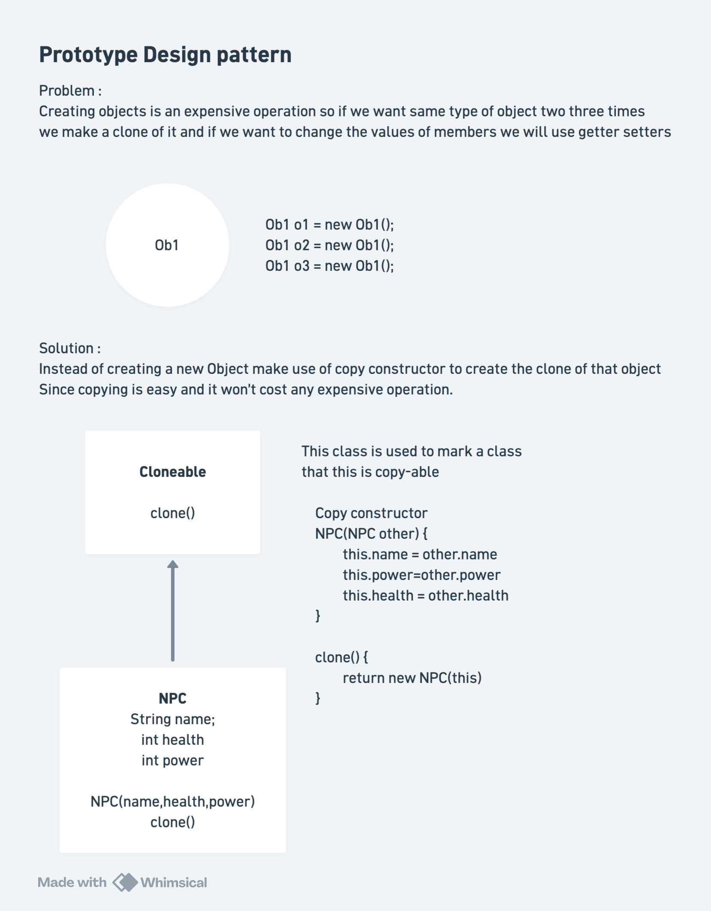

# Prototype Design Pattern

## Definition

The **Prototype Design Pattern** is a creational design pattern that enables creating new objects by copying an existing object (prototype) rather than creating from scratch. It allows you to create objects without knowing their exact classes or complex construction logic.

## Core Philosophy

**Main Insight:** Instead of expensive object creation every time, create one template object (prototype) and clone it when you need similar objects.

```
Without Prototype:
Create Object 1 (expensive) → Use
Create Object 2 (expensive) → Use
Create Object 3 (expensive) → Use

With Prototype:
Create Template (expensive) → Done once
Clone Template → Fast copy
Clone Template → Fast copy
Clone Template → Fast copy
```

---

## Problem Statement (Interview Context)

### The Challenge: Expensive Object Creation

**Scenario:** You're building a game where you need to create many NPCs (Non-Player Characters). Creating each NPC from scratch is expensive:

```java
// ❌ BAD: Creating expensive objects repeatedly
NPC alien1 = new NPC("Alien", 30, 5, 2);  // DB calls, complex calc, expensive!
NPC alien2 = new NPC("Alien", 30, 5, 2);  // Same operation again!
NPC alien3 = new NPC("Alien", 30, 5, 2);  // Same operation again!
NPC alien4 = new NPC("Alien", 30, 5, 2);  // Same operation again!

// If you need 1000 aliens:
for (int i = 0; i < 1000; i++) {
    NPC alien = new NPC("Alien", 30, 5, 2);  // 1000x expensive setup!
}
```

**Problems:**
1. **Expensive Construction**: Each NPC creation calls DB, runs complex calculations, loads resources
2. **Repeated Work**: Creating 1000 "Alien" NPCs does same work 1000 times
3. **Performance Impact**: Game frame rate drops during NPC creation
4. **Memory Inefficiency**: Duplicate data for identical NPCs
5. **Wasteful Computation**: Repeated calculations for same values

**Real Construction Cost:**
```java
public NPC(String name, int health, int attack, int defense) {
    // call DB          ← Expensive!
    // complex calc     ← Expensive!
    this.name = name;
    this.health = health;
    this.attack = attack;
    this.defense = defense;
}
```

### Solution: Prototype Pattern

```java
// ✅ GOOD: Create template once, clone many times
NPC templateAlien = new NPC("Alien", 30, 5, 2);  // Create once (expensive)

// Clone is cheap operation (just copy values)
NPC alien1 = (NPC)templateAlien.clone();
NPC alien2 = (NPC)templateAlien.clone();
NPC alien3 = (NPC)templateAlien.clone();
// ... 997 more clones (very fast)

// Customize as needed
alien1.setName("Alien1");
alien2.setName("Alien2");
alien3.setName("Alien3");
```

**Benefits:**
- ✅ Expensive construction happens once
- ✅ Cloning is fast (just copy fields)
- ✅ 1000x performance improvement
- ✅ Cleaner code (clone + setters)
- ✅ Flexible customization after cloning

---

# Quick Notes and Diagram



## Architecture & Components

### 1. Cloneable Interface

Marks objects as cloneable:

```java
interface Cloneable {
    Cloneable clone();  // Return a copy
}
```

**Responsibilities:**
- Define cloning contract
- Enable polymorphic cloning
- Type-safe clone method

**Key Point:** Returning interface type (not concrete) allows polymorphic cloning.

### 2. Prototype Class (NPC)

The object to be cloned:

```java
class NPC implements Cloneable {
    public String name;
    public int health;
    public int attack;
    public int defense;
    
    // Template constructor (expensive)
    public NPC(String name, int health, int attack, int defense) {
        // call DB
        // complex calc
        this.name = name;
        this.health = health;
        this.attack = attack;
        this.defense = defense;
    }
    
    // Copy constructor (cheap, just copies fields)
    public NPC(NPC first) {
        this.name = first.name;
        this.health = first.health;
        this.attack = first.attack;
        this.defense = first.defense;
    }
    
    // Clone method (uses copy constructor)
    @Override
    public Cloneable clone() {
        return new NPC(this);  // Delegate to copy constructor
    }
    
    // Setters for customization
    public void setName(String n) { name = n; }
    public void setHealth(int h) { health = h; }
    public void setAttack(int a) { attack = a; }
    public void setDefense(int d) { defense = d; }
}
```

**Key Components:**

**1. Constructor (Template Creation)**
```java
public NPC(String name, int health, int attack, int defense) {
    // Expensive: DB calls, calculations
    // Happens once per unique NPC type
}
```

**2. Copy Constructor (Fast Cloning)**
```java
public NPC(NPC first) {
    // Fast: Just copy fields
    this.name = first.name;
    this.health = first.health;
    this.attack = first.attack;
    this.defense = first.defense;
}
```

**3. Clone Method (Encapsulation)**
```java
public Cloneable clone() {
    return new NPC(this);  // Uses copy constructor
}
```

**4. Setters (Customization)**
```java
public void setName(String n) { name = n; }
public void setHealth(int h) { health = h; }
// ... allows tweaking cloned objects
```

---

## How It Works: Step-by-Step

### Scenario: Creating 1000 Alien NPCs

**Step 1: Create Template (One-time expensive operation)**
```java
NPC alienTemplate = new NPC("Alien", 30, 5, 2);
// Calls DB, runs calculations
// Print: "Setting up template NPC 'Alien'"
```

**Step 2: Clone Template (Fast, repeated operation)**
```java
for (int i = 0; i < 1000; i++) {
    NPC clone = (NPC)alienTemplate.clone();
    // Uses copy constructor
    // Just copies: "Alien", 30, 5, 2
    // NO DB calls, NO calculations
    // VERY fast!
}
```

**Step 3: Customize Clones**
```java
NPC alien1 = (NPC)alienTemplate.clone();
alien1.setName("Alien1");
alien1.setHealth(50);  // Stronger variant

NPC alien2 = (NPC)alienTemplate.clone();
alien2.setName("Alien2");
// Uses default stats

NPC alien3 = (NPC)alienTemplate.clone();
alien3.setAttack(100);  // Special variant
alien3.setDefense(30);
```

**Result:**
```
Original Template:
  NPC Alien [HP=30 ATK=5 DEF=2]

Clones (derived from template):
  NPC Alien1 [HP=50 ATK=5 DEF=2]
  NPC Alien2 [HP=30 ATK=5 DEF=2]
  NPC Alien3 [HP=30 ATK=100 DEF=30]
```

---

## Interview Deep Dive

### Q1: What's the difference between Copy Constructor and Clone method?

**Answer:**

| Aspect | Copy Constructor | Clone Method |
|--------|---|---|
| **Purpose** | Create a copy internally | Provide external copying interface |
| **Type Safety** | Type-checked at compile time | Requires cast at runtime |
| **Polymorphism** | No polymorphism | Enables polymorphic copying |
| **Flexibility** | Direct type dependency | Interface-based (loosely coupled) |
| **Usage** | Internal use | Public API |
| **Signature** | `NPC(NPC other)` | `Cloneable clone()` |
| **Calling** | `new NPC(existing)` | `existing.clone()` |

**Example:**
```java
// Copy Constructor
NPC clone1 = new NPC(alienTemplate);  // Type known at compile time

// Clone Method (Polymorphic)
Cloneable clone2 = alienTemplate.clone();  // Type unknown until runtime
NPC clone2Downcasted = (NPC)clone2;   // Requires cast

// Array of different prototypes
Cloneable[] prototypes = {
    new NPC("Alien", 30, 5, 2),
    new NPC("Zombie", 50, 8, 1)
};

// Clone any of them polymorphically
for (Cloneable proto : prototypes) {
    Cloneable newClone = proto.clone();  // Works for all types!
}
```

---

### Q2: Why use Cloneable interface instead of just using copy constructor?

**Answer:**

**Copy Constructor Approach (Limited):**
```java
class NPC {
    public NPC(NPC other) { ... }
}

class Zombie {
    public Zombie(Zombie other) { ... }
}

// Can't clone polymorphically
Cloneable proto = getRandomPrototype();  // Could be NPC or Zombie
// proto.clone();  // ❌ Not available! Cloneable not defined!
```

**With Cloneable Interface (Flexible):**
```java
interface Cloneable {
    Cloneable clone();
}

class NPC implements Cloneable {
    public Cloneable clone() { ... }
}

class Zombie implements Cloneable {
    public Cloneable clone() { ... }
}

// Can clone polymorphically
Cloneable proto = getRandomPrototype();
Cloneable clone = proto.clone();  // ✅ Works for any Cloneable type!
```

**Benefits of Interface:**
- ✅ Polymorphic cloning
- ✅ Type abstraction
- ✅ Works with collections
- ✅ Extensible to new types
- ✅ Decoupled from specific classes

---

### Q3: What's the cost of cloning vs creating from scratch?

**Answer:**

**From Scratch (Every field initialized):**
```java
// Every NPC creation runs full constructor
NPC alien = new NPC("Alien", 30, 5, 2);
// - Database call: 100ms
// - Complex calculation: 50ms
// - Resource loading: 50ms
// Total: ~200ms per NPC
// For 1000 NPCs: 200 seconds! 😱
```

**With Cloning (Just copy fields):**
```java
// Template created once
NPC template = new NPC("Alien", 30, 5, 2);  // 200ms

// Clone is just field copying
NPC alien = (NPC)template.clone();
// - Copy String: negligible
// - Copy int: negligible
// Total: <1ms per NPC
// For 1000 NPCs: <1 second! ✅
```

**Complexity Comparison:**
```
Creating from scratch: O(complex_setup) × O(n)
Cloning:              O(complex_setup) × O(1) + O(copy) × O(n)
                    = O(complex_setup) + O(n)
```

**Real-World Numbers:**
```
Loading texture (from scratch):     1000ms
Cloning texture reference:          <1ms

Loading complex 3D model (scratch): 5000ms
Cloning model reference:            <1ms

Calculation algorithm (scratch):    500ms
Cloning result:                     <1ms
```

---

### Q4: How do you handle deep vs shallow copy?

**Answer:**

**Shallow Copy (Current Implementation):**
```java
public NPC(NPC other) {
    this.name = other.name;           // String copied (immutable, OK)
    this.health = other.health;       // int copied (value type, OK)
    this.attack = other.attack;
    this.defense = other.defense;
}
```

**When Shallow Copy Is OK:**
```java
// Immutable types and primitives
String name;        // ✅ Immutable (safe to share)
int health;         // ✅ Value type (automatically copied)
int attack;         // ✅ Value type
```

**Problem with Shallow Copy:**
```java
class NPC {
    public String name;
    public int[] inventory;  // Mutable reference type!
    
    public NPC(NPC other) {
        this.name = other.name;
        this.inventory = other.inventory;  // ❌ SHALLOW: Same reference!
    }
}

NPC template = new NPC("Alien", new int[]{1, 2, 3});
NPC clone = (NPC)template.clone();

clone.inventory[0] = 999;  // Modifies template too!

System.out.println(template.inventory[0]);  // Also 999! ❌ Bug!
```

**Deep Copy Solution:**
```java
class NPC {
    public String name;
    public int[] inventory;
    
    // Deep copy constructor
    public NPC(NPC other) {
        this.name = other.name;
        this.inventory = other.inventory.clone();  // ✅ DEEP: New array!
    }
}

NPC template = new NPC("Alien", new int[]{1, 2, 3});
NPC clone = (NPC)template.clone();

clone.inventory[0] = 999;  // Only modifies clone

System.out.println(template.inventory[0]);  // Still 1 ✅ Works!
```

**When to Use Deep Copy:**
```
- Lists
- Arrays
- Other Cloneable objects
- Any mutable types
```

---

### Q5: When should you use Prototype vs Factory Pattern?

**Answer:**

| Aspect | Prototype | Factory |
|--------|-----------|---------|
| **Creation** | Clone existing object | Create new instance |
| **Configuration** | Template + customization | Constructor parameters |
| **Cost** | Cheap (cloning) | Expensive (construction) |
| **Complexity** | Template-based | Logic-based |
| **State** | Copies state | Initializes state |
| **Use Case** | Similar objects exist | Different type groups |

**When to Use Prototype:**
```java
// Many similar objects, one template
NPC alienTemplate = new NPC(...);  // Expensive once
for (int i = 0; i < 10000; i++) {
    NPC alien = (NPC)alienTemplate.clone();  // Cheap
}
```

**When to Use Factory:**
```java
// Different object types
interface AnimalFactory {
    Animal create();
}

class DogFactory implements AnimalFactory {
    public Animal create() { return new Dog(); }
}

class CatFactory implements AnimalFactory {
    public Animal create() { return new Cat(); }
}
```

**Use Together:**
```java
// Factory creates initial prototypes
AnimalFactory factory = new DogFactory();
Animal dogTemplate = factory.create();  // Create template

// Prototype clones for bulk creation
for (int i = 0; i < 1000; i++) {
    Animal dog = (Animal)dogTemplate.clone();
}
```

---

### Q6: How to handle registration of different prototypes?

**Answer:**

**Without Registry:**
```java
// Must remember each prototype
NPC alienTemplate = new NPC("Alien", 30, 5, 2);
NPC zombieTemplate = new NPC("Zombie", 50, 8, 1);
NPC goblinTemplate = new NPC("Goblin", 20, 4, 3);

// Hard to manage, easy to forget
```

**With Prototype Registry:**
```java
class PrototypeRegistry {
    private Map<String, Cloneable> prototypes = new HashMap<>();
    
    public void register(String name, Cloneable prototype) {
        prototypes.put(name, prototype);
    }
    
    public Cloneable getClone(String name) {
        Cloneable proto = prototypes.get(name);
        if (proto == null) {
            throw new RuntimeException("Prototype not found: " + name);
        }
        return proto.clone();
    }
}

// Usage
registry.register("Alien", new NPC("Alien", 30, 5, 2));
registry.register("Zombie", new NPC("Zombie", 50, 8, 1));
registry.register("Goblin", new NPC("Goblin", 20, 4, 3));

// Easy to use
NPC alien1 = (NPC)registry.getClone("Alien");
NPC alien2 = (NPC)registry.getClone("Alien");
NPC zombie = (NPC)registry.getClone("Zombie");
```

---

### Q7: What are common mistakes with Prototype Pattern?

**Answer:**

**❌ Mistake 1: Forgetting the Copy Constructor**
```java
// Bad: No copy constructor
class NPC implements Cloneable {
    public Cloneable clone() {
        // What to copy into? No copy constructor!
    }
}

// Good: Has copy constructor
class NPC implements Cloneable {
    public NPC(NPC other) {
        // Copy constructor implemented
    }
    
    public Cloneable clone() {
        return new NPC(this);
    }
}
```

**❌ Mistake 2: Returning New Instance from Constructor**
```java
// Bad: Infinite recursion
public NPC(NPC other) {
    new NPC(other);  // Recursion!
}

// Good: Copy fields
public NPC(NPC other) {
    this.name = other.name;
    this.health = other.health;
}
```

**❌ Mistake 3: Not Implementing Cloneable**
```java
// Bad: Not implementing interface
class NPC {
    public Object clone() {  // Returns Object, requires cast
        return new NPC(this);
    }
}

// Good: Implements Cloneable
class NPC implements Cloneable {
    public Cloneable clone() {  // Returns Cloneable
        return new NPC(this);
    }
}
```

**❌ Mistake 4: Shallow Copy with Mutable Objects**
```java
// Bad: Lists not deep copied
private List<Item> items;
public NPC(NPC other) {
    this.items = other.items;  // Same list reference!
}

// Good: Deep copy
public NPC(NPC other) {
    this.items = new ArrayList<>(other.items);
}
```

**❌ Mistake 5: Returning Wrong Type**
```java
// Bad: Casting required everywhere
public Object clone() {
    return new NPC(this);
}
// Usage: NPC clone = (NPC)proto.clone();

// Good: Proper typing
public Cloneable clone() {
    return new NPC(this);
}
```

---

### Q8: How to freeze a prototype (prevent accidental modification)?

**Answer:**

**Immutable Prototype:**
```java
class ImmutableNPC implements Cloneable {
    private final String name;      // final
    private final int health;       // final
    private final int attack;       // final
    private final int defense;      // final
    
    public ImmutableNPC(String name, int h, int a, int d) {
        this.name = name;
        this.health = h;
        this.attack = a;
        this.defense = d;
    }
    
    // No setters!
    
    public Cloneable clone() {
        return new ImmutableNPC(name, health, attack, defense);
    }
    
    // Methods that return modified versions
    public ImmutableNPC withName(String newName) {
        return new ImmutableNPC(newName, health, attack, defense);
    }
}

// Usage
NPC template = new ImmutableNPC("Alien", 30, 5, 2);
NPC clone = template.clone();
// clone.setHealth(100);  // ❌ No setters available!

// Must create new version
NPC stronger = template.withAttack(100);
```

**With Defensive Copy:**
```java
public Cloneable clone() {
    // Create defensive copy, can't affect template
    return new NPC(this);
}

// Original unchanged
NPC template = getTemplate();
NPC clone = (NPC)template.clone();
clone.setAttack(999);  // Affects only clone

template.describe();  // Still original stats ✅
```

---

### Q9: Performance implications of deep vs shallow copy?

**Answer:**

**Shallow Copy (Fast but risky):**
```java
public NPC(NPC other) {
    this.name = other.name;              // O(1) - reference copy
    this.health = other.health;          // O(1) - int copy
    this.attack = other.attack;          // O(1)
    this.defense = other.defense;        // O(1)
}
// Total: O(1) per clone - VERY FAST

// Cost: Risk of shared mutable state
```

**Deep Copy (Slower but safe):**
```java
public NPC(NPC other) {
    this.name = new String(other.name);           // O(n) - string length
    this.health = other.health;
    this.attack = other.attack;
    this.defense = other.defense;
    this.inventory = other.inventory.clone();     // O(n) - array size
    this.skills = new ArrayList<>(other.skills);  // O(n) - list size
}
// Total: O(n) where n = size of mutable collections

// Cost: Slower, but completely safe
```

**Hybrid Approach:**
```java
public NPC(NPC other) {
    // Shallow copy immutable/primitive
    this.name = other.name;        // String is immutable, OK
    this.health = other.health;    // Int is value type, OK
    
    // Deep copy only mutable collections
    this.inventory = new int[other.inventory.length];
    System.arraycopy(other.inventory, 0, this.inventory, 0, other.inventory.length);
}
// Balanced: Good performance + safety
```

**When to Use Each:**
- **Shallow**: Primitives, immutable types only
- **Deep**: Mutable collections, complex objects
- **Hybrid**: Mix based on type

---

### Q10: How to handle circular references in deep copy?

**Answer:**

**Problem:**
```java
class Node {
    public String data;
    public Node next;
    
    public Node(Node other) {
        this.data = other.data;
        this.next = new Node(other.next);  // ❌ Infinite loop if circular!
    }
}

// Circular linked list
Node n1 = new Node("A");
Node n2 = new Node("B");
n1.next = n2;
n2.next = n1;  // Circular!

Node clone = new Node(n1);  // ❌ Stack overflow!
```

**Solution 1: Track Already-Cloned Objects**
```java
public Node deepClone() {
    Map<Node, Node> cloned = new HashMap<>();
    return clone(this, cloned);
}

private Node clone(Node original, Map<Node, Node> cloned) {
    if (original == null) return null;
    
    // Already cloned this node
    if (cloned.containsKey(original)) {
        return cloned.get(original);
    }
    
    // Create new node
    Node newNode = new Node(original.data);
    cloned.put(original, newNode);  // Mark as cloned
    
    newNode.next = clone(original.next, cloned);
    
    return newNode;
}
```

**Solution 2: Limit Depth**
```java
public Node deepClone(int maxDepth) {
    return clone(this, 0, maxDepth);
}

private Node clone(Node original, int depth, int maxDepth) {
    if (original == null || depth >= maxDepth) {
        return null;
    }
    
    Node newNode = new Node(original.data);
    newNode.next = clone(original.next, depth + 1, maxDepth);
    return newNode;
}
```

---

## Real-World Use Cases

### 1. Game Development (Primary Use Case)

```java
// Create NPC templates once
NPC alienTemplate = new NPC("Alien", 30, 5, 2);
NPC zombieTemplate = new NPC("Zombie", 50, 8, 1);

// Clone for every enemy instance
for (int i = 0; i < 10000; i++) {
    NPC enemy = (NPC)random.nextBoolean() 
        ? alienTemplate.clone() 
        : zombieTemplate.clone();
    
    // Customize for this instance
    enemy.setName(enemy.getName() + i);
    enemies.add(enemy);
}
```

### 2. Document Templates

```java
// Create template document
Document template = new Document("Report");
template.addSection("Summary");
template.addSection("Details");

// Clone for each new report
for (Client client : clients) {
    Document doc = (Document)template.clone();
    doc.setTitle("Report for " + client.getName());
    doc.setDate(new Date());
    reports.add(doc);
}
```

### 3. Database Record Copying

```java
// Cache database query result as template
User userTemplate = database.query("SELECT * FROM users WHERE id=1");

// Clone template for testing/processing
User testUser1 = (User)userTemplate.clone();
User testUser2 = (User)userTemplate.clone();

testUser1.setEmail("test1@example.com");
testUser2.setEmail("test2@example.com");
```

### 4. UI Component Duplication

```java
// Create button template
Button buttonTemplate = new Button("Click me");
buttonTemplate.setStyle("blue");
buttonTemplate.setSize(100, 50);

// Clone for multiple panels
for (int i = 0; i < 10; i++) {
    Button newButton = (Button)buttonTemplate.clone();
    newButton.setPosition(100 + i*50, 100);
    panel.add(newButton);
}
```

### 5. Network Configuration Templates

```java
// Template configuration
ServerConfig template = new ServerConfig();
template.setHost("localhost");
template.setPort(8080);
template.setThreadPool(10);

// Clone for different environments
ServerConfig devConfig = (ServerConfig)template.clone();
devConfig.setHost("dev.example.com");

ServerConfig prodConfig = (ServerConfig)template.clone();
prodConfig.setHost("prod.example.com");
prodConfig.setThreadPool(100);
```

---

## Advantages

✅ **Performance Optimization**
- Cloning much faster than full construction
- Avoids expensive DB calls, calculations
- Significant speedup for bulk object creation

✅ **Memory Efficiency**
- Shared template reduces memory footprint for immutable parts
- Avoids duplicate computation storage

✅ **Code Simplicity**
- Clone + setters cleaner than multiple constructors
- Avoids telescoping constructor problem
- Natural way to create variations

✅ **Decoupling**
- Client doesn't need to know complex construction logic
- Can clone without understanding internals
- Abstracts creation complexity

✅ **Polymorphic Copying**
- Clone different types through same interface
- Works with collections of mixed types
- Runtime type flexibility

✅ **State Preservation**
- Cloned object has same state as template
- Good for creating default instances with state
- Template acts as configuration

✅ **Lazy Initialization**
- Can defer expensive operations
- Clone only what's needed
- Progressive enhancement possible

---

## Disadvantages

❌ **Deep Copy Complexity**
- Handling deep copies is complex
- Must manage circular references
- Recursive copying can be error-prone

❌ **Performance Overhead (Sometimes)**
- Cloning still takes time if many mutable objects
- Deep copy can be as expensive as construction
- Extra parameter passing and assignments

❌ **Type Casting Required**
- If returning interface type, casting needed at call site
- Runtime type errors possible
- Loss of compile-time type safety

❌ **Mutable State Shared Issues**
- Shallow copy shares mutable references
- Can cause unexpected bugs
- Circular references problematic

❌ **Hidden Dependencies**
- Template modifications affect all clones (if same reference)
- Can be confusing if not careful
- State interdependencies hidden

❌ **Not Suitable for All Domains**
- Requires pre-created template
- Overkill for simple objects
- Unnecessary complexity if no performance gain

❌ **Thread Safety Concerns**
- Template must be thread-safe if shared
- Cloning might not be atomic
- Concurrent modification issues possible

---

## When to Use Prototype Pattern

✅ **Use When:**
- Creating many similar objects is expensive
- Object construction involves complex logic
- Need bulk creation with minor variations
- Template-based approach makes sense
- Performance is critical
- Multiple objects with similar state
- Copying state is cheaper than computing

❌ **Avoid When:**
- Only creating few objects
- Construction is fast and simple
- No shared template concept
- Deep copy would be as expensive
- Simplicity is priority
- Mutable state changes frequently
- Circular references unavoidable

---

## Design Principles

### SRP (Single Responsibility)
```
✅ Followed:
- NPC: Represents an NPC with its data
- Cloneable: Defines cloning interface
- Copy constructor: Handles copying logic
- Each has one responsibility
```

### OCP (Open/Closed)
```
✅ Followed:
- Can add new prototypeable types
- Don't modify existing code
- Interface-based extension
```

### LSP (Liskov Substitution)
```
✅ Followed:
- Any Cloneable can be cloned
- Result is valid instance
- Substitutable anywhere Cloneable used
```

---

## Comparison with Alternatives

| Pattern | Copies of Objects | Performance | Complexity | When to Use |
|---------|---|---|---|---|
| **Prototype** | One template + clones | Very fast | Medium | Many similar objects, expensive creation |
| **Factory** | Creates from specs | Normal | Medium | Different object types needed |
| **Builder** | Builds customized | Normal | High | Complex construction process |
| **Direct Instantiation** | Each from scratch | Slow | Low | Few objects, simple creation |

---

## Time & Space Complexity

| Operation | Time | Space | Notes |
|-----------|------|-------|-------|
| Create template | O(setup) | O(setup) | Expensive, one-time |
| Shallow clone | O(1) | O(1) | Just copy references |
| Deep clone | O(n) | O(n) | n = size of mutable objects |
| Clone array | O(n) | O(n) | Arrays must be copied element-wise |
| Clone circular | O(n) with map | O(n) | Need to track visited nodes |

---

## Common Implementation Issues

### ❌ Issue 1: Forgotten Copy Constructor

```java
// ❌ BAD: No copy constructor
class NPC implements Cloneable {
    public Cloneable clone() {
        return new NPC();  // Won't remember state!
    }
}

// ✅ GOOD: Has copy constructor
class NPC implements Cloneable {
    public NPC(NPC other) {
        this.name = other.name;
        // ... copy all fields
    }
    
    public Cloneable clone() {
        return new NPC(this);
    }
}
```

### ❌ Issue 2: Shallow Copy Bug

```java
// ❌ BAD: Mutable lists not copied
public NPC(NPC other) {
    this.skills = other.skills;  // Same list!
}

clone.skills.add(new Skill("Fire"));
template.skills.size();  // Also increased! Bug!

// ✅ GOOD: Deep copy mutable objects
public NPC(NPC other) {
    this.skills = new ArrayList<>(other.skills);
}
```

### ❌ Issue 3: Infinite Recursion

```java
// ❌ BAD: Infinite loop
public NPC(NPC other) {
    NPC copy = new NPC(other);  // Calls this constructor again!
}

// ✅ GOOD: Copy fields directly
public NPC(NPC other) {
    this.name = other.name;
    // Field-by-field copy
}
```

---

## Interview Scenario

**Interviewer:** "Design a game where enemies spawn frequently. Creating each enemy involves loading 3D models, textures, and AI scripts (expensive). You need to spawn 10,000 enemies per level efficiently."

**Good Answer Structure:**

1. **Identify the Problem:**
   - Enemy creation expensive (load models, textures, scripts)
   - Spawning 10,000 enemies means 10,000× expensive operations
   - Performance bottleneck

2. **Recognize Template Opportunity:**
   - Each enemy type (Orc, Goblin, Troll) is similar
   - Can create template once
   - Spawn instances via cloning

3. **Design with Prototype:**
   ```java
   // Create template once (expensive)
   Enemy orcTemplate = new Enemy("Orc", "orc_model.obj", "orc_texture.png", aiScript);
   
   // Spawn enemies via cloning (fast)
   for (int i = 0; i < 10000; i++) {
       Enemy enemy = (Enemy)orcTemplate.clone();
       enemy.setPosition(random.nextInt(1000), random.nextInt(1000));
       enemy.setName("Orc" + i);
       level.addEnemy(enemy);
   }
   ```

4. **Explain Benefits:**
   - ✅ First enemy creation: 500ms (loads everything)
   - ✅ Subsequent clones: <1ms each
   - ✅ Total: 500ms + (9999 × 1ms) ≈ 10 seconds vs original 5,000 seconds
   - ✅ 500× performance improvement!

5. **Handle Deep Copy:**
   - Position: Unique per instance (shallow OK)
   - Model/Texture: Shared reference (same resource)
   - AI Script: Shared reference (same logic)
   - Name: Unique per instance (shallow OK)

6. **Implementation:**
   ```java
   interface ICloneable {
       Object clone();
   }
   
   class Enemy implements ICloneable {
       // Use copy constructor to handle cloning
   }
   ```

---

## Summary Table: Key Concepts

| Concept | Explanation |
|---------|------------|
| **Template** | Original expensive-to-create object |
| **Clone** | Copy of template |
| **Copy Constructor** | Constructor that copies from another instance |
| **Clone Method** | Public interface for creating copies |
| **Shallow Copy** | Copy only references (primitives + immutable types) |
| **Deep Copy** | Copy all data including mutable objects |
| **Prototype Registry** | Central storage for templates |

---

The diagram shows:

**Problem Section:**
- Creating Obj o1: "Obj o1 = new Obj1()"
- Statement: "Creating objects is an expensive operation"
- Solution needed: Instead of creating multiple objects with expensive operations, clone one template

**Solution Section:**
- Cloneable Interface (marks copyable objects):
  - Single abstract method: `clone()`
  - Enables marking classes as cloneable

- NPC Class (implements Cloneable):
  - Fields: String name, int health, int power
  - Constructor: `NPC(name, health, power)` - expensive template creation
  - Copy Constructor: `NPC(NPC other)` - copies all fields from template
    - `this.name = other.name`
    - `this.power = other.power`
    - `this.health = other.health`
  - Clone Method: `clone()` returns new instance using copy constructor: `return new NPC(this)`

**Flow:**
1. Create template: `new NPC(name, health, power)` - expensive, runs setup
2. Clone template multiple times: `clone()` - uses copy constructor, very fast
3. Customize clones: Use setters to modify individual instances

**Key Relationships:**
- NPC "is a" Cloneable (implements interface)
- NPC has copy constructor for cloning
- Clone method encapsulates the copying operation
- Setters allow customization after cloning

---

## Key Interview Takeaways

1. **Purpose**: Avoid expensive object creation by cloning templates
2. **Two Constructors**: Template constructor (expensive) + copy constructor (cheap)
3. **Cloneable Interface**: Enables polymorphic cloning of different types
4. **Performance**: Significant speedup for bulk object creation
5. **Customization**: Clone + setters for variations
6. **Deep vs Shallow**: Know when each is appropriate
7. **Circular References**: Handle with tracking maps if needed
8. **Registration**: Use registry to manage multiple prototypes
9. **Real-World**: Games, documents, UI, database records
10. **Trade-offs**: Easy for simple objects; complex for mutable collections

---

## When to Mention in Interview

✅ **Mention When:**
- Discussing performance optimization
- Creating bulk instances of similar objects
- Avoiding expensive initialization
- Object pools or object recycling
- Games or graphics applications
- Template-based systems

❌ **Don't Over-Use:**
- Simple objects with cheap construction
- When direct instantiation is clearer
- In domains without template concept
- Deep copy would be as expensive

