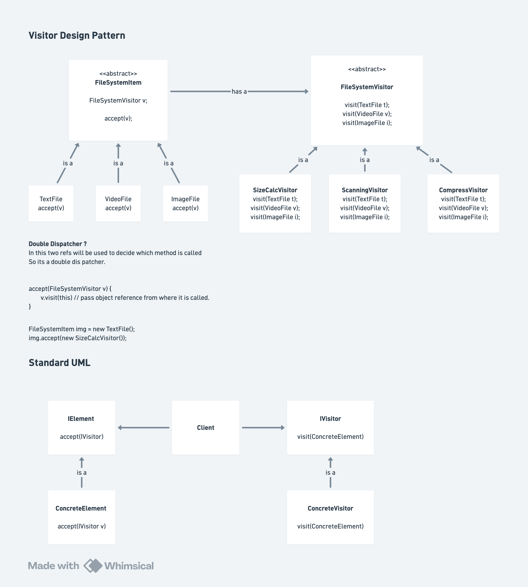

# Visitor Design Pattern

## Definition

The **Visitor Design Pattern** is a behavioral design pattern that represents an operation to be performed on the elements of an object structure. It allows you to define new operations without changing the classes of the elements on which it operates. The pattern enables separating operations from the objects they operate on using a technique called **Double Dispatch**.

## Core Philosophy

**Main Insight:** Separate the **structure of objects** from the **operations performed on them**.

Instead of adding methods to each object class for every possible operation, create `Visitor` objects that can traverse the object structure and perform operations.

```
Without Visitor (Tight Coupling):
FileSystem ← TextFile.calculateSize(), TextFile.compress(), TextFile.scan()
         ← VideoFile.calculateSize(), VideoFile.compress(), VideoFile.scan()
         ← ImageFile.calculateSize(), ImageFile.compress(), ImageFile.scan()
(Each file type has methods for every operation - code bloat!)

With Visitor (Loose Coupling):
FileSystem ← TextFile.accept(Visitor)
         ← VideoFile.accept(Visitor)
         ← ImageFile.accept(Visitor)

Visitors:
├── SizeCalculationVisitor
├── CompressionVisitor
└── VirusScanningVisitor
(Each visitor handles one operation across all file types)
```

---

## Problem Statement (Interview Context)

### The Challenge: Adding Operations to Fixed Structure

**Scenario:** You have a file system with different file types (TextFile, ImageFile, VideoFile). You need to support multiple operations:
- Calculate file size
- Compress files
- Scan for viruses
- Convert format
- Extract metadata
- Backup files
- ...and many more future operations

**Without Visitor Pattern:**

```java
// ❌ BAD: Each file type needs a method for EVERY operation
class TextFile {
    public int calculateSize() { }
    public void compress() { }
    public void scan() { }
    public void convert() { }
    public void extractMetadata() { }
    public void backup() { }
    // Add more operations → Add more methods!
}

class ImageFile {
    public int calculateSize() { }
    public void compress() { }
    public void scan() { }
    public void convert() { }
    public void extractMetadata() { }
    public void backup() { }
    // Same methods repeated!
}

class VideoFile {
    public int calculateSize() { }
    public void compress() { }
    public void scan() { }
    public void convert() { }
    public void extractMetadata() { }
    public void backup() { }
    // And again...
}
```

**Problems:**
1. **Code Duplication**: Each file type repeats same operation methods
2. **SRP Violation**: File classes do too much (storage + all operations)
3. **Hard to Extend**: Adding new operation → modify all file classes
4. **Class Bloat**: Each class becomes massive as operations grow
5. **Open/Closed Violation**: Closed for new operations (need to modify)
6. **Logic Scattered**: Operation logic spread across multiple classes

**With Visitor Pattern:**

```java
// ✅ GOOD: Visitors encapsulate operations
interface FileSystemVisitor {
    void visit(TextFile f);
    void visit(ImageFile f);
    void visit(VideoFile f);
}

// File types only accept visitors
abstract class FileSystemItem {
    abstract void accept(FileSystemVisitor v);
}

// Separate visitor for each operation
class SizeCalculationVisitor implements FileSystemVisitor {
    void visit(TextFile f) { /* size logic for text */ }
    void visit(ImageFile f) { /* size logic for image */ }
    void visit(VideoFile f) { /* size logic for video */ }
}

class CompressionVisitor implements FileSystemVisitor {
    void visit(TextFile f) { /* compress text */ }
    void visit(ImageFile f) { /* compress image */ }
    void visit(VideoFile f) { /* compress video */ }
}

// Adding new operation? Just add new visitor!
class BackupVisitor implements FileSystemVisitor {
    void visit(TextFile f) { /* backup text */ }
    void visit(ImageFile f) { /* backup image */ }
    void visit(VideoFile f) { /* backup video */ }
}
```

**Benefits:**
- ✅ No code duplication
- ✅ File classes stay simple (only accept visitors)
- ✅ Easy to add operations (new Visitor class)
- ✅ Open/Closed Principle followed
- ✅ Operation logic centralized per operation
- ✅ SRP maintained (files store/manage, visitors operate)

---

## Core Concepts

### 1. Double Dispatch

**Traditional Single Dispatch:**
```java
// Just object type determines method
FileSystemItem file = new TextFile(...);
file.accept(visitor);  // Method based on file.getClass()
```

**Double Dispatch (Visitor Pattern):**
```java
// TWO things determine method:
// 1. File type (TextFile, ImageFile, VideoFile)
// 2. Visitor type (SizeCalculationVisitor, CompressionVisitor, etc.)

FileSystemItem file = new TextFile(...);
Visitor visitor = new SizeCalculationVisitor();

// Double dispatch:
// Step 1: file.accept(visitor) dispatches based on file type
// Step 2: visitor.visit(this) dispatches based on visitor type
file.accept(visitor);

// Result: TextFile + SizeCalculationVisitor = specific behavior
```

**Why Important?**
- Determines which `visit()` method to call based on BOTH types
- Enables different behavior for different file-visitor combinations
- Not possible with single dispatch alone
- This is the power behind Visitor Pattern!

### 2. Accept Method

**Purpose:** Entry point into the Visitor pattern

```java
abstract class FileSystemItem {
    abstract void accept(FileSystemVisitor v);
}

class TextFile extends FileSystemItem {
    @Override
    public void accept(FileSystemVisitor visitor) {
        visitor.visit(this);  // Pass 'this' (TextFile instance)
    }
}

class ImageFile extends FileSystemItem {
    @Override
    public void accept(FileSystemVisitor visitor) {
        visitor.visit(this);  // Pass 'this' (ImageFile instance)
    }
}
```

**Key Point:** `accept()` calls `visitor.visit()` with `this` as argument. The correct `visit()` method is selected at compile time based on `this` type.

### 3. Visitor Interface

Defines all visit methods (one per element type):

```java
interface FileSystemVisitor {
    void visit(TextFile f);      // Overload 1
    void visit(ImageFile f);     // Overload 2
    void visit(VideoFile f);     // Overload 3
}
```

**Key Point:** Method overloading! Same method name, different parameter types.

### 4. ConcreteVisitor

Implements operation for all element types:

```java
class SizeCalculationVisitor implements FileSystemVisitor {
    @Override
    public void visit(TextFile f) {
        System.out.println("Text file size: " + f.getContent().length());
    }
    
    @Override
    public void visit(ImageFile f) {
        System.out.println("Image file size: " + f.getWidth() * f.getHeight());
    }
    
    @Override
    public void visit(VideoFile f) {
        System.out.println("Video file size: " + f.getDuration() * f.getBitrate());
    }
}
```

**Key Point:** One visitor, all file types covered. Each method handles type-specific logic.

---

# Quick Notes and Diagram



---

## Architecture

### Component Relationships

```
Element Side:
├── FileSystemVisitor (interface)
│   └── Implemented by
│       ├── SizeCalculationVisitor
│       ├── CompressionVisitor
│       └── VirusScanningVisitor
│
Structure Side:
├── FileSystemItem (abstract)
│   ├── accept(Visitor)
│   └── Implemented by
│       ├── TextFile.accept()
│       ├── ImageFile.accept()
│       └── VideoFile.accept()
```

---

## Interaction Flow: Step-by-Step

### Scenario: Compress an Image File

**Step 1: Create Objects**
```java
FileSystemItem imgFile = new ImageFile("photo.jpg");
FileSystemVisitor compressor = new CompressionVisitor();
```

**Step 2: Accept the Visitor**
```java
imgFile.accept(compressor);
```

**Step 3: First Dispatch (Runtime - File Type)**
```
ImageFile.accept(compressor) is called
↓ (Runtime determines this is ImageFile)
```

**Step 4: Inside Accept, Call Visit**
```java
// In ImageFile.accept():
visitor.visit(this);  // Pass ImageFile instance
↓
// Call becomes:
compressor.visit(this);  // 'this' is ImageFile
```

**Step 5: Second Dispatch (Compile Time - Parameter Type)**
```
Compiler sees: visitor.visit(ImageFile instance)
↓ (Compile time knows this is ImageFile)
↓ Selects overloaded method for ImageFile
↓
CompressionVisitor.visit(ImageFile f) called
→ Compression logic for IMAGE files
```

**Output:**
```
Compressing IMAGE file: photo.jpg
```

### Complete Flow Diagram

```
imgFile.accept(compressor)
  ↓
ImageFile.accept(compressor)
  ↓
compressor.visit(this)
  ↓
CompressionVisitor.visit(ImageFile)  ← Correct method called!
  ↓
Compression logic for images
```

---

## Interview Deep Dive

### Q1: What is Double Dispatch and why is it important?

**Answer:**

Double Dispatch uses **two pieces of information** to determine which method to execute:

1. **First Dispatch (Runtime - Actual Object Type):**
   ```java
   FileSystemItem file = new TextFile(...);  // Actual type: TextFile
   file.accept(visitor);
   // At runtime, JVM knows 'file' is really a TextFile
   // Calls TextFile.accept()
   ```

2. **Second Dispatch (Compile Time - Parameter Type):**
   ```java
   // In TextFile.accept():
   visitor.visit(this);  // 'this' is a TextFile
   // Compiler sees parameter is TextFile
   // Selects: visitor.visit(TextFile)
   ```

**Why Important?**
- Without it, can't dispatch based on BOTH file type AND visitor type
- Enables behavior to vary based on both dimensions
- Core mechanism of Visitor Pattern

**Example:**
```
TextFile + SizeCalculationVisitor → Text size calculation
TextFile + CompressionVisitor → Text compression
ImageFile + SizeCalculationVisitor → Image size calculation
ImageFile + CompressionVisitor → Image compression
// Each combination → different behavior!
```

---

### Q2: Can you add a new file type without modifying existing visitors?

**Answer:** **NO!** This is actually a limitation of Visitor Pattern.

**The Problem:**
```java
// If you add a new file type:
class AudioFile extends FileSystemItem {
    @Override
    void accept(FileSystemVisitor v) {
        v.visit(this);  // But visitor interface has no visit(AudioFile)!
    }
}

// Visitor interface must change:
interface FileSystemVisitor {
    void visit(TextFile f);
    void visit(ImageFile f);
    void visit(VideoFile f);
    void visit(AudioFile f);  // ← NEW!
}

// ALL implementations must add this method:
class SizeCalculationVisitor implements FileSystemVisitor {
    void visit(TextFile f) { }
    void visit(ImageFile f) { }
    void visit(VideoFile f) { }
    void visit(AudioFile f) { }  // ← MUST ADD
}

class CompressionVisitor implements FileSystemVisitor {
    void visit(TextFile f) { }
    void visit(ImageFile f) { }
    void visit(VideoFile f) { }
    void visit(AudioFile f) { }  // ← MUST ADD
}
```

**Trade-off:**
- ✅ Easy to add NEW OPERATIONS (new visitors)
- ❌ Hard to add NEW ELEMENT TYPES (need to modify everything)

**Interview Point:** "Visitor trades extensibility in one dimension (operations) for inflexibility in another (element types). Choose Visitor when you have stable element types but frequently changing operations."

---

### Q3: How is this different from just adding methods to each class?

**Answer:**

| Aspect | Methods in Classes | Visitor Pattern |
|--------|---|---|
| **Adding Operation** | Modify each class (bad) | Create new visitor (good) |
| **Adding Element** | Add new class (good) | Modify all visitors (bad) |
| **Location of Logic** | Scattered (TextFile has size, compress, scan) | Centralized (SizeVisitor has all size logic) |
| **Separation** | Mixed concerns | Clear separation |
| **Reusability** | Operation mixed with element | Visitor can be applied to different structures |
| **SRP** | Violated (multiple reasons to change) | Maintained |

**Example:**
```
// Methods in Classes
class TextFile {
    int getSize() { return content.length(); }
    void compress() { /* text compression */ }
    void scan() { /* text scanning */ }
}

// Visitor Pattern
class SizeVisitor {
    void visit(TextFile f) { return f.getContent().length(); }
}
class CompressionVisitor {
    void visit(TextFile f) { /* text compression */ }
}
class ScanningVisitor {
    void visit(TextFile f) { /* text scanning */ }
}
```

When you add "Encrypt" operation:
- **Methods Approach:** Modify TextFile, ImageFile, VideoFile (3 changes)
- **Visitor:** Create EncryptionVisitor (1 new class)

---

### Q4: What if you need to traverse a complex object structure?

**Answer:** Visitor can be combined with Composite Pattern!

```java
// File system with directories (Composite)
abstract class FileSystemItem {
    abstract void accept(FileSystemVisitor v);
}

class File extends FileSystemItem {
    @Override
    void accept(FileSystemVisitor v) {
        v.visit(this);
    }
}

class Directory extends FileSystemItem {
    private List<FileSystemItem> children;
    
    @Override
    void accept(FileSystemVisitor v) {
        v.visit(this);  // Visit directory
        // Recursively visit children!
        for (FileSystemItem child : children) {
            child.accept(v);  // Each child accepts same visitor
        }
    }
}

// Usage:
Directory root = new Directory("C:");
root.add(new File("file.txt"));
root.add(new File("image.jpg"));

// Apply visitor to entire tree
root.accept(new SizeCalculationVisitor());
// Automatically calculates size for all files in tree!
```

**Power:** Single visitor traverses entire tree structure!

---

### Q5: How do you handle state across multiple visits?

**Answer:** Store state in visitor!

```java
class SizeCalculationVisitor implements FileSystemVisitor {
    private long totalSize = 0;  // ← Track total
    
    @Override
    public void visit(TextFile f) {
        long size = f.getContent().length();
        totalSize += size;
    }
    
    @Override
    public void visit(ImageFile f) {
        long size = f.getWidth() * f.getHeight() * 3;  // 3 bytes per pixel
        totalSize += size;
    }
    
    @Override
    public void visit(VideoFile f) {
        long size = f.getDuration() * f.getBitrate() / 8;
        totalSize += size;
    }
    
    public long getTotalSize() {
        return totalSize;
    }
}

// Usage:
SizeCalculationVisitor sizer = new SizeCalculationVisitor();
file1.accept(sizer);
file2.accept(sizer);
file3.accept(sizer);

System.out.println("Total: " + sizer.getTotalSize());  // Accumulated!
```

**Key Point:** Visitor maintains state across multiple accepts!

---

### Q6: What if you need to return values from visitor methods?

**Answer:** Make visit methods return values!

```java
// Original (void returns):
interface FileSystemVisitor {
    void visit(TextFile f);
    void visit(ImageFile f);
    void visit(VideoFile f);
}

// With return values:
interface SizeVisitor {
    long visit(TextFile f);
    long visit(ImageFile f);
    long visit(VideoFile f);
}

// Implementation:
class SizeCalculationVisitor implements SizeVisitor {
    @Override
    public long visit(TextFile f) {
        return f.getContent().length();
    }
    
    @Override
    public long visit(ImageFile f) {
        return f.getWidth() * f.getHeight() * 3;
    }
    
    @Override
    public long visit(VideoFile f) {
        return f.getDuration() * f.getBitrate() / 8;
    }
}

// Usage:
SizeCalculationVisitor sizer = new SizeCalculationVisitor();
long size = file.accept(sizer);  // ← Returns size!
```

---

### Q7: Can visitors maintain state between different operations?

**Answer:** Yes, use stateful visitors!

```java
class FileAnalysisVisitor implements FileSystemVisitor {
    private Map<String, Integer> fileTypeCounts = new HashMap<>();
    private long totalBytes = 0;
    private List<String> fileNames = new ArrayList<>();
    
    @Override
    public void visit(TextFile f) {
        fileTypeCounts.put("Text", fileTypeCounts.getOrDefault("Text", 0) + 1);
        totalBytes += f.getContent().length();
        fileNames.add(f.getName());
    }
    
    @Override
    public void visit(ImageFile f) {
        fileTypeCounts.put("Image", fileTypeCounts.getOrDefault("Image", 0) + 1);
        totalBytes += /* image size */;
        fileNames.add(f.getName());
    }
    
    // Getters for state
    public Map<String, Integer> getFileTypeCounts() { return fileTypeCounts; }
    public long getTotalBytes() { return totalBytes; }
    public List<String> getFileNames() { return fileNames; }
}

// Usage:
FileAnalysisVisitor analyzer = new FileAnalysisVisitor();
for (FileSystemItem file : files) {
    file.accept(analyzer);
}

System.out.println("File counts: " + analyzer.getFileTypeCounts());
System.out.println("Total size: " + analyzer.getTotalBytes());
System.out.println("Files: " + analyzer.getFileNames());
```

---

### Q8: What's the difference between Visitor and Strategy Pattern?

**Answer:**

| Aspect | Visitor | Strategy |
|--------|---------|----------|
| **Purpose** | Operations on multiple types | Algorithm selection |
| **Focus** | Multiple element types + multiple operations | Different implementations of same operation |
| **Structure** | Hierarchy of elements | Usually single object |
| **Dispatch** | Double dispatch | Polymorphism |
| **Use Case** | File system, AST, scene graphs | Sorting algorithms, payment methods |

**Example:**

```
Visitor:
FileSystem (multiple file types)
├── TextFile + SizeVisitor → Text size
├── TextFile + CompressionVisitor → Text compress
├── ImageFile + SizeVisitor → Image size
└── ImageFile + CompressionVisitor → Image compress

Strategy:
PaymentProcessor
├── CreditCardStrategy
├── PayPalStrategy
└── BitcoinStrategy
(Choose ONE strategy for payment)
```

---

### Q9: Can you apply multiple visitors to same object?

**Answer:** Yes! Compose them!

```java
FileSystemItem file = new ImageFile("photo.jpg");

// Apply multiple visitors in sequence
file.accept(new VirusScanningVisitor());
file.accept(new CompressionVisitor());
file.accept(new SizeCalculationVisitor());

// Each visitor operates independently
// Can also combine their results
```

**Advanced: Composite Visitor**
```java
class CompositeVisitor implements FileSystemVisitor {
    private List<FileSystemVisitor> visitors = new ArrayList<>();
    
    public void addVisitor(FileSystemVisitor v) {
        visitors.add(v);
    }
    
    @Override
    public void visit(TextFile f) {
        for (FileSystemVisitor v : visitors) {
            v.visit(f);
        }
    }
    
    @Override
    public void visit(ImageFile f) {
        for (FileSystemVisitor v : visitors) {
            v.visit(f);
        }
    }
    
    @Override
    public void visit(VideoFile f) {
        for (FileSystemVisitor v : visitors) {
            v.visit(f);
        }
    }
}

// Usage:
CompositeVisitor composite = new CompositeVisitor();
composite.addVisitor(new VirusScanningVisitor());
composite.addVisitor(new CompressionVisitor());
composite.addVisitor(new SizeCalculationVisitor());

file.accept(composite);  // All three visitors execute!
```

---

### Q10: What makes Visitor hard to understand?

**Answer:** Several aspects:

1. **Double Dispatch Confusion**
   - Two method calls to determine behavior
   - Not immediately obvious to beginners

2. **Method Overloading**
   - Same method name, different types
   - Requires understanding overload resolution

3. **Indirection**
   - File doesn't directly know operation
   - Logic hidden in separate classes
   - Harder to trace execution

4. **Adding Element Types is Hard**
   - Breaking change to interface
   - Must update all visitors
   - Not as flexible as it seems

5. **Backwards from Intuition**
   - Usually think: "Add operation to object"
   - Visitor: "Add object type to operation"
   - Mind-bender at first!

**Interview Point:** "Visitor is powerful but complex. Use for stable structures with changing operations. For frequently changing structures, consider alternatives."

---

## Real-World Use Cases

### 1. Compiler Code Generation

```java
// AST nodes
interface ASTNode {
    void accept(CodeGeneratorVisitor v);
}

// Different code generators
interface CodeGeneratorVisitor {
    void visit(BinaryOpNode n);
    void visit(FunctionNode n);
    void visit(VariableNode n);
}

// Concrete generators
class JavaCodeGenerator implements CodeGeneratorVisitor {
    void visit(BinaryOpNode n) { /* Java operators */ }
    void visit(FunctionNode n) { /* Java functions */ }
    void visit(VariableNode n) { /* Java variables */ }
}

class PythonCodeGenerator implements CodeGeneratorVisitor {
    void visit(BinaryOpNode n) { /* Python operators */ }
    void visit(FunctionNode n) { /* Python functions */ }
    void visit(VariableNode n) { /* Python variables */ }
}

class CppCodeGenerator implements CodeGeneratorVisitor {
    // ... C++ code generation
}
```

### 2. DOM/XML Processing

```java
// XML nodes
interface XMLNode {
    void accept(XMLVisitor v);
}

// Visitors
interface XMLVisitor {
    void visit(Element e);
    void visit(Text t);
    void visit(Comment c);
}

// Concrete visitors
class ValidationVisitor implements XMLVisitor { }
class PrettyPrinterVisitor implements XMLVisitor { }
class SchemaValidatorVisitor implements XMLVisitor { }
```

### 3. Graphics Rendering

```java
// Scene graph
interface SceneElement {
    void accept(RenderVisitor v);
}

// Visitors
interface RenderVisitor {
    void visit(Mesh m);
    void visit(Light l);
    void visit(Texture t);
}

class OpenGLRenderer implements RenderVisitor { }
class VulkanRenderer implements RenderVisitor { }
class RayTracer implements RenderVisitor { }
```

### 4. Tax Calculation System

```java
// Income types
interface IncomeSource {
    void accept(TaxCalculator v);
}

// Calculators
interface TaxCalculator {
    void visit(Salary s);
    void visit(Investment i);
    void visit(RealEstate r);
}

class IncomeTaxCalculator implements TaxCalculator { }
class CapitalGainsTaxCalculator implements TaxCalculator { }
```

### 5. Report Generation

```java
// Data elements
interface DataElement {
    void accept(ReportVisitor v);
}

// Visitors
interface ReportVisitor {
    void visit(Table t);
    void visit(Chart c);
    void visit(Paragraph p);
}

class PDFReportGenerator implements ReportVisitor { }
class HTMLReportGenerator implements ReportVisitor { }
class ExcelReportGenerator implements ReportVisitor { }
```

---

## Advantages

✅ **Open/Closed Principle**
- Open for new operations (new visitors)
- Closed for modification (elements stay same)

✅ **Single Responsibility**
- Elements: Store data and accept visitors
- Visitors: Perform operations
- Clear separation

✅ **Centralized Operation Logic**
- All logic for one operation in one visitor
- Easy to find and modify

✅ **Easy to Add Operations**
- Just create new visitor implementation
- No changes to element classes

✅ **Encapsulation**
- Element classes don't expose internal details
- Visitors access through interface

✅ **Multiple Operations on Same Structure**
- Apply different visitors to same tree
- Reuse element structure across domains

✅ **Complex Operations**
- Multi-step operations easy to implement
- Stateful visitors maintain context

---

## Disadvantages

❌ **Hard to Add New Element Types**
- Must modify visitor interface
- All visitors must implement new method
- Breaking change

❌ **Complexity**
- Double dispatch hard to understand
- More classes needed
- Indirection makes debugging harder

❌ **Encapsulation Compromise**
- Visitors need access to element internals
- Must expose data through methods/properties
- Can't hide implementation details

❌ **Performance Overhead**
- Extra method calls (accept + visit)
- Virtual dispatch adds cost
- Not suitable for performance-critical paths

❌ **Tight Coupling Between Visitors and Elements**
- Visitors depend on element structure
- Changing element interface breaks visitors
- Not as loosely coupled as it appears

❌ **Not Intuitive**
- Difficult for developers to understand
- Harder to maintain
- Steep learning curve

❌ **Limited to Accepting Visitors**
- Elements must implement accept()
- Can't retroactively add visitors to existing classes
- Requires access to source code

---

## When to Use Visitor Pattern

✅ **Use Visitor when:**
- Stable element types (add rarely)
- Frequently changing/adding operations
- Complex operations on object structure
- Multiple independent operations needed
- Want to centralize operation logic
- Need to apply different operations polymorphically

❌ **Avoid Visitor when:**
- Frequently adding new element types
- Simple operations (just add methods)
- Few operations (not worth extra complexity)
- Performance critical (overhead matters)
- Team unfamiliar with pattern
- Small, simple object structure

---

## Common Implementation Issues

### ❌ Issue 1: Not Implementing All Visit Methods

```java
// ❌ BAD: Incomplete implementation
class MyVisitor implements FileSystemVisitor {
    public void visit(TextFile f) {
        // Implementation
    }
    
    public void visit(ImageFile f) {
        // Missing VideoFile implementation!
    }
    // Compiler error - doesn't compile!
}

// ✅ GOOD: Implement all methods
class MyVisitor implements FileSystemVisitor {
    public void visit(TextFile f) { }
    public void visit(ImageFile f) { }
    public void visit(VideoFile f) { }  // All implemented
}
```

---

### ❌ Issue 2: Forgetting Accept in New Element

```java
// ❌ BAD: Element forgetting accept()
class AudioFile extends FileSystemItem {
    // Missing accept method!
}

// ✅ GOOD: Always implement accept()
class AudioFile extends FileSystemItem {
    @Override
    public void accept(FileSystemVisitor v) {
        v.visit(this);
    }
}
```

---

### ❌ Issue 3: Attempting Visitor Polymorphism Wrong

```java
// ❌ BAD: Treating visitors as generic
public <T extends FileSystemVisitor> void process(T visitor) {
    // Might not have all visit methods
}

// ✅ GOOD: Use specific interface
public void process(FileSystemVisitor visitor) {
    file.accept(visitor);
}
```

---

### ❌ Issue 4: Modifying Element Structure Inside Visitor

```java
// ❌ BAD: Visitor modifies during traversal
class DeletingVisitor implements FileSystemVisitor {
    public void visit(TextFile f) {
        directory.removeFile(f);  // Concurrent modification!
    }
}

// ✅ GOOD: Collect modifications, apply after
class DeletingVisitor implements FileSystemVisitor {
    private List<FileSystemItem> toDelete = new ArrayList<>();
    
    public void visit(TextFile f) {
        toDelete.add(f);  // Mark for deletion
    }
    
    public void executeDeletes() {
        for (FileSystemItem item : toDelete) {
            directory.remove(item);
        }
    }
}
```

---

## Time & Space Complexity

| Operation | Time | Space |
|-----------|------|-------|
| Visit single element | O(1) | O(1) |
| Process single element | O(1) | O(k) where k = visitor state |
| Traverse n elements | O(n) | O(n) in stack (recursion depth) |
| Add new operation | O(m) where m = element types | O(m) for new visitor class |

**Traversal with Composite:**
- **Time:** O(n) for n nodes
- **Space:** O(d) where d = max depth (call stack)

---

## Design Principles

### SRP (Single Responsibility Principle)
```
✅ Followed:
- Element: Store data, accept visitors
- Visitor: Perform operation
Each has one reason to change
```

### OCP (Open/Closed Principle)
```
✅ Partially:
- Open for new operations (new visitors)
- Closed for element modification
- BUT: Closed for new element types (must modify)
```

### LSP (Liskov Substitution Principle)
```
✅ Followed:
- All visitors implement same interface
- Can substitute any visitor for another
- Same polymorphic behavior
```

---

## Interview Scenario

**Interviewer:** "Design a file processing system. You need to support:
1. Calculating total file size (different for each type)
2. Compressing files (different for each type)
3. Scanning for viruses (different for each type)
4. Future operations (unknown)

You have stable file types (Text, Image, Video) but expect new operations."

**Good Answer:**

```java
// 1. Define structure (stable)
abstract class FileSystemItem {
    abstract void accept(FileSystemVisitor v);
}

class TextFile extends FileSystemItem { }
class ImageFile extends FileSystemItem { }
class VideoFile extends FileSystemItem { }

// 2. Define visitor interface
interface FileSystemVisitor {
    void visit(TextFile f);
    void visit(ImageFile f);
    void visit(VideoFile f);
}

// 3. Implement operations (extensible)
class SizeCalculator implements FileSystemVisitor {
    public void visit(TextFile f) { /* text size logic */ }
    public void visit(ImageFile f) { /* image size logic */ }
    public void visit(VideoFile f) { /* video size logic */ }
}

class Compressor implements FileSystemVisitor {
    public void visit(TextFile f) { /* text compression */ }
    public void visit(ImageFile f) { /* image compression */ }
    public void visit(VideoFile f) { /* video compression */ }
}

// 4. Future operation? Just add new visitor!
class VirusScanner implements FileSystemVisitor {
    public void visit(TextFile f) { /* scan text */ }
    public void visit(ImageFile f) { /* scan image */ }
    public void visit(VideoFile f) { /* scan video */ }
}

// 5. More operations? Create more visitors
class Encryptor implements FileSystemVisitor { }
class Formatter implements FileSystemVisitor { }
```

**Why This Works:**
- ✅ New operations easy (new visitor classes)
- ✅ Operation logic centralized
- ✅ Stable file types (rarely change)
- ✅ Clear separation of concerns
- ✅ Scales with operations, not elements

---


The diagram illustrates the complete Visitor Pattern architecture:

**Top Section - Example with File System:**

The example shows how to structure visitors for different operations:
- `FileSystemVisitor` - visitor interface with visit methods for each file type
- `SizeCalcVisitor`, `ScanningVisitor`, `CompressVisitor` - concrete visitors
- Each visitor implements logic for all file types (TextFile, VideoFile, ImageFile)

**Key Concept Shown:**
- Visitors contain type-specific implementations (TextFile, ImageFile, VideoFile handling)
- All visitors follow same interface contract
- Shows how multiple visitors can operate on same object structure

**Double Dispatch Mechanism:**
The diagram shows:
- `accept(FileSystemVisitor v)` - Element accepts a visitor
- `visit(TextFile)`, `visit(VideoFile)`, `visit(ImageFile)` - Visitor has overloaded methods for each type
- Step 1: File type determines accept() method called
- Step 2: Visitor type determines which visit() overload called
- Result: Correct behavior for file-visitor combination

**Bottom Section - Standard UML:**

Shows class hierarchy:
- **iElement interface:** `accept(iVisitor)`
  - **ConcreteElement:** implements accept()
  
- **iVisitor interface:** `visit(ConcreteElement)`
  - **ConcreteVisitor:** implements visit() for each element type

**Relationships:**
- Client creates elements and visitors
- Elements accept visitors
- Visitors visit elements
- One visitor, many element types (1:m relationship)

**Key Insight from Diagram:**
- Elements define `accept()` - entry point for visitors
- Visitors define `visit()` - specific operations for each element type
- Combination enables different operations without modifying element classes
- Adding new operation = new visitor implementation
- Adding new element type = modify all visitors (the limitation!)

---

## Key Interview Takeaways

1. **Purpose**: Separate operations from object structure
2. **Double Dispatch**: Two method calls determine behavior
3. **Key Components**: Element (accept), Visitor (visit), Concrete implementations
4. **Trade-off**: Easy operations, hard element types
5. **Open/Closed**: Open for operations, mostly closed for elements
6. **Scalability**: Grows with operations, not with element types
7. **Complexity**: Trade-off for flexibility
8. **Real-World**: Compilers, XML, graphics, reports
9. **Limitations**: Hard to add element types, performance overhead
10. **Alternatives**: Strategy Pattern, Observer Pattern, just adding methods

---

## When to Mention in Interview

✅ **Mention Visitor when:**
- Asked about adding operations to stable structure
- Discussing compiler/interpreter design
- Designing document processing systems
- Need multiple independent operations
- Talking about Open/Closed Principle

❌ **Don't over-complicate with Visitor:**
- Simple 1-2 operations
- Frequently changing element types
- When Strategy or Observer is better fit
- When simplicity is priority

