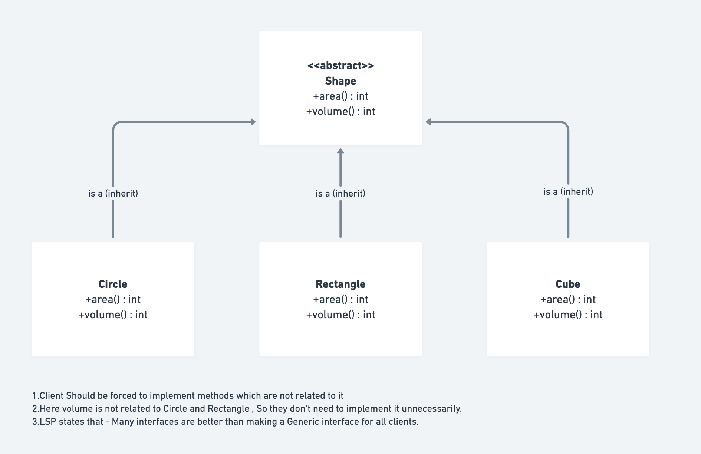
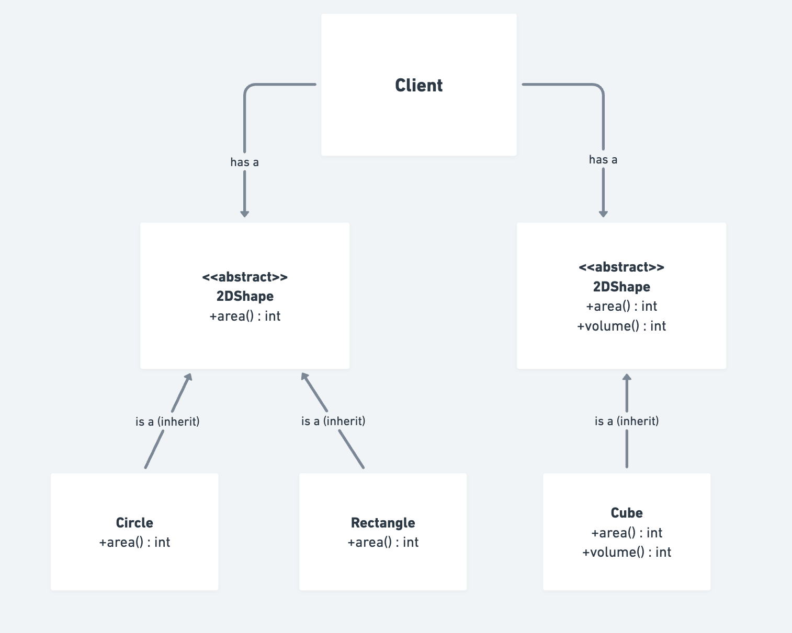

# Interface Segregation Principle (ISP) - SOLID

This folder demonstrates the **Interface Segregation Principle (ISP)**, the fourth principle of SOLID design principles.

---

## What is the Interface Segregation Principle?

**Definition**: Clients should not be forced to depend on interfaces they do not use.

**Key Idea**: 
- Break large, fat interfaces into smaller, focused interfaces
- Each client implements only the methods it actually needs
- Interfaces should be specific to client needs, not generic for all

**In Simple Terms**: 
Many specific interfaces are better than one general-purpose interface.

---

## Why ISP is Important?

1. **Reduces Coupling**: Clients depend only on what they use
2. **Improves Maintainability**: Changes to unused methods don't affect client
3. **Increases Flexibility**: Easier to implement interfaces with fewer methods
4. **Prevents Bloat**: Avoids "fat" interfaces with unrelated methods
5. **Better Code Organization**: Interfaces organized by responsibility
6. **Easier Testing**: Only implement needed methods, no dummy implementations

---

## Real-world Example: Shape Interfaces

### ❌ ISP VIOLATED (Before)

**File**: `ISP_Violated.java`



The problem: One "fat" interface forces all shapes to implement both `area()` and `volume()`.

```java
// Fat interface with unrelated methods
interface Shape {
    double area();      // All shapes have area
    double volume();    // Only 3D shapes have volume!
}

// 2D Shape forced to implement volume()
class Square implements Shape {
    @Override
    public double area() {
        return side * side;  // Makes sense
    }
    
    @Override
    public double volume() {
        throw new UnsupportedOperationException("Area not applicable for Square");  // ❌ Dummy implementation!
    }
}

// 2D Shape forced to implement volume()
class Rectangle implements Shape {
    @Override
    public double area() {
        return length * width;  // Makes sense
    }
    
    @Override
    public double volume() {
        throw new UnsupportedOperationException("Volume not applicable for Rectangle");  // ❌ Dummy implementation!
    }
}

// 3D Shape correctly implements both
class Cube implements Shape {
    @Override
    public double area() {
        return 6 * side * side;  // Makes sense
    }
    
    @Override
    public double volume() {
        return side * side * side;  // Makes sense
    }
}
```

**Problems with this approach:**

1. **Forced Implementation**: Square and Rectangle forced to implement `volume()`
2. **Dummy Methods**: `volume()` throws exception - indicates ISP violation
3. **Misleading Contract**: Interface suggests all shapes have volume (false!)
4. **Tight Coupling**: Client doesn't know which shapes support which operations
5. **Runtime Errors**: Calling `square.volume()` throws exception instead of compile-time error
6. **Maintenance Nightmare**: Adding new method to Shape affects all implementations

### ✅ ISP FOLLOWED (Correct Solution)

**File**: `ISP_Followed.java`



The solution: Segregate into focused interfaces by capability.

```java
// Small, focused interface for 2D shapes
interface TwoDimensionalShape {
    double area();
}

// Larger interface extending smaller one for 3D shapes
interface ThreeDimensionalShape {
    double area();
    double volume();
}

// 2D Shape implements only 2D interface
class Square implements TwoDimensionalShape {
    @Override
    public double area() {
        return side * side;  // ✓ Makes sense
    }
    // ✓ No volume() method - Square doesn't need it!
}

// 2D Shape implements only 2D interface
class Rectangle implements TwoDimensionalShape {
    @Override
    public double area() {
        return length * width;  // ✓ Makes sense
    }
    // ✓ No volume() method - Rectangle doesn't need it!
}

// 3D Shape implements 3D interface
class Cube implements ThreeDimensionalShape {
    @Override
    public double area() {
        return 6 * side * side;  // ✓ Makes sense
    }
    
    @Override
    public double volume() {
        return side * side * side;  // ✓ Makes sense
    }
}
```

**Advantages of this approach:**

1. ✓ **No Forced Implementation**: Each class implements only needed methods
2. ✓ **No Dummy Methods**: No fake/exception-throwing implementations
3. ✓ **Clear Contract**: Interface clearly states what a shape supports
4. ✓ **Loose Coupling**: Easy to add new shape types without affecting others
5. ✓ **Compile-time Safety**: Calling `square.volume()` is a compile error (caught early!)
6. ✓ **Easy Maintenance**: Adding methods only affects relevant implementations

---

## Comparison: Violated vs Followed

| Aspect | ISP Violated | ISP Followed |
|--------|------------|-------------|
| **Number of Interfaces** | 1 (Shape) | 2 (2D and 3D) |
| **Square.volume()** | Throws exception ❌ | Compile error ✓ |
| **Rectangle.volume()** | Throws exception ❌ | Compile error ✓ |
| **Forced Methods** | Yes ❌ | No ✓ |
| **Dummy Implementations** | Yes ❌ | No ✓ |
| **Code Clarity** | Confusing ❌ | Clear ✓ |
| **Type Safety** | Runtime ❌ | Compile-time ✓ |
| **Maintenance** | Difficult ❌ | Easy ✓ |
| **Extensibility** | Limited ❌ | Good ✓ |

---

## ISP vs Other SOLID Principles

### ISP vs SRP (Single Responsibility Principle)
```java
// SRP: Class should have one reason to change
// ISP: Interface should have one reason to change

// ✓ Good - interfaces focused on one job
interface Readable {
    void read();
}

interface Writable {
    void write();
}

// ❌ Bad - one interface with multiple reasons to change
interface FileHandler {
    void read();
    void write();
    void delete();
}
```

### ISP vs DIP (Dependency Inversion Principle)
```java
// DIP: Depend on abstractions, not concretions
// ISP: Abstractions should be focused and specific

// ❌ Bad - generic, fat abstraction
interface Worker {
    void work();
    void rest();
    void manage();
    void code();
}

// ✓ Good - specific, focused abstractions
interface Developer {
    void code();
}

interface Manager {
    void manage();
}
```

### ISP vs OCP (Open/Closed Principle)
```java
// OCP: Open for extension, closed for modification
// ISP: Avoid forcing extensions to implement unwanted methods

// Violates both OCP and ISP
interface AllServices {
    void save();
    void delete();
    void report();
    void email();
}

// ✓ Follows both OCP and ISP
interface SaveService { void save(); }
interface DeleteService { void delete(); }
interface ReportService { void report(); }
interface EmailService { void email(); }
```

---

## Common ISP Violations and Fixes

### Violation 1: Fat Interface

```java
// ❌ VIOLATION - One huge interface
interface Database {
    void create();
    void read();
    void update();
    void delete();
    void backup();
    void restore();
    void replicate();
    void audit();
    void encrypt();
    void validate();
}

// ✓ FIX - Segregate by functionality
interface CRUD {
    void create();
    void read();
    void update();
    void delete();
}

interface Backup {
    void backup();
    void restore();
}

interface Security {
    void encrypt();
    void validate();
    void audit();
}

interface Replication {
    void replicate();
}
```

### Violation 2: Unrelated Methods

```java
// ❌ VIOLATION - Payment and Shipping mixed
interface PaymentService {
    void processPayment();
    void shipOrder();
    void trackShipment();
    void calculateTax();
}

// ✓ FIX - Separate concerns
interface PaymentProcessor {
    void processPayment();
}

interface ShippingService {
    void shipOrder();
    void trackShipment();
}

interface TaxCalculator {
    void calculateTax();
}
```

### Violation 3: Forcing Dummy Implementations

```java
// ❌ VIOLATION - Mobile client forced to implement desktop methods
interface UserInterface {
    void showDesktopMenu();
    void showMobileMenu();
    void showTabletMenu();
    void printReport();
}

class MobileUI implements UserInterface {
    public void showMobileMenu() { /* ... */ }
    public void showDesktopMenu() { throw new Exception(); }  // ❌ Dummy!
    public void showTabletMenu() { throw new Exception(); }   // ❌ Dummy!
    public void printReport() { throw new Exception(); }      // ❌ Dummy!
}

// ✓ FIX - Separate interfaces
interface MobileInterface {
    void showMobileMenu();
}

interface DesktopInterface {
    void showDesktopMenu();
    void printReport();
}

interface TabletInterface {
    void showTabletMenu();
}
```

---

## How to Identify ISP Violations

### Red Flag 1: UnsupportedOperationException

```java
// ❌ Sign of ISP violation
class FileReader implements FileHandler {
    public void read() { /* ... */ }
    public void write() { 
        throw new UnsupportedOperationException("Read-only file");  // ❌ ISP violated
    }
}
```

### Red Flag 2: Empty or Dummy Implementations

```java
// ❌ Sign of ISP violation
class BasicUser implements AdminInterface {
    public void manageUsers() { throw new Exception(); }
    public void viewReports() { throw new Exception(); }
    public void changeSettings() { throw new Exception(); }
}
```

### Red Flag 3: Irrelevant Methods

```java
// ❌ Sign of ISP violation
interface Bird {
    void fly();      // Most birds fly
    void swim();     // Not all birds swim
    void walk();     // Not all birds walk
}

class Penguin implements Bird {
    public void fly() { throw new Exception("Can't fly"); }  // ❌ Forced!
}
```

### Red Flag 4: Unused Methods

```java
// ❌ Sign of ISP violation
interface Manager extends Employee {
    void code();           // Not all managers code
    void conduct review(); // Only managers review
    void manage team();    // Only managers manage
    void report stats();   // Only managers report
}

class Developer implements Manager {
    public void code() { /* implement */ }
    public void conductReview() { /* not needed */ }
    public void manageTeam() { /* not needed */ }
    public void reportStats() { /* not needed */ }
}
```

---

## ISP Application Patterns

### Pattern 1: Role-Based Interfaces

```java
// ✓ Good - each role has focused interface
interface Reader {
    Object read();
}

interface Writer {
    void write(Object obj);
}

interface ReadWrite extends Reader, Writer {
}

class Logger implements WriteOnly { }
class Monitor implements ReadOnly { }
class FileHandler implements ReadWrite { }
```

### Pattern 2: Capability-Based Interfaces

```java
// ✓ Good - each capability is separate
interface Serializable {
    void serialize();
}

interface Deserializable {
    Object deserialize();
}

interface Persistable extends Serializable, Deserializable {
}

class JsonHandler implements Persistable { }
class XmlHandler implements Persistable { }
class CsvReader implements Deserializable { }
```

### Pattern 3: Client-Specific Interfaces

```java
// ✓ Good - interfaces designed for specific client needs
interface PaymentGateway {
    void processPayment();
    void refund();
}

// Mobile app only needs to process payments
interface MobilePayment {
    void processPayment();
}

// Admin dashboard needs full functionality
interface AdminPayment extends PaymentGateway {
}

class MobilePaymentAdapter implements MobilePayment {
    private PaymentGateway gateway;
    
    public void processPayment() {
        gateway.processPayment();
    }
}
```

---

## Interview Questions and Answers

### Q1: What is Interface Segregation Principle?
**A:** ISP states that clients should not be forced to depend on interfaces they do not use. It's about creating smaller, focused interfaces rather than one large, general-purpose interface.

**Key Points**:
- Many specialized interfaces > One fat interface
- Each client uses only methods it needs
- Reduces coupling and improves flexibility

### Q2: Why Should Interfaces Be Segregated?
**A:** Segregation provides several benefits:

1. **Reduced Coupling**: Client depends only on methods it uses
2. **Easier Changes**: Modifying unused methods doesn't affect client
3. **Better Code Organization**: Related methods grouped logically
4. **Clearer Intent**: Interface clearly shows what client should use
5. **Improved Testing**: Easier to mock focused interfaces
6. **Prevents Bloat**: No unnecessary method implementations

### Q3: What's Wrong With One Big Interface?
**A:** A fat interface causes:

```java
// ❌ Problems with fat interface
interface AllInOne {
    void methodA();
    void methodB();
    void methodC();
    void methodD();
}

class Client1 implements AllInOne {
    // Uses only methodA() and methodB()
    // Forced to implement methodC() and methodD()!
}

class Client2 implements AllInOne {
    // Uses only methodC() and methodD()
    // Forced to implement methodA() and methodB()!
}
```

**Issues**:
- Forced implementations of unused methods
- Dummy implementations that throw exceptions
- Changes to one method affect all clients
- Tight coupling between unrelated clients

### Q4: Real-World Example: Air Traveler
**A:**

```java
// ❌ ISP Violated - One fat interface
interface Traveler {
    void drive();
    void fly();
    void swim();
    void walk();
}

class Person implements Traveler {
    public void drive() { /* can drive */ }
    public void fly() { /* cannot fly */ }    // ❌ Dummy!
    public void swim() { /* cannot swim */ } // ❌ Dummy!
    public void walk() { /* can walk */ }
}

// ✓ ISP Followed - Segregated interfaces
interface Pedestrian { void walk(); }
interface Driver { void drive(); }
interface Swimmer { void swim(); }
interface Pilot { void fly(); }

class Person implements Pedestrian, Driver {
    public void walk() { /* ... */ }
    public void drive() { /* ... */ }
}

class AirPilot implements Pilot {
    public void fly() { /* ... */ }
}
```

### Q5: How is ISP Different from SRP?
**A:**

| SRP | ISP |
|-----|-----|
| **Focus**: Class responsibility | **Focus**: Interface responsibility |
| **Principle**: One reason to change | **Principle**: One reason to use |
| **Applies To**: Classes | **Applies To**: Interfaces/Methods |
| **Goal**: Class does one thing | **Goal**: Interface provides one capability |

```java
// SRP - Class has one responsibility
class EmailSender {
    void send(String to, String message) { }  // Only sends emails
}

// ISP - Interface segregated for specific use
interface Sender {
    void send(Message msg);
}

interface EmailSender extends Sender {
    void send(String email, String message);
}
```

### Q6: UnsupportedOperationException - What Does It Mean?
**A:** It's a red flag indicating ISP violation:

```java
// ❌ ISP Violation indicated by UnsupportedOperationException
class Square implements Shape {
    public double area() { return side * side; }
    public double volume() {
        throw new UnsupportedOperationException("Square has no volume");  // ❌ ISP violated!
    }
}

// ✓ Proper ISP - No exceptions needed
class Square implements TwoDimensionalShape {
    public double area() { return side * side; }
    // No volume() method - Square never needs to implement it
}
```

### Q7: Should You Use Adapter Pattern With ISP?
**A:** Yes, when you have legacy code that doesn't follow ISP:

```java
// Legacy fat interface
interface LegacyWorker {
    void work();
    void rest();
    void manage();
}

// Create focused interfaces
interface Worker { void work(); }
interface Rester { void rest(); }
interface Manager { void manage(); }

// Adapter to implement only needed interface
class WorkerAdapter implements Worker {
    private LegacyWorker legacyWorker;
    
    public void work() {
        legacyWorker.work();  // Delegate to legacy implementation
    }
}
```

### Q8: How Many Methods Should an Interface Have?
**A:** There's no magic number, but follow these guidelines:

```java
// ✓ Good - 1-3 related methods
interface Readable {
    Object read();
}

interface Saveable {
    void save();
}

// ✓ Acceptable - 3-5 related methods
interface DataHandler {
    void create();
    void read();
    void update();
    void delete();
}

// ❌ Too many - indicates ISP violation
interface MasterService {
    void method1();
    void method2();
    void method3();
    void method4();
    void method5();
    // ... 15 more methods
}
```

### Q9: ISP and Multiple Inheritance?
**A:** ISP encourages multiple interface implementation (which Java supports):

```java
// ✓ Good - Multiple focused interfaces
interface Readable { void read(); }
interface Writable { void write(); }

class TextFile implements Readable, Writable {
    public void read() { /* ... */ }
    public void write() { /* ... */ }
}

// ✓ Good - Multiple levels
class AdvancedFile implements Readable, Writable, Searchable, Compressible {
    // Implements only methods it actually uses
}
```

### Q10: Can Client Use Only Part of Interface?
**A:** In Java, not directly - but ISP helps:

```java
// ❌ Without ISP - Client forced to use everything
interface BigService {
    void methodA();
    void methodB();
    void methodC();
}

class Client implements BigService {
    // Must implement ALL methods
}

// ✓ With ISP - Client implements only what it needs
interface ServiceA { void methodA(); }
interface ServiceB { void methodB(); }
interface ServiceC { void methodC(); }

class Client implements ServiceA, ServiceB {
    // Implements only ServiceA and ServiceB
    // Doesn't need ServiceC
}
```

### Q11: What About Interface Composition?
**A:** ISP often uses interface composition to build larger interfaces:

```java
// ✓ Good - Compose focused interfaces
interface Reader { Object read(); }
interface Writer { void write(Object obj); }
interface Deleter { void delete(Object obj); }

interface FileService extends Reader, Writer, Deleter {
    // Combines all three interfaces
}

class TextFile implements FileService {
    public Object read() { /* ... */ }
    public void write(Object obj) { /* ... */ }
    public void delete(Object obj) { /* ... */ }
}

// Other implementations can use subsets:
class ReadOnlyFile implements Reader { }
class AppendOnlyFile implements Writer { }
```

### Q12: Real-World ISP: Java Collections API
**A:**

```java
// ✓ Great example of ISP
interface Iterable<T> {
    Iterator<T> iterator();
}

interface Collection<E> extends Iterable<E> {
    int size();
    boolean isEmpty();
    boolean contains(Object o);
    // ... more collection methods
}

interface List<E> extends Collection<E> {
    E get(int index);
    // ... list-specific methods
}

interface Set<E> extends Collection<E> {
    // Note: Doesn't have get() because sets are unordered
}

// Each interface adds only relevant methods
// Clients depend on what they need
```

### Q13: ISP With Microservices
**A:**

```java
// ✓ ISP in microservice architecture
interface OrderService {
    Order createOrder();
    Order getOrder(String id);
}

interface PaymentService {
    PaymentResult processPayment(Payment p);
    void refundPayment(String id);
}

interface ShippingService {
    void shipOrder(String orderId);
    TrackingInfo trackShipment(String trackingId);
}

// Each microservice exposes only relevant operations
// Clients depend on specific services
class OrderManager {
    private OrderService orderService;
    private PaymentService paymentService;
    // Uses only what's needed
}
```

### Q14: Interface Pollution - How to Avoid?
**A:** Don't add "just in case" methods:

```java
// ❌ POLLUTION - Adding methods "just in case"
interface UserRepository {
    User findById(String id);
    List<User> findAll();
    User save(User user);
    void delete(String id);
    // These might not be used by all clients:
    void sendEmail(String email);      // Not repo responsibility!
    void logActivity(String message);  // Not repo responsibility!
    void cacheUser(User user);         // Not repo responsibility!
}

// ✓ CLEAN - Only repository concerns
interface UserRepository {
    User findById(String id);
    List<User> findAll();
    User save(User user);
    void delete(String id);
}

// Other concerns in separate interfaces
interface EmailService { void send(String email); }
interface ActivityLogger { void log(String message); }
interface CacheManager { void cache(Object obj); }
```

### Q15: Testing and ISP
**A:** ISP makes testing easier:

```java
// ✓ ISP makes mocking simpler
interface Logger {
    void log(String message);
}

interface Validator {
    boolean validate(Object obj);
}

@Test
public void testWithMocking() {
    Logger mockLogger = mock(Logger.class);
    Validator mockValidator = mock(Validator.class);
    
    Service service = new Service(mockLogger, mockValidator);
    
    when(mockValidator.validate(any())).thenReturn(true);
    
    service.process();  // Easy to test with small interfaces
}

// Without ISP, you'd mock 20+ methods just to use 2!
```

---

## Real-World ISP Applications

### 1. E-Commerce Platform
```java
// ✓ ISP Applied - Each interface for specific role
interface CustomerPortal {
    void browseCatalog();
    void viewOrder();
    void trackShipment();
}

interface AdminPortal {
    void manageInventory();
    void viewAnalytics();
    void manageUsers();
}

interface SupplierPortal {
    void submitInventory();
    void viewOrders();
    void downloadInvoice();
}

// Each role implements only what it needs
```

### 2. Mobile Application
```java
// ✓ ISP Applied - Phones don't need desktop features
interface MobileUI {
    void showMobileMenu();
    void handleTouch();
}

interface DesktopUI {
    void showDesktopMenu();
    void printReport();
    void handleMouseClick();
}

interface TabletUI extends MobileUI {
    void handleStylusInput();
}
```

### 3. Plugin Architecture
```java
// ✓ ISP Applied - Each plugin type implements only its interface
interface AudioPlugin {
    void process(AudioData data);
}

interface VisualizerPlugin {
    void render(AudioData data);
}

interface RecorderPlugin {
    void recordAudio(AudioData data);
}

// Users can add any combination of plugins
```

### 4. REST API
```java
// ✓ ISP Applied - Endpoints segregated by responsibility
interface UserAPI {
    User getUser(String id);
    void updateUser(User user);
}

interface OrderAPI {
    Order getOrder(String id);
    List<Order> getUserOrders(String userId);
}

interface PaymentAPI {
    PaymentResult processPayment(Payment payment);
}

// Clients use only the APIs they need
```

---

## Best Practices Checklist

- [ ] **Focus Interfaces**: Keep interfaces small and focused
- [ ] **One Reason**: Interface should have one reason to change
- [ ] **No Fat Interfaces**: Avoid interfaces with too many methods
- [ ] **No Dummy Implementations**: No methods throwing exceptions
- [ ] **Client-Driven**: Design interfaces for client needs
- [ ] **Composition Over Translation**: Compose interfaces when needed
- [ ] **Group Related Methods**: Put logically related methods together
- [ ] **No Forced Methods**: Each implementation uses all methods
- [ ] **Extract Small Interfaces**: When interface gets big, split it
- [ ] **Clear Intent**: Interface name clearly shows its purpose

---

## Common Mistakes and Solutions

| Mistake | Example | Impact | Solution |
|---------|---------|--------|----------|
| **Fat Interface** | 20+ methods in one interface | Hard to implement | Split into smaller interfaces |
| **Unrelated Methods** | Mixing saving and emailing | Tight coupling | Separate concerns |
| **Dummy Implementations** | Throwing exceptions | ISP violated | Don't force unused methods |
| **Interface Pollution** | Adding "just in case" methods | Bloat | Only add needed methods |
| **Poor Naming** | `AllServices` interface | Unclear purpose | Use specific names |
| **No Composition** | Repeating methods across interfaces | Code duplication | Use interface extension |

---

## Conclusion

Interface Segregation Principle ensures:

✓ **Focused Interfaces**: Each interface has clear purpose
✓ **No Forced Implementations**: Classes implement only needed methods
✓ **Reduced Coupling**: Clients depend on what they use
✓ **Better Maintainability**: Changes don't affect unrelated clients
✓ **Improved Flexibility**: Easy to add new implementations
✓ **Type Safety**: Compile-time checking prevents errors

Remember: **A client should never be forced to implement a method it does not use.**

If you see `UnsupportedOperationException` or empty implementations, it's a sign ISP is violated.

