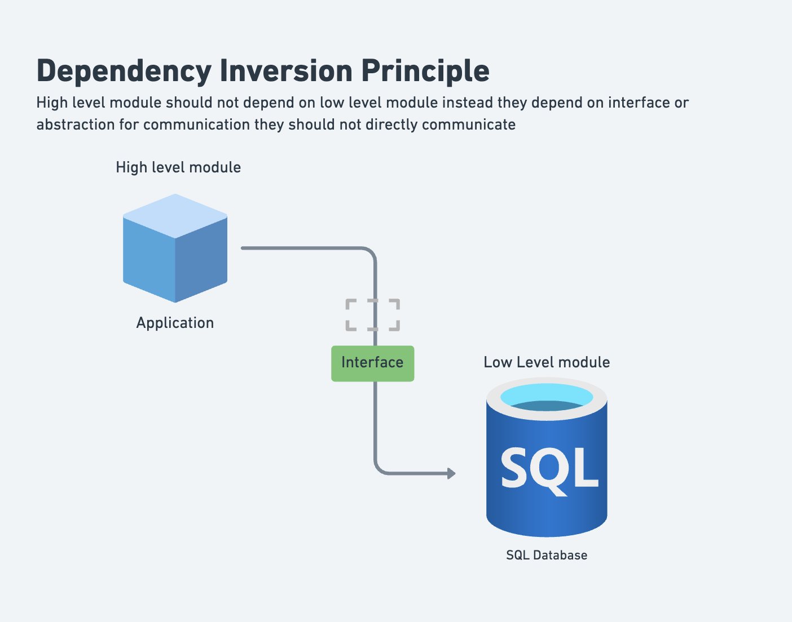
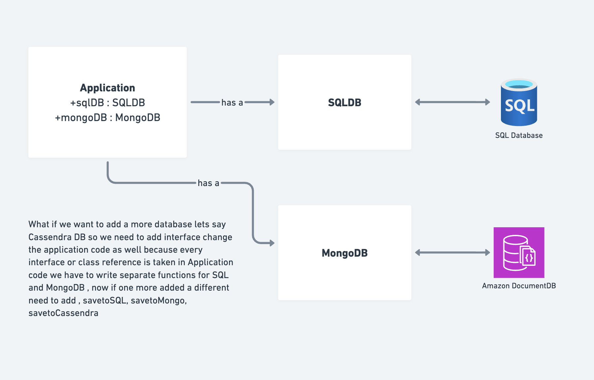
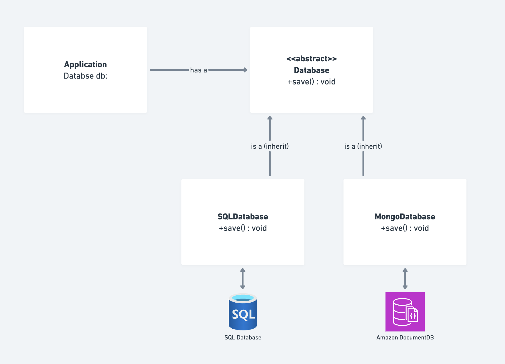

# Dependency Inversion Principle (DIP) - SOLID

This folder demonstrates the **Dependency Inversion Principle (DIP)**, the fifth and final principle of SOLID design principles.

---


## What is the Dependency Inversion Principle?



**Definition**: High-level modules should not depend on low-level modules. Both should depend on abstractions (interfaces or abstract classes).

**Additional Key Point**: Abstractions should not depend on details. Details should depend on abstractions.

**In Simple Terms**:
- Depend on interfaces/abstractions, not concrete implementations
- Invert the traditional dependency flow
- High-level code shouldn't know about low-level implementation details

---

## Why DIP is Important?

1. **Loose Coupling**: High-level code doesn't depend on low-level implementations
2. **Flexibility**: Easy to swap implementations without changing high-level code
3. **Testability**: Easy to mock dependencies for testing
4. **Maintainability**: Changes to one module don't force changes in another
5. **Reusability**: High-level modules can be reused with different implementations
6. **Scalability**: Add new implementations without modifying existing code

---

## Traditional Dependency Flow vs DIP

### Traditional (Top-Down Dependency) ❌

```
Application (High-level)
      ↓ depends on
Business Logic
      ↓ depends on
Database
      ↓ depends on
SQL Database (Low-level)
```

**Problem**: Changing the database forces changes in high-level code.

### DIP Flow (Inverted Dependency) ✅

```
Application (High-level)
      ↓ depends on
    Interface/Abstraction
      ↑ depends on
Database Implementations (Low-level)
```

**Advantage**: High-level code is independent of low-level implementation choices.

---

## Real-world Example: Database System

### ❌ DIP VIOLATED (Before)

**File**: `DIP_Violated.java`



The problem: `UserService` directly depends on concrete database implementations.

```java
// Low-level module 1: MySQL implementation
class MySQLDatabase {  // Concrete implementation
    public void saveToSQL(String data) {
        System.out.println("Saving to SQL: " + data);
    }
}

// Low-level module 2: MongoDB implementation
class MongoDBDatabase {  // Concrete implementation
    public void saveToMongo(String data) {
        System.out.println("Saving to MongoDB: " + data);
    }
}

// High-level module (tightly coupled to low-level modules)
class UserService {
    private final MySQLDatabase sqlDb = new MySQLDatabase();      // ❌ Direct dependency!
    private final MongoDBDatabase mongoDb = new MongoDBDatabase(); // ❌ Direct dependency!

    public void storeUserToSQL(String user) {
        sqlDb.saveToSQL(user);  // ❌ Depends on concrete implementation
    }

    public void storeUserToMongo(String user) {
        mongoDb.saveToMongo(user);  // ❌ Depends on concrete implementation
    }
}
```

**Problems with this approach:**

1. **Tight Coupling**: UserService directly depends on MySQLDatabase and MongoDBDatabase
2. **Hard to Test**: Can't test without actual database implementations
3. **Difficult to Extend**: Adding new database requires changing UserService
4. **Violation of OCP**: Must modify UserService to add new database type
5. **Wrong Dependencies**: High-level business logic depends on low-level details
6. **Multiple Constructors/Methods**: Different methods for each database type
7. **Inflexible**: Can't switch databases at runtime

### ✅ DIP FOLLOWED (Correct Solution)

**File**: `DIP_Followed.java`



The solution: Depend on an abstraction (interface), not concrete implementations.

```java
// Abstraction (Interface) - both depend on this
interface Database {
    void save(String data);  // Abstract operation
}

// Low-level module 1: MySQL implementation
class MySQLDatabase implements Database {
    @Override
    public void save(String data) {
        System.out.println("Executing SQL Query: INSERT INTO users...");
    }
}

// Low-level module 2: MongoDB implementation
class MongoDBDatabase implements Database {
    @Override
    public void save(String data) {
        System.out.println("Executing MongoDB Function: db.users.insert...");
    }
}

// High-level module (depends on abstraction, not concrete implementations)
class UserService {
    private final Database database;  // ✓ Depends on interface!

    public UserService(Database db) {
        this.database = db;  // ✓ Injected, not created directly
    }

    public void storeUser(String name) {
        database.save(name);  // ✓ Works with any Database implementation
    }
}

// Usage
Database mongo = new MongoDBDatabase();
Database sql = new MySQLDatabase();

UserService us1 = new UserService(mongo);  // ✓ Can swap implementations!
UserService us2 = new UserService(sql);    // ✓ Same UserService, different DB!

us1.storeUser("Naman");
us2.storeUser("Mishti");
```

**Advantages of this approach:**

1. ✓ **Loose Coupling**: UserService depends on interface, not implementations
2. ✓ **Easy Testing**: Can inject mock Database for testing
3. ✓ **Easy Extension**: Add new database by implementing Database interface
4. ✓ **Follows OCP**: No modification to UserService needed for new implementations
5. ✓ **Inverted Dependencies**: High-level depends on abstraction, not low-level
6. ✓ **Runtime Flexibility**: Change database at runtime by injecting different impl
7. ✓ **Cleaner Code**: Single constructor and save method

---

## Detailed Comparison

| Aspect | DIP Violated | DIP Followed |
|--------|------------|-------------|
| **Dependency Direction** | Downward (High → Low) ❌ | Inverted (Both → Interface) ✅ |
| **How UserService Creates DB** | Direct instantiation ❌ | Injected via constructor ✅ |
| **Adding New Database** | Modify UserService ❌ | Just implement Interface ✅ |
| **Testing UserService** | Needs real DB ❌ | Can use mock DB ✅ |
| **Flexibility** | Fixed at compile time ❌ | Dynamic at runtime ✅ |
| **Number of Methods** | storeUserToSQL, storeUserToMongo | Single storeUser ✅ |
| **Code Coupling** | Tight ❌ | Loose ✅ |
| **Follows OCP** | No ❌ | Yes ✅ |
| **Follows SOLID** | No ❌ | Yes ✅ |

---

## The Two Rules of DIP

### Rule 1: High-level Modules Should Not Depend on Low-level Modules

```java
// ❌ VIOLATES Rule 1 - High-level depends on low-level
class OrderProcessor {
    private MySQLDatabase db = new MySQLDatabase();  // Direct dependency
    
    public void processOrder(Order order) {
        db.save(order);
    }
}

// ✅ FOLLOWS Rule 1 - High-level depends on abstraction
class OrderProcessor {
    private Database db;  // Depends on interface
    
    public OrderProcessor(Database database) {
        this.db = database;
    }
    
    public void processOrder(Order order) {
        db.save(order);
    }
}
```

### Rule 2: Abstractions Should Not Depend on Details

```java
// ❌ VIOLATES Rule 2 - Abstraction depends on concrete class
interface PaymentProcessor {
    void pay(CreditCard card);  // Depends on concrete CreditCard class
}

// ✅ FOLLOWS Rule 2 - Both abstraction and details depend on abstraction
interface Payment {
    void pay();
}

interface PaymentProcessor {
    void process(Payment payment);  // Depends on abstraction
}

class CreditCardPayment implements Payment {
    public void pay() { /* ... */ }
}
```

---

## Dependency Injection - How to Implement DIP

### Method 1: Constructor Injection (Recommended)

```java
interface EmailService {
    void sendEmail(String to, String message);
}

class UserService {
    private final EmailService emailService;
    
    // ✓ Injected via constructor
    public UserService(EmailService emailService) {
        this.emailService = emailService;
    }
    
    public void registerUser(User user) {
        // ... registration logic
        emailService.sendEmail(user.getEmail(), "Welcome!");
    }
}

// Usage
EmailService service = new GmailService();  // Can be any implementation
UserService userService = new UserService(service);
```

### Method 2: Setter Injection

```java
class UserService {
    private EmailService emailService;
    
    // ✓ Injected via setter
    public void setEmailService(EmailService emailService) {
        this.emailService = emailService;
    }
}

// Usage
UserService service = new UserService();
service.setEmailService(new GmailService());
```

### Method 3: Interface Injection

```java
interface ServiceContainer {
    void injectEmailService(EmailService service);
}

class UserService implements ServiceContainer {
    private EmailService emailService;
    
    @Override
    public void injectEmailService(EmailService service) {
        this.emailService = service;
    }
}
```

### Method 4: Factory Pattern

```java
class ServiceFactory {
    public static UserService createUserService(String dbType) {
        Database db;
        if ("mysql".equals(dbType)) {
            db = new MySQLDatabase();
        } else if ("mongo".equals(dbType)) {
            db = new MongoDBDatabase();
        }
        return new UserService(db);
    }
}

// Usage
UserService service = ServiceFactory.createUserService("mysql");
```

---

## DIP with Multiple Dependencies

```java
// Multiple abstractions - better testability
interface Database {
    void save(Object obj);
}

interface Logger {
    void log(String message);
}

interface NotificationService {
    void notify(String message);
}

// High-level module depends on abstractions
class OrderService {
    private final Database database;
    private final Logger logger;
    private final NotificationService notifier;
    
    // ✓ All dependencies injected
    public OrderService(Database db, Logger log, NotificationService notif) {
        this.database = db;
        this.logger = log;
        this.notifier = notif;
    }
    
    public void createOrder(Order order) {
        logger.log("Creating order...");
        database.save(order);
        notifier.notify("Order created!");
    }
}

// Usage - Easy to test
OrderService service = new OrderService(
    new MockDatabase(),
    new MockLogger(),
    new MockNotificationService()
);
```

---

## DIP vs Traditional Layered Architecture

### Traditional (Violates DIP)
```
┌─────────────────┐
│ Presentation    │ (High-level)
└────────┬────────┘
         │ depends on
┌────────▼────────┐
│ Business Logic  │ (Mid-level)
└────────┬────────┘
         │ depends on
┌────────▼────────┐
│ Data Access     │ (Low-level)
└─────────────────┘
```

**Problem**: Top layers depend on bottom layers. changing bottom breaks top.

### DIP Layered (Follows DIP)
```
┌──────────────────┐
│ Presentation     │
└────────┬─────────┘
         │ depends on
    ┌────▼─────┐
    │Interfaces│
    └────▲─────┘
         │ implements
┌────────┴────────────────────┐
│ Business Logic & Data Access│
└─────────────────────────────┘
```

**Advantage**: All layers depend on interfaces. Low-level can change safely.

---

## Common DIP Violations

### Violation 1: Creating Dependencies Directly

```java
// ❌ VIOLATION - Direct instantiation
class PaymentService {
    private DatabaseConnection connection = new DatabaseConnection();  // Tight coupling!
    
    public void processPayment(Payment p) {
        connection.save(p);
    }
}

// ✅ CORRECT - Injected dependency
class PaymentService {
    private Database database;
    
    public PaymentService(Database db) {
        this.database = db;
    }
    
    public void processPayment(Payment p) {
        database.save(p);
    }
}
```

### Violation 2: Depending on Concrete Classes

```java
// ❌ VIOLATION
class UserRepository {
    public User findById(MySQLConnection conn, String id) {  // Concrete class!
        return conn.query("SELECT * FROM users WHERE id = " + id);
    }
}

// ✅ CORRECT
interface DatabaseConnection {
    User findById(String id);
}

class UserRepository {
    private DatabaseConnection conn;
    
    public UserRepository(DatabaseConnection connection) {
        this.conn = connection;
    }
    
    public User findById(String id) {
        return conn.findById(id);
    }
}
```

### Violation 3: Circular Dependencies

```java
// ❌ VIOLATION - A depends on B, B depends on A
class PaymentService {
    private OrderService orderService;  // Depends on OrderService
}

class OrderService {
    private PaymentService paymentService;  // Depends on PaymentService
}

// ✓ FIX - Use shared interface
interface OrderRepository {
    void saveOrder(Order o);
}

class PaymentService {
    private OrderRepository repo;
}

class OrderService {
    private OrderRepository repo;
}
```

---

## DIP and Testing

### Without DIP - Hard to Test

```java
// ❌ Difficult to test - depends on real database
class UserService {
    private MySQLDatabase db = new MySQLDatabase();
    
    public void registerUser(User user) {
        db.save(user);
    }
}

@Test
public void testRegisterUser() {
    // Must use real database - slow and fragile
    UserService service = new UserService();
    service.registerUser(new User("test", "test@example.com"));
    // Must query real database to verify
}
```

### With DIP - Easy to Test

```java
// ✓ Easy to test - depends on interface, can mock
class UserService {
    private Database db;
    
    public UserService(Database database) {
        this.db = database;
    }
    
    public void registerUser(User user) {
        db.save(user);
    }
}

@Test
public void testRegisterUser() {
    // Use mock - fast and reliable
    Database mockDb = mock(Database.class);
    UserService service = new UserService(mockDb);
    service.registerUser(new User("test", "test@example.com"));
    
    verify(mockDb).save(any(User.class));
}
```

---

## Interview Questions and Answers

### Q1: What is Dependency Inversion Principle?
**A:** DIP states that high-level modules should not depend on low-level modules. Both should depend on abstractions. Additionally, abstractions should not depend on details—instead, details should depend on abstractions.

**Example**:
```java
// ❌ Wrong - High depends directly on Low
class PaymentService {
    private StripePaymentGateway stripe = new StripePaymentGateway();
}

// ✅ Right - Both depend on abstraction
class PaymentService {
    private PaymentGateway gateway;  // Interface
}
```

### Q2: Why is DIP Called "Inversion"?
**A:** Because it inverts the traditional dependency flow:

**Traditional**: High → Mid → Low (downward flow)
**DIP**: Both → Interface (upward to abstraction)

Traditionally, high-level code depends on low-level code. DIP inverts this by making both depend on interfaces instead.

### Q3: How Does DIP Differ from Dependency Injection?
**A:** 

**DIP**: A design principle about how to organize dependencies
**Dependency Injection**: A technique/pattern to implement DIP

- DIP = WHAT (design goal)
- Dependency Injection = HOW (implementation technique)

```java
// DIP says: "Depend on interfaces"
interface Database { void save(Object obj); }

// Dependency Injection is HOW we achieve DIP:
class UserService {
    private Database db;
    
    public UserService(Database db) {  // Constructor Injection (HOW)
        this.db = db;                   // Implements DIP (WHAT)
    }
}
```

### Q4: What Are the Two Rules of DIP?
**A:**

**Rule 1**: High-level modules should not depend on low-level modules
- Both should depend on abstractions (interfaces)

**Rule 2**: Abstractions should not depend on details
- Details should depend on abstractions

```java
// Rule 1 Violation
class HighLevel {
    private LowLevelClass low = new LowLevelClass();  // ❌ Direct dependency
}

// Rule 2 Violation
interface Abstraction {
    void method(ConcreteClass obj);  // ❌ Depends on concrete class
}
```

### Q5: Tight Coupling vs Loose Coupling - What's the Difference?
**A:**

**Tight Coupling**: Objects are strongly dependent on each other
```java
// ❌ Tight coupling
class EmailSender {
    private GmailService gmail = new GmailService();  // Hard dependency
}

// Problem: Can't test without Gmail, can't switch providers
```

**Loose Coupling**: Objects interact through interfaces, not concrete implementations
```java
// ✓ Loose coupling
class EmailSender {
    private EmailService service;
    
    public EmailSender(EmailService svc) {
        this.service = svc;  // Soft dependency through interface
    }
}

// Benefit: Can test with mock, can switch providers
```

### Q6: How Many Ways Can You Implement Dependency Injection?
**A:** Four main ways:

1. **Constructor Injection** (Recommended)
```java
class Service {
    private Dependency dep;
    public Service(Dependency dependency) {
        this.dep = dependency;
    }
}
```

2. **Setter Injection**
```java
class Service {
    private Dependency dep;
    public void setDependency(Dependency dependency) {
        this.dep = dependency;
    }
}
```

3. **Interface Injection**
```java
interface Consumer { void inject(Dependency d); }
class Service implements Consumer {
    public void inject(Dependency d) { /* ... */ }
}
```

4. **Service Locator/Factory**
```java
class Service {
    private Dependency dep = ServiceLocator.getDependency();
}
```

**Best Practice**: Use Constructor Injection - makes dependencies explicit and ensures object is always in valid state.

### Q7: Why Is Constructor Injection Better Than Setter Injection?
**A:**

**Constructor Injection Benefits:**
- ✓ Immutability: Dependencies can't be changed after creation
- ✓ Mandatory: Forces provision of all dependencies
- ✓ Clear Intent: Constructor signature shows all dependencies
- ✓ Thread Safety: Object is fully initialized before use
- ✓ No Null Checks: All fields are guaranteed non-null

**Setter Injection Problems:**
- ❌ Can forget to set dependencies
- ❌ Object might be used in incomplete state
- ❌ Mutable: Can change dependencies at runtime (unexpected)
- ❌ Requires null checks
- ❌ Less clear what's required

```java
// ❌ Unsafe - Setter Injection
class Service {
    private Database db;
    public void setDatabase(Database d) { this.db = d; }
    public void process() {
        if (db == null) throw new Exception();  // ❌ Must check!
        db.save();
    }
}

// ✓ Safe - Constructor Injection
class Service {
    private final Database db;
    public Service(Database database) {
        this.db = database;  // Guaranteed non-null
    }
    public void process() {
        db.save();  // ✓ No null check needed!
    }
}
```

### Q8: What's the Problem with Service Locator Pattern?
**A:** Service Locator can seem simpler but has hidden problems:

```java
// ❌ Service Locator - Hidden dependencies
class UserService {
    public void registerUser(User user) {
        Database db = ServiceLocator.getDatabase();  // Hidden dependency!
        db.save(user);
    }
}

// Problems:
// 1. Dependencies not visible in constructor
// 2. Hard to test - must configure ServiceLocator
// 3. Runtime errors if dependency not registered
// 4. Creates coupling to ServiceLocator
// 5. Unclear what UserService needs
```

```java
// ✓ Constructor Injection - Explicit dependencies
class UserService {
    private final Database db;
    
    public UserService(Database database) {
        this.db = database;  // ✓ Clear dependency
    }
    
    public void registerUser(User user) {
        db.save(user);
    }
}

// Benefits:
// 1. Dependencies visible immediately
// 2. Easy to test - inject mock
// 3. Compile error if dependency missing
// 4. No coupling to locator
// 5. Very clear what UserService needs
```

### Q9: DIP With Multiple Implementations - How to Choose?
**A:** Use abstraction and let client decide:

```java
interface PaymentGateway {
    boolean processPayment(double amount);
}

class StripePaymentGateway implements PaymentGateway { /* ... */ }
class PayPalPaymentGateway implements PaymentGateway { /* ... */ }
class SquarePaymentGateway implements PaymentGateway { /* ... */ }

// Service doesn't know which implementation
class PaymentService {
    private final PaymentGateway gateway;
    
    public PaymentService(PaymentGateway pg) {
        this.gateway = pg;  // Can be any implementation
    }
    
    public boolean chargeCustomer(double amount) {
        return gateway.processPayment(amount);
    }
}

// Client chooses implementation
PaymentGateway stripe = new StripePaymentGateway();
PaymentGateway paypal = new PayPalPaymentGateway();

PaymentService service1 = new PaymentService(stripe);
PaymentService service2 = new PaymentService(paypal);
```

### Q10: When Should You Use Abstractions vs Concrete Classes?
**A:**

**Use Abstractions (Interfaces) When:**
- ✓ Class has multiple implementations
- ✓ You need to swap implementations
- ✓ You want to test in isolation
- ✓ Implementation might change
- ✓ Creating frameworks/libraries

**Use Concrete Classes When:**
- ✓ Simple utility classes (Math, String utilities)
- ✓ Data classes (domain objects, POJOs)
- ✓ Internal helpers that won't change
- ✓ Only one implementation exists and won't have others

```java
// ✓ Use concrete class - utility
class MathUtils {
    public static int add(int a, int b) { return a + b; }
}

// ✓ Use concrete class - data holder
class User {
    private String name;
    private String email;
}

// ✓ Use interface - multiple implementations
interface Database {
    void save(Object obj);
}

// ✓ Use interface - might change
interface EmailService {
    void sendEmail(String to, String message);
}
```

### Q11: What is Inversion of Control (IoC)?
**A:** IoC is a broader concept where the framework/container controls the flow of program:

**With IoC**:
- Framework creates and manages objects
- Framework calls your code (callbacks)
- Framework handles dependency injection
- Your code calls framework APIs

**Without IoC**:
- Your code creates and manages objects
- Your code calls framework functions
- Your code handles everything

```java
// Without IoC - Your code controls flow
class MyService {
    private Database db = new MySQLDatabase();  // You create
    
    public void process() {
        db.save(data);  // You call
    }
}

// With IoC - Framework controls flow
@Component
class MyService {
    @Autowired
    private Database db;  // Framework creates
    
    @Override
    public void process() {  // Framework calls
        db.save(data);
    }
}
```

IoC Containers (like Spring) automate dependency injection.

### Q12: Real-World Example: Payment System
**A:**

```java
// WITHOUT DIP - Difficult to extend
class PaymentProcessor {
    public void processStripe(double amount) { /* Stripe logic */ }
    public void processPayPal(double amount) { /* PayPal logic */ }
    public void processSquare(double amount) { /* Square logic */ }
    // Adding new provider requires modifying this class!
}

// WITH DIP - Easy to extend
interface PaymentGateway {
    boolean processPayment(double amount);
}

class StripeGateway implements PaymentGateway {
    @Override
    public boolean processPayment(double amount) { /* Stripe */ }
}

class PayPalGateway implements PaymentGateway {
    @Override
    public boolean processPayment(double amount) { /* PayPal */ }
}

class PaymentProcessor {
    private final PaymentGateway gateway;
    
    public PaymentProcessor(PaymentGateway pg) {
        this.gateway = pg;
    }
    
    public boolean process(double amount) {
        return gateway.processPayment(amount);  // Works with any gateway
    }
}

// Adding new provider - just implement interface, no changes to processor!
```

### Q13: DIP vs Inheritance - Which to Use?
**A:**

**DIP with Composition** (Preferred):
```java
// ✓ More flexible - depend on interfaces
class UserService {
    private final Database database;  // Composed dependency
    
    public UserService(Database db) {
        this.database = db;
    }
}
```

**Inheritance** (Limited Use):
```java
// Use when there's true IS-A relationship
class Dog extends Animal {
    @Override
    public void makeSound() {
        System.out.println("Woof!");
    }
}
```

**Guidelines**:
- For behavior/implementation: Use composition + interfaces (DIP)
- For true type relationships: Use inheritance
- Prefer composition over inheritance (easier to test, more flexible)

### Q14: How DIP Helps With the OCP Principle
**A:** DIP enables OCP by allowing extensions without modification:

```java
// Without DIP - Violates both DIP and OCP
class Report {
    public void generateHTML() { /* HTML */ }
    public void generatePDF() { /* PDF */ }
    public void generateXML() { /* XML */ }
    // Adding new format requires modifying this class!
}

// With DIP - Follows both DIP and OCP
interface Formatter {
    String format(ReportData data);
}

class HTMLFormatter implements Formatter {
    @Override
    public String format(ReportData data) { /* HTML */ }
}

class PDFFormatter implements Formatter {
    @Override
    public String format(ReportData data) { /* PDF */ }
}

class Report {
    private final Formatter formatter;
    
    public Report(Formatter fmt) {
        this.formatter = fmt;
    }
    
    public String generate(ReportData data) {
        return formatter.format(data);
    }
}

// Adding new format - just create new Formatter impl, no Report changes!
```

DIP at the design level → OCP at the implementation level.

### Q15: Spring Framework and DIP
**A:** Spring is an IoC container that implements DIP:

```java
// Spring manages dependencies automatically
interface UserRepository {
    User findById(String id);
}

@Repository
class MySQLUserRepository implements UserRepository {
    @Override
    public User findById(String id) { /* ... */ }
}

@Service
public class UserService {
    private final UserRepository repository;
    
    @Autowired  // Spring injects dependency
    public UserService(UserRepository repo) {
        this.repository = repo;
    }
    
    public User getUser(String id) {
        return repository.findById(id);
    }
}

// Changing database:
// 1. Create new implementation of UserRepository
// 2. Mark with @Repository
// 3. Spring automatically uses new implementation
// 4. No change to UserService needed!
```

Spring makes DIP practical by automating dependency injection.

---

## Real-World DIP Applications

### 1. Database Independence
```java
interface Database {
    void save(Object obj);
    Object findById(String id);
}

// Can be MySQL, MongoDB, PostgreSQL - application doesn't care
class MySQLDatabase implements Database { }
class MongoDBDatabase implements Database { }
class PostgreSQLDatabase implements Database { }
```

### 2. Logging Framework
```java
interface Logger {
    void info(String message);
    void error(String message);
}

// Can be SLF4J, Log4j, Custom - application doesn't care
class SLF4JLogger implements Logger { }
class Log4jLogger implements Logger { }
class ConsoleLogger implements Logger { }
```

### 3. Email Delivery
```java
interface EmailService {
    void sendEmail(String to, String subject, String body);
}

// Can be Gmail, SendGrid, AWS SES - application doesn't care
class GmailService implements EmailService { }
class SendGridService implements EmailService { }
class AWSSESService implements EmailService { }
```

### 4. Payment Processing
```java
interface PaymentGateway {
    PaymentResult processPayment(Payment payment);
    PaymentResult refundPayment(String transactionId);
}

// Can be Stripe, PayPal, Square - application doesn't care
class StripeGateway implements PaymentGateway { }
class PayPalGateway implements PaymentGateway { }
class SquareGateway implements PaymentGateway { }
```

### 5. File Storage
```java
interface FileStorage {
    void save(String filename, byte[] content);
    byte[] read(String filename);
    void delete(String filename);
}

// Can be Local FS, S3, Azure Blob - application doesn't care
class LocalFileStorage implements FileStorage { }
class S3FileStorage implements FileStorage { }
class AzureBlobStorage implements FileStorage { }
```

---

## Best Practices Checklist

- [ ] **Depend on Abstractions**: Use interfaces/abstract classes, not concrete classes
- [ ] **Inject Dependencies**: Use constructor injection, not direct instantiation
- [ ] **One Responsibility**: Abstractions should represent one contract
- [ ] **Avoid Service Locator**: Prefer dependency injection
- [ ] **No Circular Dependencies**: Refactor if A depends on B and B depends on A
- [ ] **Testable Design**: If hard to test, likely violates DIP
- [ ] **Constructor Injection**: Prefer over setter or service locator
- [ ] **Clear Interfaces**: Abstract methods should represent actual contracts
- [ ] **Segregate Interfaces**: Use ISP with DIP for best results
- [ ] **Immutable Dependencies**: Use final fields where possible

---

## Common Mistakes and Solutions

| Mistake | Example | Impact | Solution |
|---------|---------|--------|----------|
| **Direct Instantiation** | `new MySQLDatabase()` | Tight coupling | Inject via constructor |
| **Service Locator** | `ServiceLocator.get()` | Hidden dependencies | Use constructor injection |
| **Concrete Dependencies** | Depends on concrete class | Hard to test | Depend on interface |
| **Circular Dependencies** | A → B → A | Won't compile | Extract common interface |
| **Too Many Dependencies** | 10+ dependencies injected | Hard to manage | Split into smaller classes |
| **Forgetting to Inject** | No constructor parameter | Object broken at runtime | Always use constructor injection |
| **Global State** | Static references | Untestable | Inject instead |

---

## Conclusion

Dependency Inversion Principle ensures:

✓ **Decoupling**: High-level code independent of low-level details
✓ **Flexibility**: Easy to swap implementations
✓ **Testability**: Can mock/inject test implementations
✓ **Maintainability**: Changes localized to one module
✓ **Scalability**: Add implementations without modifying existing code
✓ **SOLID Compliance**: Works with other principles

Remember Key Rules:
1. **Depend on Abstractions**: Not concrete classes
2. **Inject Dependencies**: Don't create them directly
3. **Abstractions Simple**: Accurately represent contracts

The ultimate goal: **Depend on what will change the least** (abstractions), not what will change the most (implementations).

