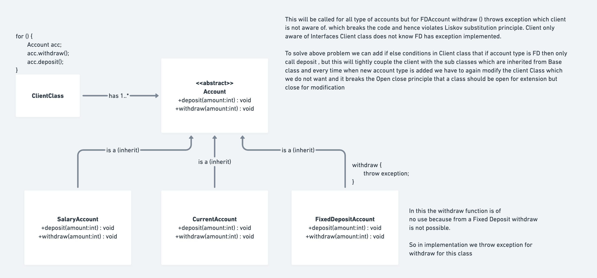
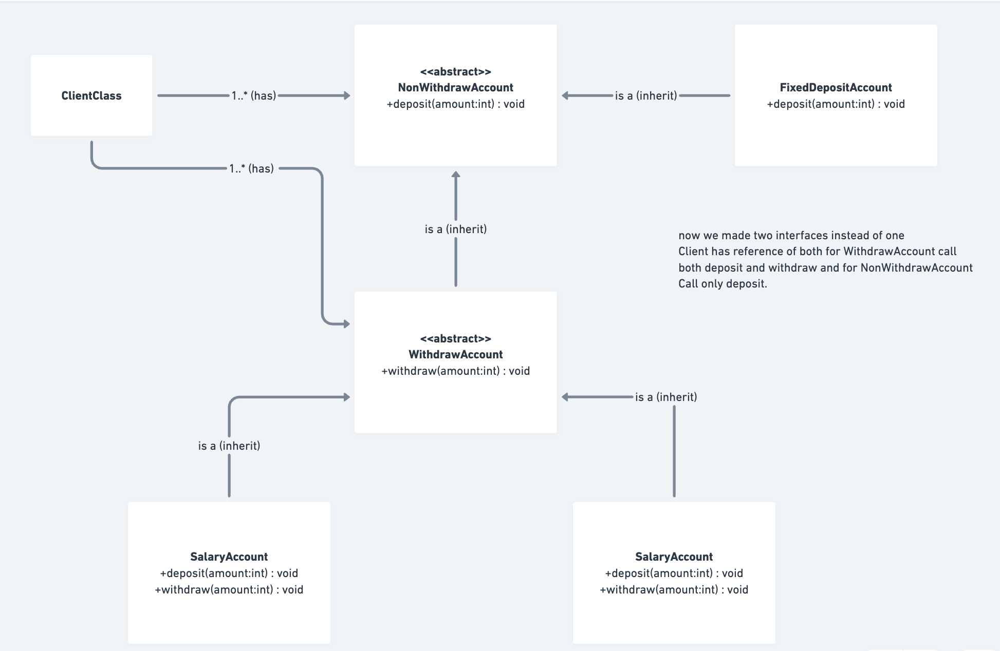

# Liskov Substitution Principle (LSP) - SOLID

This folder demonstrates the **Liskov Substitution Principle (LSP)**, the third principle of SOLID design principles.

## What is the Liskov Substitution Principle?

**Definition**: Objects of a superclass should be replaceable with objects of its subclasses without breaking the application.

**Key Idea**: If `S` is a subtype of `T`, then objects of type `T` in a program may be substituted with objects of type `S` without altering any of the desirable properties of that program.

In simpler terms:
- A derived class should be able to replace its base class without breaking the code
- If a function expects a parent class, it should work correctly with any child class
- Child classes should not weaken or break the contract defined by the parent

---

## Why LSP is Important?

1. **Predictable Polymorphism**: You can trust that subclasses behave as expected
2. **Code Reliability**: No surprising behavior changes when using different subclasses
3. **Maintainability**: Easier to understand and reason about the code
4. **Extensibility**: Easy to add new subclasses without fear of breaking existing code
5. **Loose Coupling**: Client code doesn't need to know about specific subclass implementations
6. **Prevents Defensive Programming**: No need for type checks and special handling in client code

---

## Real-world Example: Banking System

### ❌ LSP VIOLATED (Before)

**File**: `LSP_Violated.java`



The problem: `FixedDepositAccount` doesn't honor the `Account` contract:

```java
// Account interface defines a contract
interface Account {
    void deposit(double amount);
    void withdraw(double amount);  // All accounts should support withdrawal
}

// Most accounts work fine
class SavingsAccount implements Account {
    @Override
    public void withdraw(double amount) {
        // Works normally
        balance -= amount;
    }
}

// ❌ VIOLATES LSP - FixedDepositAccount breaks the contract
class FixedDepositAccount implements Account {
    @Override
    public void withdraw(double amount) {
        throw new UnsupportedOperationException("Withdrawals not allowed");
    }
}

// Client code expects all accounts to support withdrawals
class BankClient {
    public void performTransactions() {
        for (Account account : accounts) {
            account.deposit(100);
            account.withdraw(50);  // ❌ CRASHES for FixedDepositAccount!
        }
    }
}
```

**Problems with this approach:**

1. **Broken Substitutability**: Can't substitute FixedDepositAccount for Account
2. **Runtime Exceptions**: Unexpected exceptions thrown at runtime
3. **Violates the Contract**: FixedDepositAccount doesn't fulfill the Account contract
4. **Difficult to Use**: Client code can't rely on account behavior
5. **Bad Encapsulation**: Implementation details leak to client code

### ✅ LSP FOLLOWED (Correct Solution)

**File**: `LSP_Followed.java`



The solution: Use separate interfaces for different account types:

```java
// Interface 1: For accounts that only support deposits
interface DepositOnlyAccount {
    void deposit(double amount);
}

// Interface 2: Extends interface 1, adds withdrawal capability
interface WithdrawableAccount extends DepositOnlyAccount {
    void withdraw(double amount);
}

// Accounts that support both operations
class SavingsAccount implements WithdrawableAccount {
    @Override
    public void deposit(double amount) { /* ... */ }
    
    @Override
    public void withdraw(double amount) { /* ... */ }
}

// Fixed term accounts only support deposits
class FixedTermAccount implements DepositOnlyAccount {
    @Override
    public void deposit(double amount) { /* ... */ }
    // No withdraw method!
}

// Client code with proper separation
class BankClient {
    public void performTransactions() {
        // For deposit-only accounts
        for (DepositOnlyAccount account : depositOnlyAccounts) {
            account.deposit(4000);  // ✓ Safe - all support deposits
        }
        
        // For withdrawable accounts
        for (WithdrawableAccount account : withdrawableAccounts) {
            account.deposit(4000);
            account.withdraw(500);  // ✓ Safe - all support withdrawals
        }
    }
}
```

**Advantages:**

1. **Contract Honored**: Each interface defines what subclasses must support
2. **Substitutable**: Any implement of an interface works correctly
3. **No Runtime Surprises**: Compile-time safety ensures correct usage
4. **Clean Client Code**: No instanceof checks or exception handling needed
5. **Maintainable**: Adding new account types is straightforward

### ❌ LSP WRONGLY HANDLED (Client-Side Workaround)

**File**: `LSP_WronglyHandledClientSide.java`

What NOT to do - trying to fix LSP violation in client code:

```java
// ❌ WRONG - Checking type in client code
class BankClient {
    public void performTransactions() {
        for (Account account : accounts) {
            account.deposit(4000);
            
            // ❌ This is a BAD solution - violates LSP principles
            if (account instanceof FixedDepositAccount) {
                System.out.println("Skip withdraw for Fixed Deposit");
            } else {
                account.withdraw(1000);  // Only for other types
            }
        }
    }
}
```

**Why this is wrong:**

1. **Tight Coupling**: Client code depends on specific implementation (FixedDepositAccount)
2. **Violates OCP**: Modifying client code every time new account type is added
3. **Not Substitutable**: Proves LSP is still violated
4. **Maintenance Nightmare**: Client code must know about all account types
5. **Fragile Code**: Adding new account type breaks existing code

---

## Comparison: All Three Approaches

| Aspect | LSP Violated | LSP Wrongly Handled | LSP Followed |
|--------|------------|-------------------|------------|
| **Substitutability** | ❌ No | ❌ No | ✅ Yes |
| **Runtime Exceptions** | ❌ Yes | ✅ No | ✅ No |
| **Type Checks** | ❌ None (but could) | ❌ Yes | ✅ No |
| **Compile-time Safety** | ❌ No | ❌ No | ✅ Yes |
| **Code Coupling** | Medium | ❌ High | ✅ Low |
| **Maintainability** | ❌ Poor | ❌ Poor | ✅ Good |
| **Extensibility** | ❌ Difficult | ❌ Difficult | ✅ Easy |

---

## How to Run

```bash
# LSP Violated Example
javac LSP_Violated.java
java solid.liskov_substiuion_principle.LSP_Violated

# LSP Followed Example (Correct)
javac LSP_Followed.java
java solid.liskov_substiuion_principle.LSP_Followed

# LSP Wrongly Handled on Client Side (Bad workaround)
javac LSP_WronglyHandledClientSide.java
java solid.liskov_substiuion_principle.LSP_WronglyHandledClientSide
```

## Expected Output

### LSP_Followed Output:
```
Deposited: 4000 in Savings Account. New Balance: 4000
Withdrawn: 500 from Savings Account. New Balance: 3500
Deposited: 4000 in Current Account. New Balance: 4000
Withdrawn: 500 from Current Account. New Balance: 3500
Deposited: 4000 in Fixed Term Account. New Balance: 4000
```

### LSP_WronglyHandledClientSide Output:
```
Deposited: 4000 in Savings Account. New Balance: 4000
Amount left in Saving account : 3000
Deposited: 4000 in Current Account. New Balance: 4000
Amount left in Current account : 3000
Deposited: 4000 in Fixed Deposit Account. New Balance: 4000
Skip the withdraw Operation for FixedDepositAccount
```

---

## Interview Questions and Answers

### Q1: What is the Liskov Substitution Principle?
**A:** The Liskov Substitution Principle states that objects of a superclass should be replaceable with objects of its subclasses without breaking the application. If you can substitute a subclass for a superclass without causing issues, then LSP is being followed.

**Example**: If your code works with a `Vehicle` base class, it should work equally well with `Car`, `Bike`, or `Truck` subclasses without any special handling.

### Q2: Why is LSP important?
**A:** LSP is important because:
1. **Reliability**: Code behaves predictably with any subclass
2. **Maintainability**: No need for type checking or special cases
3. **Extensibility**: New subclasses can be added without modifying existing code
4. **Testability**: Easier to test with different subclass implementations
5. **Clean Code**: Avoids defensive programming patterns
6. **Trust in Polymorphism**: Can safely use polymorphic behavior

### Q3: How is LSP different from method overriding?
**A:**
- **Method Overriding**: Syntax feature - subclass provides different implementation
- **LSP**: Semantic principle - subclass implementation must maintain parent's contract

Not all method overrides follow LSP:

```java
// ✓ Proper override (follows LSP)
class Bird {
    void fly() { /* fly logic */ }
}
class Sparrow extends Bird {
    @Override
    void fly() { /* sparrow flies same way */ }
}

// ❌ Violates LSP (parent doesn't expect this behavior)
class Penguin extends Bird {
    @Override
    void fly() {
        throw new UnsupportedOperationException("Penguins can't fly");
    }
}
```

### Q4: What is the "contract" in LSP?
**A:** The contract is the set of behaviors/promises defined by the parent class:

```java
class Parent {
    // Contract: Should return positive number
    public int getValue() {
        return 10;
    }
}

class Child extends Parent {
    // ✓ Honors contract - returns positive
    @Override
    public int getValue() {
        return 20;
    }
}

class BadChild extends Parent {
    // ❌ Violates contract - returns negative
    @Override
    public int getValue() {
        return -10;  // Breaks contract!
    }
}
```

### Q5: What are some signs of LSP violation?
**A:** Watch for these warning signs:

1. **instanceof checks in client code**:
```java
if (obj instanceof SpecificType) {
    // Special handling for this subclass
}
```

2. **Type casting after polymorphic calls**:
```java
Animal animal = getAnimal();
if (animal instanceof Dog) {
    Dog dog = (Dog) animal;
    dog.bark();
}
```

3. **Exceptions thrown by subclass methods**:
```java
class Shape {
    void draw() { /* ... */ }
}
class SpecialShape extends Shape {
    @Override
    void draw() {
        throw new UnsupportedOperationException();
    }
}
```

4. **null checks for specific subclasses**:
```java
if (object != null && object.getClass().equals(SpecificClass.class)) {
    // Special handling
}
```

### Q6: How do you fix LSP violations?
**A:** Solutions depend on the violation type:

**Solution 1: Use Separate Interfaces**
```java
// Instead of one interface with all operations
interface BankAccount {  // ❌ Violates LSP
    void deposit();
    void withdraw();
    void transfer();
}

// Use focused interfaces
interface DepositableAccount { void deposit(); }
interface WithdrawableAccount { void withdraw(); }
interface TransferableAccount { void transfer(); }

// Each account implements only what it supports
class FixedDepositAccount implements DepositableAccount { }
class SavingsAccount implements DepositableAccount, WithdrawableAccount { }
```

**Solution 2: Use Composition**
```java
// Instead of inheritance-based type hierarchy
class AccountService {
    private Account account;  // Has-a relationship
    private WithdrawService withdrawService;
    private DepositService depositService;
}
```

**Solution 3: Design Better Hierarchy**
```java
// Instead of forcing all shapes to implement area/perimeter
interface Shape { }
interface TwoDimensionalShape extends Shape { double getArea(); }
interface ThreeDimensionalShape extends Shape { double getVolume(); }
```

### Q7: How is LSP related to contract design?
**A:** LSP is fundamentally about honoring contracts:

- **Preconditions**: Subclass shouldn't strengthen (require more) than parent
- **Postconditions**: Subclass shouldn't weaken (return less) than parent
- **Invariants**: Subclass should maintain class invariants from parent
- **Exceptions**: Subclass shouldn't throw unexpected exceptions

```java
class Parent {
    // Contract: Accepts any positive number
    public void process(int number) { }
}

class BadChild extends Parent {
    // ❌ Violates contract - strengthens precondition
    @Override
    public void process(int number) {
        if (number < 100) throw new Exception("Must be >= 100");
    }
}
```

### Q8: Can a subclass throw different exceptions than its parent?
**A:** **Limited extent**: A subclass can throw:
- ✓ Same exception as parent
- ✓ Subclass of parent's exception (narrower)
- ✗ New or broader exceptions (violates LSP)

```java
class Parent {
    void method() throws IOException { }
}

class GoodChild extends Parent {
    @Override
    void method() throws FileNotFoundException { }  // ✓ Subclass of IOException
}

class BadChild extends Parent {
    @Override
    void method() throws Exception { }  // ❌ Broader exception
}
```

### Q9: What is the relationship between LSP and inheritance?
**A:** LSP guides how inheritance should be used:

- **Inheritance**: "Is-a" relationship
- **LSP**: Ensures the relationship is meaningful and substitutable

```java
// ✓ Good inheritance - Penguin IS a Bird, but...
class Penguin extends Bird { }

// ❌ Problem: Bird contract includes flying, which Penguin can't do
```

Better approach:

```java
interface Bird { }
interface FlyingBird extends Bird { void fly(); }
interface SwimmingBird extends Bird { void swim(); }

class Penguin implements SwimmingBird { }  // ✓ Correct!
```

### Q10: How does LSP relate to polymorphism?
**A:** LSP ensures safe polymorphism:

```java
// ✓ LSP-compliant code - polymorphism works safely
List<Shape> shapes = new ArrayList<>();
shapes.add(new Circle());
shapes.add(new Square());

for (Shape shape : shapes) {
    shape.draw();  // ✓ Works safely for all shapes
}

// ❌ LSP violation - unsafe polymorphism
List<Animal> animals = new ArrayList<>();
animals.add(new Dog());
animals.add(new Penguin());

for (Animal animal : animals) {
    animal.fly();  // ❌ Penguin can't fly!
}
```

### Q11: Is it a problem if a subclass does MORE than the parent?
**A:** Yes, if the additional behavior affects the parent's contract:

```java
class Shape {
    void draw() { /* render shape */ }
}

class Shape3D extends Shape {
    @Override
    void draw() {
        // ✓ OK - still draws, just in 3D
        render3D();
    }
    
    // ❌ NOT OK if this affects draw() contract
    void draw() {
        if (lightingConditions < 0) {
            throw new Exception("Can't draw without light");
        }
        render3D();
    }
}
```

### Q12: What is the "Penguin Problem" in LSP?
**A:** The classic example of LSP violation:

```java
class Bird {
    void fly() { /* fly like normal bird */ }
}

class Penguin extends Bird {
    @Override
    void fly() {
        throw new UnsupportedOperationException("Penguins can't fly");
    }
}

// Client code breaks
void makeBirdFly(Bird bird) {
    bird.fly();  // ❌ Fails if bird is Penguin!
}
```

**Solution**: Better class hierarchy

```java
class Bird { /* common bird behavior */ }
class FlyingBird extends Bird { void fly(); }
class SwimmingBird extends Bird { void swim(); }
class Penguin extends SwimmingBird { /* implements swim */ }
```

### Q13: How do you test for LSP violations?
**A:** Use substitutability test:

```java
@Test
public void testSubstitutability() {
    // If any subclass replacement causes test failure, LSP is violated
    processWithBaseClass(new SubClass1());  // Should pass
    processWithBaseClass(new SubClass2());  // Should pass
    processWithBaseClass(new SubClass3());  // Should pass
}

void processWithBaseClass(BaseClass obj) {
    obj.doSomething();  // Should work same way for all subclasses
}
```

### Q14: Can you violate LSP unintentionally?
**A:** Yes, common unintentional violations:

```java
// ❌ Silently changing behavior
class Parent {
    public int getValue() { return 10; }  // Always returns positive
}

class Child extends Parent {
    @Override
    public int getValue() {
        Random rand = new Random();
        return rand.nextInt();  // Sometimes negative!
    }
}

// ❌ Adding input restrictions
class Parent {
    void process(int value) { /* process any int */ }
}

class Child extends Parent {
    @Override
    void process(int value) {
        if (value < 0) throw new Exception("Negative not allowed");
    }
}
```

### Q15: How does LSP enable the Open/Closed Principle (OCP)?
**A:** LSP ensures that OCP works correctly:

- **OCP**: Open for extension (new subclasses), closed for modification
- **LSP**: Ensures extensions (subclasses) don't break existing code

```java
// With LSP and OCP together
List<PaymentMethod> methods = new ArrayList<>();
methods.add(new CreditCard());
methods.add(new PayPal());
methods.add(new Bitcoin());  // New payment method (OCP)

for (PaymentMethod method : methods) {
    method.process(amount);  // Works for all (LSP)
}
```

---

## Best Practices for LSP

### 1. **Design Interfaces to Support Substitutability**
```java
// ✓ Good - narrow, specific interfaces
interface Drawable { void draw(); }
interface Saveable { void save(); }
interface Computable { int compute(); }

// ✗ Bad - too broad, forces implementations
interface AllInOne {
    void draw();
    void save();
    int compute();
    void transfer();
}
```

### 2. **Use Extract Interface When Needed**
```java
// If you have mixed capabilities, separate them
interface Persistable { void save(); void load(); }
interface Executable { void execute(); }

class Worker implements Persistable, Executable { }
```

### 3. **Follow the Contract Strictly**
```java
// Parent defines contract
interface Queue {
    void enqueue(Object item);      // Never returns null
    Object dequeue();               // Returns item or throws exception
}

// Child must honor contract
class PriorityQueue implements Queue {
    @Override
    public Object dequeue() {
        return highestPriorityItem;  // ✓ Never null or unexpected behavior
    }
}
```

### 4. **Document Expected Behavior**
```java
/**
 * Returns the age of the person.
 * @return age >= 0
 *         age <= 150
 *         never null
 */
int getAge() { }
```

### 5. **Use Abstract Base Classes for Refinement**
```java
abstract class Shape {
    abstract void draw();  // Core contract
    
    // Provide default implementations that subclasses can rely on
    double getArea() { return 0; }
}
```

---

## Common Mistakes and How to Avoid Them

### Mistake 1: Forcing Incompatible Subclasses into Hierarchy
```java
// ❌ Wrong - Rectangle and Square don't follow same rules
class Rectangle {
    void setWidth(double w) { /* ... */ }
    void setHeight(double h) { /* ... */ }
}

class Square extends Rectangle {
    @Override
    void setWidth(double w) {
        this.width = w;
        this.height = w;  // Violates Rectangle's contract!
    }
}

// ✓ Better - use separate interfaces
interface Resizable { setWidth(double w); setHeight(double h); }
interface FixedSize { getWidth(); getHeight(); }
```

### Mistake 2: Weakening Preconditions (Requiring Less)
```java
// ✓ OK - Child accepts same or broader range
class Parent {
    public void process(String nonNull) {  // Requires non-null
        if (nonNull == null) throw new Exception();
    }
}

class Child extends Parent {
    @Override
    public void process(String s) {
        if (s == null) s = "";  // ✓ Now accepts null
    }
}

// ❌ Wrong - Child strengthens precondition
class BadChild extends Parent {
    @Override
    public void process(String s) {
        if (s.length() < 5) throw new Exception("Min 5 chars");  // Violates!
    }
}
```

### Mistake 3: Strengthening Postconditions (Requiring More)
```java
// ❌ Wrong - Child returns something more restrictive
class Parent {
    public Number getNumber() { return any number }
}

class Child extends Parent {
    @Override
    public Number getNumber() {
        return only positive numbers;  // Violates contract!
    }
}
```

---

## Real-World LSP Applications

### 1. Collections Framework
```java
// LSP in Java Collections
List<Integer> list = new ArrayList<>();  // or LinkedList, Vector
list.add(5);
list.get(0);
// Any List implementation works the same way
```

### 2. JDBC Database Drivers
```java
// Any database driver implements Connection interface
Connection conn = DriverManager.getConnection(url);
// Could be MySQL, Oracle, PostgreSQL - client code doesn't care
java.sql.Statement stmt = conn.createStatement();
```

### 3. Message Queues
```java
interface MessageQueue {
    void send(Message msg);
    Message receive();
}

// Could be RabbitMQ, Kafka, ActiveMQ - all substitutable
MessageQueue queue = getMessageQueue();
queue.send(message);
```

---

## Checklist for LSP Implementation

- [ ] Can you replace parent class with any subclass without errors?
- [ ] Do subclasses honor the parent's contract?
- [ ] Are there no type checks (instanceof) in client code?
- [ ] Do subclasses not throw unexpected exceptions?
- [ ] Can subclasses be used polymorphically without issues?
- [ ] Are preconditions not strengthened by subclasses?
- [ ] Are postconditions not weakened by subclasses?
- [ ] Are class invariants maintained by subclasses?
- [ ] Do all subclasses fulfill the parent interface?
- [ ] Would adding a new subclass require modifying client code?

---

## Conclusion

The Liskov Substitution Principle is crucial for writing reliable polymorphic code. By ensuring that:

✓ **Subclasses are truly substitutable**: Clients can use any subclass safely
✓ **Contracts are honored**: Parent and child maintain consistent behavior
✓ **Polymorphism is predictable**: No surprises with different subclass implementations
✓ **Extensions are safe**: New subclasses don't break existing code

You create:
- 🛡️ **Robust Code**: Fewer runtime surprises
- 🔧 **Maintainable Code**: Easier to reason about behavior
- 📈 **Scalable Code**: Easy to add new types
- 🧪 **Testable Code**: Can test with any subclass implementation

Remember: LSP is about maintaining trust in your inheritance hierarchy. If you can substitute a parent with a child without breaking anything, you've got a clean, LSP-compliant design.
