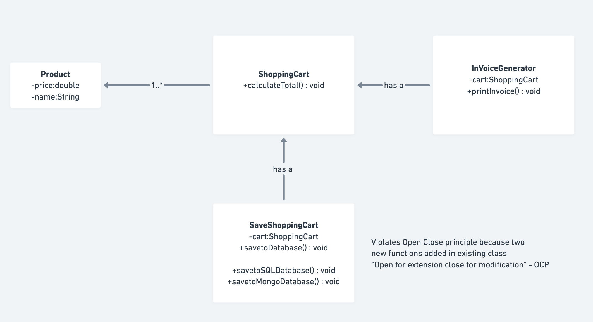
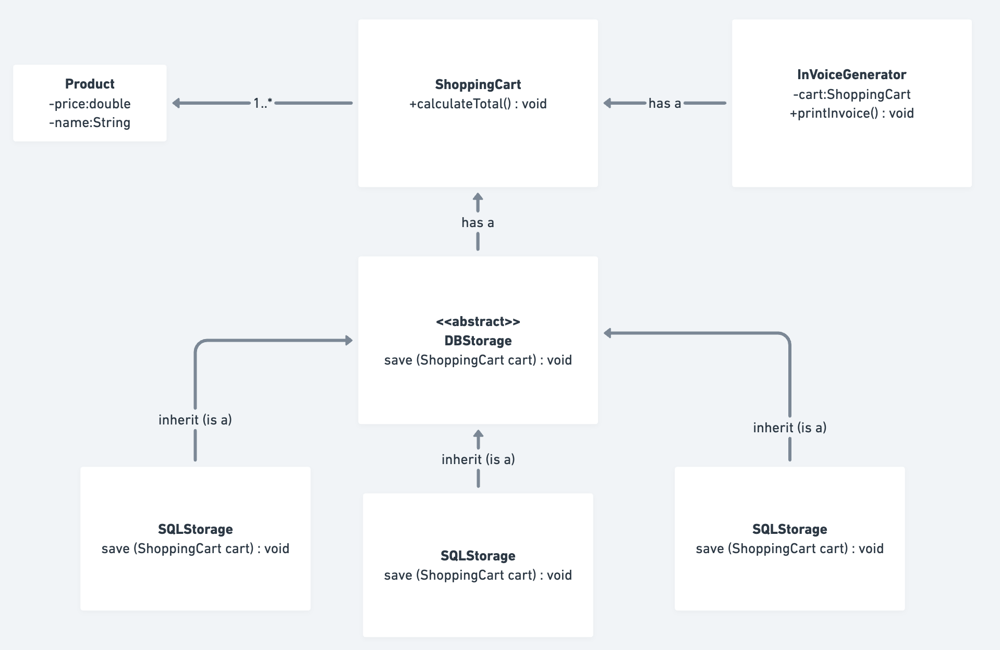

# Open/Closed Principle (OCP) - SOLID

This folder demonstrates the **Open/Closed Principle (OCP)**, the second principle of SOLID design principles.

## What is the Open/Closed Principle?

**Definition**: Software entities (classes, modules, functions) should be **OPEN for extension but CLOSED for modification**.

**Key Idea**: 
- **Open for Extension**: You should be able to add new functionality
- **Closed for Modification**: You should NOT need to modify existing code to add new functionality

In simpler terms:
- When you need new features, ADD new classes, don't MODIFY existing ones
- Use abstraction (interfaces/abstract classes) to allow extension
- Base classes should remain stable while child classes provide the extension

---

## Why OCP is Important?

1. **Reduced Risk of Breaking Changes**: Existing code remains untouched, reducing bugs
2. **Better Maintainability**: Changes are isolated to new classes
3. **Improved Extensibility**: Easy to add new features without modifying existing code
4. **Better Testability**: No need to retest existing code when adding features
5. **Loose Coupling**: Classes depend on abstractions, not concrete implementations
6. **Follow the Don't Repeat Yourself (DRY) Principle**: Reuse base code without modification

---

## Real-world Example: E-Commerce Database Storage

### ❌ OCP VIOLATED (Before)

**File**: `OCPViolated.java`



The `ShoppingCartStorage` class violates OCP:

```java
class ShoppingCartStorage {
class ShoppingCartStorage {
    private ShoppingCart shoppingCart;

    public ShoppingCartStorage(ShoppingCart shoppingCart) {
        this.shoppingCart = shoppingCart;
    }

    // Initially only saves to generic DB
    public void saveToDatabase(ShoppingCart shoppingCart) {
        System.out.println("Saving shopping cart to database...");
    }

    // ❌ VIOLATES OCP - Modifying existing class to add new functionality
    public void saveToSQLDB(ShoppingCart shoppingCart) {
        System.out.println("Saving shopping cart to SQL database...");
    }

    // ❌ VIOLATES OCP - Adding yet another method
    public void saveToMongoDB(ShoppingCart shoppingCart) {
        System.out.println("Saving shopping cart to MongoDB database...");
    }
}
```

**Problems with this approach:**

1. **Modification Instead of Extension**: 
   - Every new database type requires modifying the existing class
   - Not following "open for extension, closed for modification"

2. **Risk of Breaking Existing Code**:
   - Each modification increases the risk of introducing bugs
   - Existing methods might be affected

3. **Violation of Single Responsibility**:
   - Class now handles multiple database types (another violation!)

4. **Difficult to Test**:
   - Each modification requires retesting the entire class

5. **Not Scalable**:
   - What if you need 10 different database types? Add 10 methods?

### ✅ OCP FOLLOWED (After)

**File**: `OCPFollowed.java`



Each storage type is a separate class implementing an interface:

```java
// Interface: Abstracts the storage behavior
interface DBStorage {
    void save(ShoppingCart shoppingCart);
}

// SQL Storage: Implements DBStorage
class SQLStorage implements DBStorage {
    @Override
    public void save(ShoppingCart shoppingCart) {
        System.out.println("Saving shopping cart data to SQL database...");
    }
}

// MongoDB Storage: Implements DBStorage
class MongoDBStorage implements DBStorage {
    @Override
    public void save(ShoppingCart shoppingCart) {
        System.out.println("Saving shopping cart data to MongoDB database...");
    }
}

// File Storage: Implements DBStorage
class FileStorage implements DBStorage {
    @Override
    public void save(ShoppingCart shoppingCart) {
        System.out.println("Saving shopping cart data to file...");
    }
}

// Using the storage (no modification needed)
DBStorage storage = new SQLStorage();
storage.save(cart);

// Adding new storage type (no existing code modified)
DBStorage fileStorage = new FileStorage();
fileStorage.save(cart);
```

**Advantages:**

1. **Open for Extension**:
   - Add new storage types by creating new classes
   - No modification to existing code required

2. **Closed for Modification**:
   - Original DBStorage interface and implementations remain unchanged
   - No risk of breaking existing functionality

3. **Single Responsibility**:
   - Each class handles one storage type only

4. **Easy to Test**:
   - Each storage implementation can be tested independently

5. **Highly Scalable**:
   - Add 100 new storage types without touching existing code

6. **Follows Strategy Pattern**:
   - DBStorage interface acts as the strategy
   - Different implementations are concrete strategies

---

## Comparison: Violated vs Followed

| Aspect | OCP Violated | OCP Followed |
|--------|------------|------------|
| **New Feature** | Modify existing class | Create new class |
| **Class Count** | 1 (grows with methods) | N (one per storage type) |
| **Interface** | No abstraction | Interface provided |
| **Risk** | High (modifying existing code) | Low (only adding new code) |
| **Testability** | Difficult | Easy |
| **Scalability** | Poor | Excellent |
| **Maintenance** | Difficult | Easy |
| **Code Smell** | Many if-else or switch statements | None |

---

## How to Run

```bash
# OCP Violated Example
javac OCPViolated.java
java solid.open_close_principle.OCPViolated

# OCP Followed Example
javac OCPFollowed.java
java solid.open_close_principle.OCPFollowed
```

## Expected Output

### OCPFollowed Output:
```
Shopping Cart Invoice:
Laptop - Rs 1000.0
Mouse - Rs 50.0
Total: Rs 1050.0

Total value to be store : 1050.0
Saving shopping cart data to SQL database...

Total value to be store : 1050.0
Saving shopping cart data to MongoDB database...

Saving shopping cart data to file...
```

---

## Interview Questions and Answers

### Q1: What is the Open/Closed Principle?
**A:** The Open/Closed Principle states that software entities should be **open for extension but closed for modification**. This means:
- You should be able to extend functionality by adding new code
- You should NOT need to modify existing code to add new functionality
- This is achieved through abstraction (interfaces, abstract classes)

**Example**: Instead of modifying a PaymentProcessor class to add new payment methods, create an interface and implement it for each payment type.

### Q2: Why is OCP important?
**A:** OCP is important because:
1. **Reduces Risk**: No modification = no risk of breaking existing code
2. **Better Maintainability**: Changes are isolated to new classes
3. **Improved Testing**: No need to retest existing code
4. **Scalability**: Easy to add new features
5. **Loose Coupling**: Code depends on abstractions, not concrete implementations
6. **Team Collaboration**: Multiple developers can add features independently

### Q3: What is the difference between "Open for Extension" and "Closed for Modification"?
**A:**
- **Open for Extension**: You can add new functionality to the system
  - New classes, new methods, new implementations
- **Closed for Modification**: Existing code (base classes, interfaces) doesn't change
  - Reduce risk, maintain stability, protect existing tests

```java
// Open for Extension - You CAN do this
class NewDatabaseStorage implements DBStorage { }  // ✓ Add new class

// Closed for Modification - You CANNOT do this
interface DBStorage {  // ✗ Don't modify existing interface
    void save(ShoppingCart cart);
    void delete(int id);  // ✗ Don't add new methods to existing interface
}
```

### Q4: How do you achieve OCP?
**A:** OCP is achieved through abstraction:

1. **Use Interfaces/Abstract Classes**: Define contracts/abstractions
2. **Dependency Injection**: Depend on abstractions, not concrete classes
3. **Polymorphism**: Use runtime polymorphism for flexibility
4. **Strategy Pattern**: Different implementations for different behaviors
5. **Decorator Pattern**: Add behavior without modifying original class
6. **Template Method Pattern**: Define skeleton, let subclasses fill in details

### Q5: Can you provide a real-world example of OCP?
**A:** E-Commerce Payment Processing:

```java
// ❌ Without OCP
class PaymentProcessor {
    void processPayment(String type, double amount) {
        if (type.equals("CreditCard")) {
            // Process credit card
        } else if (type.equals("PayPal")) {
            // Process PayPal
        } else if (type.equals("Bitcoin")) {
            // Process Bitcoin
        }
        // Adding new payment type requires modifying this method!
    }
}

// ✅ With OCP
interface PaymentMethod {
    void pay(double amount);
}

class CreditCardPayment implements PaymentMethod { }
class PayPalPayment implements PaymentMethod { }
class BitcoinPayment implements PaymentMethod { }
class ApplePayPayment implements PaymentMethod { }  // New - no modification needed!
```

### Q6: What design patterns support OCP?
**A:** Several design patterns naturally support OCP:

1. **Strategy Pattern**: Different strategies (implementations) for different behaviors
2. **Decorator Pattern**: Add behavior without modifying original class
3. **Observer Pattern**: Extend system by adding listeners
4. **Factory Pattern**: Create objects without knowing concrete types
5. **Template Method**: Define algorithm structure, let subclasses implement details
6. **State Pattern**: Different states implement same interface

### Q7: What is the relationship between OCP and polymorphism?
**A:** Polymorphism is the mechanism that enables OCP:

- Polymorphism allows you to write code that works with parent types
- Subclasses can provide different implementations
- At runtime, the correct implementation is called based on actual object type
- This allows extension without modification

```java
// Parent type reference
PaymentMethod payment = new CreditCardPayment();  // or PayPalPayment, etc.

// Same method call, different behavior based on actual type
payment.pay(100);  // Polymorphic call - works with ANY PaymentMethod
```

### Q8: How does OCP relate to SRP?
**A:** Both are about single responsibility but from different angles:

- **SRP**: Each class should have ONE reason to change (responsibility)
- **OCP**: Class should NOT need to change when new requirements come (extension instead of modification)

Together:
- SRP makes code focused
- OCP makes code extensible
- Both improve maintainability

### Q9: Can you violate OCP unintentionally?
**A:** Yes! Watch for these signs of OCP violation:

1. **if-else or switch statements based on type**:
```java
// ❌ Adding new type requires modification
if (storageType == "SQL") { }
else if (storageType == "MongoDB") { }
else if (storageType == "File") { }  // Modify existing method!
```

2. **Hardcoded type checks**:
```java
if (obj instanceof SQLStorage) { }
else if (obj instanceof MongoStorage) { }
```

3. **Constants for type identification**:
```java
public static final int SQL = 1;
public static final int MONGO = 2;
public static final int FILE = 3;  // Adding new type requires adding new constant
```

### Q10: What is the difference between OCP and Extension through Inheritance?
**A:**
- **Inheritance Extension**: Subclass overrides parent methods
  - ```java
    class Animal { void makeSound() { } }
    class Dog extends Animal { void makeSound() { } }
    ```
  
- **OCP Extension**: Implement new class from interface/abstract class
  - ```java
    interface Animal { void makeSound(); }
    class Dog implements Animal { void makeSound() { } }
    ```

**OCP Approach is Better** because:
- Avoids tight coupling
- Supports composition over inheritance
- More flexible and maintainable

### Q11: Is OCP always achievable?
**A:** OCP is an ideal, not always perfectly achievable:

**Realistic situations:**
1. **Some modification is inevitable**: Low-level APIs might need updates
2. **Performance vs OCP**: Sometimes violating OCP improves performance
3. **Simplicity vs OCP**: Simple problems don't need full OCP implementation
4. **Library evolution**: Even well-designed libraries need some modifications

**Goal**: Minimize modifications, maximize extensions. Aim for 80/20 rule.

### Q12: How do you test OCP-compliant code?
**A:** OCP code is easier to test:

```java
// Mock interface implementation for testing
class MockStorage implements DBStorage {
    private List<ShoppingCart> savedCarts = new ArrayList<>();
    
    @Override
    public void save(ShoppingCart cart) {
        savedCarts.add(cart);
    }
    
    public List<ShoppingCart> getSavedCarts() {
        return savedCarts;
    }
}

// Test without executing real database
@Test
public void testSaving() {
    DBStorage storage = new MockStorage();
    cart.addProduct(new Product("Laptop", 1000));
    storage.save(cart);
    // Verify without database interaction
}
```

### Q13: What is the relationship between OCP and Design Patterns?
**A:** Most design patterns are implementations of OCP:

- **Creational Patterns** (Factory, Builder): Decouple object creation
- **Structural Patterns** (Decorator, Adapter): Add functionality without modification
- **Behavioral Patterns** (Strategy, State): Different behaviors for different contexts
- **Architectural Patterns** (MVC, Plugin Architecture): Extensible systems

### Q14: How do you refactor code to follow OCP?
**A:** Process:

1. **Identify Extension Points**: What might change in the future?
2. **Create Abstraction**: Interface or abstract class
3. **Move Concrete Logic**: Implement interface with concrete classes
4. **Introduce Dependency Injection**: Inject abstractions instead of concrete types
5. **Test Thoroughly**: Ensure behavior remains the same
6. **Update Clients**: Use abstraction instead of concrete types

**Example Refactoring**:
```java
// Before (Violates OCP)
class ReportGenerator {
    void generateReport(String format) {  // Future: need new formats?
        if (format.equals("PDF")) { }
        else if (format.equals("Excel")) { }
    }
}

// After (Follows OCP)
interface ReportFormatter {
    void format(ReportData data);
}

class PDFFormatter implements ReportFormatter { }
class ExcelFormatter implements ReportFormatter { }
class JSONFormatter implements ReportFormatter { }  // New format - no modification!

class ReportGenerator {
    void generateReport(ReportFormatter formatter) {
        formatter.format(data);  // Works with any formatter
    }
}
```

### Q15: Can you give an example of OCP in Java Collections Framework?
**A:** Yes! The Collections Framework is a great example of OCP:

```java
// List interface (closed for modification)
List<String> list;

// Open for extension - can be any implementation
list = new ArrayList<>();  // Or LinkedList, Vector, CopyOnWriteArrayList, etc.

// Client code doesn't change, just inject different implementation
public void processData(List<String> data) {
    for (String item : data) { }  // Works with ANY List implementation
}
```

New implementations (like CopyOnWriteArrayList for thread-safety) can be added without changing:
- The List interface
- The client code
- Existing implementations

---

## Best Practices for OCP

### 1. **Use Abstractions (Interfaces/Abstract Classes)**
```java
// ✓ Good - Depends on abstraction
public class OrderService {
    private PaymentProcessor processor;  // Abstraction
}

// ✗ Bad - Depends on concrete class
public class OrderService {
    private CreditCardProcessor processor;  // Concrete implementation
}
```

### 2. **Identify Variation Points**
Ask: "What might change in the future?"
- Different payment methods? → Create PaymentMethod interface
- Different storage types? → Create Storage interface
- Different notification channels? → Create Notifier interface

### 3. **Design for Interfaces, Not Implementations**
```java
// ✓ Good - Depend on interface
void processPayment(PaymentMethod method) { }

// ✗ Bad - Depends on concrete type
void processPayment(CreditCardPayment payment) { }
```

### 4. **Use Dependency Injection**
```java
// ✓ Good - Inject dependency
class OrderService {
    private PaymentProcessor processor;
    
    public OrderService(PaymentProcessor processor) {
        this.processor = processor;
    }
}

// ✗ Bad - Create internally (tight coupling)
class OrderService {
    private PaymentProcessor processor = new CreditCardProcessor();
}
```

### 5. **Avoid Hardcoding Type Checks**
```java
// ✗ Bad - Type checking (OCP violation)
if (obj instanceof CreditCard) { }
else if (obj instanceof PayPal) { }

// ✓ Good - Polymorphism instead
paymentMethod.process(amount);  // Works for any type
```

### 6. **Follow the Liskov Substitution Principle**
```java
// ✓ Good - Subclass is substitutable for parent
class SQLStorage implements DBStorage { }

// ✗ Bad - Different behavior breaks substitutability
class SQLStorage implements DBStorage {
    @Override
    public void save(ShoppingCart cart) {
        throw new UnsupportedOperationException();  // Not truly implementing contract
    }
}
```

---

## Common Mistakes and How to Avoid Them

### Mistake 1: Over-Abstracting Simple Code
```java
// ✗ Over-engineered for simple case
interface StringFormatter {
    String format(String input);
}
class SimpleStringFormatter implements StringFormatter { }
class UpperCaseStringFormatter implements StringFormatter { }

// ✓ Better for simple case (just keep it simple)
String.toUpperCase();  // Built-in methods are fine
```

**Key**: Use OCP judgment - don't abstract everything, only variation points.

### Mistake 2: Creating Too Many Interfaces
```java
// ✗ Too many interfaces (over-engineering)
interface Saveable { }
interface Updatable { }
interface Deletable { }
interface Findable { }

// ✓ Better - One interface with clear responsibility
interface Repository {
    void save(Object obj);
    void update(Object obj);
    void delete(Object obj);
    Object find(String id);
}
```

### Mistake 3: Ignoring the Single Responsibility Principle
```java
// ✗ One class with multiple concerns (violates SRP + OCP)
class UserManager {
    void createUser() { }
    void sendEmail() { }
    void saveToDatabase() { }
}

// ✓ Better - Separate concerns
class User { }
class UserRepository { void save(User user) { } }
class EmailService { void send(String email) { } }
```

### Mistake 4: Making Everything Public
```java
// ✗ Too public - clients might depend on internal details
public class StorageFactory {
    public static DBStorage storage;  // Direct access to internal state
}

// ✓ Better - Hidden implementation details
public class StorageFactory {
    public static DBStorage createStorage(String type) { }  // Factory method
}
```

---

## Real-World Application: Multi-Database Application

```java
// ✓ Each storage type is separate, no modification needed
interface DatabaseStorage {
    void insert(Object data);
    void update(Object data);
    void delete(String id);
    Object retrieve(String id);
}

class MySQLStorage implements DatabaseStorage {
    public void insert(Object data) { /* MySQL logic */ }
    public void update(Object data) { /* MySQL logic */ }
    public void delete(String id) { /* MySQL logic */ }
    public Object retrieve(String id) { /* MySQL logic */ }
}

class MongoDBStorage implements DatabaseStorage {
    public void insert(Object data) { /* MongoDB logic */ }
    public void update(Object data) { /* MongoDB logic */ }
    public void delete(String id) { /* MongoDB logic */ }
    public Object retrieve(String id) { /* MongoDB logic */ }
}

class PostgreSQLStorage implements DatabaseStorage {
    public void insert(Object data) { /* PostgreSQL logic */ }
    public void update(Object data) { /* PostgreSQL logic */ }
    public void delete(String id) { /* PostgreSQL logic */ }
    public Object retrieve(String id) { /* PostgreSQL logic */ }
}

// Add new database type without modifying anything!
class CassandraStorage implements DatabaseStorage {
    public void insert(Object data) { /* Cassandra logic */ }
    public void update(Object data) { /* Cassandra logic */ }
    public void delete(String id) { /* Cassandra logic */ }
    public Object retrieve(String id) { /* Cassandra logic */ }
}

// Client code works with any storage
class DataService {
    private DatabaseStorage storage;
    
    public DataService(DatabaseStorage storage) {
        this.storage = storage;
    }
    
    public void saveData(Object data) {
        storage.insert(data);  // Works with ANY database!
    }
}
```

---

## Comparison with Real Standard Libraries

### Java Stream API - OCP Example
```java
// Extension without modification
Stream<Integer> nums = Arrays.stream(new int[]{1, 2, 3});

// Different implementations, same interface
nums.filter(n -> n > 1)
    .map(n -> n * 2)
    .forEach(System.out::println);

// Add custom operations without modifying Stream interface
Stream<Integer> custom = nums.flatMap(n -> Stream.of(n, n*2));
```

### JDBC - OCP Example
```java
// Depends on abstraction
Connection connection;  // Can be MySQL, Oracle, PostgreSQL, etc.

// Different implementations, same interface
connection = DriverManager.getConnection("jdbc:mysql://...");
connection = DriverManager.getConnection("jdbc:oracle:...");
connection = DriverManager.getConnection("jdbc:postgresql:...");
```

---

## Checklist for OCP Implementation

- [ ] Does the class have only one reason to extend (but closed for modification)?
- [ ] Are variation points identified and abstracted?
- [ ] Is there an abstract class or interface that defines the contract?
- [ ] Are concrete implementations separate classes?
- [ ] Do clients depend on abstractions, not concrete types?
- [ ] Can you add new functionality without modifying existing classes?
- [ ] Is dependency injection used for loose coupling?
- [ ] Are there no hardcoded type checks (if-else on type)?
- [ ] Can new implementations be added easily?
- [ ] Are existing tests still passing when new implementations are added?

---

## Conclusion

The Open/Closed Principle is fundamental to building extensible, maintainable software. By designing systems to be:

✓ **Open for Extension**: Adding new features is easy
✓ **Closed for Modification**: Existing code remains stable
✓ **You Create**: Flexible systems that adapt to change

Key Takeaways:
1. Think about future variation points
2. Use abstraction (interfaces/abstract classes) to enable extension
3. Depend on abstractions, not concrete implementations
4. Prefer composition and polymorphism over modification
5. Use design patterns to enable OCP compliance

Remember: OCP is not about being perfect, but about minimizing modifications while maximizing extensions. Aim for a balance between simplicity and extensibility.
