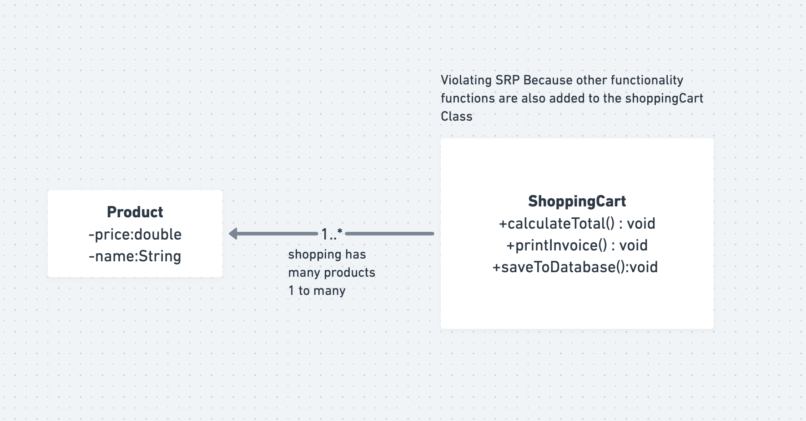
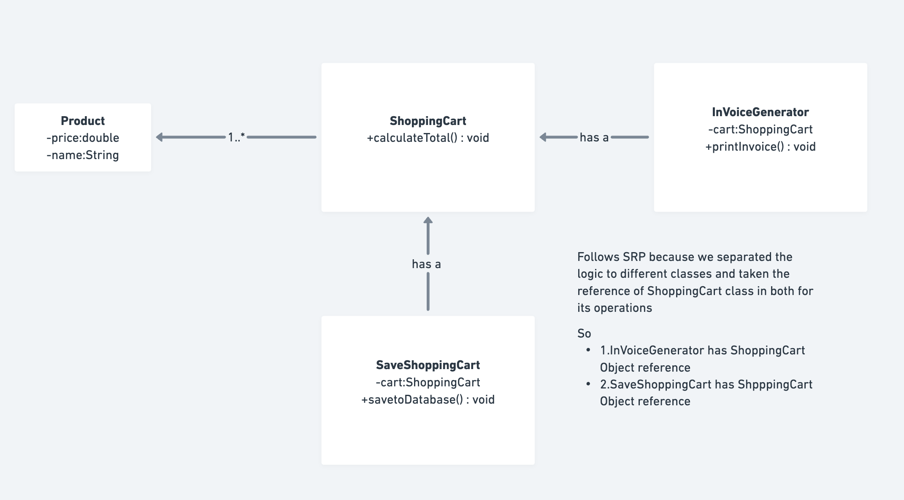

# Single Responsibility Principle (SRP) - SOLID

This folder demonstrates the **Single Responsibility Principle (SRP)**, the first principle of SOLID design principles.

## What is the Single Responsibility Principle?

**Definition**: A class should have only one reason to change, or in other words, a class should have only one job or responsibility.

**Key Idea**: A module should be responsible to one, and only one, actor or user story.

In simpler terms:
- Each class should do ONE thing
- Each class should have ONE reason to change
- Each class should have ONE job or responsibility

## Why SRP is Important?

1. **Easier Maintenance**: If a class has only one responsibility, changes to that responsibility won't affect other parts of the code
2. **Better Reusability**: Classes with single responsibility are easier to reuse in different contexts
3. **Reduced Complexity**: Smaller, focused classes are easier to understand
4. **Improved Testability**: Classes with single responsibility are easier to unit test
5. **Flexibility**: Changes to one responsibility don't impact unrelated functionality

---

## Real-world Example: E-Commerce Shopping Cart

### ❌ SRP VIOLATED (Before)

**File**: `SRPViolated.java`



The `ShoppingCart` class has multiple responsibilities:

```java
class ShoppingCart {
    private List<Product> products;
    
    // Responsibility 1: Manage products
    public void addProduct(Product product) { }
    
    // Responsibility 2: Calculate totals
    public double calculateTotal() { }
    
    // Responsibility 3: Process checkout
    public void checkout() { }
    
    // ❌ Responsibility 4: Print invoices (VIOLATES SRP)
    public void printInvoice() { }
    
    // ❌ Responsibility 5: Save to database (VIOLATES SRP)
    public void saveToDatabase() { }
}
```

**Problems with this approach:**

1. **Multiple Reasons to Change**:
   - If invoice format changes → modify ShoppingCart
   - If database changes → modify ShoppingCart
   - If checkout logic changes → modify ShoppingCart
   - If tax calculation changes → modify ShoppingCart

2. **Difficult to Test**: You have to set up the entire shopping cart to test invoice printing

3. **Hard to Reuse**: If you want to use invoice printing elsewhere, you can't without importing ShoppingCart

4. **Code Fragility**: Changes in one area can unexpectedly break another area

5. **Difficult to Understand**: The class does too many things, making it harder to understand

### ✅ SRP FOLLOWED (After)

**File**: `SRPFollowed.java`



Each class has a single responsibility:

```java
// Responsibility 1: Manage products in cart
class ShoppingCart {
    private List<Product> products;
    
    public void addProduct(Product product) { }
    public List<Product> getProducts() { }
    public double calculateTotal() { }
    public void checkout() { }
}

// Responsibility 2: Print invoices
class InvoicePrinter {
    private ShoppingCart shoppingCart;
    
    public void printInvoice() { }
}

// Responsibility 3: Save to database
class ShoppingCartStorage {
    private ShoppingCart shoppingCart;
    
    public void saveToDatabase() { }
}
```

**Advantages:**

1. **Single Reason to Change**:
   - ShoppingCart changes only if cart management logic changes
   - InvoicePrinter changes only if invoice format changes
   - ShoppingCartStorage changes only if database changes

2. **Easy to Test**: Test each class in isolation

3. **Reusable**: InvoicePrinter can be used anywhere you need to print invoices

4. **Flexible**: Easy to add new functionality (e.g., EmailInvoiceSender, PDFInvoicePrinter)

5. **Clear Intent**: Each class clearly states what it does

---

## Comparison: Violated vs Followed

| Aspect | SRP Violated | SRP Followed |
|--------|------------|------------|
| **Classes** | 2 (Product, ShoppingCart) | 4 (Product, ShoppingCart, InvoicePrinter, ShoppingCartStorage) |
| **Responsibilities per class** | Multiple | Single |
| **Reasons to change** | Many | One per class |
| **Testability** | Hard | Easy |
| **Reusability** | Low | High |
| **Maintainability** | Difficult | Easy |
| **Extensibility** | Hard to extend | Easy to extend |

---

## How to Run

```bash
# SRP Violated Example
javac SRPViolated.java
java solid.single_responsibility_principle.SRPViolated

# SRP Followed Example
javac SRPFollowed.java
java solid.single_responsibility_principle.SRPFollowed
```

## Expected Output

Both examples produce similar output:
```
Checking out the Cart with total: 51500.0
Shopping Cart Invoice:
Laptop - Rs 50000.0
Mouse - Rs 1500.0
Total: Rs 51500.0
```

But the code structure and maintainability differ significantly.

---

## Interview Questions and Answers

### Q1: What is the Single Responsibility Principle?
**A:** The Single Responsibility Principle states that a class should have only one reason to change. This means each class should have only one job or responsibility. If a class has multiple reasons to change, it violates SRP.

**Example**: A User class should only be responsible for user data, not for sending emails or logging to database.

### Q2: Why is SRP important in software design?
**A:** SRP is important because:
1. **Maintainability**: Easier to locate and fix bugs
2. **Testability**: Easier to write unit tests
3. **Reusability**: Classes can be reused in different contexts
4. **Flexibility**: Changes in one responsibility don't affect others
5. **Team Collaboration**: Multiple developers can work on different responsibilities

### Q3: What does "reason to change" mean in SRP?
**A:** "Reason to change" refers to any requirement or actor that would necessitate modifying a class. For example:
- A `User` class has reasons to change if:
  - User data format changes
  - User validation rules change
  - User persistence mechanism changes ❌ (This is a second reason - violates SRP)

### Q4: What is the difference between SRP and modularity?
**A:** 
- **Modularity**: Dividing code into separate modules/packages
- **SRP**: Each module/class has only ONE responsibility

A module can have multiple classes with different responsibilities (violates SRP), while SRP is about having a single responsibility per class.

### Q5: Can a class have multiple methods and still follow SRP?
**A:** Yes! A class can have multiple methods as long as all methods serve a **single responsibility**. For example:

```java
// ✓ FOLLOWS SRP - All methods related to invoice printing
class InvoicePrinter {
    void printInvoice() { }
    void formatInvoiceHeader() { }
    void formatInvoiceFooter() { }
    void calculateInvoiceTax() { }
}

// ✗ VIOLATES SRP - Mixed responsibilities
class InvoicePrinter {
    void printInvoice() { }
    void sendEmailNotification() { }  // Different responsibility
    void saveToDatabase() { }  // Different responsibility
}
```

### Q6: How do you identify violations of SRP?
**A:** Watch for these signs:
1. **Multiple reasons to change**: If reasons to change are unrelated
2. **Generic names**: Classes named "Handler", "Manager", "Processor", "Service"
3. **And keyword**: If you describe a class as "X AND Y", it likely violates SRP
4. **Large classes**: More than 300-400 lines often indicates multiple responsibilities
5. **Tests are hard to write**: Difficult to test in isolation
6. **Multiple reasons in documentation**: Class description mentions unrelated tasks

```java
// ❌ "AND" indicates multiple responsibilities
class UserManager {  // Manages users AND handles authentication AND updates profiles
    void addUser() { }
    void authenticateUser() { }
    void handlePasswordReset() { }
}
```

### Q7: What are the benefits of following SRP?
**A:**
1. **Easier Testing**: Each class tested independently
2. **Better Reusability**: Single-responsibility classes are more reusable
3. **Reduced Coupling**: Classes depend on fewer things
4. **Easier Maintenance**: Changes are isolated to specific classes
5. **Improved Readability**: Code is easier to understand
6. **Flexibility**: Easy to add new functionality without modifying existing code
7. **Team Productivity**: Multiple developers can work on different responsibilities

### Q8: What are the drawbacks or challenges of SRP?
**A:**
1. **More Classes**: Results in more files to manage
2. **Complexity**: More classes mean more complexity initially
3. **Indirection**: May require going through multiple objects to complete a task
4. **Over-engineering**: Can lead to too many small classes for simple problems
5. **Learning Curve**: Requires discipline and good judgment to apply correctly

**Key**: Balance is needed - don't create a class for every single thing.

### Q9: How would you refactor a class that violates SRP?
**A:** Process:
1. **Identify responsibilities**: List all reasons the class can change
2. **Create new classes**: One for each responsibility
3. **Extract methods**: Move methods to appropriate new classes
4. **Add dependencies**: Pass necessary objects through constructors
5. **Test thoroughly**: Ensure functionality remains the same

**Example**:
```java
// Before (Violates SRP)
class Order {
    void addItem() { }
    void calculateTotal() { }
    void printReceipt() { }  // Different responsibility
    void sendEmail() { }     // Different responsibility
}

// After (Follows SRP)
class Order {
    void addItem() { }
    void calculateTotal() { }
}

class OrderPrinter {
    void printReceipt(Order order) { }
}

class OrderNotifier {
    void sendEmail(Order order) { }
}
```

### Q10: Can a class implement multiple interfaces and still follow SRP?
**A:** Yes! Interfaces can represent a single responsibility. A class can implement multiple interfaces as long as all methods collectively serve a single purpose for that class.

```java
// ✓ Still follows SRP - All methods serve email sending
class EmailSender implements Notifier, Logger {
    @Override public void notify(String message) { sendEmail(message); }
    @Override public void log(String message) { logEmailAttempt(message); }
}

// ✗ Violates SRP - Mixing unrelated responsibilities
class PaymentProcessor implements PaymentHandler, UserManager {
    @Override public void processPayment() { }  // Payment responsibility
    @Override public void createUser() { }      // User management responsibility
}
```

### Q11: Is SRP always applicable? Are there exceptions?
**A:** In most cases, yes, but context matters:
1. **Utility/Helper classes**: Small utility classes may not follow SRP (e.g., StringUtils)
2. **Simple applications**: Small projects might use fewer classes
3. **DTO/POJO classes**: Data transfer objects don't need SRP applied

However, for business logic classes, SRP should be followed to ensure maintainability.

### Q12: How does SRP relate to other SOLID principles?
**A:**
- **SRP**: One responsibility per class
- **OCP (Open/Closed)**: Easy to extend when classes have single responsibility
- **LSP (Liskov Substitution)**: Easier to implement when classes are focused
- **ISP (Interface Segregation)**: Interfaces with single purpose support SRP
- **DIP (Dependency Inversion)**: Depend on focused abstractions

SRP is the foundation that enables other SOLID principles.

### Q13: What is the relationship between SRP and the Unix philosophy?
**A:** The Unix philosophy states: "Do one thing and do it well."

This is exactly what SRP advocates:
- Write focused classes
- Each class does one thing well
- Compose simple classes for complex behavior
- Easy to test, maintain, and understand individual components

### Q14: Give an example of SRP in real-world frameworks
**A:**
1. **Spring Framework**:
   - `UserService`: Handles user business logic
   - `UserRepository`: Handles database operations
   - `UserController`: Handles HTTP requests
   - `UserValidator`: Handles validation

2. **Java Collections**:
   - `ArrayList`: Manages dynamic array
   - `Collections`: Provides utility methods
   - `Comparator`: Defines sorting logic

3. **Servlet API**:
   - `HttpServlet`: Handles HTTP protocol
   - `Filter`: Handles request/response filtering
   - `Listener`: Handles events

### Q15: How do you know when you've applied SRP correctly?
**A:** A class follows SRP correctly when:
1. ✓ It has only one reason to change
2. ✓ It can be described in one sentence without using "and"
3. ✓ It's easy to test independently
4. ✓ It can be reused in different contexts
5. ✓ Changes to one class don't require changes to others
6. ✓ The class name clearly indicates its purpose
7. ✓ All methods are related to the same responsibility

```java
// ✓ Correct Application of SRP
class EmailValidator {
    boolean isValidEmail(String email) { }  // Single clear responsibility
}

// ✗ Incorrect - Multiple purposes
class UserValidator {
    boolean isValidEmail(String email) { }
    boolean isValidPassword(String password) { }
    void saveUser() { }  // To database
}
```

---

## Best Practices for SRP

### 1. **Use Descriptive Class Names**
```java
// ✓ Good - Name clearly indicates responsibility
class EmailNotificationSender { }
class UserPermissionValidator { }

// ✗ Bad - Generic names hide responsibility
class Handler { }
class Manager { }
class Service { }  // Too vague
```

### 2. **Keep Classes Small**
- Aim for classes with 100-200 lines of code
- If exceeding 300 lines, likely violates SRP

### 3. **Use Composition Over Inheritance**
```java
// ✓ Good - Composition respects SRP
class User {
    private EmailValidator emailValidator = new EmailValidator();
}

// ✗ Bad - Inheritance creates tight coupling
class User extends EmailValidator { }
```

### 4. **Use Dependency Injection**
```java
// ✓ Good - Dependencies injected
class OrderProcessor {
    private PaymentProcessor paymentProcessor;
    
    public OrderProcessor(PaymentProcessor processor) {
        this.paymentProcessor = processor;
    }
}

// ✗ Bad - Creates tight coupling
class OrderProcessor {
    private PaymentProcessor processor = new PaymentProcessor();
}
```

### 5. **Write Focused Interfaces**
```java
// ✓ Good - Single responsibility interface
interface PaymentProcessor {
    void processPayment(double amount);
}

// ✗ Bad - Multiple responsibilities in one interface
interface PaymentService {
    void processPayment(double amount);
    void refund(String transactionId);
    void generateReport();
}
```

---

## Common Mistakes and How to Avoid Them

### Mistake 1: Over-Engineering with Too Many Classes
```java
// ✗ Over-engineered - Too many small classes
class UserValidator { void validate() { } }
class UserStorage { void save() { } }
class UserFetcher { void fetch() { } }
class UserDeleter { void delete() { } }

// ✓ Better - Related responsibilities grouped
class UserRepository {
    void save() { }
    void fetch() { }
    void delete() { }
}
```

### Mistake 2: Creating Responsibility Silos
```java
// ✗ Wrong - Creating separate classes for similar tasks
class EmailPrinter { void print() { } }
class ConsolePrinter { void print() { } }
class DatabasePrinter { void print() { } }

// ✓ Better - Use strategy pattern
interface PrinterStrategy { void print(String data); }
class EmailPrinter implements PrinterStrategy { }
class ConsolePrinter implements PrinterStrategy { }
```

### Mistake 3: Ignoring Cohesion
```java
// ✗ Low cohesion - Methods not related
class Document {
    void createPDF() { }
    void sendEmail() { }
    void storeInDatabase() { }
    void compressFile() { }
}

// ✓ Better - High cohesion - All methods related to document creation
class DocumentGenerator {
    void generatePDF() { }
    void formatContent() { }
    void applyStyles() { }
}
```

---

## Real-World Application of SRP

### E-Commerce Order Processing System

```java
// ✓ Each class has single responsibility
class Order {
    Items[] items;
    void addItem(Item item) { }
    void removeItem(Item item) { }
}

class OrderCalculator {  // Only calculates order total
    double calculateTotal(Order order) { }
    double calculateTax(Order order) { }
}

class PaymentProcessor {  // Only processes payments
    void processPayment(Order order, PaymentMethod method) { }
}

class OrderPersistence {  // Only handles database operations
    void saveOrder(Order order) { }
    Order retrieveOrder(String orderId) { }
}

class OrderNotifier {  // Only sends notifications
    void notifyCustomer(Order order) { }
    void notifyWarehouse(Order order) { }
}

class ShippingManager {  // Only handles shipping
    void createShippingLabel(Order order) { }
    void updateTrackingInfo(Order order, String trackingId) { }
}
```

---

## Checklist for SRP Implementation

- [ ] Each class has only one reason to change
- [ ] Class name clearly describes its responsibility
- [ ] Class can be described in one sentence without "and"
- [ ] All methods in class are related to the same responsibility
- [ ] Class is easy to test independently
- [ ] Class can be reused in different contexts
- [ ] No tight coupling to other classes
- [ ] Dependencies are injected, not created internally
- [ ] Class follows cohesion principle
- [ ] Changes in one class don't affect others

---

## Conclusion

The Single Responsibility Principle is fundamental to writing maintainable, testable, and reusable code. By ensuring each class has only one reason to change, you create:

✓ **Cleaner Code**: Easy to understand and navigate
✓ **Better Maintainability**: Changes are isolated and predictable
✓ **Improved Testability**: Each component can be tested independently
✓ **Greater Flexibility**: Easy to extend without modifying existing code
✓ **Enhanced Reusability**: Classes can be used in multiple contexts

Remember: SRP is not about creating one method per class, but ensuring all methods in a class serve a single, well-defined purpose.
