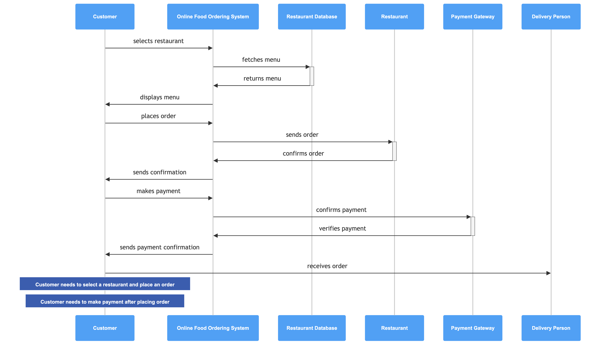
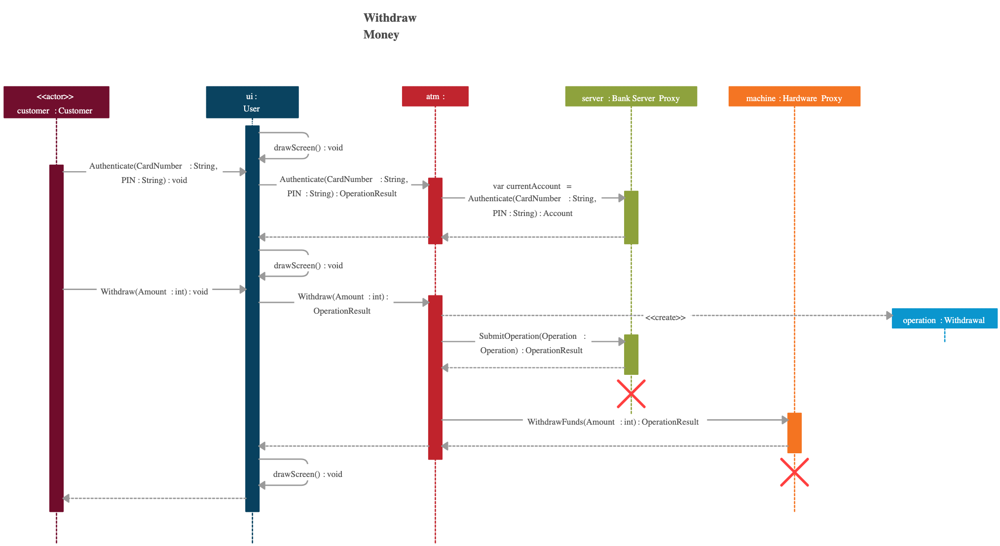
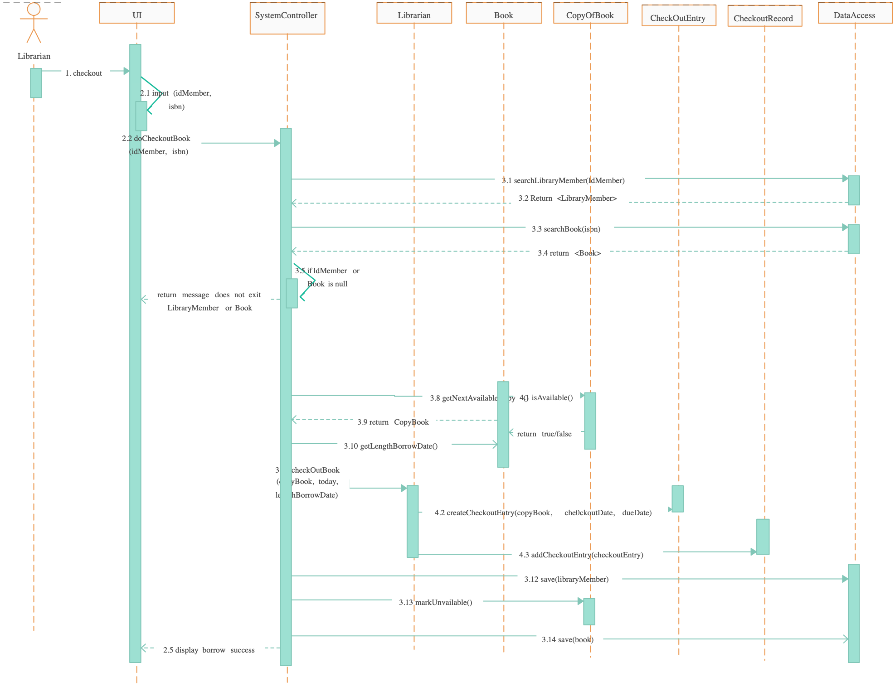

# UML Diagrams: Class Diagrams & Sequence Diagrams

## Table of Contents
1. [Introduction to UML](#introduction-to-uml)
2. [What are UML Diagrams](#what-are-uml-diagrams)
3. [Class Diagrams](#class-diagrams)
4. [Sequence Diagrams](#sequence-diagrams)
5. [Relationships Between Diagrams](#relationships-between-diagrams)
6. [Best Practices](#best-practices)
7. [Interview Questions & Answers](#interview-questions--answers)

---

## Introduction to UML

**UML (Unified Modeling Language)** is a standardized notation for visualizing, specifying, constructing, and documenting software systems. It provides a visual representation of a software architecture, making it easier for developers, architects, and stakeholders to understand and communicate complex systems.

### Why UML?
- **Communication**: Facilitates clear communication among team members
- **Documentation**: Serves as comprehensive system documentation
- **Standardization**: Uses industry-standard notation that developers worldwide understand
- **Quality Assurance**: Helps identify design flaws early in development
- **Maintenance**: Makes code maintenance and enhancements easier

### History of UML
- **UML 1.0** was released in 1997
- **UML 2.0** (current standard) was released in 2004
- It consolidates the work of leading object-oriented methodologies like OMT, Booch notation, and OOSE

---

## What are UML Diagrams

UML diagrams are graphical representations of different aspects of a software system. They can be categorized into two main types:

### 1. **Structural Diagrams**
These represent the static structure of a system:
- **Class Diagram**: Shows classes, attributes, methods, and their relationships
- **Component Diagram**: Shows components and dependencies
- **Deployment Diagram**: Shows deployment architecture
- **Object Diagram**: Shows instances of classes at a specific point in time
- **Package Diagram**: Shows logical grouping of classes and dependencies
- **Composite Structure Diagram**: Shows internal structure of composite objects

### 2. **Behavioral Diagrams**
These represent the dynamic behavior of a system:
- **Sequence Diagram**: Shows interactions between objects over time
- **Use Case Diagram**: Shows system functionality from user perspective
- **State Machine Diagram**: Shows state transitions
- **Activity Diagram**: Shows workflow and activities
- **Communication Diagram**: Shows interactions with emphasis on links between objects
- **Timing Diagram**: Shows behavior of objects over time
- **Interaction Overview Diagram**: Shows interactions at a higher level

---

## Class Diagrams

### What is a Class Diagram?

A **Class Diagram** is a type of structural UML diagram that shows the structure of a system by displaying:
- **Classes**: Templates for creating objects
- **Attributes**: Data members of a class
- **Methods**: Operations/behaviors of a class
- **Relationships**: How classes relate to each other (inheritance, association, composition, aggregation)

Class diagrams are the most commonly used diagrams in software development and are essential for object-oriented analysis and design.

### Components of a Class Diagram

#### 1. **Class Representation**

```
┌─────────────────────────┐
│      ClassName          │  ← Class Name
├─────────────────────────┤
│ - attribute1: type      │  ← Attributes/Properties
│ - attribute2: type      │
├─────────────────────────┤
│ + method1(): returnType │  ← Methods/Operations
│ + method2(): returnType │
└─────────────────────────┘
```

#### 2. **Visibility Modifiers**

| Modifier | Symbol | Meaning |
|----------|--------|---------|
| Public | `+` | Accessible from anywhere |
| Protected | `#` | Accessible within the class and its subclasses |
| Private | `-` | Accessible only within the class |
| Package/Default | `~` | Accessible within the same package |
| Static | `_underline_` | Belongs to the class, not instances |

**Example:**
```
┌─────────────────────────┐
│      Student            │
├─────────────────────────┤
│ - studentId: int        │  (Private)
│ # name: String          │  (Protected)
│ + age: int              │  (Public)
│ ~ gpa: double           │  (Package)
├─────────────────────────┤
│ + getStudentId(): int   │
│ - calculateGPA(): void  │
│ + displayInfo(): void   │
└─────────────────────────┘
```

#### 3. **Attribute Syntax**

```
visibility name: type = default_value [multiplicity] {property}
```

**Example:**
```
- balance: double = 0.0
+ accounts: List<Account> [1..*]
```

#### 4. **Method Syntax**

```
visibility name(parameter1: type1, parameter2: type2): return_type {property}
```

**Example:**
```
+ deposit(amount: double): void
- validateAccount(): boolean
+ getBalance(): double
```

### Relationships in Class Diagrams

#### 1. **Association**
- Represents a "HAS-A" relationship between two classes
- A class is aware of another class and uses its services
- **Types of Association:**
  - **Unidirectional**: One-way relationship
  - **Bidirectional**: Two-way relationship
  - **Multiplicity**: Indicates how many objects can participate

**Symbol:**
```
Class A ────────── Class B   (Bidirectional)
Class A ─────────→ Class B   (Unidirectional)
```

**Multiplicity Notations:**
- `1` : Exactly one
- `0..1` : Zero or one
- `*` : Zero or more (unbounded)
- `1..*` : One or more
- `n` : Exactly n
- `m..n` : Between m and n

**Example:**
```
┌──────────────┐              ┌──────────────┐
│   Student    │──────1..*──→ │    Course    │
└──────────────┘              └──────────────┘
(One student enrolls in many courses)
```

#### 2. **Inheritance (Generalization)**
- Represents an "IS-A" relationship
- A subclass inherits from a superclass
- **Symbol**: Solid line with unfilled triangle pointing to the parent class

**Example:**
```
          ┌──────────────┐
          │     Shape    │
          └──────────────┘
                 △
                 │ (Inheritance)
         ┌───────┴────────┐
         │                │
    ┌────────┐       ┌────────┐
    │ Circle │       │ Square │
    └────────┘       └────────┘
```

**Notation:**
```
         Animal
           △
           │
    ┌──────┼──────┐
    │      │      │
   Dog    Cat   Bird
```

#### 3. **Composition**
- Represents a "PART-OF" relationship (strong ownership)
- The part cannot exist without the whole
- If the container object is destroyed, so are the contained objects
- **Symbol**: Solid line with filled diamond on the container side

**Example:**
```
┌─────────────┐         ┌──────────────┐
│   Car       │◆────────│    Engine    │
└─────────────┘         └──────────────┘
(Car contains Engine. If Car is destroyed, Engine is destroyed too)
```

**Notation in Code:**
```
public class Car {
    private Engine engine = new Engine();  // Composition
}
```

#### 4. **Aggregation**
- Represents a "PART-OF" relationship (weak ownership)
- The part can exist independently of the whole
- If the container is destroyed, contained objects may still exist
- **Symbol**: Solid line with unfilled diamond on the container side

**Example:**
```
┌─────────────┐         ┌──────────────┐
│   Team      │◇────────│    Player    │
└─────────────┘         └──────────────┘
(Team has Players. If Team is dissolved, Players can still exist)
```

**Notation in Code:**
```
public class Team {
    private List<Player> players;  // Aggregation
    
    public Team(List<Player> players) {
        this.players = players;  // Players passed externally
    }
}
```

#### 5. **Dependency**
- Represents a "USES-A" relationship
- One class depends on another class
- The dependency is temporary or weak
- **Symbol**: Dashed line with an arrow

**Example:**
```
┌─────────────┐         ┌──────────────┐
│   Student   │ - - - → │   Printer    │
└─────────────┘         └──────────────┘
(Student uses Printer temporarily)
```

#### 6. **Realization (Implementation)**
- Represents an interface implementation
- A class implements an interface
- **Symbol**: Dashed line with unfilled triangle

**Example:**
```
┌──────────────────┐
│   <<interface>>  │
│   Drawable       │
└──────────────────┘
         △
         │ (Implementation)
         │
┌──────────────────┐
│    Circle        │
└──────────────────┘
```

### Complete Class Diagram Example

**Banking System:**

```
                    ┌──────────────────┐
                    │<<interface>>     │
                    │  Accountable     │
                    ├──────────────────┤
                    │ + deposit()      │
                    │ + withdraw()     │
                    │ + getBalance()   │
                    └──────────────────┘
                           △
                           │ (Implementation)
                           │
        ┌──────────────────┴──────────────────┐
        │                                     │
┌──────────────────┐               ┌──────────────────┐
│   Savings        │               │  Checking        │
│   Account        │               │  Account         │
├──────────────────┤               ├──────────────────┤
│ - interestRate   │               │ - monthlyFee     │
│ - balance        │               │ - balance        │
├──────────────────┤               ├──────────────────┤
│ + deposit()      │               │ + deposit()      │
│ + withdraw()     │               │ + withdraw()     │
│ + getBalance()   │               │ + getBalance()   │
└──────────────────┘               └──────────────────┘
        △                                   △
        │ (Inheritance)                     │
        │                                   │
        └──────────────┬────────────────────┘
                       │
              ┌────────────────┐
              │    Account     │ (Abstract Class)
              ├────────────────┤
              │ - accountId    │
              │ - owner        │
              ├────────────────┤
              │ + deposit()    │
              │ + withdraw()   │
              │ + getBalance() │
              └────────────────┘
                       △
                       │
         ┌─────────────┴─────────────┐
         │                           │
    ┌─────────────┐            ┌─────────────┐
    │   Customer  │            │    Bank     │
    ├─────────────┤            ├─────────────┤
    │ - name      │ ◇──────┬── │ - name      │
    │ - email     │ (1..*) │   │ - location  │
    └─────────────┘        │   └─────────────┘
                           │
                         (1)
```

---

## Sequence Diagrams

### What is a Sequence Diagram?

A **Sequence Diagram** is a type of behavioral UML diagram that shows:
- **Interactions** between different objects/components
- **Order of interactions** over time
- **Timeline** of the system's behavior
- **Messages** passed between objects

Sequence diagrams are excellent for understanding the flow of operations in a system and identifying design issues related to interaction patterns.

### Components of a Sequence Diagram

#### 1. **Actors and Objects**

An **Actor** is typically an external entity (user, external system):
```
┌────────────┐
│   User     │  (Actor - stick figure)
└────────────┘
```

An **Object** (instance of a class):
```
┌────────────┐
│   :Order   │  (Object name: instance name)
└────────────┘
┌────────────┐
│   system   │  (Lifeline representing an object)
```

#### 2. **Lifeline**

A vertical dashed line representing the life of an object during the interaction:
```
┌──────────┐
│  Order   │
└──────────┘
    │││ (Lifeline - existence over time)
    │││
    │││
    ▼││
```

#### 3. **Messages**

Communication between objects. Various types exist:

**a) Synchronous Message (Blocking Call)**
- Caller waits for the response
- **Symbol**: Solid arrow with filled arrowhead
```
Object1 ──→ Object2 : methodCall()
```

**b) Asynchronous Message (Non-blocking)**
- Caller doesn't wait for response
- **Symbol**: Solid arrow with half-filled arrowhead
```
Object1 --→ Object2 : notify()
```

**c) Return Message**
- Response from a method call
- **Symbol**: Dashed arrow
```
Object1 ←-- Object2 : returnValue
```

**d) Self Message**
- An object calls its own method
- **Symbol**: Arrow that loops back to the same object
```
    │
    ↓─→┐
    │  │
    └──┘
```

#### 4. **Activation Box**

A thin rectangle on the lifeline showing when an object is active (executing):
```
┌──────────────┐
│   Object     │
└──────────────┘
      │
      ├──────┐ ← Activation box (object is busy)
      │      │
      └──────┘
      │
      ● (object is idle)
```

#### 5. **Message Syntax**

```
[condition] message_name [(arguments)] : [return_value]
```

**Examples:**
```
validate()                          (Simple message)
createOrder(itemId, quantity)       (With parameters)
total(): double                     (With return type)
[if isValid] processOrder()          (Conditional)
*[for each item] addItem()           (Loop/Repeating)
```

### Sequence Diagram Example 1: Simple Order Processing

**Scenario**: User places an order through a web system



### Sequence Diagram Example 2: ATM Withdrawal

**Scenario**: Customer withdraws money from ATM



### Interaction Fragments (Advanced)

Sequence diagrams support interaction fragments to represent complex behavior:

#### 1. **Alternative (alt)**
Used for conditional logic (if-else):
```
        alt [balance >= amount]
    ├─────────────────────────
    │ approveWithdrawal()
    ├─────── else ────────────
    │ rejectWithdrawal()
```

#### 2. **Loop (loop)**
Used for repetitive interactions:
```
        loop [for each item]
    ├─────────────────────────
    │ processItem(item)
```

#### 3. **Option (opt)**
Used for optional interactions:
```
        opt [if premium]
    ├─────────────────────────
    │ applyDiscount()
```

#### 4. **Parallel (par)**
Used for concurrent interactions:
```
        par [concurrent operations]
    ├─────────────────────────
    │ processPayment() | | saveOrder()
```

#### 5. **Break (break)**
Used to exit from an interaction:
```
        break [on error]
    ├─────────────────────────
    │ exitProcess()
```

#### 6. **Reference (ref)**
Used to reference another sequence diagram:
```
        ref
    ├─ executePayment Sequence Diagram
```

### Complete Sequence Diagram Example: Library System Book Checkout



---

## Relationships Between Diagrams

### How Class and Sequence Diagrams Complement Each Other

1. **Class Diagram** shows the **WHAT** (structure)
   - What classes exist
   - What attributes and methods they have
   - How they are related

2. **Sequence Diagram** shows the **HOW** (behavior)
   - How objects interact
   - In what order things happen
   - Which methods are called and when

### Workflow Example:

**Step 1: Create Class Diagram**
```
┌──────────────┐         ┌──────────────┐
│   Student    │  ──────→│   Course     │
├──────────────┤         ├──────────────┤
│ - id         │         │ - courseId   │
│ - name       │         │ - title      │
├──────────────┤         ├──────────────┤
│ + enroll()   │         │ + addStudent()
└──────────────┘         └──────────────┘
```

**Step 2: Create Sequence Diagram**
```
Student         EnrollmentSystem        Course
  │                   │                    │
  ├─ enroll(courseId) ─→│                  │
  │                   ├─ addStudent() ───→│
  │                   │←─ [success] ────┤
  │←─ [confirmed] ────│                  │
```

### Other Related Diagrams

- **Use Case Diagram**: Shows what the system does from user's perspective
- **State Machine Diagram**: Shows state transitions of an object
- **Activity Diagram**: Shows workflow and activities
- **Communication Diagram**: Similar to sequence but emphasizes links
- **Timing Diagram**: Shows behavior over time with precise timing

---

## Best Practices

### For Class Diagrams

1. **Keep it Simple**
   - Don't show every attribute and method initially
   - Start with main classes and relationships
   - Add details iteratively

2. **Use Meaningful Names**
   - Use clear, descriptive class names
   - Follow naming conventions (PascalCase for classes)
   - Use meaningful method and attribute names

3. **Represent Real-World Concepts**
   - Design classes to represent actual entities
   - Ensure relationships reflect real dependencies
   - Use inheritance for "IS-A" relationships

4. **Avoid Over-Complication**
   - Use separate diagrams for different subsystems
   - Group related classes in packages
   - Consider using multiple diagrams for large systems

5. **Use Stereotypes**
   ```
   <<abstract>> for abstract classes
   <<interface>> for interfaces
   <<enumeration>> for enums
   ```

6. **Verify Relationships**
   - Ensure associations make logical sense
   - Use correct relationship types (composition vs. aggregation)
   - Include multiplicity information

### For Sequence Diagrams

1. **Focus on Specific Scenarios**
   - Create separate diagrams for different use cases
   - Each diagram should represent one specific flow

2. **Maintain Temporal Order**
   - Messages should flow from top to bottom
   - Preserve causal relationships
   - Avoid crossing message lines when possible

3. **Use Clear Message Names**
   - Use method names from class diagram
   - Include parameters and return values
   - Use clear naming conventions

4. **Include Conditions and Loops**
   - Use alt for if-else logic
   - Use loop for iterations
   - Use opt for optional behavior

5. **Show Important Interactions Only**
   - Don't include trivial method calls
   - Focus on critical interactions
   - Maintain readability

6. **Proper Lifeline Representation**
   - Activation boxes show when objects are working
   - Proper spacing indicates timing relationships
   - Use creation/destruction markers appropriately

7. **Error Handling**
   - Show exceptional flows separate from happy path
   - Use alt fragments for error conditions
   - Include error messages

### General Best Practices

1. **Consistency**
   - Use consistent notation across all diagrams
   - Follow project standards
   - Keep naming conventions uniform

2. **Documentation**
   - Add descriptions for complex diagrams
   - Document assumptions and constraints
   - Include legends if non-standard notation is used

3. **Evolution with Code**
   - Keep diagrams synchronized with code
   - Update diagrams when design changes
   - Use reverse engineering tools to maintain accuracy

4. **Tools**
   - Use professional UML tools (ArchiMate, Lucidchart, PlantUML, Star UML)
   - Ensure team has agreed-upon tools
   - Use tools that support collaboration

5. **Review and Validation**
   - Have diagrams reviewed by team
   - Validate against actual code
   - Get stakeholder feedback

---

## Interview Questions & Answers

### Basic Questions

#### Q1: What is UML and why is it important?
**A:** UML (Unified Modeling Language) is a standardized visual notation for visualizing, specifying, and documenting software systems. It's important because:
- Facilitates clear communication among team members
- Documents system architecture
- Uses industry-standard notation
- Helps identify design flaws early
- Makes maintenance easier
- Improves code quality

#### Q2: What are the main types of UML diagrams?
**A:** UML diagrams are classified into two main categories:
1. **Structural Diagrams**: Show static structure (Class, Component, Deployment, Object, Package)
2. **Behavioral Diagrams**: Show dynamic behavior (Sequence, Use Case, State Machine, Activity)

#### Q3: What is the difference between a Class Diagram and a Sequence Diagram?
**A:**
- **Class Diagram**: Shows the structure of the system (WHAT) - classes, attributes, methods, and relationships
- **Sequence Diagram**: Shows the behavior of the system (HOW) - interactions between objects over time and the order of method calls

#### Q4: What are the different visibility modifiers in a Class Diagram?
**A:**
- `+` Public: Accessible from anywhere
- `-` Private: Accessible only within the class
- `#` Protected: Accessible within the class and its subclasses
- `~` Package/Default: Accessible within the same package

### Class Diagram Questions

#### Q5: What are the different types of relationships in a Class Diagram?
**A:**
1. **Association**: "HAS-A" relationship; one class uses another
2. **Inheritance**: "IS-A" relationship; subclass inherits from parent
3. **Composition**: Strong "PART-OF"; part dies with whole
4. **Aggregation**: Weak "PART-OF"; part can exist independently
5. **Dependency**: "USES-A"; temporary or weak dependency
6. **Realization**: Class implements an interface

#### Q6: What is the difference between Composition and Aggregation?
**A:**
| Aspect | Composition | Aggregation |
|--------|-------------|-------------|
| Ownership | Strong | Weak |
| Lifespan | Part dies with whole | Part can exist independently |
| Symbol | Filled diamond | Unfilled diamond |
| Example | Car-Engine (composed) | Team-Player (aggregated) |

#### Q7: How do you represent inheritance in a Class Diagram?
**A:** Inheritance is represented with a solid line with an unfilled triangle pointing from the subclass to the parent class.
```
    Parent
      △
      │
   Child
```

#### Q8: What does multiplicity mean in a Class Diagram?
**A:** Multiplicity indicates how many instances of one object can be related to another. Common notations:
- `1`: Exactly one
- `0..1`: Zero or one
- `*`: Zero or more
- `1..*`: One or more
- `n`: Exactly n
- `m..n`: Between m and n

### Sequence Diagram Questions

#### Q9: What are the main components of a Sequence Diagram?
**A:**
1. **Actors/Objects**: External entities or instances (shown at top)
2. **Lifelines**: Vertical dashed lines representing object existence
3. **Messages**: Arrows showing communication between objects
4. **Activation Boxes**: Rectangles showing when an object is active
5. **Interaction Fragments**: Structure for complex behavior (alt, loop, opt, par)

#### Q10: What types of messages can you show in a Sequence Diagram?
**A:**
1. **Synchronous**: Solid arrow with filled head (caller waits for response)
2. **Asynchronous**: Solid arrow with half-filled head (caller doesn't wait)
3. **Return Message**: Dashed arrow (response from method call)
4. **Self Message**: Arrow looping to same object (object calls itself)

#### Q11: What are Interaction Fragments and give examples?
**A:** Interaction fragments are structured ways to represent complex control flow:
- **alt**: Alternative (if-else)
- **loop**: Repetition (for each)
- **opt**: Optional behavior
- **par**: Parallel/concurrent operations
- **break**: Exit condition
- **ref**: Reference to another sequence diagram

#### Q12: How do you represent error handling in a Sequence Diagram?
**A:** Use **alt** (alternative) fragments:
```
        alt [error condition]
    ├─────────────────────────
    │ handleError()
    ├─────── else ────────────
    │ continueProcess()
```

#### Q13: What is an Activation Box and why is it important?
**A:** Activation box is a thin rectangle on a lifeline showing when an object is active (executing). It's important because:
- Shows the time period when an object is busy
- Visualizes the call stack
- Helps understand execution flow
- Indicates nested method calls

### Advanced Questions

#### Q14: How do you ensure consistency between Class Diagrams and Sequence Diagrams?
**A:**
1. Method calls in sequence diagrams should match methods defined in class diagrams
2. Objects in sequence diagrams should be instances of classes shown in class diagram
3. Relationships in class diagram should logically support interactions shown in sequence diagram
4. Regular cross-verification and synchronization
5. Use automated tools to detect inconsistencies

#### Q15: In a Class Diagram, when would you use an Interface instead of an Abstract Class?
**A:**
- **Interface**: When you want to define a contract that unrelated classes can implement; supports multiple inheritance of type
- **Abstract Class**: When you want to provide common functionality and state that subclasses should inherit; use when classes are related
- Generally: Use interfaces for "CAN DO" relationships, abstract classes for "IS A" relationships

#### Q16: How would you model a Many-to-Many relationship in a Class Diagram?
**A:**
```
┌─────────┐           ┌──────────┐
│ Student │ 1---*---* │  Course  │
└─────────┘           └──────────┘
```
Alternatively, you can create an intermediate (junction) class:
```
┌─────────┐        ┌────────────┐        ┌──────────┐
│ Student │ 1---1  │ Enrollment │  1---1 │  Course  │
└─────────┘        └────────────┘        └──────────┘
               (Enrollment class holds relationship details)
```

#### Q17: What is the purpose of a Reference (ref) fragment in Sequence Diagrams?
**A:** The **ref** fragment allows you to reference another sequence diagram or a part of interaction, enabling:
- Reusing common interaction patterns
- Breaking complex flows into manageable pieces
- Reducing diagram complexity
- Maintaining single source of truth for repeated interactions

#### Q18: How do you represent optional parameters or return values in a Sequence Diagram?
**A:**
- Use square brackets for conditions: `[if valid] validateOrder()`
- Use clear method signatures: `getBalance(): double`
- Use the format: `message(param1, [optional_param2]): [return_type]`
- Add comments or notes for complex scenarios

#### Q19: What are the best practices for naming in UML Diagrams?
**A:**
1. **Classes**: PascalCase (Student, OrderProcessor)
2. **Attributes/Methods**: camelCase (studentId, calculateGPA())
3. **Constants**: UPPER_SNAKE_CASE (MAX_ATTEMPTS)
4. **Interfaces**: PascalCase, optionally prefixed with 'I' (Drawable, IDrawable)
5. **Use meaningful names that reflect real-world concepts
6. Avoid abbreviations unless universally understood
7. Document any non-obvious naming conventions

#### Q20: How would you model a system where an Employee can be either a Manager or a Worker, but not both?
**A:** Use inheritance with additional constraints:
```
        ┌─────────────┐
        │  Employee   │
        └─────────────┘
             △
             │
      ┌──────┴──────┐
      │             │
┌──────────┐  ┌──────────┐
│ Manager  │  │  Worker  │
└──────────┘  └──────────┘
```

Or use enumeration to represent role:
```
┌───────────────┐
│   Employee    │
├───────────────┤
│ - role: enum  │ ← (Manager, Worker)
└───────────────┘
```

---

## Summary

- **UML Diagrams** provide standardized visual representations of software systems
- **Class Diagrams** show the static structure and relationships between classes
- **Sequence Diagrams** show the dynamic behavior and interactions between objects
- Understanding both diagram types is essential for comprehensive system design
- Proper use of relationships, visibility modifiers, and multiplicity creates accurate, maintainable diagrams
- Class diagrams and sequence diagrams complement each other and should be consistent
- Following best practices ensures diagrams are clear, usable, and valuable for the project

---

## Resources & Tools

### Popular UML Tools
- **StarUML**: Lightweight, open-source
- **PlantUML**: Text-based, great for version control
- **ArchiMate**: Enterprise architecture
- **Lucidchart**: Cloud-based, collaborative
- **Visual Studio Enterprise**: Built-in UML support
- **Enterprise Architect**: Comprehensive toolset

